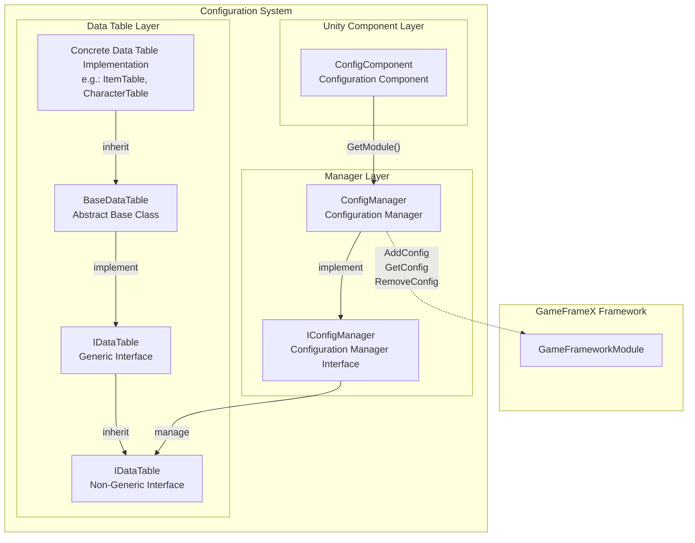
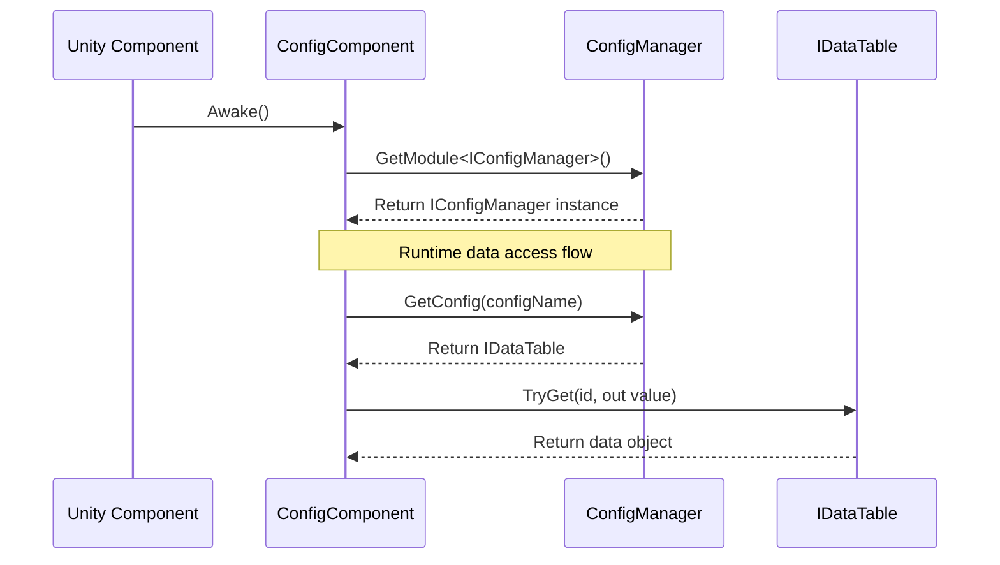

# ConfigManager Configuration Manager

ConfigManager is the core module of the GameFrameX Config System, responsible for unified management of all configuration data tables in the game. It provides core features such as configuration data storage, querying, adding, and removing. It is the main entry point for accessing configuration data at game runtime.

## Overview

ConfigManager serves as the global configuration manager, playing the role of the configuration data central repository. In game development, there are usually large amounts of configuration data (such as item tables, character property tables, level configurations, etc.) that require a unified management mechanism to ensure efficient access. ConfigManager manages `IDataTable` type configuration data tables through key-value pairs, supporting fast lookup and retrieval of corresponding data tables through configuration names.

This manager adopts thread-safe `ConcurrentDictionary` implementation, ensuring safe access and modification of configuration data in multi-threaded environments. As one of the core modules of GameFramework, ConfigManager initializes at game startup and cleans up all configuration data when the game closes.

### Core Responsibilities

- **Configuration Storage Management**: Unifies management of all game configuration data table storage
- **Configuration Query**: Provides fast config data lookup and retrieval
- **Configuration Lifecycle**: Manages configuration data add, remove, and clear operations
- **Thread Safety Guarantee**: Safely access config data in multi-threaded environments

## Architecture Design



The diagram above shows the overall architecture of the Config System, from Unity Component Layer to Data Table Layer complete call chain.

### Core Class Description

| Class Name | Responsibility | Description |
|------|------|------|
| ConfigManager | Config Manager Core Implementation | Inherits GameFrameworkModule, manages all configuration data tables |
| IConfigManager | Config Manager Interface | Defines standard operation interfaces for configuration manager |
| ConfigComponent | Unity Component | As Unity layer entry point, obtains ConfigManager instance |
| IDataTable | Data Table Base Interface | Defines basic operations for data tables |
| IDataTable<T> | Generic Data Table Interface | Provides strongly-typed data table query capability |
| BaseDataTable<T> | Data Table Abstract Base Class | Implements core features of data tables, such as dictionary storage and queries |

## Workflow



## Core Features

### Configuration Data Storage

ConfigManager uses `ConcurrentDictionary<string, IDataTable>` to store all configuration data tables. This design has the following advantages:

- **Thread Safety**: ConcurrentDictionary is a thread-safe collection, suitable for multi-threaded environments
- **High-Performance Lookup**: Dictionary's O(1) time complexity ensures high-speed access to configuration data
- **Key-Value Management**: Manages configuration data tables through configuration names (strings) as keys for convenient management and lookup

```csharp
// Source code location: Runtime/Config/Config/ConfigManager.cs#L47-L61
public sealed partial class ConfigManager : GameFrameworkModule, IConfigManager
{
    private readonly ConcurrentDictionary<string, IDataTable> m_ConfigDatas;

    public ConfigManager()
    {
        m_ConfigDatas = new ConcurrentDictionary<string, IDataTable>(StringComparer.Ordinal);
    }
}
```
> Source: [ConfigManager.cs](https://github.com/GameFrameX/com.gameframex.unity.config/blob/main/Runtime/Config/Config/ConfigManager.cs#L47-L61)

### Configuration Data Operations

ConfigManager provides complete configuration data operation interfaces, including checking, adding, removing, and getting configuration:

```csharp
// Check if configuration exists
public bool HasConfig(string configName)
{
    return m_ConfigDatas.TryGetValue(configName, out _);
}

// Add configuration
public void AddConfig(string configName, IDataTable configValue)
{
    m_ConfigDatas.TryAdd(configName, configValue);
}

// Remove configuration
public bool RemoveConfig(string configName)
{
    return m_ConfigDatas.TryRemove(configName, out _);
}

// Get configuration
public IDataTable GetConfig(string configName)
{
    return m_ConfigDatas.TryGetValue(configName, out var value) ? value : null;
}

// Clear all configurations
public void RemoveAllConfigs()
{
    m_ConfigDatas.Clear();
}
```
> Source: [ConfigManager.cs](https://github.com/GameFrameX/com.gameframex.unity.config/blob/main/Runtime/Config/Config/ConfigManager.cs#L99-L167)

The design of these methods follows the principle of simplicity and directness, managing configuration data tables through string keys, supporting dynamic add and remove configuration.

## Usage Examples

### Access Configuration Through ConfigComponent

In game code, configuration manager is usually accessed through ConfigComponent:

```csharp
// Get ConfigComponent component
var configComponent = UnityEngine.Object.FindObjectOfType<ConfigComponent>();

// Check if configuration exists
if (configComponent.HasConfig<CharacterTable>())
{
    // Get configuration data table
    var characterTable = configComponent.GetConfig<CharacterTable>();

    // Find character data by ID
    if (characterTable.TryGet(1001, out var character))
    {
        UnityEngine.Debug.Log($"Character name: {character.Name}");
    }
}
```
> Source: [ConfigComponent.cs](https://github.com/GameFrameX/com.gameframex.unity.config/blob/main/Runtime/Config/ConfigComponent.cs#L117-L142)

### Data Table Query Operations

Data table provides rich query methods, supporting multiple lookup methods:

```csharp
// Find by ID (recommended to use TryGet)
var item = itemTable.TryGet(1001, out var itemData) ? itemData : null;

// Find using indexer
var character = characterTable[1001];

// Find all objects satisfying conditions
var allWarriors = characterTable.FindList(c => c.Type == "Warrior");

// Calculate property sum
var totalAttack = characterTable.Sum(c => c.Attack);

// Iterate through all data
characterTable.ForEach(character => {
    UnityEngine.Debug.Log(character.Name);
});
```
> Source: [BaseDataTable.cs](https://github.com/GameFrameX/com.gameframex.unity.config/blob/main/Runtime/Config/Config/BaseDataTable.cs#L296-L349)

### Custom Data Table Implementation

Developers can inherit BaseDataTable to create their own data table implementations:

```csharp
// Example: Define character data table
public class CharacterData
{
    public int Id { get; set; }
    public string Name { get; set; }
    public int Attack { get; set; }
    public int Defense { get; set; }
}

public class CharacterTable : BaseDataTable<CharacterData>
{
    public override async Task LoadAsync()
    {
        // Implement data loading logic here
        // Can load data from Resources, AssetBundle, or network
    }
}
```

## API Reference

### IConfigManager Interface

Core interface of configuration manager, defining basic operations for configuration data:

| Method | Return Type | Description |
|------|----------|------|
| `HasConfig(configName)` | `bool` | Check whether a config with the specified name exists |
| `AddConfig(configName, configValue)` | `void` | Add a new config data table |
| `RemoveConfig(configName)` | `bool` | Remove the config data table with the specified name |
| `GetConfig(configName)` | `IDataTable` | Get the config data table with the specified name |
| `RemoveAllConfigs()` | `void` | Clear all config data tables |
| `Count` | `int` | Get the number of config data tables |

### IDataTable Interface

Base interface for data tables, providing metadata and loading capability for data tables:

| Member | Type | Description |
|------|------|------|
| `LoadAsync()` | `Task` | Asynchronously load data table |
| `Count` | `int` | Get the number of data items in the data table |

### IDataTable<T> Generic Interface

Strongly-typed data table interface, providing data query and statistics functionality:

#### Query Methods

| Method | Description |
|------|------|
| `TryGet(int id, out T value)` | Attempt to get data by integer ID |
| `TryGet(long id, out T value)` | Attempt to get data by long integer ID |
| `TryGet(string id, out T value)` | Attempt to get data by string ID |
| `Find(Func<T, bool> func)` | Find the first matching item by condition |
| `FindList(Func<T, bool> func)` | Find all matching items by condition and return a list |
| `FindListArray(Func<T, bool> func)` | Find all matching items by condition and return an array |

#### Indexer

| Indexer | Description |
|--------|------|
| `this[int id]` | Get data through integer primary key |
| `this[long id]` | Get data through long integer primary key |
| `this[string id]` | Get data through string key |

#### Aggregation Methods

| Method | Description |
|------|------|
| `Max<Tk>(Func<T, Tk> func)` | Get maximum value of specified property |
| `Min<Tk>(Func<T, Tk> func)` | Get minimum value of specified property |
| `Sum(Func<T, int> func)` | Calculate sum of int type property |
| `Sum(Func<T, long> func)` | Calculate sum of long type property |
| `Sum(Func<T, float> func)` | Calculate sum of float type property |

#### Conversion Methods

| Method | Description |
|------|------|
| `All` | Get an array of all data |
| `ToArray()` | Convert to array |
| `ToList()` | Convert to list |
| `FirstOrDefault` | Get the first element |
| `LastOrDefault` | Get the last element |

## Related Links

- [ConfigComponent](./10.config-component.md) - Configuration entry point for Unity component layer
- [IDataTable Interface](./07.idata-table.md) - Data table interface definition and detailed specifications
- [Data Table Definition](./08.data-table-definition.md) - How to define and use data tables
- [Interface Definitions](./06.interfaces.md) - Complete API interface documentation