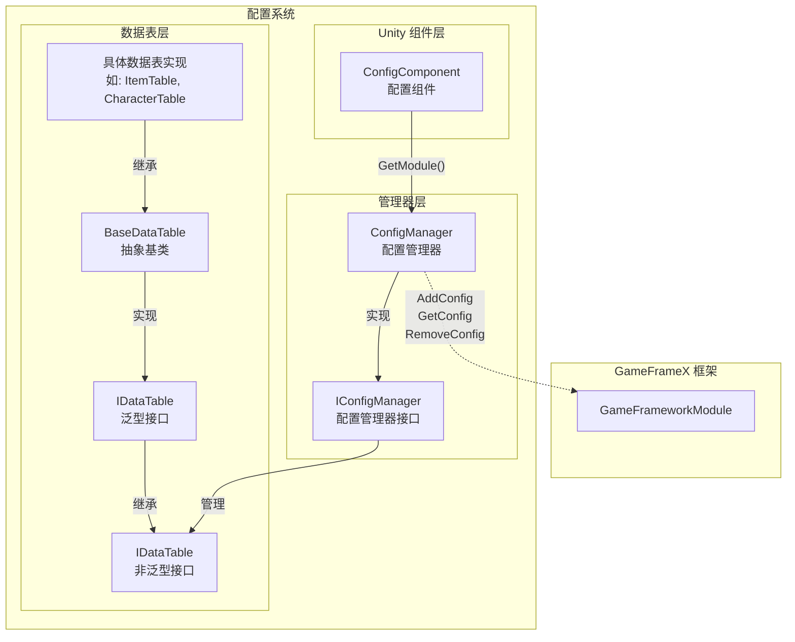
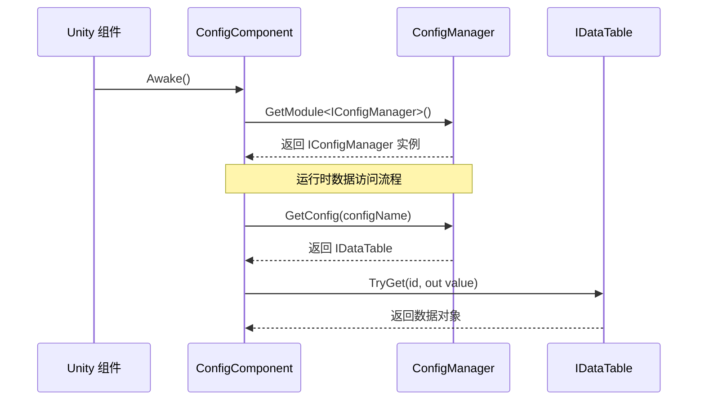

# ConfigManager configurationManages器

ConfigManager 是 GameFrameX Config System的核心模块，responsible for统一Manages游戏中的所有Config Data表。它provides了Config Data的存储、查询、add、remove等Core Features，是Game RuntimeAccessConfig Data的主要入口。

## 概述

ConfigManager 作为全局configurationManages器，扮演着Config Data中央仓库的角色。在游戏开发中，通常会有大量的Config Data（如物品表、角色Property表、关卡configuration等），这些数据需要统一的Manages机制来ensure高效Access。ConfigManager through键值对的方式Manages `IDataTable` Type的Config Data表，supportsthroughConfig Name快速find和get对应的Data Table。

该Manages器adoptsThread Safety的 `ConcurrentDictionary` Implements，ensure在多线程环境下也能安全地进行Config Data的Access和修改。作为 GameFramework 的核心模块之一，ConfigManager 在游戏start时Initialize，在游戏Closed时cleanup所有Config Data。

### Core Responsibilities

- **configuration存储Manages**：统一Manages所有游戏Config Data表的存储
- **configuration查询**：Provides fast config data lookup and retrieval
- **configuration生命周期**：ManagesConfig Data的add、remove和clear操作
- **Thread Safety保障**：Safely access config data in multi-threaded environments

## Architecture Design



上图展示了Config System的整体架构，从 Unity Component Layer到Data Table Layer的完整调用链路。

### 核心类Description

| 类名 | Responsibility | Description |
|------|------|------|
| ConfigManager | Config Manager Core Implementation | Inherits GameFrameworkModule，Manages所有Config Data表 |
| IConfigManager | Config Manager Interface | 定义configurationManages器的标准操作接口 |
| ConfigComponent | Unity Component | As Unity layer entry point, obtains ConfigManager instance |
| IDataTable | Data Table Base Interface | 定义Data Table的基本操作 |
| IDataTable<T> | 泛型Data Table接口 | provides强Type的Data Table查询能力 |
| BaseDataTable<T> | Data TableAbstract Base Class | ImplementsData Table的Core Features，如字典存储、查询等 |

## Workflow



## Core Features

### Config Data存储

ConfigManager Uses `ConcurrentDictionary<string, IDataTable>` 来存储所有的Config Data表。这种设计具有以下优势：

- **Thread Safety**：ConcurrentDictionary 是Thread Safety的集合，suitable for多线程环境
- **高性能find**：字典的 O(1) 时间复杂度ensure了Config Data的高速Access
- **键值对Manages**：throughConfig Name（字符串）作为键，方便Manages和find

```csharp
// 源代码位置: Runtime/Config/Config/ConfigManager.cs#L47-L61
public sealed partial class ConfigManager : GameFrameworkModule, IConfigManager
{
    private readonly ConcurrentDictionary<string, IDataTable> m_ConfigDatas;

    public ConfigManager()
    {
        m_ConfigDatas = new ConcurrentDictionary<string, IDataTable>(StringComparer.Ordinal);
    }
}
```
> Source: [ConfigManager.cs](https://github.com/GameFrameX/com.gameframex.unity.config/blob/main/Runtime/Config/Config/ConfigManager.cs#L47-L61)

### Config Data操作

ConfigManager provides了完整的Config Data操作接口，includingcheck、增加、remove和Get Config：

```csharp
// 检查配置是否存在
public bool HasConfig(string configName)
{
    return m_ConfigDatas.TryGetValue(configName, out _);
}

// 添加配置
public void AddConfig(string configName, IDataTable configValue)
{
    m_ConfigDatas.TryAdd(configName, configValue);
}

// 移除配置
public bool RemoveConfig(string configName)
{
    return m_ConfigDatas.TryRemove(configName, out _);
}

// 获取配置
public IDataTable GetConfig(string configName)
{
    return m_ConfigDatas.TryGetValue(configName, out var value) ? value : null;
}

// 清空所有配置
public void RemoveAllConfigs()
{
    m_ConfigDatas.Clear();
}
```
> Source: [ConfigManager.cs](https://github.com/GameFrameX/com.gameframex.unity.config/blob/main/Runtime/Config/Config/ConfigManager.cs#L99-L167)

这些Method的设计follows了简单直接的原则，through字符串键来ManagesConfig Data表，supports动态add和Remove Config。

## Usage Examples

### through ConfigComponent Accessconfiguration

在游戏代码中，通常through ConfigComponent 来AccessconfigurationManages器：

```csharp
// 获取 ConfigComponent 组件
var configComponent = UnityEngine.Object.FindObjectOfType<ConfigComponent>();

// 检查配置是否存在
if (configComponent.HasConfig<CharacterTable>())
{
    // 获取配置数据表
    var characterTable = configComponent.GetConfig<CharacterTable>();
    
    // 根据 ID 查找角色数据
    if (characterTable.TryGet(1001, out var character))
    {
        UnityEngine.Debug.Log($"角色名称: {character.Name}");
    }
}
```
> Source: [ConfigComponent.cs](https://github.com/GameFrameX/com.gameframex.unity.config/blob/main/Runtime/Config/ConfigComponent.cs#L117-L142)

### Data TableQuery Operations

Data Tableprovides了丰富的Query Methods，supports多种find方式：

```csharp
// 根据 ID 查找（推荐使用 TryGet）
var item = itemTable.TryGet(1001, out var itemData) ? itemData : null;

// 使用索引器查找
var character = characterTable[1001];

// 查找所有满足条件的对象
var allWarriors = characterTable.FindList(c => c.Type == "Warrior");

// 计算属性总和
var totalAttack = characterTable.Sum(c => c.Attack);

// 遍历所有数据
characterTable.ForEach(character => {
    UnityEngine.Debug.Log(character.Name);
});
```
> Source: [BaseDataTable.cs](https://github.com/GameFrameX/com.gameframex.unity.config/blob/main/Runtime/Config/Config/BaseDataTable.cs#L296-L349)

### Custom Data TableImplements

开发者可以Inherits BaseDataTable 来Creates自己的Data TableImplements：

```csharp
// 示例：定义角色数据表
public class CharacterData
{
    public int Id { get; set; }
    public string Name { get; set; }
    public int Attack { get; set; }
    public int Defense { get; set; }
}

public class CharacterTable : BaseDataTable<CharacterData>
{
    public override async Task LoadAsync()
    {
        // 在这里实现数据加载逻辑
        // 可以从 Resources、AssetBundle 或网络加载数据
    }
}
```

## API Reference

### IConfigManager 接口

configurationManages器的核心接口，定义了Config Data的基本操作：

| Method | Return Type | Description |
|------|----------|------|
| `HasConfig(configName)` | `bool` | Check whether a config with the specified name exists |
| `AddConfig(configName, configValue)` | `void` | Add a new config data table |
| `RemoveConfig(configName)` | `bool` | Remove the config data table with the specified name |
| `GetConfig(configName)` | `IDataTable` | Get the config data table with the specified name |
| `RemoveAllConfigs()` | `void` | Clear all config data tables |
| `Count` | `int` | Get the number of config data tables |

### IDataTable 接口

Data Table的基础接口，providesData Table的元数据和load能力：

| Member | Type | Description |
|------|------|------|
| `LoadAsync()` | `Task` | Asynchronous LoadingData Table |
| `Count` | `int` | Get the number of data items in the data table |

### IDataTable<T> Generic Interface

强Type的Data Table接口，providesData Query和统计功能：

#### Query Methods

| Method | Description |
|------|------|
| `TryGet(int id, out T value)` | 根据整数 ID 尝试get数据 |
| `TryGet(long id, out T value)` | 根据长整数 ID 尝试get数据 |
| `TryGet(string id, out T value)` | 根据字符串 ID 尝试get数据 |
| `Find(Func<T, bool> func)` | 根据条件find第一个匹配项 |
| `FindList(Func<T, bool> func)` | 根据条件find所有匹配项并返回列表 |
| `FindListArray(Func<T, bool> func)` | 根据条件find所有匹配项并返回数组 |

#### Indexer

| Indexer | Description |
|--------|------|
| `this[int id]` | through整数主键get数据 |
| `this[long id]` | through长整数主键get数据 |
| `this[string id]` | through字符串键get数据 |

#### Aggregation Methods

| Method | Description |
|------|------|
| `Max<Tk>(Func<T, Tk> func)` | get指定Property的最大值 |
| `Min<Tk>(Func<T, Tk> func)` | get指定Property的最小值 |
| `Sum(Func<T, int> func)` | 计算 int TypeProperty的总和 |
| `Sum(Func<T, long> func)` | 计算 long TypeProperty的总和 |
| `Sum(Func<T, float> func)` | 计算 float TypeProperty的总和 |

#### convertMethod

| Method | Description |
|------|------|
| `All` | Get an array of all data |
| `ToArray()` | Convert to array |
| `ToList()` | Convert to list |
| `FirstOrDefault` | Get the first element |
| `LastOrDefault` | Get the last element |

## Related Links

- [ConfigComponent Config Component](./4-core-concepts.config-component) - Unity Component Layer面的configuration入口
- [IDataTable Data Table接口](./4-core-concepts.idata-table) - Data Table的Interface Definitions和详细规范
- [Getting Started - Data Table Definition](./3-getting-started.data-table-definition) - 如何定义和UsesData Table
- [API Reference - Interface Definitions](./5-api-reference.interfaces) - 完整的 API 接口文档
