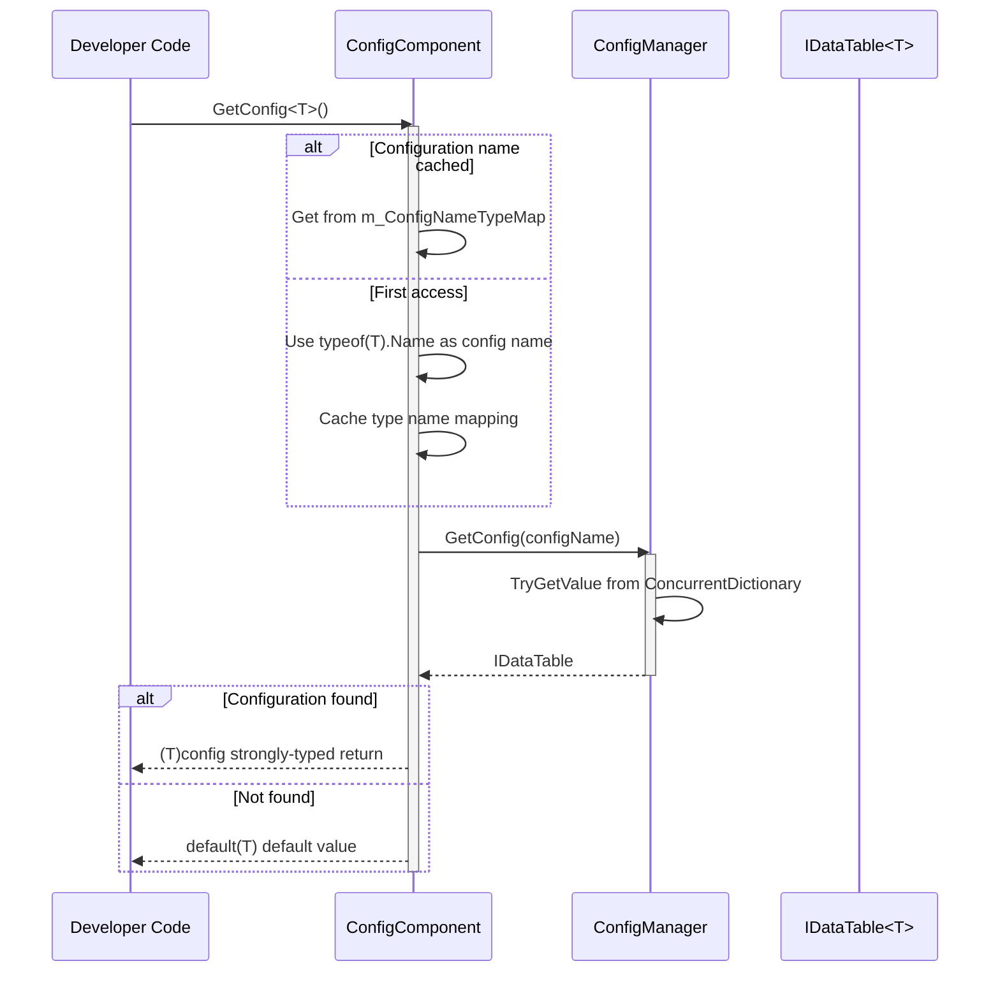
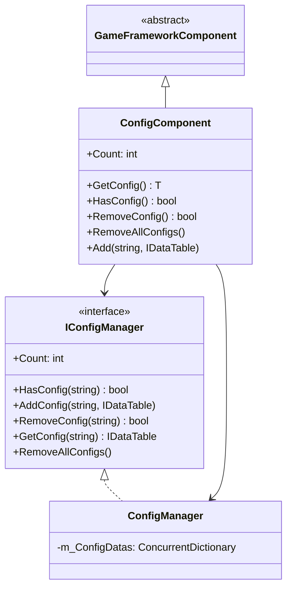

# ConfigComponent Configuration Component

ConfigComponent is the Unity Component Layer of the GameFrameX Config System. As the core entry point for game configuration management, it provides type-safe configuration data access capability.

## Overview

ConfigComponent is a `MonoBehaviour` component in Unity scenes, inheriting from `GameFrameworkComponent`. It serves as a bridge between the configuration management system and the Unity engine, enabling developers to conveniently get and manage configuration data at game runtime.

### Core Responsibilities

- **Type-Safe Configuration Access**: Provides compile-time type checking through generic methods
- **Configuration Cache Management**: Maintains type-to-config-name mapping
- **Unified Configuration Entry**: Encapsulates ConfigManager complexity, provides clean API
- **Lifecycle Management**: Initializes configuration manager during Awake phase

### Design Intent

ConfigComponent adopts the Facade Pattern design, aiming to simplify the complexity of configuration management. Developers do not need to interact directly with ConfigManager. They only need to go through ConfigComponent to complete configuration get, query, and management operations. The use of generic methods ensures compile-time type safety, reducing runtime errors.

## Architecture

### Component Layer Structure

```mermaid
graph TD
    subgraph Unity["Unity Layer (Scene)"]
        ConfigComp["ConfigComponent<br/>(MonoBehaviour)"]
    end

    subgraph Framework["GameFrameX Core Layer"]
        IConfigMgr["IConfigManager<br/>(Interface)"]
        ConfigMgr["ConfigManager<br/>(Implementation)"]
    end

    subgraph Data["Data Layer"]
        IDataTable["IDataTable<T><br/>(Interface)"]
        BaseDataTable["BaseDataTable<T><br/>(Base Class)"]
        CustomDT["Custom Data Table<br/>(Inherit BaseDataTable)"]
    end

    ConfigComp -->|"Get Configuration"| IConfigMgr
    IConfigMgr <|.. ConfigMgr
    ConfigMgr -->|"Store/Query"| IDataTable
    IDataTable <|.. BaseDataTable
    BaseDataTable <|-- CustomDT
```

### Configuration Access Flow



## Core Features

### Configuration Get

ConfigComponent provides two ways to get configuration:

1. **Generic Method Get** (Recommended): Automatically uses type name as configuration key
2. **Manual Add Config**: Allows explicitly specifying config name and instance

### Type Name Map Mechanism

Internally uses `ConcurrentDictionary<Type, string>` to cache type-to-name map, avoiding frequent calls to `typeof(T).Name`:

```csharp
private ConcurrentDictionary<Type, string> m_ConfigNameTypeMap = new ConcurrentDictionary<Type, string>();
```

> Source: [ConfigComponent.cs](https://github.com/GameFrameX/com.gameframex.unity.config/blob/main/Runtime/Config/ConfigComponent.cs#L51)

### Configuration Count Statistics

Through the `Count` property, you can quickly get the total number of currently loaded configuration items:

```csharp
public int Count
{
    get { return m_ConfigManager.Count; }
}
```

> Source: [ConfigComponent.cs](https://github.com/GameFrameX/com.gameframex.unity.config/blob/main/Runtime/Config/ConfigComponent.cs#L61-L64)

## Usage Examples

### Usage in Unity Scene

1. Create empty object in Unity Editor
2. Add `GameFrameX/Config` component (automatically adds ConfigComponent)
3. Get and use configuration through scripts

### Get Config Data

```csharp
using GameFrameX.Config.Runtime;

// Get configuration component
var configComponent = UnityEngine.GameObject.Find("GameFrameX").GetComponent<ConfigComponent>();

// Check if configuration exists
if (configComponent.HasConfig<WeaponDataTable>())
{
    // Get configuration
    var weaponTable = configComponent.GetConfig<WeaponDataTable>();

    // Get data by ID
    var weapon = weaponTable[1001];

    // Use TryGet for safe access
    if (weaponTable.TryGetValue(1001, out var weapon2))
    {
        // Use weapon2
    }
}
```

> Source: [ConfigComponent.cs](https://github.com/GameFrameX/com.gameframex.unity.config/blob/main/Runtime/Config/ConfigComponent.cs#L117-L127)

### Add Custom Configuration

```csharp
// Manually add configuration
var customTable = new MyCustomDataTable();
configComponent.Add("MyCustomConfig", customTable);

// Remove specified configuration
configComponent.RemoveConfig<WeaponDataTable>();

// Clear all configurations
configComponent.RemoveAllConfigs();
```

> Source: [ConfigComponent.cs](https://github.com/GameFrameX/com.gameframex.unity.config/blob/main/Runtime/Config/ConfigComponent.cs#L153-L170)

### Data Table Query Example

```csharp
var config = configComponent.GetConfig<ItemDataTable>();

// Get all data
var allItems = config.All;

// Conditional query
var rareItems = config.FindList(item => item.Quality >= 4);

// Aggregation operations
var maxPrice = config.Max(item => item.Price);
var totalCount = config.Sum(item => item.Count);

// Iteration operation
config.ForEach(item => {
    UnityEngine.Debug.Log(item.Name);
});
```

> Source: [BaseDataTable.cs](https://github.com/GameFrameX/com.gameframex.unity.config/blob/main/Runtime/Config/Config/BaseDataTable.cs#L296-L349)

## API Reference

### Property

#### `Count: int`

Gets the number of global configuration items.

```csharp
int count = configComponent.Count;
```

| Property | Value |
|------|-----|
| Type | `int` |
| Access | Read-only |
| Description | Returns the total number of configuration items stored in ConfigManager |

### Method

#### `GetConfig<T>(): T`

Gets the global configuration item of the specified type.

```csharp
var config = configComponent.GetConfig<WeaponDataTable>();
```

| Parameters | Type | Description |
|------|------|------|
| T | Generic Parameter | Configuration item type, must implement `IDataTable` interface |

| Return Value | Description |
|--------|------|
| T | Found configuration item; returns `default(T)` when not found |

> Source: [ConfigComponent.cs](https://github.com/GameFrameX/com.gameframex.unity.config/blob/main/Runtime/Config/ConfigComponent.cs#L117-L127)

---

#### `HasConfig<T>(): bool`

Checks if a configuration item of the specified type exists.

```csharp
bool exists = configComponent.HasConfig<MonsterDataTable>();
```

| Parameters | Type | Description |
|------|------|------|
| T | Generic Parameter | Configuration item type, must implement `IDataTable` interface |

| Return Value | Description |
|--------|------|
| `bool` | Returns `true` if configuration item exists; otherwise `false` |

> Source: [ConfigComponent.cs](https://github.com/GameFrameX/com.gameframex.unity.config/blob/main/Runtime/Config/ConfigComponent.cs#L138-L142)

---

#### `RemoveConfig<T>(): bool`

Removes the configuration item of the specified type.

```csharp
bool success = configComponent.RemoveConfig<WeaponDataTable>();
```

| Parameters | Type | Description |
|------|------|------|
| T | Generic Parameter | Configuration item type, must implement `IDataTable` interface |

| Return Value | Description |
|--------|------|
| `bool` | Returns `true` if removal successful; returns `false` if configuration does not exist |

> Source: [ConfigComponent.cs](https://github.com/GameFrameX/com.gameframex.unity.config/blob/main/Runtime/Config/ConfigComponent.cs#L153-L157)

---

#### `RemoveAllConfigs(): void`

Clears all global configuration items.

```csharp
configComponent.RemoveAllConfigs();
```

> Source: [ConfigComponent.cs](https://github.com/GameFrameX/com.gameframex.unity.config/blob/main/Runtime/Config/ConfigComponent.cs#L166-L170)

---

#### `Add(configName: string, dataTable: IDataTable): void`

Adds the specified global configuration item.

```csharp
configComponent.Add("MyConfig", myDataTable);
```

| Parameters | Type | Description |
|------|------|------|
| configName | `string` | Name of the global configuration item |
| dataTable | `IDataTable` | Data table instance of the global configuration item |

> Source: [ConfigComponent.cs](https://github.com/GameFrameX/com.gameframex.unity.config/blob/main/Runtime/Config/ConfigComponent.cs#L181-L184)

## Inheritance Structure



## Related Links

- [ConfigManager](./09.config-manager.md)
- [IDataTable Interface](./07.idata-table.md)
- [Interface Definitions](./06.interfaces.md)
- [Event Arguments](./12.event-args.md)
- [Binary Config Table](./11.binary-config.md)
- [Scripting Define Symbols](./13.scripting-define-symbols.md)