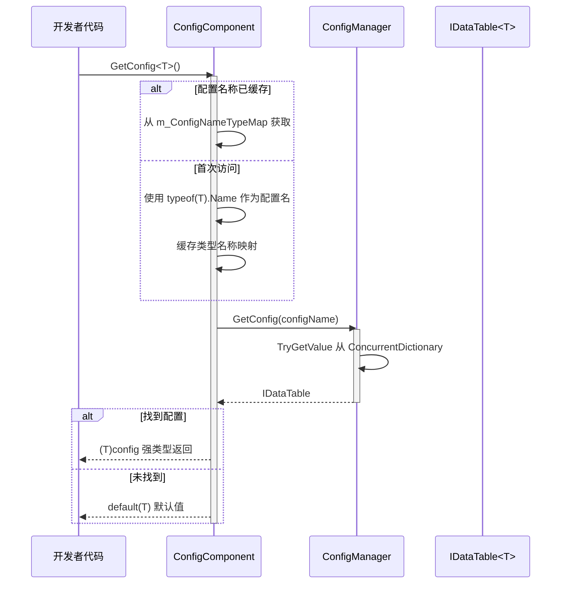
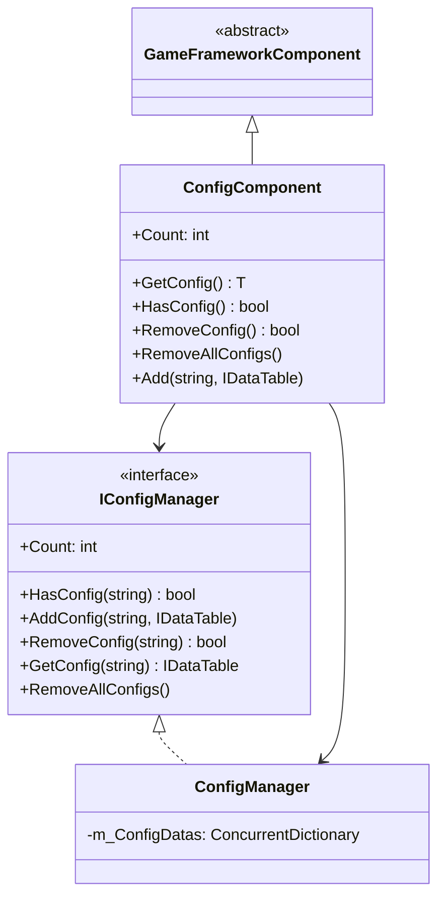

# ConfigComponent Config Component

ConfigComponent 是 GameFrameX Config System的 Unity Component Layer，作为游戏configurationManages的核心入口，providesType Safety的Config DataAccess能力。

## 概述

ConfigComponent 是 Unity 场景中的 `MonoBehaviour` 组件，Inherits自 `GameFrameworkComponent`。它充当了configurationManages系统与 Unity 引擎之间的桥梁，使开发者能够在Game Runtime方便地get和ManagesConfig Data。

### Core Responsibilities

- **Type Safety的configurationAccess**：through泛型Methodprovides编译时Typecheck
- **configuration缓存Manages**：Maintains type-to-config-name mapping
- **统一configuration入口**：Encapsulates ConfigManager complexity，Provides clean API
- **生命周期Manages**：在 Awake 阶段InitializeconfigurationManages器

### 设计意图

ConfigComponent adopts门面模式（Facade Pattern）设计，旨在简化configurationManages的复杂性。开发者无需直接与 ConfigManager 交互，只需through ConfigComponent 即可completeconfiguration的get、查询和Manages操作。泛型Method的Usesensure了编译时的Type Safety，减少了运行时error。

## 架构

### 组件层次结构

```mermaid
graph TD
    subgraph Unity["Unity 层 (Scene)"]
        ConfigComp["ConfigComponent<br/>(MonoBehaviour)"]
    end
    
    subgraph Framework["GameFrameX 核心层"]
        IConfigMgr["IConfigManager<br/>(接口)"]
        ConfigMgr["ConfigManager<br/>(实现)"]
    end
    
    subgraph Data["数据层"]
        IDataTable["IDataTable<T><br/>(接口)"]
        BaseDataTable["BaseDataTable<T><br/>(基类)"]
        CustomDT["自定义数据表<br/>(继承BaseDataTable)"]
    end
    
    ConfigComp -->|"获取配置"| IConfigMgr
    IConfigMgr <|.. ConfigMgr
    ConfigMgr -->|"存储/查询"| IDataTable
    IDataTable <|.. BaseDataTable
    BaseDataTable <|-- CustomDT
```

### configurationAccess流程



## Core Features

### configurationget

ConfigComponent provides了两种方式Get Config：

1. **泛型Methodget**（推荐）：自动UsesType名称作为configuration键
2. **手动Add Config**：允许显式指定Config Name和实例

### Type名称map机制

内部Uses `ConcurrentDictionary<Type, string>` 缓存Type到名称的map，避免频繁调用 `typeof(T).Name`：

```csharp
private ConcurrentDictionary<Type, string> m_ConfigNameTypeMap = new ConcurrentDictionary<Type, string>();
```

> Source: [ConfigComponent.cs](https://github.com/GameFrameX/com.gameframex.unity.config/blob/main/Runtime/Config/ConfigComponent.cs#L51)

### configuration数量统计

through `Count` Property可以快速Get the total number of currently loaded config items：

```csharp
public int Count
{
    get { return m_ConfigManager.Count; }
}
```

> Source: [ConfigComponent.cs](https://github.com/GameFrameX/com.gameframex.unity.config/blob/main/Runtime/Config/ConfigComponent.cs#L61-L64)

## Usage Examples

### 在 Unity 场景中Uses

1. 在 Unity Editor中Creates空物体
2. add `GameFrameX/Config` 组件（自动add ConfigComponent）
3. through脚本get并Usesconfiguration

### Get Config数据

```csharp
using GameFrameX.Config.Runtime;

// 获取配置组件
var configComponent = UnityEngine.GameObject.Find("GameFrameX").GetComponent<ConfigComponent>();

// 检查配置是否存在
if (configComponent.HasConfig<WeaponDataTable>())
{
    // 获取配置
    var weaponTable = configComponent.GetConfig<WeaponDataTable>();
    
    // 通过 ID 获取数据
    var weapon = weaponTable[1001];
    
    // 使用 TryGet 安全获取
    if (weaponTable.TryGetValue(1001, out var weapon2))
    {
        // 使用 weapon2
    }
}
```

> Source: [ConfigComponent.cs](https://github.com/GameFrameX/com.gameframex.unity.config/blob/main/Runtime/Config/ConfigComponent.cs#L117-L127)

### add自定义configuration

```csharp
// 手动添加配置
var customTable = new MyCustomDataTable();
configComponent.Add("MyCustomConfig", customTable);

// 移除指定配置
configComponent.RemoveConfig<WeaponDataTable>();

// 清空所有配置
configComponent.RemoveAllConfigs();
```

> Source: [ConfigComponent.cs](https://github.com/GameFrameX/com.gameframex.unity.config/blob/main/Runtime/Config/ConfigComponent.cs#L153-L170)

### Data Table查询示例

```csharp
var config = configComponent.GetConfig<ItemDataTable>();

// 获取所有数据
var allItems = config.All;

// 条件查询
var rareItems = config.FindList(item => item.Quality >= 4);

// 聚合操作
var maxPrice = config.Max(item => item.Price);
var totalCount = config.Sum(item => item.Count);

// 遍历操作
config.ForEach(item => {
    UnityEngine.Debug.Log(item.Name);
});
```

> Source: [BaseDataTable.cs](https://github.com/GameFrameX/com.gameframex.unity.config/blob/main/Runtime/Config/Config/BaseDataTable.cs#L296-L349)

## API Reference

### Property

#### `Count: int`

get全局configuration项数量。

```csharp
int count = configComponent.Count;
```

| Property | 值 |
|------|-----|
| Type | `int` |
| Access | Read-only |
| Description | 返回 ConfigManager 中存储的configuration项总数 |

### Method

#### `GetConfig<T>(): T`

get指定Type的全局configuration项。

```csharp
var config = configComponent.GetConfig<WeaponDataTable>();
```

| Parameters | Type | Description |
|------|------|------|
| T | 泛型Parameters | configuration项Type，必须Implements `IDataTable` 接口 |

| Return Value | Description |
|--------|------|
| T | 找到的configuration项；未找到时返回 `default(T)` |

> Source: [ConfigComponent.cs](https://github.com/GameFrameX/com.gameframex.unity.config/blob/main/Runtime/Config/ConfigComponent.cs#L117-L127)

---

#### `HasConfig<T>(): bool`

check指定Type的configuration项Whether exists。

```csharp
bool exists = configComponent.HasConfig<MonsterDataTable>();
```

| Parameters | Type | Description |
|------|------|------|
| T | 泛型Parameters | configuration项Type，必须Implements `IDataTable` 接口 |

| Return Value | Description |
|--------|------|
| `bool` | configuration项存在返回 `true`，否则返回 `false` |

> Source: [ConfigComponent.cs](https://github.com/GameFrameX/com.gameframex.unity.config/blob/main/Runtime/Config/ConfigComponent.cs#L138-L142)

---

#### `RemoveConfig<T>(): bool`

remove指定Type的configuration项。

```csharp
bool success = configComponent.RemoveConfig<WeaponDataTable>();
```

| Parameters | Type | Description |
|------|------|------|
| T | 泛型Parameters | configuration项Type，必须Implements `IDataTable` 接口 |

| Return Value | Description |
|--------|------|
| `bool` | removesuccess返回 `true`；configuration不存在返回 `false` |

> Source: [ConfigComponent.cs](https://github.com/GameFrameX/com.gameframex.unity.config/blob/main/Runtime/Config/ConfigComponent.cs#L153-L157)

---

#### `RemoveAllConfigs(): void`

clear所有全局configuration项。

```csharp
configComponent.RemoveAllConfigs();
```

> Source: [ConfigComponent.cs](https://github.com/GameFrameX/com.gameframex.unity.config/blob/main/Runtime/Config/ConfigComponent.cs#L166-L170)

---

#### `Add(configName: string, dataTable: IDataTable): void`

增加指定的全局configuration项。

```csharp
configComponent.Add("MyConfig", myDataTable);
```

| Parameters | Type | Description |
|------|------|------|
| configName | `string` | 全局configuration项的名称 |
| dataTable | `IDataTable` | 全局configuration项的Data Table实例 |

> Source: [ConfigComponent.cs](https://github.com/GameFrameX/com.gameframex.unity.config/blob/main/Runtime/Config/ConfigComponent.cs#L181-L184)

## Inherits结构



## Related Links

- [ConfigManager configurationManages器](./4-core-concepts.config-manager)
- [IDataTable Data Table接口](./4-core-concepts.idata-table)
- [Interface Definitions](./5-api-reference.interfaces)
- [Event Arguments](./5-api-reference.event-args)
- [Binary Config Table](./6-configuration.binary-config)
- [Scripting Define Symbols](./6-configuration.scripting-define-symbols)
