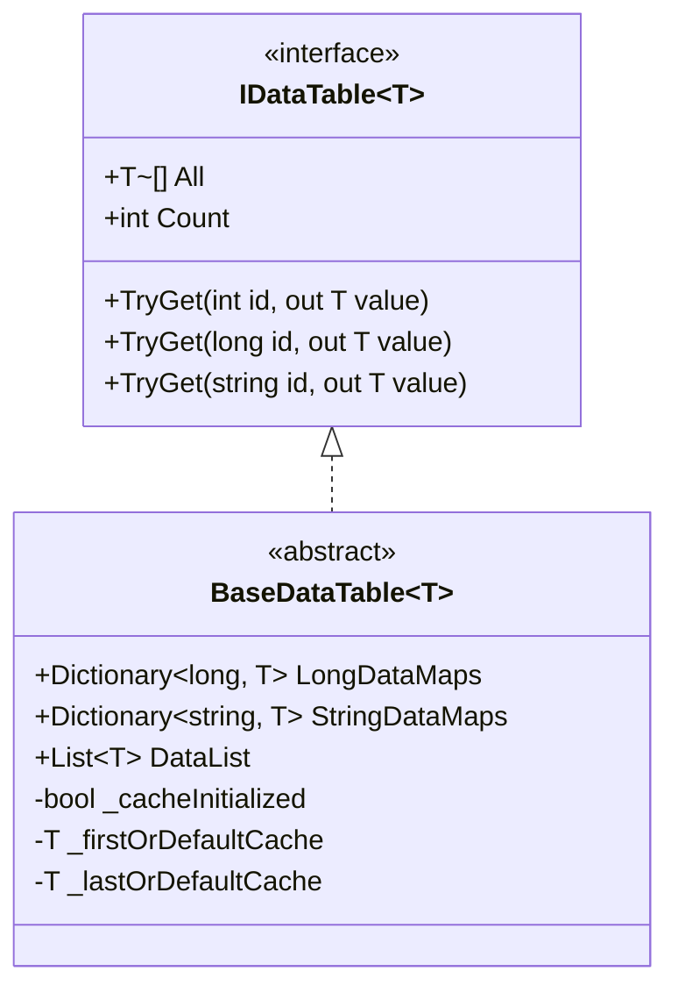

# Binary Config Table

Binary Config Table is an important component of the GameFrameX Config Config System, used for storing and loading game configuration data in binary format. Compared with text format, Binary Config Table has advantages such as faster loading speed, smaller storage space, and higher parsing efficiency, especially suitable for game scenarios with high performance requirements.

## Overview

Binary Config Table functionality allows developers to use `.bytes` format binary configuration files in Unity projects. The system automatically identifies configuration type through file extension: when the config asset name ends with `.bytes`, the system parses it as binary data; otherwise, it processes it as text format.

This design provides great flexibility. Developers can choose to use text config tables or binary config tables based on actual needs, and can even use both formats mixed in the same project.

### Core Advantages of Binary Configuration

**Load Performance**: Binary data does not require string parsing. It can be read directly through BinaryReader, which can significantly reduce loading time. This advantage is particularly evident in large games or multi-configuration scenarios.

**Storage Efficiency**: Binary format stores data compactly. Compared with text formats (such as JSON, XML), it can save 30%-50% of storage space while reducing runtime memory usage.

**Security**: Binary Config Table is not easily readable or modifiable directly, providing a certain degree of protection for game data. Although it cannot completely prevent cracking, it has a higher security coefficient compared with plaintext text configuration files.

## Architecture Design

```mermaid
flowchart TD
    subgraph ConfigSystem["Configuration System Architecture"]
        subgraph UnityLayer["Unity Layer"]
            CC[ConfigComponent<br/>Configuration Component]
        end

        subgraph ManagerLayer["Manager Layer"]
            CM[ConfigManager<br/>Configuration Manager]
        end

        subgraph DataLayer["Data Layer"]
            DT[IDataTable&lt;T&gt;<br/>Data Table Interface]
            BDT[BaseDataTable&lt;T&gt;<br/>Data Table Base Class]
        end

        subgraph StorageLayer["Storage Layer"]
            DictLong[Dictionary&lt;long, T&gt;<br/>Long Integer Index]
            DictStr[Dictionary&lt;string, T&gt;<br/>String Index]
            List[List&lt;T&gt;<br/>Data List]
        end
    end

    CC --> CM
    CM --> DT
    DT <|-- BDT
    BDT --> DictLong
    BDT --> DictStr
    BDT --> List
```

### Core Component Responsibilities

**ConfigComponent** is the Unity layer entry component, inherits from GameFrameworkComponent. Through mounting to game objects, it provides configuration functionality. It is responsible for initializing ConfigManager and exposing configuration access interfaces to the game logic layer.

**ConfigManager** implements IConfigManager interface and is the core manager of the entire Config System. It maintains a thread-safe ConcurrentDictionary, used for storing all loaded config table instances, and provides configuration query, add, remove, and other operations.

**BaseDataTable<T>** is the generic base class for all data tables, providing complete implementation for data storage and queries. It internally maintains three data structures: LongDataMaps used for long integer ID indexing, StringDataMaps used for string ID indexing, and DataList used for sequential iteration and batch operations.

## Binary Config Loading Flow

```mermaid
sequenceDiagram
    participant Game as Game Logic
    participant CC as ConfigComponent
    participant CM as ConfigManager
    participant RC as ResourceComponent
    participant Parser as Config Parser

    Game->>CC: Request to load configuration
    CC->>CM: GetConfig&lt;T&gt;()
    CM->>RC: LoadAsset(configName.bytes)
    RC-->>CM: Return TextAsset.bytes
    CM->>Parser: ParseData(bytes)

    alt File extension is .bytes
        Parser->>Parser: Use BinaryReader to parse
        Parser->>Parser: Loop read string-key and string-value
    else Other extensions
        Parser->>Parser: Use text parser
    end

    Parser-->>CM: Return parse result
    CM-->>CM: Store to Dictionary
    CM-->>CC: Return IDataTable
    CC-->>Game: Return configuration data
```

## Scripting Define Symbols

Binary configuration functionality is controlled through Unity Scripting Define Symbols. The Editor directory provides the ConfigDefineSymbols utility class to manage this macro definition.

### Enable Binary Configuration

In Unity Editor, you can enable or disable binary configuration functionality through menu operations:

```csharp
// Source: [Editor/ConfigDefineSymbols.cs](https://github.com/GameFrameX/com.gameframex.unity.config/blob/main/Editor/ConfigDefineSymbols.cs#L1-L31)

namespace GameFrameX.Config.Editor
{
    /// <summary>
    /// Configuration table binary function scripting define symbols.
    /// </summary>
    public static class ConfigDefineSymbols
    {
        public const string EnableBinaryConfigScriptingDefineSymbol = "ENABLE_BINARY_CONFIG";

        /// <summary>
        /// Enable configuration table as binary scripting define symbol.
        /// </summary>
        [MenuItem("GameFrameX/Scripting Define Symbols/Enable Binary Config", false, 501)]
        public static void EnableBinaryConfig()
        {
            ScriptingDefineSymbols.AddScriptingDefineSymbol(EnableBinaryConfigScriptingDefineSymbol);
        }

        /// <summary>
        /// Disable configuration table as binary scripting define symbol.
        /// </summary>
        [MenuItem("GameFrameX/Scripting Define Symbols/Disable Binary Config", false, 500)]
        public static void DisableBinaryConfig()
        {
            ScriptingDefineSymbols.RemoveScriptingDefineSymbol(EnableBinaryConfigScriptingDefineSymbol);
        }
    }
}
```

Through menu **GameFrameX → Scripting Define Symbols → Enable Binary Config** you can enable binary configuration support.

## Binary Configuration Format

Binary Config Table uses a simple key-value pair format to store data. Each record contains two strings: Config Name (key) and configuration value (value).

### Binary Format Specification

Binary files use BinaryWriter to write data in the following order:

```
[Configuration Name 1 (string)] [Configuration Value 1 (string)]
[Configuration Name 2 (string)] [Configuration Value 2 (string)]
...
```

Each string uses UTF-8 encoding and is written through the BinaryWriter.Write(string) method.

### Data Parsing Implementation

The system uses BinaryReader to parse binary data. The core implementation logic is as follows:

```csharp
// Source: [Runtime/Config/DefaultConfigHelper.cs](https://github.com/GameFrameX/com.gameframex.unity.config/blob/main/Runtime/Config/DefaultConfigHelper.cs#L147-L184)

/// <summary>
/// Parse global configuration (binary format).
/// </summary>
public override bool ParseData(IConfigManager configManager, byte[] configBytes, int startIndex, int length, object userData)
{
    try
    {
        using (MemoryStream memoryStream = new MemoryStream(configBytes, startIndex, length, false))
        {
            using (BinaryReader binaryReader = new BinaryReader(memoryStream, Encoding.UTF8))
            {
                while (binaryReader.BaseStream.Position < binaryReader.BaseStream.Length)
                {
                    string configName = binaryReader.ReadString();
                    string configValue = binaryReader.ReadString();
                    if (!configManager.AddConfig(configName, configValue))
                    {
                        Log.Warning("Can not add config with config name '{0}' which may be invalid or duplicate.", configName);
                        return false;
                    }
                }
            }
        }

        return true;
    }
    catch (Exception exception)
    {
        Log.Warning("Can not parse config bytes with exception '{0}'.", exception);
        return false;
    }
}
```

During parsing, the system continuously reads string pairs until the end of the stream. For each configuration item read, it calls the AddConfig method to add it to the configuration manager.

### File Extension Recognition

The system automatically determines configuration type through the resource file extension:

```csharp
// Source: [Runtime/Config/DefaultConfigHelper.cs](https://github.com/GameFrameX/com.gameframex.unity.config/blob/main/Runtime/Config/DefaultConfigHelper.cs#L61-L78)

private static readonly string BytesAssetExtension = ".bytes";

public override bool ReadData(IConfigManager configManager, string configAssetName, object configAsset, object userData)
{
    TextAsset configTextAsset = configAsset as TextAsset;
    if (configTextAsset != null)
    {
        if (configAssetName.EndsWith(BytesAssetExtension, StringComparison.Ordinal))
        {
            // Binary format parsing
            return configManager.ParseData(configTextAsset.bytes, userData);
        }
        else
        {
            // Text format parsing
            return configManager.ParseData(configTextAsset.text, userData);
        }
    }

    Log.Warning("Config asset '{0}' is invalid.", configAssetName);
    return false;
}
```

## Data Table Storage Structure

BaseDataTable<T> uses multiple data structures to meet different query requirements. This design ensures functional completeness while optimizing the performance of common operations.



### Storage Structure Description

**LongDataMaps**: Uses Dictionary<long, T> to store configuration data with long integer as primary key, providing O(1) time complexity for ID-based queries.

**StringDataMaps**: Uses Dictionary<string, T> to store configuration data with string as primary key, suitable for scenarios that need to use string identifiers.

**DataList**: Uses List<T> to store all configuration data objects, supporting sequential iteration, batch operations, and First/Last queries.

**Caching Mechanism**: BaseDataTable implements a caching mechanism, used for caching first and last elements and count statistics in the data table, avoiding frequent iteration of underlying data structures.

## Configuration Query Example

Data table supports multiple query methods. Developers can choose the most appropriate method based on actual scenarios:

```csharp
// Source: [Runtime/Config/Config/BaseDataTable.cs](https://github.com/GameFrameX/com.gameframex.unity.config/blob/main/Runtime/Config/Config/BaseDataTable.cs#L119-L162)

/// <summary>
/// Try to get object by integer ID.
/// </summary>
public bool TryGet(int id, out T value)
{
    return LongDataMaps.TryGetValue(id, out value);
}

/// <summary>
/// Try to get object by long integer ID.
/// </summary>
public bool TryGet(long id, out T value)
{
    return LongDataMaps.TryGetValue(id, out value);
}

/// <summary>
/// Try to get object by string ID.
/// </summary>
public bool TryGet(string id, out T value)
{
    return StringDataMaps.TryGetValue(id, out value);
}
```

### Common Query Methods

| Method | Description | Return Type |
|------|------|----------|
| TryGet(int id) | Attempt to get data by integer ID | bool |
| TryGet(long id) | Attempt to get data by long integer ID | bool |
| TryGet(string id) | Attempt to get data by string ID | bool |
| Find(func) | Find the first matching object by condition | T |
| FindListArray(func) | Find all matching objects by condition | T[] |
| FirstOrDefault | Get the first object | T |
| LastOrDefault | Get the last object | T |
| All | Get all object array | T[] |

## Related Links

- [Config Component Overview](./01.overview.md)
- [Features](./04.features.md)
- [Installation](./02.installation.md)
- [Dependencies](./05.dependencies.md)
- [Basic Usage](./03.getting-started.md)
- [Data Table Definition](./08.data-table-definition.md)
- [ConfigComponent](./10.config-component.md)
- [ConfigManager](./09.config-manager.md)
- [IDataTable Interface](./07.idata-table.md)
- [Interface Definitions](./06.interfaces.md)
- [Event Arguments](./12.event-args.md)
- [Scripting Define Symbols](./13.scripting-define-symbols.md)
- [Troubleshooting](./14.troubleshooting.md)