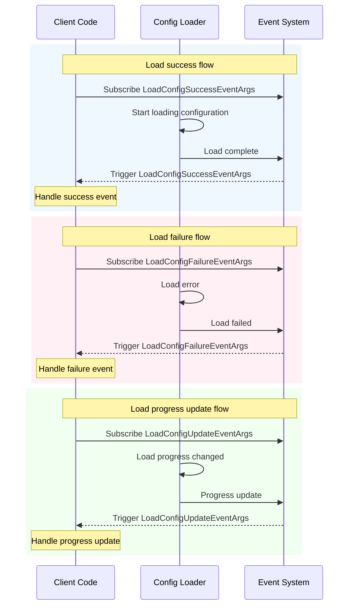

# Event Arguments

This document introduces the Event Arguments types defined in the GameFrameX configuration module, used for passing event data during config loading.

## Overview

Event Arguments are an important part of the observer pattern in the GameFrameX Config System. When configuration assets undergo asynchronous loading, the system triggers different types of events to notify code that is monitoring the process. These events include: Load Success, Load Failure, and load progress update.

Event Arguments classes uniformly inherit from `GameFrameX.Event.Runtime.GameEventArgs` base class, using object pool pattern to optimize memory allocation. Each event class provides a static `EventId` property for event identification and a static `Create` factory method for creating event instances.

## Event Arguments Classes

### 1. LoadConfigSuccessEventArgs - Load Success Event

This event is triggered when a global configuration asset loads successfully.

```csharp
public sealed class LoadConfigSuccessEventArgs : GameEventArgs
{
    /// <summary>
    /// Global configuration load success event ID.
    /// </summary>
    public static readonly string EventId = typeof(LoadConfigSuccessEventArgs).FullName;

    /// <summary>
    /// Gets the global configuration asset name.
    /// </summary>
    public string ConfigAssetName { get; private set; }

    /// <summary>
    /// Gets the load duration.
    /// </summary>
    /// <remarks>
    /// Load duration in seconds
    /// </remarks>
    public float Duration { get; private set; }

    /// <summary>
    /// Gets the user custom data.
    /// </summary>
    public object UserData { get; private set; }

    /// <summary>
    /// Creates a global configuration load success event.
    /// </summary>
    public static LoadConfigSuccessEventArgs Create(string dataAssetName, float duration, object userData)
    {
        LoadConfigSuccessEventArgs loadConfigSuccessEventArgs = ReferencePool.Acquire<LoadConfigSuccessEventArgs>();
        loadConfigSuccessEventArgs.ConfigAssetName = dataAssetName;
        loadConfigSuccessEventArgs.Duration = duration;
        loadConfigSuccessEventArgs.UserData = userData;
        return loadConfigSuccessEventArgs;
    }

    /// <summary>
    /// Clears the global configuration load success event.
    /// </summary>
    public override void Clear()
    {
        ConfigAssetName = null;
        Duration = 0f;
        UserData = null;
    }
}
```

> Source: [LoadConfigSuccessEventArgs.cs](https://github.com/GameFrameX/com.gameframex.unity.config/blob/main/Runtime/EventArgs/LoadConfigSuccessEventArgs.cs#L43-L137)

### 2. LoadConfigFailureEventArgs - Load Failure Event

This event is triggered when a global configuration asset fails to load.

```csharp
public sealed class LoadConfigFailureEventArgs : GameEventArgs
{
    /// <summary>
    /// Global configuration load failure event ID.
    /// </summary>
    public static readonly string EventId = typeof(LoadConfigFailureEventArgs).FullName;

    /// <summary>
    /// Gets the global configuration asset name.
    /// </summary>
    public string ConfigAssetName { get; private set; }

    /// <summary>
    /// Gets the error message.
    /// </summary>
    public string ErrorMessage { get; private set; }

    /// <summary>
    /// Gets the user custom data.
    /// </summary>
    public object UserData { get; private set; }

    /// <summary>
    /// Creates a global configuration load failure event.
    /// </summary>
    public static LoadConfigFailureEventArgs Create(string dataAssetName, string errorMessage, object userData)
    {
        LoadConfigFailureEventArgs loadConfigFailureEventArgs = ReferencePool.Acquire<LoadConfigFailureEventArgs>();
        loadConfigFailureEventArgs.ConfigAssetName = dataAssetName;
        loadConfigFailureEventArgs.ErrorMessage = errorMessage;
        loadConfigFailureEventArgs.UserData = userData;
        return loadConfigFailureEventArgs;
    }

    /// <summary>
    /// Clears the global configuration load failure event.
    /// </summary>
    public override void Clear()
    {
        ConfigAssetName = null;
        ErrorMessage = null;
        UserData = null;
    }
}
```

> Source: [LoadConfigFailureEventArgs.cs](https://github.com/GameFrameX/com.gameframex.unity.config/blob/main/Runtime/EventArgs/LoadConfigFailureEventArgs.cs#L43-L137)

### 3. LoadConfigUpdateEventArgs - Load Progress Update Event

This event is triggered when the global configuration asset load progress updates.

```csharp
public sealed class LoadConfigUpdateEventArgs : GameEventArgs
{
    /// <summary>
    /// Global configuration load update event ID.
    /// </summary>
    public static readonly string EventId = typeof(LoadConfigUpdateEventArgs).FullName;

    /// <summary>
    /// Gets the global configuration asset name.
    /// </summary>
    public string ConfigAssetName { get; private set; }

    /// <summary>
    /// Gets the global configuration load progress.
    /// </summary>
    /// <remarks>
    /// Load progress, range from 0.0 to 1.0
    /// </remarks>
    public float Progress { get; private set; }

    /// <summary>
    /// Gets the user custom data.
    /// </summary>
    public object UserData { get; private set; }

    /// <summary>
    /// Creates a global configuration load update event.
    /// </summary>
    public static LoadConfigUpdateEventArgs Create(string dataAssetName, float progress, object userData)
    {
        LoadConfigUpdateEventArgs loadConfigUpdateEventArgs = ReferencePool.Acquire<LoadConfigUpdateEventArgs>();
        loadConfigUpdateEventArgs.ConfigAssetName = dataAssetName;
        loadConfigUpdateEventArgs.Progress = progress;
        loadConfigUpdateEventArgs.UserData = userData;
        return loadConfigUpdateEventArgs;
    }

    /// <summary>
    /// Clears the global configuration load update event.
    /// </summary>
    public override void Clear()
    {
        ConfigAssetName = null;
        Progress = 0f;
        UserData = null;
    }
}
```

> Source: [LoadConfigUpdateEventArgs.cs](https://github.com/GameFrameX/com.gameframex.unity.config/blob/main/Runtime/EventArgs/LoadConfigUpdateEventArgs.cs#L43-L137)

## Event Relationship Class Diagram

```mermaid
classDiagram
    class GameEventArgs {
        <<abstract>>
        +Id: string {get; abstract}
        +Clear() void$ abstract
    }

    class LoadConfigSuccessEventArgs {
        +EventId: string
        +ConfigAssetName: string
        +Duration: float
        +UserData: object
        +Create(dataAssetName, duration, userData)$ LoadConfigSuccessEventArgs
    }

    class LoadConfigFailureEventArgs {
        +EventId: string
        +ConfigAssetName: string
        +ErrorMessage: string
        +UserData: object
        +Create(dataAssetName, errorMessage, userData)$ LoadConfigFailureEventArgs
    }

    class LoadConfigUpdateEventArgs {
        +EventId: string
        +ConfigAssetName: string
        +Progress: float
        +UserData: object
        +Create(dataAssetName, progress, userData)$ LoadConfigUpdateEventArgs
    }

    GameEventArgs <|-- LoadConfigSuccessEventArgs
    GameEventArgs <|-- LoadConfigFailureEventArgs
    GameEventArgs <|-- LoadConfigUpdateEventArgs
```

## Event Flow



## API Reference

### LoadConfigSuccessEventArgs

**Namespace:** `GameFrameX.Config.Runtime`

**Inherits:** `GameEventArgs`

#### Property

| Property | Type | Read-only | Description |
|------|------|------|------|
| EventId | string | Yes | Unique event identifier, value is the fully qualified name of the type |
| ConfigAssetName | string | Yes | Name of the config asset that loaded successfully |
| Duration | float | Yes | Time spent loading in seconds |
| UserData | object | Yes | User custom data, used for passing context between events |

#### Method

| Method | Return Type | Description |
|------|----------|------|
| Create(string, float, object) | LoadConfigSuccessEventArgs | Static factory method, gets instance from object pool and initializes |
| Clear() | void | Clears all property values, returns instance to object pool |

---

### LoadConfigFailureEventArgs

**Namespace:** `GameFrameX.Config.Runtime`

**Inherits:** `GameEventArgs`

#### Property

| Property | Type | Read-only | Description |
|------|------|------|------|
| EventId | string | Yes | Unique event identifier, value is the fully qualified name of the type |
| ConfigAssetName | string | Yes | Name of the config asset that failed to load |
| ErrorMessage | string | Yes | Error information describing the reason for failure |
| UserData | object | Yes | User custom data, used for passing context between events |

#### Method

| Method | Return Type | Description |
|------|----------|------|
| Create(string, string, object) | LoadConfigFailureEventArgs | Static factory method, gets instance from object pool and initializes |
| Clear() | void | Clears all property values, returns instance to object pool |

---

### LoadConfigUpdateEventArgs

**Namespace:** `GameFrameX.Config.Runtime`

**Inherits:** `GameEventArgs`

#### Property

| Property | Type | Read-only | Description |
|------|------|------|------|
| EventId | string | Yes | Unique event identifier, value is the fully qualified name of the type |
| ConfigAssetName | string | Yes | Name of the config asset being loaded |
| Progress | float | Yes | Load progress, range from 0.0 to 1.0 |
| UserData | object | Yes | User custom data, used for passing context between events |

#### Method

| Method | Return Type | Description |
|------|----------|------|
| Create(string, float, object) | LoadConfigUpdateEventArgs | Static factory method, gets instance from object pool and initializes |
| Clear() | void | Clears all property values, returns instance to object pool |

## Usage Examples

### Subscribe to Config Loading Events

```csharp
using GameFrameX.Event.Runtime;
using GameFrameX.Config.Runtime;

// Subscribe to config load success event
EventSystem.EventSubscribe<LoadConfigSuccessEventArgs>(OnLoadConfigSuccess);

// Subscribe to config load failure event
EventSystem.EventSubscribe<LoadConfigFailureEventArgs>(OnLoadConfigFailure);

// Subscribe to config load progress update event
EventSystem.EventSubscribe<LoadConfigUpdateEventArgs>(OnLoadConfigUpdate);

private void OnLoadConfigSuccess(object sender, LoadConfigSuccessEventArgs e)
{
    UnityEngine.Debug.Log($"Config loaded successfully: {e.ConfigAssetName}, duration: {e.Duration}s");
    // Handle load success logic
    // Note: After use, need to return event object to object pool
    ReferencePool.Release(e);
}

private void OnLoadConfigFailure(object sender, LoadConfigFailureEventArgs e)
{
    UnityEngine.Debug.LogError($"Config load failed: {e.ConfigAssetName}, error: {e.ErrorMessage}");
    ReferencePool.Release(e);
}

private void OnLoadConfigUpdate(object sender, LoadConfigUpdateEventArgs e)
{
    UnityEngine.Debug.Log($"Load progress: {e.ConfigAssetName} - {e.Progress * 100}%");
    ReferencePool.Release(e);
}
```

> Source: [LoadConfigSuccessEventArgs.cs](https://github.com/GameFrameX/com.gameframex.unity.config/blob/main/Runtime/EventArgs/LoadConfigSuccessEventArgs.cs#L116-L123)
> Source: [LoadConfigFailureEventArgs.cs](https://github.com/GameFrameX/com.gameframex.unity.config/blob/main/Runtime/EventArgs/LoadConfigFailureEventArgs.cs#L116-L123)
> Source: [LoadConfigUpdateEventArgs.cs](https://github.com/GameFrameX/com.gameframex.unity.config/blob/main/Runtime/EventArgs/LoadConfigUpdateEventArgs.cs#L116-L123)

## Related Links

- [Interface Definitions](./06.interfaces.md) - Configuration manager interface definitions
- [ConfigComponent](./10.config-component.md) - Detailed introduction to Config component
- [ConfigManager](./09.config-manager.md) - Detailed introduction to configuration manager
- [IDataTable Interface](./07.idata-table.md) - Detailed definition of data table interface