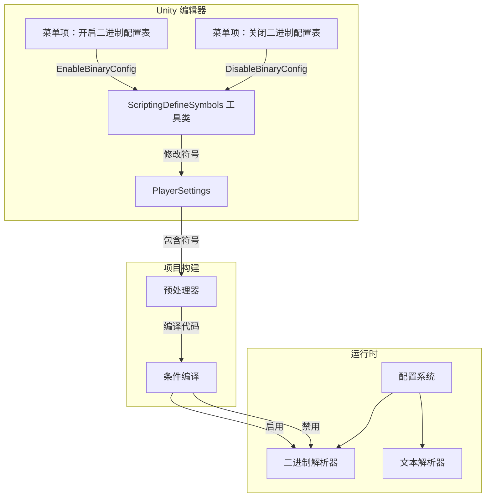
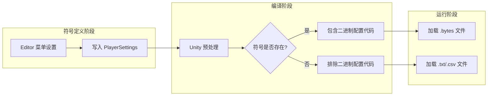

# Scripting Define Symbols

Scripting Define Symbols（Scripting Define Symbols）是 Unity 项目中used for条件编译的预process器符号。GameFrameX Config 组件throughScripting Define Symbols来控制Binary Config Table功能的开启与Closed。

## 概述

Scripting Define Symbols是 Unity 编译器的一个特性，允许开发者在代码中根据不同的编译条件contains或排除特定代码段。GameFrameX Config 组件Uses `ENABLE_BINARY_CONFIG` 脚本宏来控制是否启用Binary Config Table功能。

### 什么是Binary Config Table

Binary Config Table是一种以二进制格式存储Config Data的方式，相比文本格式（CSV、TSV）具有以下优势：

- **load速度更快**：二进制数据无需parse，可直接read
- **文件体积更小**：数据以紧凑的二进制格式存储
- **安全性更高**：二进制数据不易被直接阅读和修改
- **parse开销更低**：无需字符串分割和Typeconvert

## 工作原理

### 架构流程



### 符号作用机制



## UsesMethod

### 开启Binary Config Table

在 Unity Editor中，through菜单操作开启二进制configuration功能：

1. 打开 Unity Editor
2. 依次点击菜单：`GameFrameX` → `Scripting Define Symbols` → `Enable Binary Config(开启二进制配置表)`
3. 等待 Unity 重新编译脚本

### ClosedBinary Config Table

如需切换回文本格式configuration：

1. 依次点击菜单：`GameFrameX` → `Scripting Define Symbols` → `Disable Binary Config(关闭二进制配置表)`
2. 等待 Unity 重新编译脚本

## API Reference

### ConfigDefineSymbols

Namespace：`GameFrameX.Config.Editor`

```csharp
public static class ConfigDefineSymbols
```

Config Table二进制功能的Scripting Define Symbols类，providesBinary Config Table开关功能。

#### Field

| Field | Type | Description |
|------|------|------|
| `EnableBinaryConfigScriptingDefineSymbol` | `const string` | Binary Config TableScripting Define Symbols的常量值：`"ENABLE_BINARY_CONFIG"` |

#### Method

##### EnableBinaryConfig

```csharp
[MenuItem("GameFrameX/Scripting Define Symbols/Enable Binary Config(开启二进制配置表)", false, 501)]
public static void EnableBinaryConfig()
```

开启Binary Config Table功能的Scripting Define Symbols。

**功能Description：**
将 `ENABLE_BINARY_CONFIG` 符号add到项目的 PlayerSettings 中，使项目在编译时contains二进制configuration相关的代码。

> Source: [ConfigDefineSymbols.cs](https://github.com/GameFrameX/com.gameframex.unity.config/blob/main/Editor/ConfigDefineSymbols.cs#L25-L29)

---

##### DisableBinaryConfig

```csharp
[MenuItem("GameFrameX/Scripting Define Symbols/Disable Binary Config(关闭二进制配置表)", false, 500)]
public static void DisableBinaryConfig()
```

ClosedBinary Config Table功能的Scripting Define Symbols。

**功能Description：**
从项目的 PlayerSettings 中remove `ENABLE_BINARY_CONFIG` 符号，使项目在编译时不contains二进制configuration相关的代码。

> Source: [ConfigDefineSymbols.cs](https://github.com/GameFrameX/com.gameframex.unity.config/blob/main/Editor/ConfigDefineSymbols.cs#L16-L20)

## Configuration Options

| configuration项 | Type | Default | Description |
|--------|------|--------|------|
| `ENABLE_BINARY_CONFIG` | 脚本宏 | 未定义 | 控制Binary Config Table功能的开关 |

## Notes

1. **编译重载**：修改Scripting Define Symbols后，Unity 会自动重新编译脚本，此时可能短暂卡顿，属正常现象。

2. **平台差异**：Scripting Define Symbols是全局的，对所有平台生效。如需针对特定平台set，请手动在 PlayerSettings 中修改。

3. **资源格式**：开启二进制configuration后，需要ensureConfig Asset文件为 `.bytes` 格式。

4. **数据兼容性**：二进制格式和文本格式的数据结构可能不同，切换时需ensure数据已正确convert。

## Related Links

- [Binary Config Table](./6-configuration.binary-config)
- [ConfigComponent Config Component](./4-core-concepts.config-component)
- [ConfigManager configurationManages器](./4-core-concepts.config-manager)
- [IDataTable Data Table接口](./4-core-concepts.idata-table)
