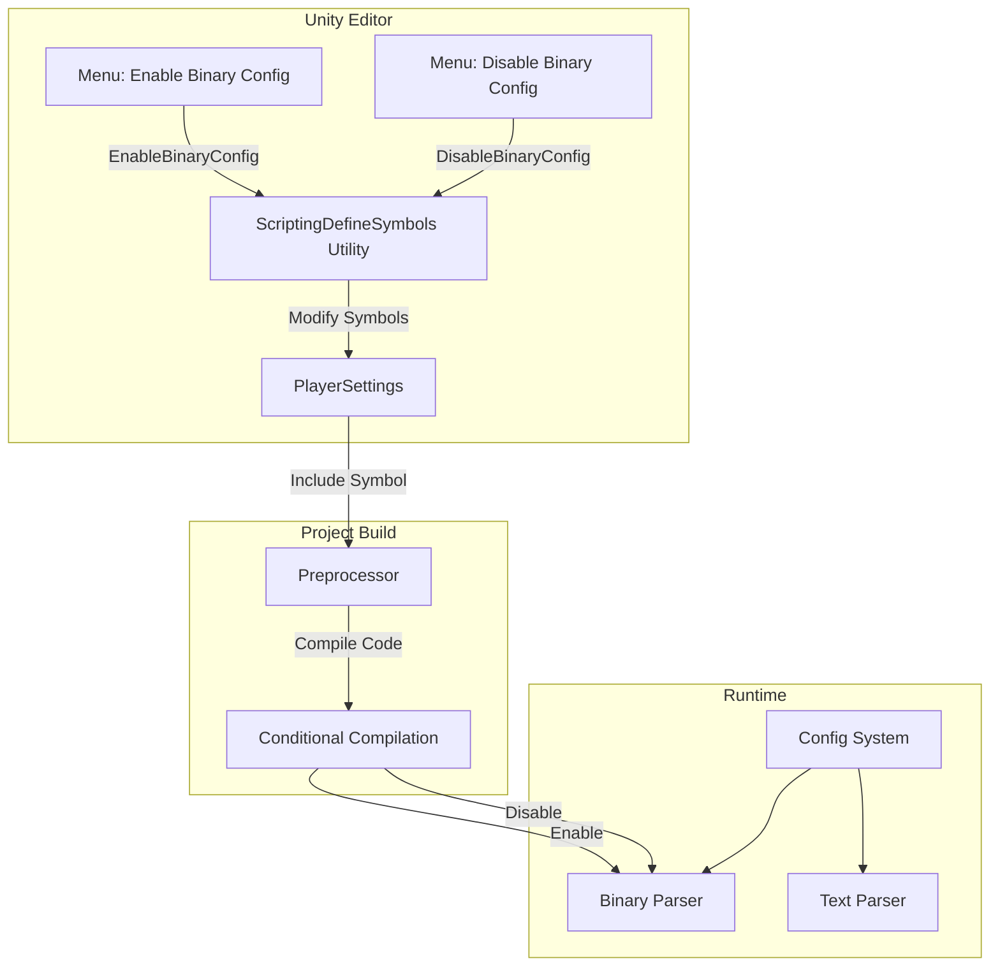
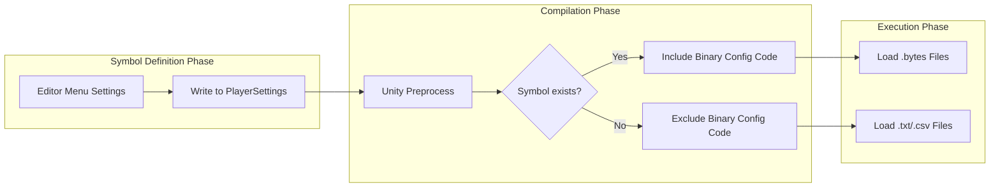

# Scripting Define Symbols

Scripting Define Symbols are preprocessor symbols used for conditional compilation in Unity projects. The GameFrameX Config component uses Scripting Define Symbols to control the enabling and disabling of Binary Config Table functionality.

## Overview

Scripting Define Symbols are a feature of the Unity compiler that allows developers to include or exclude specific code segments based on different compilation conditions. The GameFrameX Config component uses the `ENABLE_BINARY_CONFIG` scripting define symbol to control whether Binary Config Table functionality is enabled.

### What is Binary Config Table

Binary Config Table is a way of storing configuration data in binary format. Compared with text format (CSV, TSV), it has the following advantages:

- **Faster loading speed**: Binary data does not require parsing, can be read directly
- **Smaller file size**: Data is stored in compact binary format
- **Higher security**: Binary data is not easily readable or modifiable directly
- **Lower parsing overhead**: No string splitting and type conversion required

## How It Works

### Architecture Flow



### Symbol Mechanism



## Usage Method

### Enable Binary Config Table

In Unity Editor, enable binary configuration functionality through menu operations:

1. Open Unity Editor
2. Click menu in order: `GameFrameX` → `Scripting Define Symbols` → `Enable Binary Config`
3. Wait for Unity to recompile scripts

### Disable Binary Config Table

If you need to switch back to text format configuration:

1. Click menu in order: `GameFrameX` → `Scripting Define Symbols` → `Disable Binary Config`
2. Wait for Unity to recompile scripts

## API Reference

### ConfigDefineSymbols

Namespace: `GameFrameX.Config.Editor`

```csharp
public static class ConfigDefineSymbols
```

Scripting Define Symbols class for configuration table binary functionality, provides Binary Config Table toggle functionality.

#### Field

| Field | Type | Description |
|------|------|------|
| `EnableBinaryConfigScriptingDefineSymbol` | `const string` | Constant value of Binary Config Table Scripting Define Symbol: `"ENABLE_BINARY_CONFIG"` |

#### Method

##### EnableBinaryConfig

```csharp
[MenuItem("GameFrameX/Scripting Define Symbols/Enable Binary Config", false, 501)]
public static void EnableBinaryConfig()
```

Enables Binary Config Table functionality Scripting Define Symbol.

**Function Description:**
Adds the `ENABLE_BINARY_CONFIG` symbol to the project's PlayerSettings, causing the project to include binary configuration related code during compilation.

> Source: [ConfigDefineSymbols.cs](https://github.com/GameFrameX/com.gameframex.unity.config/blob/main/Editor/ConfigDefineSymbols.cs#L25-L29)

---

##### DisableBinaryConfig

```csharp
[MenuItem("GameFrameX/Scripting Define Symbols/Disable Binary Config", false, 500)]
public static void DisableBinaryConfig()
```

Disables Binary Config Table functionality Scripting Define Symbol.

**Function Description:**
Removes the `ENABLE_BINARY_CONFIG` symbol from the project's PlayerSettings, causing the project to exclude binary configuration related code during compilation.

> Source: [ConfigDefineSymbols.cs](https://github.com/GameFrameX/com.gameframex.unity.config/blob/main/Editor/ConfigDefineSymbols.cs#L16-L20)

## Configuration Options

| Configuration Item | Type | Default | Description |
|--------|------|--------|------|
| `ENABLE_BINARY_CONFIG` | Scripting Macro | Not Defined | Controls the toggle for Binary Config Table functionality |

## Notes

1. **Recompilation**: After modifying Scripting Define Symbols, Unity will automatically recompile scripts. This may cause a brief hang, which is normal.

2. **Platform Differences**: Scripting Define Symbols are global and apply to all platforms. If you need to set for specific platforms, manually modify in PlayerSettings.

3. **Asset Format**: After enabling binary configuration, ensure that config asset files are in `.bytes` format.

4. **Data Compatibility**: Binary format and text format may have different data structures. When switching, ensure data has been correctly converted.

## Related Links

- [Binary Config Table](./11.binary-config.md)
- [ConfigComponent](./10.config-component.md)
- [ConfigManager](./09.config-manager.md)
- [IDataTable Interface](./07.idata-table.md)