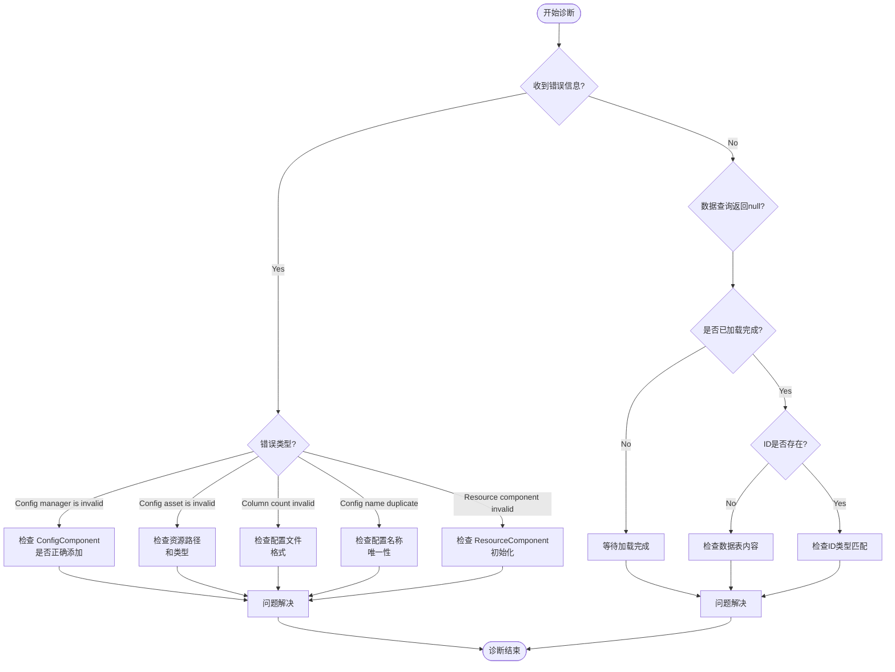

# Troubleshooting

This document summarizesUses Config Config Table Component时可能遇到的Troubleshooting、errorinformation及其解决方案。

## 概述

Config Config Table Component为 Unity 游戏provides了一套完整的Config DataManages解决方案。在实际Uses过程中，开发者可能会遇到configurationLoad Failure、数据parseerror、组件未正确Initialize等问题。本文档旨在帮助开发者快速定位和解决这些问题。

## Troubleshooting列表

### 1. Config Manager 未Initialize

**errorinformation：**
```
Config manager is invalid.
```

**原因分析：**
此error表示 `ConfigComponent` 在Initialize时无法从 GameFrameworkEntry get到 `IConfigManager` 模块。这通常发生在框架Initializesequential不正确的情况下。

**解决方案：**

1. ensure在场景中正确add了 `ConfigComponent` 组件：
```csharp
// 在 Unity 场景中添加 ConfigComponent
// GameObject -> Add Component -> GameFrameX -> Config
```

2. ensure GameFramework 核心组件已正确Initialize。check场景中Whether exists `GameEntry` 对象：
> 详情Please refer to [Core Concepts - ConfigComponent](./4-core-concepts.config-component)

---

### 2. Config AssetType无效

**errorinformation：**
```
Config asset 'xxx' is invalid.
```

**原因分析：**
此warning表示系统无法将load的资产识别为有效的Config Asset。可能原因including：
- 资源路径不正确
- 资源Type不是 `TextAsset` 或 `.bytes` 文件
- 资源文件损坏

**解决方案：**

1. Check Config文件的路径是否正确
2. ensureConfig File是纯文本文件（`.txt`）或二进制文件（`.bytes`）
3. verify资源已正确打包到最终的游戏构建中

---

### 3. configuration列数不匹配

**errorinformation：**
```
Can not parse config line string 'xxx' which column count is invalid.
```

**原因分析：**
在parse文本格式的Config File时，parse器期望每行有 4 列数据（Uses Tab 分隔）。如果列数不符合预期，parse将failure。

Config File格式要求：
```
#ID    名称    注释    值
1      config1 示例     value1
2      config2 示例     value2
```

**解决方案：**

1. Check Config文件的列数是否正确（应为 4 列）
2. ensureUses Tab 字符作为列分隔符
3. check是否有空行或格式不正确的行

> 详情Please refer to [Configuration Options - Binary Config Table](./6-configuration.binary-config)

---

### 4. Config Name重复或无效

**errorinformation：**
```
Can not add config with config name 'xxx' which may be invalid or duplicate.
```

**原因分析：**
此warning表示尝试add的Config Name无效或已存在。每个Config Name必须是唯一的。

**解决方案：**

1. Check if exists重复的Config Name
2. ensureConfig Name不为空字符串
3. Uses唯一标识符作为Config Name

---

### 5. Resource Component 未找到

**errorinformation：**
```
Resource component is invalid.
```

**原因分析：**
`DefaultConfigHelper` Depends on `ResourceComponent` 来loadConfig Asset。如果 `ResourceComponent` 未正确Initialize，configuration将无法load。

**解决方案：**

1. ensure场景中存在 `ResourceComponent` 组件
2. check资源系统的Initializesequential
3. ensure资源包已正确load

---

### 6. Binary Config Table不生效

**问题Description：**
启用 `ENABLE_BINARY_CONFIG` 宏定义后，Binary Config Table功能未生效。

**解决方案：**

1. 在 Unity 菜单中启用二进制configuration：
   - 打开菜单：`GameFrameX -> Scripting Define Symbols -> Enable Binary Config(开启二进制配置表)`

2. ensureConfig File扩展名为 `.bytes`

> 详情Please refer to [Configuration Options - Scripting Define Symbols](./6-configuration.scripting-define-symbols)

---

### 7. Data TableLoad Failure

**问题Description：**
调用 `IDataTable.LoadAsync()` Method后，数据未正确load。

**排查步骤：**

1. checkAsynchronous Loading是否complete：
```csharp
// 正确等待加载完成
IDataTable<MyConfig> configTable = component.GetConfig<MyConfigTable>();
await configTable.LoadAsync();

// 检查是否加载成功
if (component.HasConfig<MyConfigTable>()) {
    // 配置已加载
}
```

2. check事件是否捕获到error：
> 详情Please refer to [API Reference - Event Arguments](./5-api-reference.event-args)

---

### 8. Data Query返回 null

**问题Description：**
Uses `TryGet` Method查询Config Data时，返回 `false` 或 `null`。

**可能原因：**

1. Data Table尚未loadcomplete
2. 查询的 ID 不存在
3. Data TableType不匹配

**解决方案：**

1. ensure在数据loadcomplete后再进行查询
2. Uses `HasConfig<T>()` Method先Check ConfigWhether exists
3. verify查询的 ID Type（int/long/string）与Data Table Definition一致

```csharp
// 正确的数据查询流程
var configTable = component.GetConfig<MyConfigTable>();
if (component.HasConfig<MyConfigTable>()) {
    if (configTable.TryGet(1, out var config)) {
        // 成功获取配置
    }
}
```

---

## Diagnostic Flow



## Debugging Tips

### 1. 启用logdebug

Config 组件会输出详细的loginformation。在开发阶段，ensurelog级别set为 `Debug` 或 `Info`：

```csharp
// 在游戏启动时设置日志级别
Log.SetLogHelper(new DebugLogHelper());
```

### 2. Uses事件监听

监听Config Loading事件可以帮助快速定位问题：

```csharp
// 监听配置加载成功事件
GameEntry.Event.Subscribe(LoadConfigSuccessEventArgs.EventId, OnLoadConfigSuccess);

// 监听配置加载失败事件
GameEntry.Event.Subscribe(LoadConfigFailureEventArgs.EventId, OnLoadConfigFailure);

private void OnLoadConfigSuccess(object sender, LoadConfigSuccessEventArgs e)
{
    UnityEngine.Debug.Log($"配置加载成功: {e.ConfigAssetName}, 耗时: {e.Duration}秒");
}

private void OnLoadConfigFailure(object sender, LoadConfigFailureEventArgs e)
{
    UnityEngine.Debug.LogError($"配置加载失败: {e.ConfigAssetName}, 错误: {e.ErrorMessage}");
}
```

### 3. Check Config数量

在debug时，可以check当前load的configuration数量：

```csharp
var configComponent = GameEntry.GetComponent<ConfigComponent>();
UnityEngine.Debug.Log($"当前配置数量: {configComponent.Count}");
```

---

## Best Practices

1. **始终Uses TryGet Method**：避免Uses已标记为 `[Obsolete]` 的 `Get` Method
2. **Check Config存在性**：在Usesconfiguration前先调用 `HasConfig<T>()` Method
3. **Asynchronous Loading**：Config Loading是asynchronous的，ensure在loadcomplete后再Uses数据
4. **Error Handling**：订阅Load Failure Event，以便及时发现和processerror

---

## Related Links

- [Core Concepts - ConfigComponent](./4-core-concepts.config-component)
- [Core Concepts - ConfigManager](./4-core-concepts.config-manager)
- [Core Concepts - IDataTable](./4-core-concepts.idata-table)
- [API Reference - Interface Definitions](./5-api-reference.interfaces)
- [API Reference - Event Arguments](./5-api-reference.event-args)
- [Configuration Options - Binary Config Table](./6-configuration.binary-config)
- [Configuration Options - Scripting Define Symbols](./6-configuration.scripting-define-symbols)
