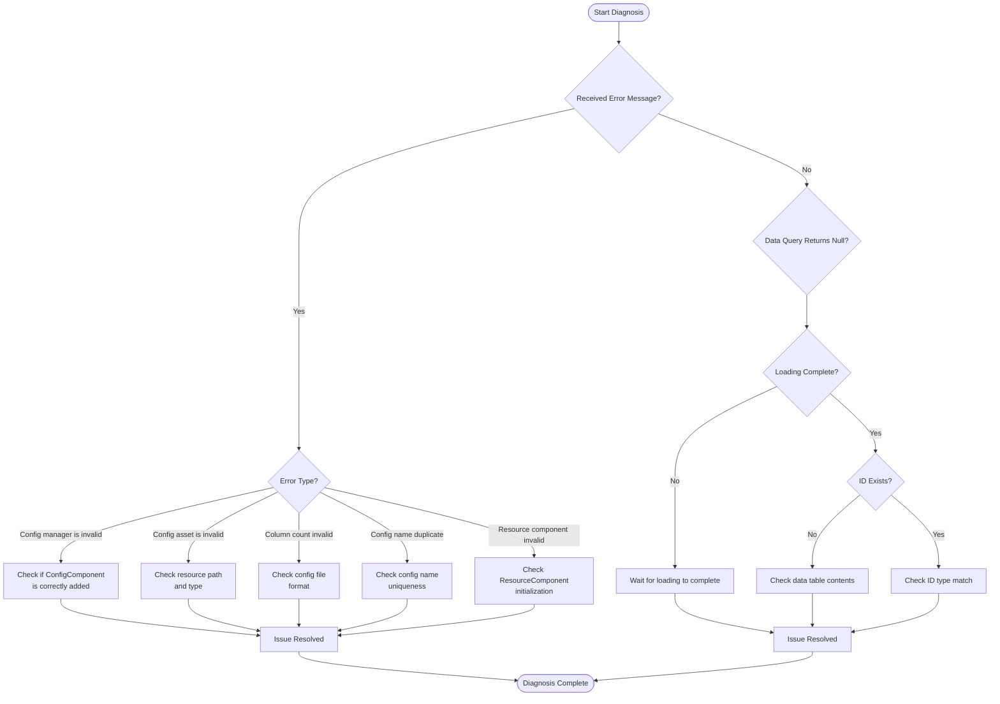

# Troubleshooting

This document summarizes troubleshooting, error information, and solutions that may be encountered when using the Config Config Table component.

## Overview

The Config Config Table component provides a complete configuration data management solution for Unity games. During actual use, developers may encounter issues such as configuration load failure, data parsing errors, and components not initializing correctly. This document aims to help developers quickly locate and resolve these issues.

## Troubleshooting List

### 1. Config Manager Not Initialized

**Error Information:**
```
Config manager is invalid.
```

**Cause Analysis:**
This error indicates that `ConfigComponent` cannot obtain the `IConfigManager` module from GameFrameworkEntry during initialization. This usually occurs when the framework initialization sequence is incorrect.

**Solution:**

1. Ensure `ConfigComponent` component is correctly added to the scene:
```csharp
// Add ConfigComponent in Unity scene
// GameObject -> Add Component -> GameFrameX -> Config
```

2. Ensure GameFramework core components are correctly initialized. Check if the `GameEntry` object exists in the scene:
> For details, refer to [ConfigComponent](./10.config-component.md)

---

### 2. Invalid Config Asset Type

**Error Information:**
```
Config asset 'xxx' is invalid.
```

**Cause Analysis:**
This warning indicates that the system cannot recognize the loaded asset as a valid Config asset. Possible reasons include:
- Incorrect resource path
- Resource type is not `TextAsset` or `.bytes` file
- Resource file is corrupted

**Solution:**

1. Check if the config file path is correct
2. Ensure config file is plain text file (`.txt`) or binary file (`.bytes`)
3. Verify the resource has been correctly packaged into the final game build

---

### 3. Configuration Column Count Mismatch

**Error Information:**
```
Can not parse config line string 'xxx' which column count is invalid.
```

**Cause Analysis:**
When parsing text format config files, the parser expects each line to have 4 columns of data (using Tab as separator). If the column count does not match expectations, parsing will fail.

Config file format requirements:
```
#ID    Name    Comment    Value
1      config1 example    value1
2      config2 example    value2
```

**Solution:**

1. Check if the config file has the correct number of columns (should be 4)
2. Ensure Tab character is used as column separator
3. Check for empty lines or incorrectly formatted lines

> For details, refer to [Binary Config Table](./11.binary-config.md)

---

### 4. Config Name Duplicate or Invalid

**Error Information:**
```
Can not add config with config name 'xxx' which may be invalid or duplicate.
```

**Cause Analysis:**
This warning indicates that the config name being added is invalid or already exists. Each config name must be unique.

**Solution:**

1. Check if there are duplicate config names
2. Ensure config name is not an empty string
3. Use unique identifiers as config names

---

### 5. Resource Component Not Found

**Error Information:**
```
Resource component is invalid.
```

**Cause Analysis:**
`DefaultConfigHelper` depends on `ResourceComponent` to load config assets. If `ResourceComponent` is not correctly initialized, configuration cannot be loaded.

**Solution:**

1. Ensure `ResourceComponent` component exists in the scene
2. Check the resource system initialization sequence
3. Ensure asset bundles are correctly loaded

---

### 6. Binary Config Table Not Taking Effect

**Problem Description:**
After enabling `ENABLE_BINARY_CONFIG` macro definition, Binary Config Table functionality does not take effect.

**Solution:**

1. Enable binary configuration in Unity menu:
   - Open menu: `GameFrameX -> Scripting Define Symbols -> Enable Binary Config`

2. Ensure config file extension is `.bytes`

> For details, refer to [Scripting Define Symbols](./13.scripting-define-symbols.md)

---

### 7. Data Table Load Failure

**Problem Description:**
After calling `IDataTable.LoadAsync()` method, data is not correctly loaded.

**Troubleshooting Steps:**

1. Check if asynchronous loading is complete:
```csharp
// Correctly wait for loading to complete
IDataTable<MyConfig> configTable = component.GetConfig<MyConfigTable>();
await configTable.LoadAsync();

// Check if loading succeeded
if (component.HasConfig<MyConfigTable>()) {
    // Configuration loaded
}
```

2. Check if events captured errors:
> For details, refer to [Event Arguments](./12.event-args.md)

---

### 8. Data Query Returns null

**Problem Description:**
When using `TryGet` method to query config data, returns `false` or `null`.

**Possible Causes:**

1. Data table has not completed loading
2. The queried ID does not exist
3. Data table type mismatch

**Solution:**

1. Ensure queries are only performed after data loading is complete
2. Use `HasConfig<T>()` method to check if config exists first
3. Verify the queried ID type (int/long/string) matches the data table definition

```csharp
// Correct data query flow
var configTable = component.GetConfig<MyConfigTable>();
if (component.HasConfig<MyConfigTable>()) {
    if (configTable.TryGet(1, out var config)) {
        // Successfully obtained configuration
    }
}
```

---

## Diagnostic Flow



## Debugging Tips

### 1. Enable Log Debug

The Config component outputs detailed log information. During development, ensure log level is set to `Debug` or `Info`:

```csharp
// Set log level when game starts
Log.SetLogHelper(new DebugLogHelper());
```

### 2. Use Event Listening

Listening to config loading events can help quickly locate issues:

```csharp
// Listen to config load success event
GameEntry.Event.Subscribe(LoadConfigSuccessEventArgs.EventId, OnLoadConfigSuccess);

// Listen to config load failure event
GameEntry.Event.Subscribe(LoadConfigFailureEventArgs.EventId, OnLoadConfigFailure);

private void OnLoadConfigSuccess(object sender, LoadConfigSuccessEventArgs e)
{
    UnityEngine.Debug.Log($"Config loaded successfully: {e.ConfigAssetName}, duration: {e.Duration}s");
}

private void OnLoadConfigFailure(object sender, LoadConfigFailureEventArgs e)
{
    UnityEngine.Debug.LogError($"Config load failed: {e.ConfigAssetName}, error: {e.ErrorMessage}");
}
```

### 3. Check Config Count

During debugging, you can check the current number of loaded configurations:

```csharp
var configComponent = GameEntry.GetComponent<ConfigComponent>();
UnityEngine.Debug.Log($"Current configuration count: {configComponent.Count}");
```

---

## Best Practices

1. **Always Use TryGet Method**: Avoid using `Get` method marked as `[Obsolete]`
2. **Check Config Existence**: Call `HasConfig<T>()` method before using configuration
3. **Asynchronous Loading**: Config loading is asynchronous, ensure data is used only after loading is complete
4. **Error Handling**: Subscribe to load failure events to timely discover and handle errors

---

## Related Links

- [ConfigComponent](./10.config-component.md)
- [ConfigManager](./09.config-manager.md)
- [IDataTable Interface](./07.idata-table.md)
- [Interface Definitions](./06.interfaces.md)
- [Event Arguments](./12.event-args.md)
- [Binary Config Table](./11.binary-config.md)
- [Scripting Define Symbols](./13.scripting-define-symbols.md)