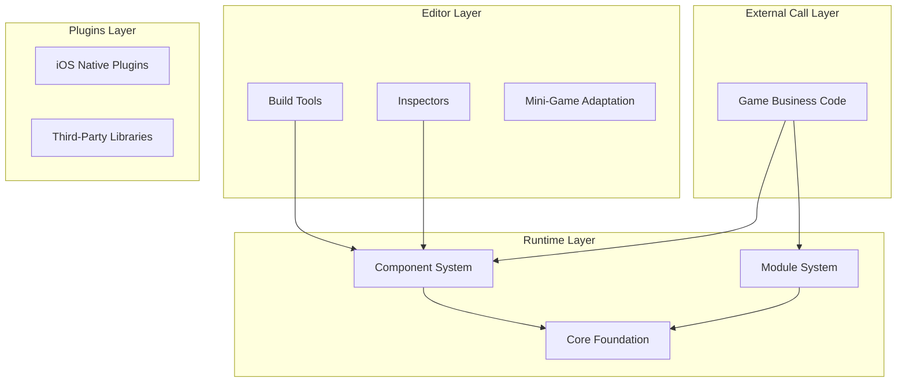
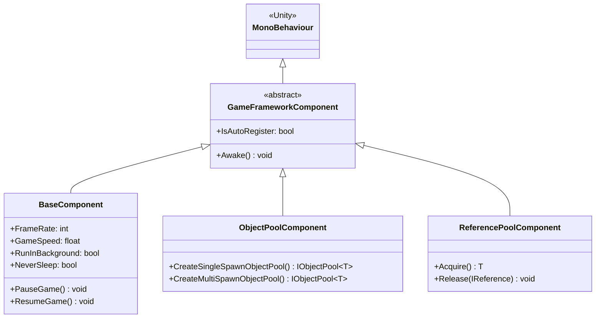
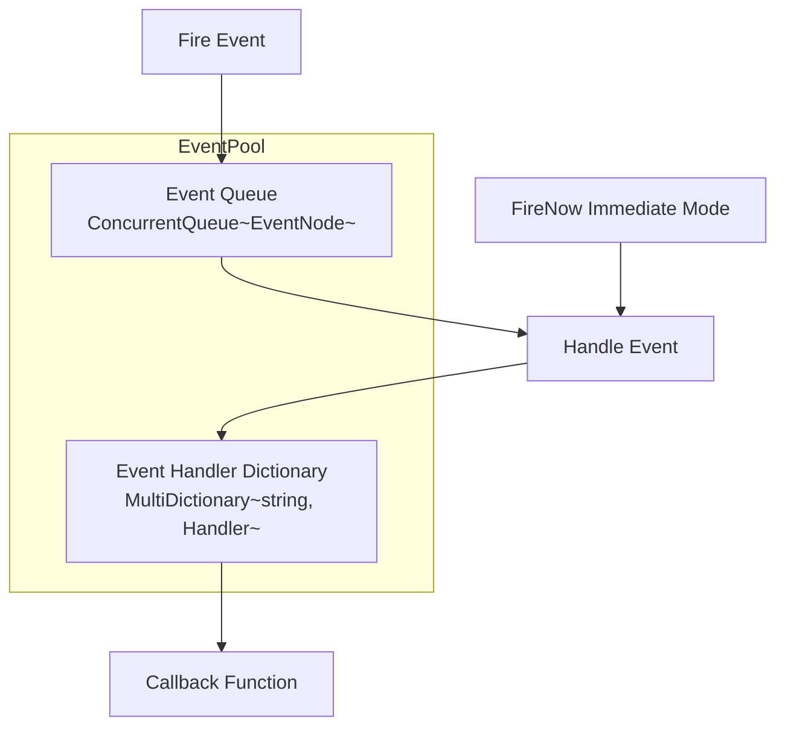
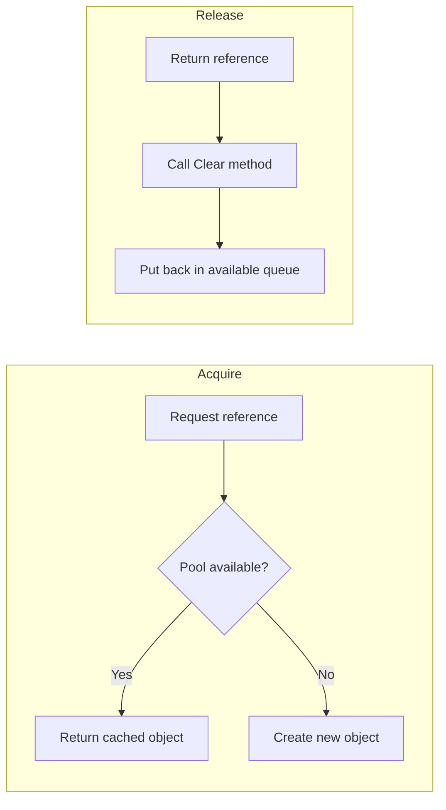

# Core Concepts

GameFrameX framework adopts a modern three-layer modular architecture design, providing an integrated front-end and back-end solution for indie game developers. This document details the framework's core concepts, architecture design, and key design patterns.

## Overview

GameFrameX is a modern framework specifically designed for Unity game developers. Its core philosophy is to help developers quickly build high-quality game projects through modular architecture and rich built-in tools. The framework adopts **component-based design**, encapsulating various functions as independent components that developers can flexibly combine based on project requirements.

### Design Goals

The framework follows these core principles:

1. **Modular Design**: Each functional module is independently encapsulated and communicates through interfaces, making it easy to replace and extend
2. **Performance First**: Optimize memory allocation through object pooling, reference pooling, and other technologies to reduce garbage collection pressure
3. **Development Efficiency**: Provide rich extension methods, utility classes, and editor tools to improve development efficiency
4. **Cross-Platform Support**: Support PC, mobile, WebGL, and multiple mini-game platforms

### System Architecture

GameFrameX framework adopts a clear three-layer architecture design:



## Core Component System

The core of GameFrameX is the component system, with all functionality provided through components. The component system is divided into two categories: **Component** and **Module**.

### Component

Components inherit from `MonoBehaviour` and are Unity components attached to GameObjects. Each component is automatically registered with `GameEntry` when the game starts and can be obtained through the `GameEntry.GetComponent<T>()` method.



> Source: [GameFrameworkComponent.cs](https://github.com/GameFrameX/com.gameframex.unity/blob/main/Runtime/Base/GameFrameworkComponent.cs#L44-L95)

#### Component Registration Mechanism

Components are automatically registered with `GameEntry` in the `Awake()` method:

```csharp
protected virtual void Awake()
{
    GameEntry.RegisterComponent(this);
    if (IsAutoRegister)
    {
        GameFrameworkEntry.RegisterModule(InterfaceComponentType, ImplementationComponentType);
    }
}
```

> Source: [GameFrameworkComponent.cs](https://github.com/GameFrameX/com.gameframex.unity/blob/main/Runtime/Base/GameFrameworkComponent.cs#L85-L94)

### Module

Modules are pure C# classes that do not depend on Unity's `MonoBehaviour` and are used to implement logic services unrelated to the Unity lifecycle. Modules have a priority concept, executing in priority order during `Update` polling and `Shutdown`.

```csharp
public abstract class GameFrameworkModule
{
    /// <summary>
    /// Gets the priority of the game framework module
    /// </summary>
    protected internal virtual int Priority
    {
        get { return 0; }
    }

    /// <summary>
    /// Polls the game framework module
    /// </summary>
    protected internal abstract void Update(float elapseSeconds, float realElapseSeconds);

    /// <summary>
    /// Closes and cleans up the game framework module
    /// </summary>
    protected internal abstract void Shutdown();
}
```

> Source: [GameFrameworkModule.cs](https://github.com/GameFrameX/com.gameframex.unity/blob/main/Runtime/Base/GameFrameworkModule.cs#L40-L70)

### Framework Entry (GameEntry)

`GameEntry` is the static entry point of the framework, responsible for managing the registration and retrieval of all components:

```csharp
public static class GameEntry
{
    private static readonly GameFrameworkLinkedList<GameFrameworkComponent> GameFrameworkComponents = new GameFrameworkLinkedList<GameFrameworkComponent>();

    /// <summary>
    /// Gets a game framework component
    /// </summary>
    public static T GetComponent<T>() where T : GameFrameworkComponent
    {
        return (T)GetComponent(typeof(T));
    }

    /// <summary>
    /// Registers a game framework component
    /// </summary>
    internal static void RegisterComponent(GameFrameworkComponent gameFrameworkComponent)
    {
        // Component registration logic...
    }
}
```

> Source: [GameEntry.cs](https://github.com/GameFrameX/com.gameframex.unity/blob/main/Runtime/Base/GameEntry.cs#L46-L195)

## Event System

GameFrameX provides a powerful event pool system, supporting **thread-safe async event dispatch** and **sync immediate event dispatch** modes. The event system adopts a publish-subscribe pattern to achieve loose-coupled communication between modules.

### Event Pool Architecture



### Event Usage Example

```csharp
// Define event args
public class PlayerDeadEventArgs : BaseEventArgs
{
    public static int EventId => typeof(PlayerDeadEventArgs).GetHashCode();
    public int PlayerId { get; private set; }
    public float Damage { get; private set; }

    public static PlayerDeadEventArgs Create(int playerId, float damage)
    {
        var args = ReferencePool.Acquire<PlayerDeadEventArgs>();
        args.PlayerId = playerId;
        args.Damage = damage;
        return args;
    }

    public override void Clear()
    {
        PlayerId = 0;
        Damage = 0;
    }
}

// Subscribe to event
GameEntry.Event.Subscribe(PlayerDeadEventArgs.EventId, OnPlayerDead);

// Fire event (async, processed next frame)
GameEntry.Event.Fire(this, PlayerDeadEventArgs.Create(playerId, damage));

// Fire event (sync, processed immediately)
GameEntry.Event.FireNow(this, PlayerDeadEventArgs.Create(playerId, damage));

// Unsubscribe
GameEntry.Event.Unsubscribe(PlayerDeadEventArgs.EventId, OnPlayerDead);
```

> Source: [EventPool.cs](https://github.com/GameFrameX/com.gameframex.unity/blob/main/Runtime/Base/EventPool/EventPool.cs#L200-L335)

### Event Pool Mode

The event pool supports multiple modes that can be combined to achieve different behaviors:

| Mode | Description |
|------|-------------|
| `AllowMultiHandler` | Allows multiple handlers for the same event |
| `AllowDuplicateHandler` | Allows duplicate handlers |
| `AllowNoHandler` | Allows events without handlers |

```csharp
// Create an event pool that supports multiple handlers
var eventPool = new EventPool<MyEventArgs>(EventPoolMode.AllowMultiHandler | EventPoolMode.AllowDuplicateHandler);
```

> Source: [EventPoolMode.cs](https://github.com/GameFrameX/com.gameframex.unity/blob/main/Runtime/Base/EventPool/EventPoolMode.cs)

## Reference Pool System

The reference pool is one of the core memory optimization technologies in the GameFrameX framework, specifically designed for managing memory allocation of **non-Unity objects**. Through the reference pool, you can avoid garbage collection pressure caused by frequent object creation and destruction.

### Reference Pool Principle



### Usage

Any class that needs to use the reference pool must implement the `IReference` interface:

```csharp
public class MyData : IReference
{
    public int Id { get; set; }
    public string Name { get; set; }
    public float Value { get; set; }

    // Must implement Clear method
    public void Clear()
    {
        Id = 0;
        Name = null;
        Value = 0;
    }
}

// Acquire object from reference pool
var data = ReferencePool.Acquire<MyData>();
data.Id = 1;
data.Name = "Test";
data.Value = 100f;

// Return to reference pool
ReferencePool.Release(data);

// Add pre-allocated references
ReferencePool.Add<MyData>(10);
```

> Source: [ReferencePool.cs](https://github.com/GameFrameX/com.gameframex.unity/blob/main/Runtime/Base/ReferencePool/ReferencePool.cs#L120-L167)

## Object Pool System

The object pool system is specifically designed for managing the reuse of **Unity objects** (such as GameObject, Component) and is an important means of performance optimization in game development.

### Object Pool Types

| Type | Description | Use Case |
|------|-------------|----------|
| `SingleSpawnObjectPool` | Single spawn pool | Bullets, items, etc. one-time objects |
| `MultiSpawnObjectPool` | Multi-spawn pool | NPCs, UI elements, etc. reusable objects |

### Usage Example

```csharp
// Create an object pool
var pool = GameEntry.ObjectPool.CreateMultiSpawnObjectPool<MyObject>("MyPool", 10, 60f, 100);

// Spawn object from pool
var obj = pool.Spawn();

// Return object to pool
pool.Unspawn(obj);

// Destroy object pool
GameEntry.ObjectPool.DestroyObjectPool<MyObject>("MyPool");
```

> Source: [ObjectPoolComponent.cs](https://github.com/GameFrameX/com.gameframex.unity/blob/main/Runtime/ObjectPool/ObjectPoolComponent.cs#L650-L1045)

### Expiration Time and Auto-Release

Object pools support setting object expiration time, and objects not used after timeout are automatically released:

```csharp
// Create object pool with expiration time (expires after 60 seconds)
var pool = GameEntry.ObjectPool.CreateMultiSpawnObjectPool<MyObject>("ExpirePool", 60f);

// Set auto-release interval (check every 30 seconds)
pool.AutoReleaseInterval = 30f;
```

## Singleton Pattern

GameFrameX provides two singleton base classes for different scenarios.

### Regular Singleton (GameFrameworkSingleton)

Suitable for pure C# classes, using double-check locking to ensure thread safety:

```csharp
public class MySingleton : GameFrameworkSingleton<MySingleton>
{
    public void DoSomething()
    {
        // Business logic
    }
}

// Usage
MySingleton.Instance.DoSomething();
```

> Source: [GameFrameworkSingleton.cs](https://github.com/GameFrameX/com.gameframex.unity/blob/main/Runtime/Base/GameFrameworkSingleton.cs#L11-L46)

### Mono Singleton (GameFrameworkMonoSingleton)

Suitable for components that need to be attached to GameObjects:

```csharp
public class MyMonoSingleton : GameFrameworkMonoSingleton<MyMonoSingleton>
{
    protected override void OnWake()
    {
        // Initialization logic
    }
}

// Usage
MyMonoSingleton.Instance.DoSomething();
```

> Source: [GameFrameworkMonoSingleton.cs](https://github.com/GameFrameX/com.gameframex.unity/blob/main/Runtime/Base/GameFrameworkMonoSingleton.cs)

## Property System

The property system (BindableProperty) provides support for the MVVM architecture pattern, allowing automatic notification to observers when property values change.

### Bindable Property

```csharp
// Define bindable property
public BindableProperty<int> Score = new BindableProperty<int>(0);
public BindableProperty<string> PlayerName = new BindableProperty<string>("Player");

// Subscribe to value change events
Score.Add(OnScoreChanged);
PlayerName.RegisterWithInitValue(OnNameChanged);

// Automatically trigger callback when value changes
Score.Value = 100;  // Triggers OnScoreChanged(100)

// Remove event
Score.Remove(OnScoreChanged);

// Clear all events
Score.Clear();
```

> Source: [BindableProperty.cs](https://github.com/GameFrameX/com.gameframex.unity/blob/main/Runtime/Property/BindableProperty.cs#L7-L89)

### MVVM Pattern Application

BindableProperty can well support MVVM architecture:

```csharp
// Model - Data model
public class PlayerModel
{
    public BindableProperty<int> Health = new BindableProperty<int>(100);
    public BindableProperty<int> Mana = new BindableProperty<int>(50);
    public BindableProperty<Vector3> Position = new BindableProperty<Vector3>();
}

// ViewModel - View model
public class PlayerViewModel
{
    private readonly PlayerModel _model;

    public PlayerViewModel(PlayerModel model)
    {
        _model = model;
    }

    public void TakeDamage(int damage)
    {
        _model.Health.Value -= damage;
    }
}

// View - View (in UI script)
public class PlayerHUD : MonoBehaviour
{
    public Text healthText;
    private PlayerModel _model;

    public void Bind(PlayerModel model)
    {
        _model = model;
        _model.Health.RegisterWithInitValue(OnHealthChanged);
    }

    private void OnHealthChanged(int health)
    {
        healthText.text = $"HP: {health}";
    }
}
```

## Extension Method Library

GameFrameX provides a rich library of extension methods covering string, collections, date/time, Unity types, and other areas.

### Transform Extensions

```csharp
// Set position components
transform.SetPositionX(10f);
transform.SetPositionY(20f);
transform.SetPositionZ(30f);

// Set in batch
transform.SetLocalScaleXYZ(2f, 2f, 2f);

// Reset transform
transform.ResetTransformation();

// Find child objects
var child = transform.FindChildRecursive("ChildName");
```

### Vector Extensions

```csharp
Vector3 pos = transform.position;
pos = pos.WithX(5f).WithY(10f);  // Create new value, preserving other components
Vector3 direction = pos.NormalizeTo();
float angle = transform.forward.AngleTo(Vector3.forward);
```

### GameObject Extensions

```csharp
// Optimized activation/deactivation
gameObject.SetActiveOptimized(true);

// Recursively set layer
gameObject.SetLayerRecursively(LayerMask.NameToLayer("UI"));

// Get or add component
var component = gameObject.GetOrAddComponent<MyComponent>();
```

> Source: [UnityEngage.GameObjectExtension.cs](https://github.com/GameFrameX/com.gameframex.unity/blob/main/Runtime/Extension/UnityEngage.GameObject/UnityEngage.GameObjectExtension.cs)

## Utility Classes

The framework provides comprehensive utility classes covering encryption, compression, file operations, networking, and more.

### Encryption/Decryption

```csharp
// AES encryption
string encrypted = Utility.Encryption.Aes.Encrypt("plaintext", "key");
string decrypted = Utility.Encryption.Aes.Decrypt(encrypted, "key");

// MD5 hash
string md5 = Utility.Hash.Md5.ComputeHash("input");

// SHA1 hash
string sha1 = Utility.Hash.Sha1.ComputeHash("input");
```

### File Operations

```csharp
// Read file
byte[] data = Utility.File.ReadAllBytes("path/to/file");
string content = Utility.File.ReadAllString("path/to/file");

// Write file
Utility.File.WriteAllBytes("path/to/file", data);
Utility.File.WriteAllString("path/to/file", content);
```

### JSON Serialization

```csharp
// Object to JSON
string json = Utility.Json.ToJson(myObject);

// JSON to object
var obj = Utility.Json.FromJson<MyClass>(json);
```

## Related Links

- [Base Components](./5-runtime.base)
- [Event System](./5-runtime.event-system)
- [Object Pool System](./5-runtime.object-pool)
- [Reference Pool System](./5-runtime.reference-pool)
- [Property System](./5-runtime.property-system)
- [Extension Method Library](./5-runtime.extension-methods)
- [Utility Classes](./5-runtime.utility-classes)
- [API Reference](./8-api-reference)