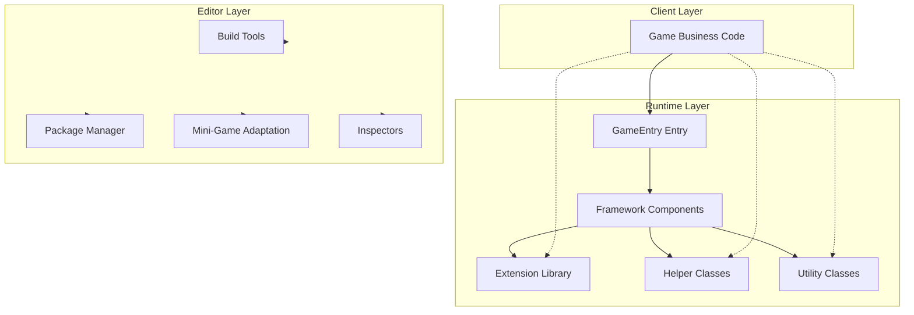
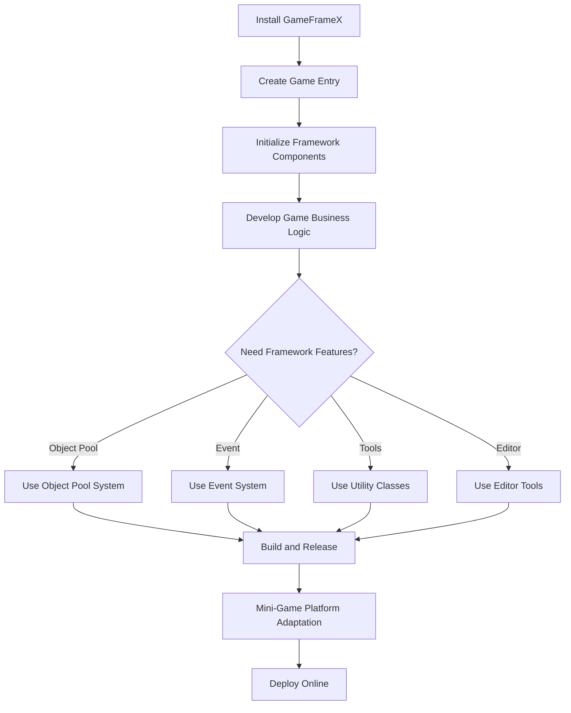
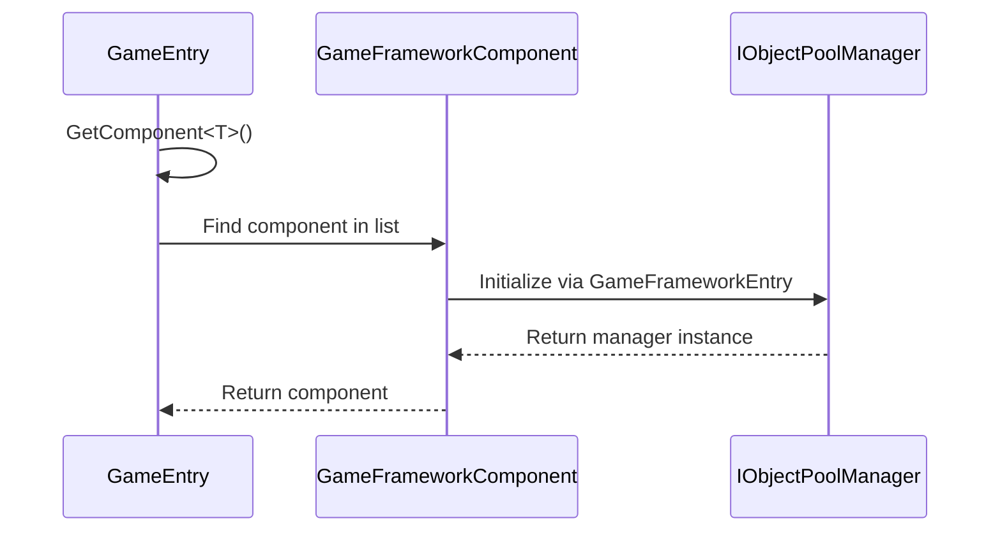

# Getting Started

GameFrameX is a modern Unity game framework designed for indie game developers, adopting a three-layer modular architecture to provide a complete front-end and back-end integrated solution, helping developers quickly build high-quality game projects.

## Overview

GameFrameX framework provides rich runtime components and editor tools, including:

- **Object Pool System**: Efficient memory management and object reuse mechanism
- **Event System**: Decoupled communication based on publish-subscribe pattern
- **Reference Pool System**: Memory optimization for reference type objects
- **Extension Method Library**: Rich Unity engine extension methods
- **Utility Classes**: Common features like encryption, compression, networking, JSON, etc.
- **Editor Tools**: Build tools, package management, mini-game platform adaptation, etc.

### System Requirements

| Requirement | Specification |
|-------------|---------------|
| Unity Version | 2019.4 or higher |
| .NET Version | .NET Standard 2.0+ |
| Supported Platforms | Windows, macOS, Linux, iOS, Android, WebGL |

## Architecture Overview



## Installation Guide

### Method 1: Unity Package Manager (Recommended)

1. Open Unity Editor
2. Open `Window` -> `Package Manager`
3. Click the `+` button in the upper left corner
4. Select `Add package from git URL...`
5. Enter: `https://github.com/GameFrameX/com.gameframex.unity.git`

### Method 2: Manual Download

1. Download the latest [Release](https://github.com/GameFrameX/com.gameframex.unity/releases)
2. Extract to your project's `Packages` directory

## Basic Usage

### Game Entry

GameFrameX uses `GameEntry` as a static entry point to access all framework components:

```csharp
using GameFrameX.Runtime;

public class GameManager : MonoBehaviour
{
    void Start()
    {
        // Get object pool component
        var objectPool = GameEntry.GetComponent<ObjectPoolComponent>();

        // Get reference pool component
        var referencePool = GameEntry.GetComponent<ReferencePoolComponent>();

        // Use extension methods
        transform.SetPositionX(10f);
        gameObject.SetActiveOptimized(true);
    }
}
```

> Source: [Runtime/Base/GameEntry.cs](https://github.com/GameFrameX/com.gameframex.unity/blob/main/Runtime/Base/GameEntry.cs#L46-L70)

### Framework Components

GameFrameX provides various framework components, all accessible via `GameEntry.GetComponent<T>()`:

```csharp
// Object pool component - efficient reusable object management
var objectPool = GameEntry.GetComponent<ObjectPoolComponent>();

// Reference pool component - optimized reference type memory management
var referencePool = GameEntry.GetComponent<ReferencePoolComponent>();
```

> Source: [Runtime/ObjectPool/ObjectPoolComponent.cs](https://github.com/GameFrameX/com.gameframex.unity/blob/main/Runtime/ObjectPool/ObjectPoolComponent.cs#L45-L72)

## Core Feature Examples

### Object Pool System

The object pool system optimizes game performance by avoiding frequent object creation and destruction:

```csharp
// Get object pool component
var objectPool = GameEntry.GetComponent<ObjectPoolComponent>();

// Create object pool (single spawn mode)
objectPool.CreateSingleSpawnObjectPool<MyObject>("MyObjectPool", 10, 60f);

// Spawn object from pool
var obj = objectPool.Spawn<MyObject>("MyObjectPool");

// Return object to pool
objectPool.Unspawn(obj);

// Create object pool (multi spawn mode)
objectPool.CreateMultiSpawnObjectPool<MyObject>("MyObjectMultiPool", 100, 60f);

// Destroy object pool
objectPool.DestroyPool("MyObjectPool");
```

### Extension Methods

GameFrameX provides rich extension methods to simplify common operations:

#### Transform Extensions

```csharp
// Set position components
transform.SetPositionX(10f);
transform.SetPositionY(20f);
transform.SetPositionZ(30f);

// Set local scale components
transform.SetLocalScaleX(2f);
transform.SetLocalScaleY(2f);
transform.SetLocalScaleZ(2f);

// Set local scale XYZ
transform.SetLocalScaleXYZ(2f, 2f, 2f);

// Reset transform
transform.ResetTransformation();
```

> Source: [Runtime/Extension/UnityEngine.Transform/UnityEngine.TransformExtension.cs](https://github.com/GameFrameX/com.gameframex.unity/blob/main/Runtime/Extension/UnityEngine.Transform/UnityEngine.TransformExtension.cs#L55-L60)

#### Vector3 Extensions

```csharp
Vector3 pos = transform.position;

// Create new vector, modify specified components
pos = pos.WithX(5f).WithY(10f);

// Vector operation extensions
Vector3 direction = Vector3.Right;
direction = direction.RotateBy(45f, Vector3.Up);
```

#### GameObject Extensions

```csharp
// Optimized activation setting
gameObject.SetActiveOptimized(true);

// Recursively set layer
gameObject.SetLayerRecursively(LayerMask.NameToLayer("UI"));

// Get or add component
var component = gameObject.GetOrAddComponent<MyComponent>();
```

### Utility Classes

GameFrameX provides static utility classes covering various common functions:

#### File Operations

```csharp
// Write byte array
Utility.File.WriteAllBytes("path/to/file", data);

// Read byte array
byte[] content = Utility.File.ReadAllBytes("path/to/file");

// Write text
Utility.File.WriteAllText("path/to/file", "content");

// Read text
string text = Utility.File.ReadAllText("path/to/file");
```

#### AES Encryption/Decryption

```csharp
// AES encrypt
string encrypted = Utility.Encryption.Aes.Encrypt("plaintext", "key");

// AES decrypt
string decrypted = Utility.Encryption.Aes.Decrypt(encrypted, "key");
```

#### Hash Computation

```csharp
// MD5 hash
string md5 = Utility.Hash.Md5.ComputeHash("input");

// SHA1 hash
string sha1 = Utility.Hash.Sha1.ComputeHash("input");

// HMAC SHA256
string hmac = Utility.Hash.HMACSha256.ComputeHash("input", "key");
```

#### JSON Serialization

```csharp
// Object to JSON
string json = Utility.Json.ToJson(myObject);

// JSON to object
var obj = Utility.Json.FromJson<MyClass>(json);
```

#### Compression/Decompression

```csharp
// Compress data
byte[] compressed = Utility.Compression.Compress(data);

// Decompress data
byte[] decompressed = Utility.Compression.Decompress(compressed);
```

### Event System

The event system adopts a publish-subscribe pattern to achieve decoupled communication between components:

```csharp
// Define event args
public class PlayerDeadEventArgs : BaseEventArgs
{
    public int PlayerId { get; set; }
    public float Damage { get; set; }

    public static PlayerDeadEventArgs Create(int playerId, float damage)
    {
        var args = ReferencePool.Acquire<PlayerDeadEventArgs>();
        args.PlayerId = playerId;
        args.Damage = damage;
        return args;
    }
}

// Subscribe to event
GameEntry.Event.Subscribe(PlayerDeadEventArgs.EventId, OnPlayerDead);

// Fire event
GameEntry.Event.Fire(this, PlayerDeadEventArgs.Create(playerId, damage));

// Unsubscribe
GameEntry.Event.Unsubscribe(PlayerDeadEventArgs.EventId, OnPlayerDead);
```

> Source: [Runtime/Base/EventPool/EventPool.cs](https://github.com/GameFrameX/com.gameframex.unity/blob/main/Runtime/Base/EventPool/EventPool.cs)

## Editor Tools

GameFrameX provides rich editor tools located under the `GameFrameX` menu:

### Build Tools

```
GameFrameX/
├── Build/
│   ├── Windows X64
│   ├── Windows X32
│   ├── Mac Os
│   ├── Linux
│   ├── iOS
│   ├── Android
│   └── WebGL
├── Build Hotfix
└── Build WebGL With HybridCLR
```

### Package Manager

```
GameFrameX/
├── Package Manager (Package Manager)
└── Update All Packages (Update All Packages)
```

### Mini-Game Platform Adaptation

GameFrameX supports one-click switching for **21 mainstream mini-game platforms**:

```
GameFrameX/
├── Scripting Define Symbols/
│   ├── Domestic Mini Games/
│   │   ├── Enable WeChat Mini Game
│   │   ├── Enable Alipay Mini Game
│   │   ├── Enable DouYin Mini Game
│   │   ├── Enable KuaiShou Mini Game
│   │   ├── Enable Baidu Mini Game
│   │   ├── Enable JingDong Mini Game
│   │   ├── Enable Meituan Mini Game
│   │   ├── Enable Taobao Mini Game
│   │   └── Enable Bilibili Mini Game
│   ├── International Mini Games/
│   │   ├── Enable Discord Mini Game
│   │   ├── Enable YouTube Mini Game
│   │   ├── Enable Facebook Mini Game
│   │   ├── Enable Google Play Mini Game
│   │   ├── Enable TikTok Mini Game
│   │   ├── Enable CrazyGames Mini Game
│   │   └── Enable Poki Mini Game
│   ├── Device OEMs/
│   │   ├── Enable Huawei Mini Game
│   │   ├── Enable OPPO Mini Game
│   │   ├── Enable Vivo Mini Game
│   │   └── Enable Xiaomi Mini Game
│   └── Game Platforms/
│       └── Enable TapTap Mini Game
```

### Log Control

```
GameFrameX/
├── Scripting Define Symbols/
│   ├── Disable All Logs
│   ├── Enable All Logs
│   ├── Enable Debug And Above Logs
│   ├── Enable Info And Above Logs
│   ├── Enable Warning And Above Logs
│   ├── Enable Error And Above Logs
│   └── Enable Fatal And Above Logs
```

### Utility Tools

```
GameFrameX/
├── Open Folder/
│   ├── Data Path
│   ├── Persistent Data Path
│   ├── Streaming Assets Path
│   ├── Temporary Cache Path
│   └── Console Log Path
├── Cropping (Image Cropping Tool)
└── Welcome (Welcome Window)
```

## Workflow

### Typical Game Development Flow



### Component Initialization Flow



## Quick Start Checklist

- [ ] Install GameFrameX package
- [ ] Understand GameEntry entry point
- [ ] Learn object pool system usage
- [ ] Master extension method usage
- [ ] Familiarize with utility classes
- [ ] Use editor tools to improve efficiency
- [ ] Configure mini-game platforms as needed

## Related Links

- [Core Concepts](./4-core-concepts) - Learn framework core design in depth
- [Runtime Modules](./5-runtime.base) - Base component details
- [Event System](./5-runtime.event-system) - Event-driven programming
- [Object Pool System](./5-runtime.object-pool) - Performance optimization
- [Extension Method Library](./5-runtime.extension-methods) - Extension method complete reference
- [Utility Classes](./5-runtime.utility-classes) - Utility class details
- [Editor Tools](./6-editor-tools.build-tools) - Build tools
- [Mini-Game Platform Adaptation](./6-editor-tools.mini-game-platform) - 21 platform support
- [Platform Support](./7-platforms) - Multi-platform deployment guide
- [Installation Guide](./2-installation) - Detailed installation instructions