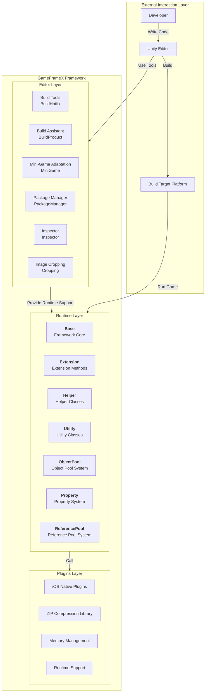
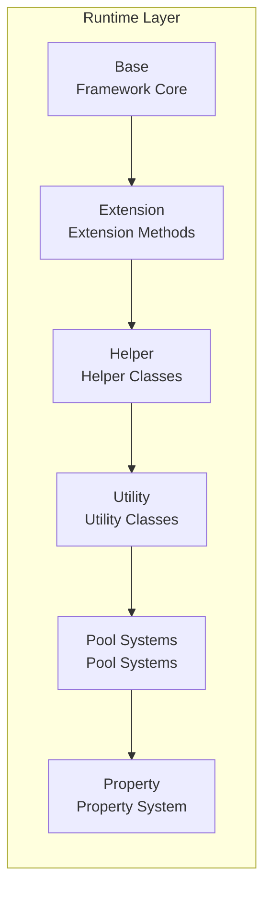

# Overview

GameFrameX is a modern Unity game framework designed for indie game developers, providing a complete front-end and back-end integrated solution. The framework adopts a **three-layer modular architecture** design and includes rich built-in game development tools and components, helping developers quickly build high-quality game projects.

> Source: [README.zh-CN.md](https://github.com/GameFrameX/com.gameframex.unity/blob/main/README.zh-CN.md#L1-L60)

---

## Project Introduction

GameFrameX aims to provide a powerful, easy-to-use, and highly extensible game development framework for indie game developers. The framework is carefully designed to meet various needs from small personal projects to medium-sized commercial games.

### Core Features

| Feature | Description |
|---------|-------------|
| **Three-Layer Architecture** | Clear layering: Runtime, Plugins, Editor |
| **Rich Tool Set** | Built-in various development assistance tools and editor extensions |
| **Object Pool Management** | Efficient memory management and object reuse mechanism |
| **Extension Method Library** | Rich Unity engine extension methods |
| **Utility Classes** | Covers encryption, compression, networking, and other common functions |
| **Multi-Platform Support** | Supports PC, mobile, WebGL, and other multi-platform deployment |
| **Hot Update Support** | Built-in HybridCLR hot update solution |
| **Mini-Game Adaptation** | One-click switch multi-platform mini-game environment |

### System Requirements

| Requirement | Specification |
|-------------|---------------|
| **Unity Version** | 2019.4 or higher |
| **Platform Support** | Windows, macOS, Linux, iOS, Android, WebGL |
| **.NET Version** | .NET Standard 2.0+ |

---

## Architecture Overview

GameFrameX adopts a clear three-layer architecture design, with each module fulfilling specific responsibilities and working together. This layered design ensures high cohesion and low coupling of the code, making it easy to maintain and extend.



### Architecture Design Philosophy

1. **Modular Design**: Each module is independently responsible for specific functions, making it easy to test and maintain individually
2. **Interface Separation**: Decoupling through interfaces, modules communicate through abstractions
3. **On-Demand Loading**: Components are initialized on demand to avoid unnecessary performance overhead
4. **Extensibility**: Provides rich extension points, allowing developers to easily add custom functionality

---

## Core Modules Detail

### Runtime Layer

Core runtime code providing all functions required for game runtime.



| Sub-Module | Description | Main Functions |
|------------|-------------|----------------|
| **Base** | Framework core foundation | Component management, event pool, logging system, reference pool, task pool, variable system, lifecycle management, singleton pattern |
| **Extension** | Extension method library | Common extensions (strings, collections, dates), Unity type extensions (Transform, Vector), sequence readers, GameObject extensions |
| **Helper** | Helper utility classes | Application, camera, file, path, math, random, timer, network, JSON, rendering, location, and other comprehensive auxiliary functions |
| **ObjectPool** | Object pool system | Object reuse, memory optimization, performance improvement |
| **Property** | Property system | Bindable properties, data listening, MVVM support |
| **ReferencePool** | Reference pool system | Reference type object management, GC optimization |
| **Utility** | Utility classes | Encryption/decryption (AES/RSA/DSA), compression/decompression, hash computation (MD5/SHA1/HMAC), CRC verification, JSON serialization, file operations, ID generation, type conversion, text processing, logging, etc. |

### Plugins Layer

Native platform plugins and third-party dependency libraries.

| Sub-Module | Description | Dependencies |
|------------|-------------|-------------|
| **iOS Plugins** | iOS native platform functionality | GameFrameX.mm |
| **Compression Library** | ZIP file compression/decompression | SharpZipLib |
| **Memory Management** | Efficient memory operations | StringTools, Memory, Buffers |
| **Runtime Support** | .NET runtime extensions | CompilerServices.Unsafe |

### Editor Layer

Editor tools and extensions to improve development efficiency.

| Sub-Module | Description | Main Functions |
|------------|-------------|----------------|
| **BuildHotfix** | Hot update build | HybridCLR hot update assembly build and management |
| **BuildProduct** | Product build | Build process automation, pre/post-processing hooks |
| **BuildWebGLTools** | WebGL build | WebGL platform-specific build tools |
| **Cropping** | Image cropping | Visual image cropping tool |
| **Inspector** | Custom inspectors | Object pool, reference pool visual monitoring |
| **InspectorLockShortcut** | Panel lock | Keyboard shortcut to lock Inspector panels |
| **MiniGame** | Mini-game adaptation | One-click switch for 21 mini-game platforms |
| **PackageManager** | Package management | Visual package management interface |
| **UpdatePackages** | Package update | Batch update project dependencies |
| **Welcome** | Welcome interface | New user guide and quick access |

---

## Platform Support

### Operating System Platforms

| Platform | Status | Supported Versions |
|----------|--------|-------------------|
| Windows | Supported | Unity 2019.4+ |
| macOS | Supported | Unity 2019.4+ |
| Linux | Supported | Unity 2019.4+ |
| iOS | Supported | Unity 2019.4+ |
| Android | Supported | Unity 2019.4+ |
| WebGL | Supported | Unity 2019.4+ |

### Mini-Game Platform Adaptation

GameFrameX provides one-click switching mini-game platform adaptation, supporting **21 mainstream mini-game platforms globally**:

#### China Mini-Games (9)

WeChat, Alipay, DouYin, Kuaishou, Baidu, JingDong, Taobao, Meituan, Bilibili

#### International Mini-Games (7)

Discord, YouTube, Facebook, Google Play, TikTok, CrazyGames, Poki

#### Device OEMs (4)

Huawei, OPPO, vivo, Xiaomi

#### Game Platforms (1)

TapTap

---

## Core Concepts

### Game Entry

GameFrameX uses `GameEntry` as the game entry point, managing all framework modules through `GameFrameworkEntry`.

```csharp
using GameFrameX.Runtime;

// Get object pool component
var objectPool = GameEntry.GetComponent<ObjectPoolComponent>();

// Get reference pool component
var referencePool = GameEntry.GetComponent<ReferencePoolComponent>();

// Use extension methods
transform.SetPositionX(10f);
gameObject.SetActiveOptimized(true);
```
> Source: [README.zh-CN.md](https://github.com/GameFrameX/com.gameframex.unity/blob/main/README.zh-CN.md#L366-L386)

### Component System

GameFrameX adopts component-based design, with all functionality provided through components. Components inherit from the `GameFrameworkComponent` base class and can be obtained through the `GameEntry.GetComponent<T>()` method.

```csharp
public sealed class ObjectPoolComponent : GameFrameworkComponent
{
    // Object pool management implementation
}
```
> Source: [Runtime/ObjectPool/ObjectPoolComponent.cs](https://github.com/GameFrameX/com.gameframex.unity/blob/main/Runtime/ObjectPool/ObjectPoolComponent.cs#L45-L46)

### Module System

Framework modules (Module) provide a higher level of abstraction through interfaces, supporting on-demand creation and lazy loading.

```csharp
public static T GetModule<T>() where T : class
{
    // Automatically create module (if it doesn't exist)
    return GetModule(moduleType) as T;
}
```
> Source: [Runtime/Base/GameFrameworkEntry.cs](https://github.com/GameFrameX/com.gameframex.unity/blob/main/Runtime/Base/GameFrameworkEntry.cs#L95-L120)

---

## Version Information

| Item | Information |
|------|-------------|
| **Package Name** | com.gameframex.unity |
| **Version** | 1.10.0 |
| **Unity Version** | 2019.4+ |
| **License** | MIT + Apache 2.0 |
| **Author** | Blank |

---

## Related Links

- [Full Documentation](https://gameframex.doc.alianblank.com)
- [Installation Guide](./2-installation)
- [Getting Started](./3-getting-started)
- [Core Concepts](./4-core-concepts)
- [Runtime Modules](./5-runtime.base)
- [Editor Tools](./6-editor-tools.build-tools)
- [Platform Support](./7-platforms)
- [API Reference](./8-api-reference)
- [FAQ](./9-troubleshooting)

---

## Community and Support

- QQ Discussion Group: 467608841
- Bug Reports: [GitHub Issues](https://github.com/GameFrameX/com.gameframex.unity/issues)
- Feature Suggestions: [GitHub Discussions](https://github.com/GameFrameX/com.gameframex.unity/discussions)

---

If this project helps you, please give us a Star!