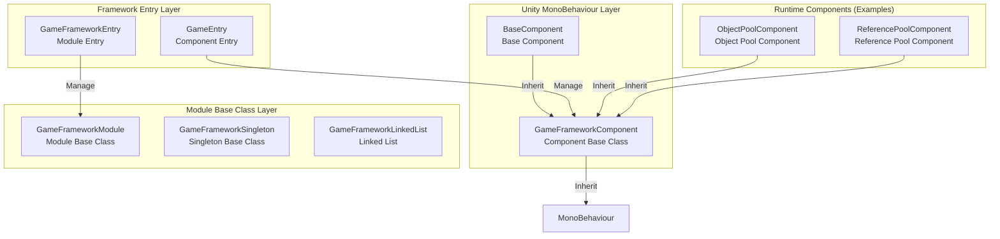
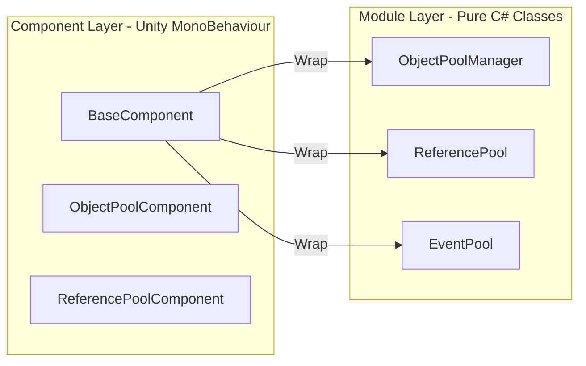
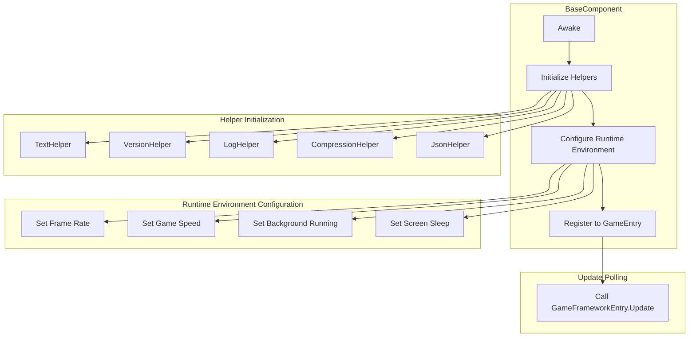
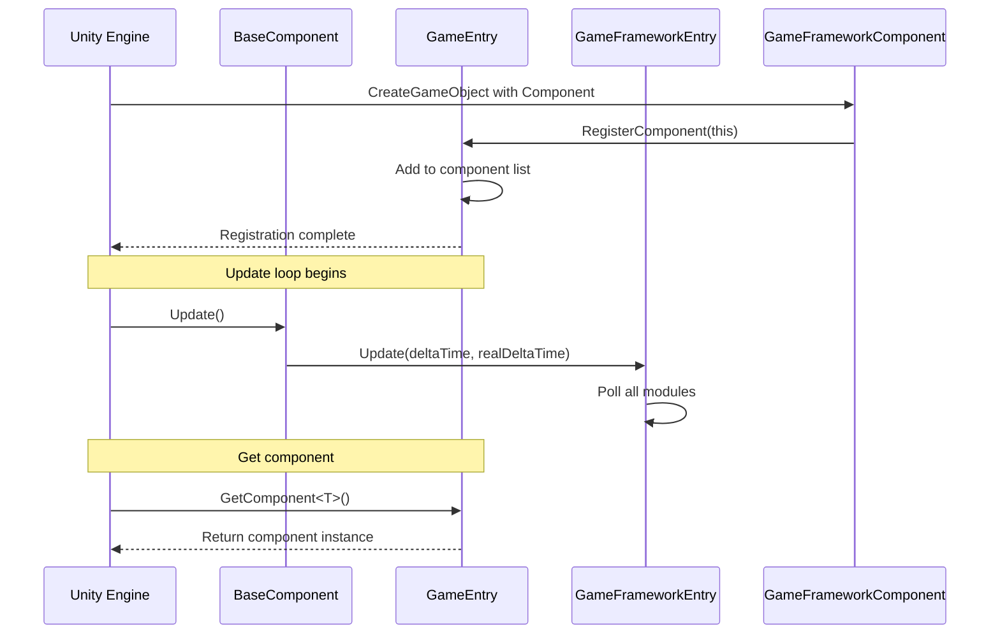

# Base Components

Base components are the core low-level architecture of the GameFrameX framework, providing the foundational functionality and component management mechanisms required for game runtime. They form the支柱 of the entire framework, with all other functional modules depending on these base components.

## Overview

GameFrameX's base components are located in the `Runtime/Base` directory and include the framework's core entry points, component base classes, module base classes, and fundamental data structures. These components are responsible for:

- **Game runtime environment configuration**: Frame rate, game speed, background running, screen sleep, etc.
- **Component lifecycle management**: Registration, retrieval, destruction
- **Module system**: Module creation, polling, shutdown
- **Singletons and data structures**: Common design pattern implementations

### Core Class Relationships



## Architecture Details

### Component System Architecture

GameFrameX adopts a two-layer architecture design: Component Layer and Module Layer.



**Design Intent:**
- **Component Layer** inherits from `MonoBehaviour` and can be directly attached to GameObjects in Unity scenes
- **Module Layer** is a pure C# class responsible for specific business logic implementation
- The component layer acts as a Facade for the module layer, providing a unified access interface

### BaseComponent Details

`BaseComponent` is the core component of the framework and must be attached to a scene. It is responsible for initializing the game runtime environment and various helper tools.



### Component Registration and Retrieval Flow



## Core Features

### 1. Runtime Environment Control

BaseComponent provides comprehensive control over the game runtime environment:

| Feature | Property | Description |
|---------|----------|-------------|
| Frame Rate Control | `FrameRate` | Sets `Application.targetFrameRate` |
| Game Speed | `GameSpeed` | Controls `Time.timeScale`, supports slow motion |
| Pause State | `IsGamePaused` | Reads whether the game is paused |
| Normal Speed | `IsNormalGameSpeed` | Checks if running at 1x speed |
| Background Running | `RunInBackground` | Sets `Application.runInBackground` |
| Screen Sleep | `NeverSleep` | Controls `Screen.sleepTimeout` |

**Code Example:**

```csharp
// Get base component
var baseComponent = GameEntry.GetComponent<BaseComponent>();

// Control frame rate
baseComponent.FrameRate = 60;

// Pause game
baseComponent.PauseGame();

// Resume game
baseComponent.ResumeGame();

// Prevent sleep
baseComponent.NeverSleep = true;
```
> Source: [BaseComponent.cs](https://github.com/GameFrameX/com.gameframex.unity/blob/main/Runtime/Base/BaseComponent.cs#L220-L243)

### 2. Component Access

All registered framework components can be accessed through the static `GameEntry` class:

```csharp
// Get component via generic
var baseComponent = GameEntry.GetComponent<BaseComponent>();
var objectPool = GameEntry.GetComponent<ObjectPoolComponent>();

// Get component via type
var component = GameEntry.GetComponent(typeof(BaseComponent));

// Get component via type name
var component = GameEntry.GetComponent("BaseComponent");
```
> Source: [GameEntry.cs](https://github.com/GameFrameX/com.gameframex.unity/blob/main/Runtime/Base/GameEntry.cs#L67-L121)

### 3. Module Management

`GameFrameworkEntry` is responsible for managing the creation, polling, and destruction of all framework modules:

```csharp
// Get module (via interface)
var module = GameFrameworkEntry.GetModule<IObjectPoolManager>();

// Modules are automatically sorted by priority
// Update is called every frame
```
> Source: [GameFrameworkEntry.cs](https://github.com/GameFrameX/com.gameframex.unity/blob/main/Runtime/Base/GameFrameworkEntry.cs#L95-L120)

### 4. Framework Shutdown

The framework supports three shutdown modes:

```csharp
// Only shutdown framework (do not exit)
GameEntry.Shutdown(ShutdownType.None);

// Shutdown and restart game
GameEntry.Shutdown(ShutdownType.Restart);

// Shutdown and quit game
GameEntry.Shutdown(ShutdownType.Quit);
```
> Source: [ShutdownType.cs](https://github.com/GameFrameX/com.gameframex.unity/blob/main/Runtime/Base/ShutdownType.cs#L41-L66)

## Fundamental Data Structures

### Singleton Pattern

GameFrameX provides a thread-safe singleton base class:

```csharp
public class MySingleton : GameFrameworkSingleton<MySingleton>
{
    public void DoSomething()
    {
        // Singleton method
    }
}

// Usage
MySingleton.Instance.DoSomething();
```
> Source: [GameFrameworkSingleton.cs](https://github.com/GameFrameX/com.gameframex.unity/blob/main/Runtime/Base/GameFrameworkSingleton.cs#L1-L47)

### Linked List Data Structure

Custom linked list implementation with node caching mechanism:

```csharp
var list = new GameFrameworkLinkedList<GameFrameworkComponent>();
list.AddLast(component);
var node = list.First;
// ... use linked list
```
> Source: [GameFrameworkLinkedList.cs](https://github.com/GameFrameX/com.gameframex.unity/blob/main/Runtime/Base/GameFrameworkLinkedList.cs#L47-L59)

## Configuration Options

In the Unity Editor, BaseComponent provides the following configurable options:

| Configuration | Type | Default | Description |
|-------------|------|---------|-------------|
| TextHelperTypeName | string | "UnityGameFramework.Runtime.DefaultTextHelper" | Text helper type |
| VersionHelperTypeName | string | "UnityGameFramework.Runtime.DefaultVersionHelper" | Version helper type |
| LogHelperTypeName | string | "UnityGameFramework.Runtime.DefaultLogHelper" | Log helper type |
| CompressionHelperTypeName | string | "UnityGameFramework.Runtime.DefaultCompressionHelper" | Compression helper type |
| JsonHelperTypeName | string | "UnityGameFramework.Runtime.DefaultJsonHelper" | JSON helper type |
| FrameRate | int | 30 | Game target frame rate |
| GameSpeed | float | 1f | Game running speed |
| RunInBackground | bool | true | Whether background running is allowed |
| NeverSleep | bool | true | Whether screen sleep is prevented |

## API Reference

### `BaseComponent`

Game base component, provides runtime environment configuration.

#### Properties

| Property | Type | Description |
|----------|------|-------------|
| `FrameRate` | int | Gets or sets game frame rate |
| `GameSpeed` | float | Gets or sets game speed |
| `IsGamePaused` | bool | Gets whether the game is paused |
| `IsNormalGameSpeed` | bool | Gets whether the game is running at normal speed |
| `RunInBackground` | bool | Gets or sets whether background running is allowed |
| `NeverSleep` | bool | Gets or sets whether sleep is prevented |

#### Methods

| Method | Return Type | Description |
|--------|-------------|-------------|
| `PauseGame()` | void | Pauses the game |
| `ResumeGame()` | void | Resumes the game |
| `ResetNormalGameSpeed()` | void | Resets to normal game speed |

### `GameEntry`

Framework component access entry point.

#### Methods

| Method | Return Type | Description |
|--------|-------------|-------------|
| `GetComponent<T>()` | T | Gets component of specified type |
| `GetComponent(Type)` | GameFrameworkComponent | Gets component via type |
| `GetComponent(string)` | GameFrameworkComponent | Gets component via type name |
| `Shutdown(ShutdownType)` | void | Shuts down framework |

### `GameFrameworkEntry`

Framework module management entry.

#### Methods

| Method | Return Type | Description |
|--------|-------------|-------------|
| `GetModule<T>()` | T | Gets module for specified interface |
| `GetModule(Type)` | GameFrameworkModule | Gets module via type |
| `Update(float, float)` | void | Polls all modules |
| `Shutdown()` | void | Shuts down all modules |

### `GameFrameworkComponent`

Component abstract base class.

#### Properties

| Property | Type | Description |
|----------|------|-------------|
| `IsAutoRegister` | bool | Gets or sets whether auto-registration is enabled |
| `ImplementationComponentType` | Type | Implementation class type |
| `InterfaceComponentType` | Type | Interface class type |

### `GameFrameworkModule`

Module abstract base class.

#### Properties

| Property | Type | Description |
|----------|------|-------------|
| `Priority` | int | Module priority, higher priority is polled first |

#### Methods

| Method | Return Type | Description |
|--------|-------------|-------------|
| `Update(float, float)` | void | Polls the module |
| `Shutdown()` | void | Shuts down and cleans up the module |

## Usage Examples

### Initialize Framework

1. Create an empty GameObject in Unity scene named "GameFrame"
2. Add the `BaseComponent` component
3. Configure parameters as needed
4. Run the game

```csharp
// GameEntry.cs is automatically created
// BaseComponent completes initialization in Awake
```
> Source: [BaseComponent.cs](https://github.com/GameFrameX/com.gameframex.unity/blob/main/Runtime/Base/BaseComponent.cs#L153-L192)

### Pause/Resume Game

```csharp
var baseComponent = GameEntry.GetComponent<BaseComponent>();

// Pause game (time stops)
baseComponent.PauseGame();

// Check if paused
if (baseComponent.IsGamePaused)
{
    Debug.Log("Game is paused");
}

// Resume game
baseComponent.ResumeGame();

// Or reset to normal speed
baseComponent.ResetNormalGameSpeed();
```
> Source: [BaseComponent.cs](https://github.com/GameFrameX/com.gameframex.unity/blob/main/Runtime/Base/BaseComponent.cs#L216-L257)

### Create Custom Module

```csharp
public interface IMyModule : GameFramework.IModule
{
    void DoSomething();
}

public class MyModule : GameFrameworkModule, IMyModule
{
    // Priority: higher value is processed first
    internal override int Priority => 10;

    // Poll every frame
    protected internal override void Update(float elapseSeconds, float realElapseSeconds)
    {
        // Polling logic
    }

    // Clean up resources on shutdown
    protected internal override void Shutdown()
    {
        // Cleanup logic
    }

    public void DoSomething()
    {
        // Business logic
    }
}
```
> Source: [GameFrameworkModule.cs](https://github.com/GameFrameX/com.gameframex.unity/blob/main/Runtime/Base/GameFrameworkModule.cs#L40-L70)

## Related Links

- [Event System](./5-runtime.event-system) - Framework built-in event system
- [Object Pool System](./5-runtime.object-pool) - Object pool management
- [Reference Pool System](./5-runtime.reference-pool) - Reference pool management
- [Task Pool System](./5-runtime.task-pool) - Async task management
- [Extension Method Library](./5-runtime.extension-methods) - Common extension methods
- [API Reference](./8-api-reference) - Complete API documentation