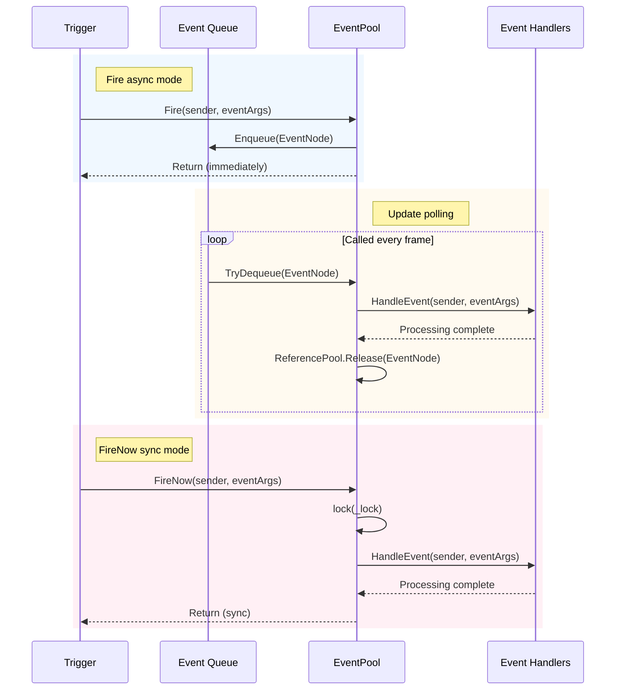
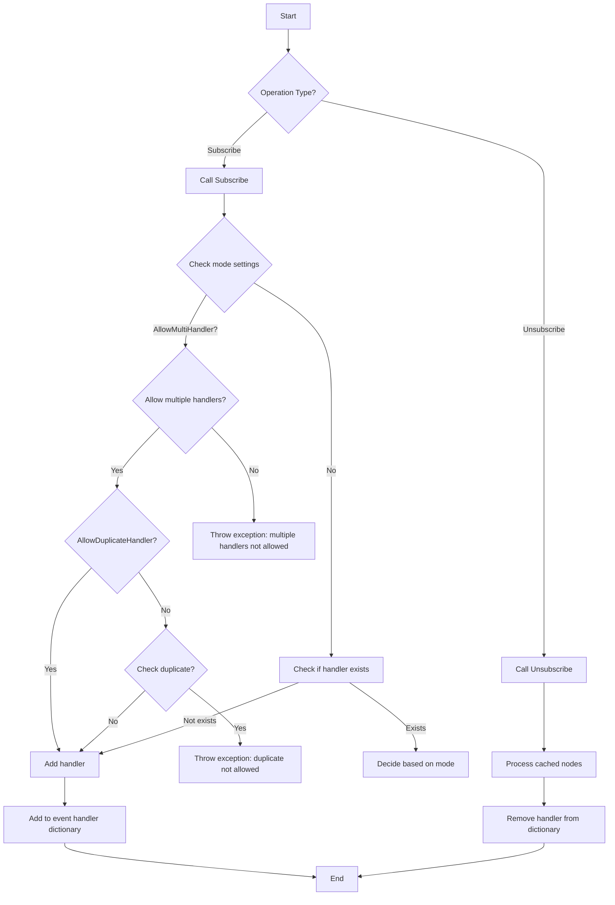

# Event System

The GameFrameX Event System is a lightweight, high-performance cross-component communication solution that implements decoupling through the publish-subscribe pattern.

## Overview

The event system is one of the core modules of the GameFrameX framework, providing a complete game event management mechanism. It adopts the **Publish-Subscribe Pattern**, allowing different modules in the game to communicate without direct mutual dependencies.

### Core Features

- **Generic Event Pool**: Based on `EventPool<T>` generic class, supports type-safe event handling
- **Thread Safe**: Supports triggering events in background threads and callback processing on the main thread
- **Dual-Mode Dispatch**: Supports async queue mode (`Fire`) and sync immediate mode (`FireNow`)
- **Flexible Configuration**: Through `EventPoolMode` flag enum, can configure whether to allow multiple handlers, duplicate handlers, etc.
- **Memory Optimization**: Uses reference pool technology to reuse event nodes, reducing garbage collection pressure

### Use Cases

- Decoupled communication between UI and game logic
- Loose-coupled interaction between modules
- Async event handling (e.g., network responses, resource loading completion)
- Multi-module state synchronization

## Architecture

```mermaid
classDiagram
    class GameFrameworkEventArgs {
        <<abstract>>
        +Clear() void
    }

    class BaseEventArgs {
        <<abstract>>
        +Id: string { get }
    }

    class EventPoolMode {
        <<enum>>
        +Default
        +AllowNoHandler
        +AllowMultiHandler
        +AllowDuplicateHandler
    }

    class EventPool~T~ {
        -_lock: object
        -_eventHandlers: GameFrameworkMultiDictionary
        -_events: ConcurrentQueue~EventNode~
        -_eventPoolMode: EventPoolMode
        +Subscribe(id, handler) void
        +Unsubscribe(id, handler) void
        +Fire(sender, e) void
        +FireNow(sender, e) void
        +Update(elapseSeconds, realElapseSeconds) void
    }

    class EventNode {
        <<internal>>
        -_sender: object
        -_eventArgs: T
        +Sender: object
        +EventArgs: T
        +Create(sender, e): EventNode
        +Clear() void
    }

    GameFrameworkEventArgs <|-- BaseEventArgs
    BaseEventArgs <|-- T
    EventPoolMode --* EventPool
    EventPool *-- EventNode
    EventNode ..> T
```

### Component Description

| Component | Description |
|-----------|-------------|
| `GameFrameworkEventArgs` | Base class for all event args, inherits from `EventArgs` and implements `IReference` interface |
| `BaseEventArgs` | Framework event args base class, defines event ID property |
| `EventPool<T>` | Generic event pool, manages subscription, unsubscription, and dispatch of specific type events |
| `EventNode` | Internal class for wrapping events for queue processing |
| `EventPoolMode` | Event pool mode enum, controls event handling behavior |

## Core Concepts

### Event Args

All custom event args must inherit from `BaseEventArgs` and implement the `Id` property to identify the event type.

```csharp
public sealed class PlayerHpChangedEventArgs : BaseEventArgs
{
    public override string Id => "PlayerHpChanged";

    public int OldHp { get; private set; }
    public int NewHp { get; private set; }

    public static PlayerHpChangedEventArgs Create(int oldHp, int newHp)
    {
        var args = ReferencePool.Acquire<PlayerHpChangedEventArgs>();
        args.OldHp = oldHp;
        args.NewHp = newHp;
        return args;
    }

    public override void Clear()
    {
        OldHp = 0;
        NewHp = 0;
    }
}
```

> Source: [BaseEventArgs.cs](https://github.com/GameFrameX/com.gameframex.unity/blob/main/Runtime/Base/EventPool/BaseEventArgs.cs#L34-L54)

### Event Pool Mode

`EventPoolMode` is a flags enum, supporting the following options:

| Mode | Description |
|------|-------------|
| `Default` | Default mode, one and only one event handler must exist |
| `AllowNoHandler` | Allows firing events when no event handler exists |
| `AllowMultiHandler` | Allows multiple event handlers |
| `AllowDuplicateHandler` | Allows duplicate event handlers (requires AllowMultiHandler) |

```csharp
[Flags]
public enum EventPoolMode : byte
{
    Default = 0,
    AllowNoHandler = 1,
    AllowMultiHandler = 2,
    AllowDuplicateHandler = 4
}
```

> Source: [EventPoolMode.cs](https://github.com/GameFrameX/com.gameframex.unity/blob/main/Runtime/Base/EventPool/EventPoolMode.cs#L37-L77)

## Workflow

### Event Dispatch Flow



### Event Subscription and Unsubscription



## Usage Examples

### Basic Usage

#### 1. Define Event Args

```csharp
public sealed class ScoreChangedEventArgs : BaseEventArgs
{
    public override string Id => "ScoreChanged";

    public int OldScore { get; private set; }
    public int NewScore { get; private set; }

    public static ScoreChangedEventArgs Create(int oldScore, int newScore)
    {
        var args = ReferencePool.Acquire<ScoreChangedEventArgs>();
        args.OldScore = oldScore;
        args.NewScore = newScore;
        return args;
    }

    public override void Clear()
    {
        OldScore = 0;
        NewScore = 0;
    }
}
```

#### 2. Create Event Pool and Subscribe

```csharp
// Create event pool (supports multiple handlers)
var eventPool = new EventPool<ScoreChangedEventArgs>(EventPoolMode.AllowMultiHandler);

// Subscribe to event
EventHandler<ScoreChangedEventArgs> handler = (sender, e) =>
{
    Debug.Log($"Score changed: {e.OldScore} -> {e.NewScore}");
};
eventPool.Subscribe("ScoreChanged", handler);

// Fire event (async, processed next frame)
eventPool.Fire(this, ScoreChangedEventArgs.Create(100, 150));

// Fire event (sync, processed immediately)
eventPool.FireNow(this, ScoreChangedEventArgs.Create(150, 200));

// Unsubscribe
eventPool.Unsubscribe("ScoreChanged", handler);
```

> Source: [EventPool.cs](https://github.com/GameFrameX/com.gameframex.unity/blob/main/Runtime/Base/EventPool/EventPool.cs#L200-L335)

#### 3. Poll Event Processing in Update

```csharp
private EventPool<ScoreChangedEventArgs> _eventPool;

void Update(float elapseSeconds, float realElapseSeconds)
{
    // Must call Update periodically to process events in the queue
    _eventPool.Update(elapseSeconds, realElapseSeconds);
}
```

### Advanced Usage

#### Set Default Handler

When an event has no registered handlers, the default handler is called:

```csharp
var eventPool = new EventPool<ScoreChangedEventArgs>(EventPoolMode.AllowNoHandler);

eventPool.SetDefaultHandler((sender, e) =>
{
    Debug.Log($"Default handler: Score changed {e.OldScore} -> {e.NewScore}");
});

// Will call default handler even without subscribers
eventPool.Fire(this, ScoreChangedEventArgs.Create(0, 100));
```

#### Combine Modes

Multiple mode flags can be combined:

```csharp
// Allow multiple handlers and allow no handler
var mode = EventPoolMode.AllowMultiHandler | EventPoolMode.AllowNoHandler;
var eventPool = new EventPool<ScoreChangedEventArgs>(mode);
```

#### Thread-Safe Event Triggering

Safely trigger events in background threads, events are processed in Update on the main thread:

```csharp
// Trigger in background thread
Task.Run(() =>
{
    // Thread-safe - event is added to queue
    eventPool.Fire(networkClient, ScoreChangedEventArgs.Create(oldScore, newScore));
});

// Process in main thread's Update
void Update(float elapseSeconds, float realElapseSeconds)
{
    eventPool.Update(elapseSeconds, realElapseSeconds);
}
```

## API Reference

### `EventPool<T>`

Generic event pool class, manages subscription, unsubscription, and dispatch of specific type events.

#### Constructor

```csharp
public EventPool(EventPoolMode mode)
```

**Parameters:**
- `mode` (EventPoolMode): Event pool mode, controls handler behavior

**Example:**
```csharp
var eventPool = new EventPool<ScoreChangedEventArgs>(EventPoolMode.Default);
```

#### Properties

| Property | Type | Description |
|----------|------|-------------|
| `EventHandlerCount` | int | Gets the number of registered event handlers |
| `EventCount` | int | Gets the number of events waiting in the queue |

#### Methods

##### Subscribe

Subscribe to an event handler.

```csharp
public void Subscribe(string id, EventHandler<T> handler)
```

**Parameters:**
- `id` (string): Event type identifier
- `handler` (`EventHandler<T>`): Event handler to subscribe

**Exceptions:**
- `GameFrameworkException`: When multiple handlers are not allowed but one already exists, or when duplicate handlers are not allowed

---

##### Unsubscribe

Unsubscribe from an event handler.

```csharp
public void Unsubscribe(string id, EventHandler<T> handler)
```

**Parameters:**
- `id` (string): Event type identifier
- `handler` (`EventHandler<T>`): Event handler to unsubscribe

---

##### Fire

Trigger event in async mode (thread-safe, event dispatched next frame).

```csharp
public void Fire(object sender, T e)
```

**Parameters:**
- `sender` (object): Event sender
- `e` (T): Event args

**Exceptions:**
- `GameFrameworkException`: When event args is null

---

##### FireNow

Trigger event in sync mode immediately (not thread-safe).

```csharp
public void FireNow(object sender, T e)
```

**Parameters:**
- `sender` (object): Event sender
- `e` (T): Event args

---

##### Update

Poll and process all events in the queue.

```csharp
public void Update(float elapseSeconds, float realElapseSeconds)
```

**Parameters:**
- `elapseSeconds` (float): Logical elapsed time (seconds)
- `realElapseSeconds` (float): Real elapsed time (seconds)

---

##### Shutdown

Close and clean up the event pool.

```csharp
public void Shutdown()
```

---

##### Check

Check if a specified event handler exists.

```csharp
public bool Check(string id, EventHandler<T> handler)
```

**Parameters:**
- `id` (string): Event type identifier
- `handler` (`EventHandler<T>`): Event handler to check

**Returns:** Whether the handler exists

---

##### Count

Get the number of handlers for a specified event type.

```csharp
public int Count(string id)
```

**Parameters:**
- `id` (string): Event type identifier

**Returns:** Number of handlers

---

##### SetDefaultHandler

Set the default event handler.

```csharp
public void SetDefaultHandler(EventHandler<T> handler)
```

**Parameters:**
- `handler` (`EventHandler<T>`): Default event handler

---

### BaseEventArgs

Base class for all custom event args.

```csharp
public abstract class BaseEventArgs : GameFrameworkEventArgs
{
    public abstract string Id { get; }
}
```

**Properties:**
- `Id` (string): Unique event type identifier (abstract property, must be implemented)

---

### EventPoolMode

Event pool mode enum (Flags).

```csharp
[Flags]
public enum EventPoolMode : byte
{
    Default = 0,
    AllowNoHandler = 1,
    AllowMultiHandler = 2,
    AllowDuplicateHandler = 4
}
```

## Best Practices

### Event Definition Standards

1. **Use meaningful IDs**: Event IDs should clearly describe the event type, such as `"PlayerHpChanged"`, `"GameStart"`
2. **Implement Create factory method**: Provide a static Create method to acquire instances from the reference pool
3. **Implement Clear method**: Override Clear method to reset all data, ensuring objects can be reused
4. **Use reference pool**: Acquire and release event args through ReferencePool to reduce memory allocation

### Performance Optimization

1. **Avoid frequent subscribe/unsubscribe**: Subscribe during module initialization, unsubscribe during destruction
2. **Use async mode**: For events triggered in background threads, use Fire instead of FireNow
3. **Set modes reasonably**: Choose appropriate EventPoolMode based on actual needs, avoid unnecessary checks

### Error Handling

1. **Check handler existence**: Use Check method to verify before unsubscribing
2. **Exception handling**: Exceptions in event handlers are caught and logged but do not interrupt other handlers
3. **Null checks**: Fire and FireNow perform null checks on event args

## Related Links

- [Reference Pool System](./5-runtime.reference-pool) - Event system uses reference pool to manage event node and event args memory
- [Object Pool System](./5-runtime.object-pool) - Similar pooling technology for game object management
- [Task Pool System](./5-runtime.task-pool) - Async task management used with event system
- [Base Components](./5-runtime.base) - Base component architecture of GameFrameX framework