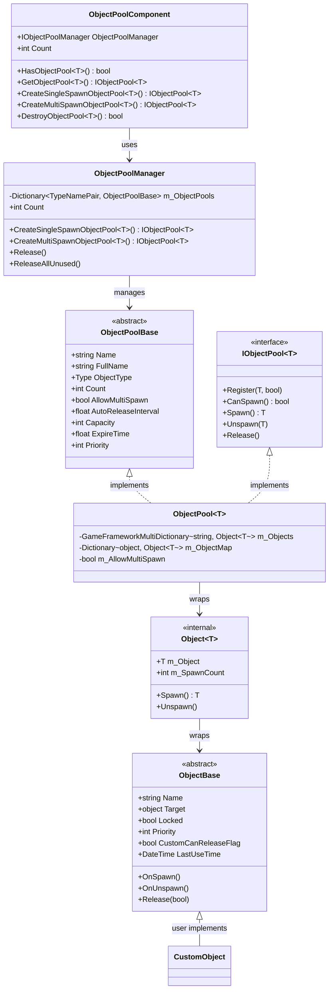
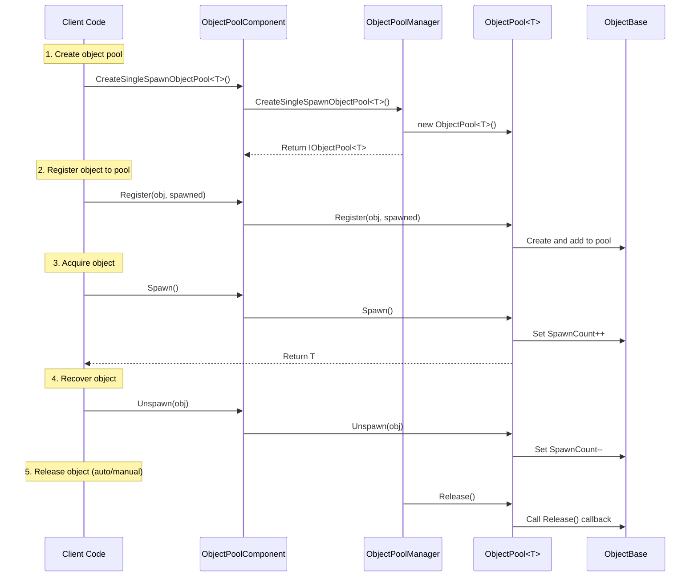

# Object Pool System

The object pool system is one of the core modules of the GameFrameX framework, used to manage the reuse of game objects, avoiding performance overhead and GC pressure caused by frequent object creation and destruction. This system provides complete object lifecycle management, including object acquisition, recovery, and automatic release.

## Overview

In game development, frequent creation and destruction of objects (such as bullets, effects, UI elements, etc.) is a common performance bottleneck. The object pool system significantly reduces memory allocation overhead and GC triggering frequency by pre-creating a certain number of objects and reusing them.

GameFrameX's object pool system provides the following core features:

- **Type-safe generic pool management**: Supports strongly typed object pool operations
- **Single/multi spawn modes**: Flexible control over object reuse strategies
- **Automatic release mechanism**: Automatic recycling based on time expiration and capacity thresholds
- **Priority system**: Fine-grained control over object release priority
- **Locking mechanism**: Protects important objects from accidental release

## Architecture



### Component Description

| Component | Description | Layer |
|-----------|-------------|-------|
| `ObjectPoolComponent` | Unity component, attached to GameObject for scene use | API Layer |
| `ObjectPoolManager` | Core manager, manages all object pools | Core Layer |
| `ObjectPoolBase` | Object pool abstract base class | Abstract Layer |
| `ObjectPool<T>` | Generic object pool implementation | Implementation Layer |
| `ObjectBase` | Abstract base class for poolable objects | Abstract Layer |
| `Object<T>` | Internal object wrapper | Internal Implementation |

## Core Concepts

### Object Pool Types

The system supports two types of object pools:

**1. Single Spawn Object Pool**
- Only one consumer can use the object at the same time
- Suitable for exclusive resources such as player characters, vehicles, etc.

```csharp
// Create a single spawn object pool
IObjectPool<Bullet> bulletPool = objectPoolComponent.CreateSingleSpawnObjectPool<Bullet>("Bullet Pool", 100, 60f, 10);
```

> Source: [Runtime/ObjectPool/ObjectPoolComponent.cs](https://github.com/GameFrameX/com.gameframex.unity/blob/main/Runtime/ObjectPool/ObjectPoolComponent.cs#L257-L260)

**2. Multi Spawn Object Pool**
- Can be used by multiple consumers simultaneously
- Suitable for reusable resources such as bullets, effects, etc.

```csharp
// Create a multi spawn object pool
IObjectPool<Effect> effectPool = objectPoolComponent.CreateMultiSpawnObjectPool<Effect>("Effect Pool", 50, 30f, 5);
```

> Source: [Runtime/ObjectPool/ObjectPoolComponent.cs](https://github.com/GameFrameX/com.gameframex.unity/blob/main/Runtime/ObjectPool/ObjectPoolComponent.cs#L655-L658)

### Key Parameters

| Parameter | Description | Default |
|-----------|-------------|---------|
| `name` | Object pool name, used for identification and lookup | Empty string |
| `capacity` | Object pool capacity, maximum number of objects | int.MaxValue |
| `expireTime` | Object expiration time (seconds), objects not used beyond this time can be released | float.MaxValue (never expires) |
| `autoReleaseInterval` | Auto release interval (seconds), attempts to release expired objects every this time | Depends on creation parameter |
| `priority` | Object pool priority, affects release order | 0 |

## Usage Flow



## Creating Poolable Objects

To use the object pool system, you need to inherit from the `ObjectBase` class and implement the relevant methods:

```csharp
using GameFrameX.ObjectPool;
using GameFrameX.Runtime;

public class Bullet : ObjectBase
{
    private BulletController m_Controller;

    // Initialize object
    public void Initialize(BulletController controller)
    {
        Initialize(null, controller.Target, 0);
        m_Controller = controller;
    }

    // Called when object is spawned
    protected internal override void OnSpawn()
    {
        base.OnSpawn();
        m_Controller.gameObject.SetActive(true);
    }

    // Called when object is unspawned
    protected internal override void OnUnspawn()
    {
        base.OnUnspawn();
        m_Controller.gameObject.SetActive(false);
    }

    // Called when object is released
    protected internal override void Release(bool isShutdown)
    {
        if (isShutdown || m_Controller == null)
        {
            if (m_Controller != null)
            {
                UnityEngine.Object.Destroy(m_Controller.gameObject);
            }
        }
        m_Controller = null;
    }
}
```

> Source: [Runtime/ObjectPool/ObjectBase.cs](https://github.com/GameFrameX/com.gameframex.unity/blob/main/Runtime/ObjectPool/ObjectBase.cs#L201-L223)

### Extension Methods

The system also provides extension methods for user convenience:

```csharp
// Extension method example (pseudo code)
public static class ObjectPoolExtensions
{
    public static T Spawn<T>(this IObjectPool<T> pool) where T : ObjectBase
    {
        return pool.Spawn();
    }

    public static void Unspawn<T>(this IObjectPool<T> pool, T obj) where T : ObjectBase
    {
        pool.Unspawn(obj);
    }
}
```

## Usage Examples

### Basic Usage

```csharp
using GameFrameX.Runtime;
using GameFrameX.ObjectPool;
using UnityEngine;

// 1. Get object pool component
var objectPoolComponent = UnityEngine.Object.FindObjectOfType<ObjectPoolComponent>();

// 2. Create object pool (multi spawn mode, suitable for bullets)
var bulletPool = objectPoolComponent.CreateMultiSpawnObjectPool<Bullet>("Bullet Pool", 100, 60f);

// 3. Register object to pool
var bulletObj = new Bullet();
bulletObj.Initialize(bulletController);
bulletPool.Register(bulletObj, false);

// 4. Acquire object from pool
var bullet = bulletPool.Spawn();

// 5. Recover object after use
bulletPool.Unspawn(bullet);
```

> Source: [Runtime/ObjectPool/ObjectPoolManager.ObjectPool.cs](https://github.com/GameFrameX/com.gameframex.unity/blob/main/Runtime/ObjectPool/ObjectPoolManager.ObjectPool.cs#L256-L292)

### Advanced Usage: Custom Release Strategy

```csharp
// Custom release filter
IObjectPool<Bullet> bulletPool = objectPoolComponent.GetObjectPool<Bullet>("Bullet Pool");

// Release objects matching criteria
bulletPool.Release(10, (candidateObjects, toReleaseCount, expireTime) =>
{
    // Prioritize releasing low priority objects
    var releaseList = new List<Bullet>();
    var sorted = candidateObjects.OrderByDescending(b => b.Priority)
                                 .ThenBy(b => b.LastUseTime);

    int count = 0;
    foreach (var bullet in sorted)
    {
        if (count >= toReleaseCount) break;
        releaseList.Add(bullet);
        count++;
    }
    return releaseList;
});
```

> Source: [Runtime/ObjectPool/ObjectPoolManager.ObjectPool.cs](https://github.com/GameFrameX/com.gameframex.unity/blob/main/Runtime/ObjectPool/ObjectPoolManager.ObjectPool.cs#L498-L529)

### Advanced Usage: Object Locking

```csharp
// Lock object to prevent auto-release
bulletPool.SetLocked(bullet, true);

// Unlock object to allow release
bulletPool.SetLocked(bullet, false);
```

> Source: [Runtime/ObjectPool/ObjectPoolManager.ObjectPool.cs](https://github.com/GameFrameX/com.gameframex.unity/blob/main/Runtime/ObjectPool/ObjectPoolManager.ObjectPool.cs#L336-L374)

### Advanced Usage: Set Priority

```csharp
// Set object priority (higher value = higher priority, released later)
bulletPool.SetPriority(bullet, 100);
```

> Source: [Runtime/ObjectPool/ObjectPoolManager.ObjectPool.cs](https://github.com/GameFrameX/com.gameframex.unity/blob/main/Runtime/ObjectPool/ObjectPoolManager.ObjectPool.cs#L376-L414)

## Configuration Options

### ObjectPoolComponent Configuration

In the Unity Editor, the `ObjectPoolComponent` component provides the following configurable options:

| Configuration | Type | Description |
|--------------|------|-------------|
| ImplementationComponentType | Type | Object pool manager implementation type |
| InterfaceComponentType | Type | Object pool manager interface type |

> See ObjectPoolComponent source for details

### Object Pool Parameter Configuration

| Parameter | Type | Default | Description |
|-----------|------|---------|-------------|
| name | string | "" | Object pool name |
| capacity | int | int.MaxValue | Object pool capacity |
| expireTime | float | float.MaxValue | Object expiration time (seconds) |
| autoReleaseInterval | float | float.MaxValue | Auto release interval |
| priority | int | 0 | Object pool priority |

## API Reference

### ObjectPoolComponent

```csharp
// Create single spawn object pool
IObjectPool<T> CreateSingleSpawnObjectPool<T>(string name, float autoReleaseInterval, int capacity, float expireTime, int priority)
```

**Parameters:**
- `name` (string): Object pool name
- `autoReleaseInterval` (float): Auto release interval in seconds
- `capacity` (int): Object pool capacity
- `expireTime` (float): Object expiration time in seconds
- `priority` (int): Object pool priority

```csharp
// Create multi spawn object pool
IObjectPool<T> CreateMultiSpawnObjectPool<T>(string name, float autoReleaseInterval, int capacity, float expireTime, int priority)
```

> Source: [Runtime/ObjectPool/ObjectPoolComponent.cs](https://github.com/GameFrameX/com.gameframex.unity/blob/main/Runtime/ObjectPool/ObjectPoolComponent.cs#L1026-L1029)

### `IObjectPool<T>`

```csharp
// Register object to pool
void Register(T obj, bool spawned)

// Check if object can be spawned
bool CanSpawn(string name)

// Spawn object
T Spawn(string name)

// Unspawn object
void Unspawn(T obj)

// Release object
void Release()
```

> Source: [Runtime/ObjectPool/IObjectPool.cs](https://github.com/GameFrameX/com.gameframex.unity/blob/main/Runtime/ObjectPool/IObjectPool.cs#L92-L129)

## Related Links

- [Reference Pool System](./5-runtime.reference-pool) - Another pooling mechanism for managing reference type objects
- [Task Pool System](./5-runtime.task-pool) - Async task pool management
- [Base Components](./5-runtime.base) - GameFramework base components
- [API Reference](./8-api-reference) - Complete API documentation