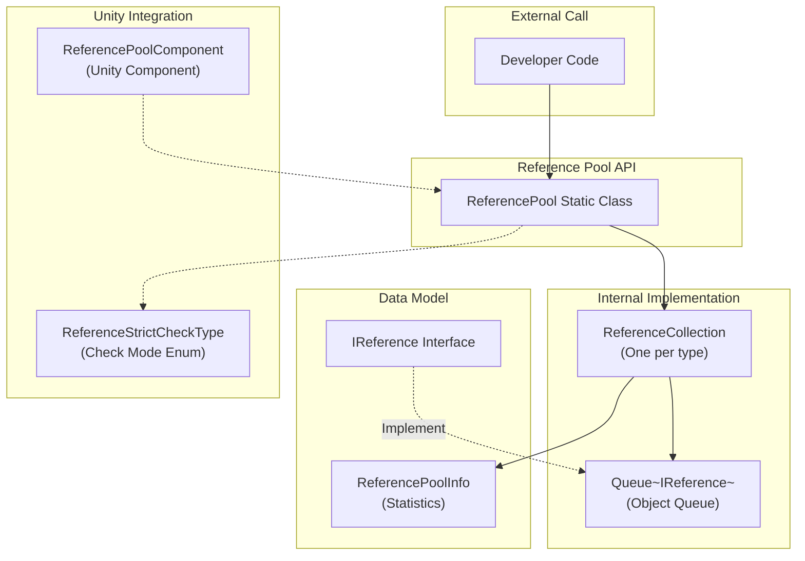
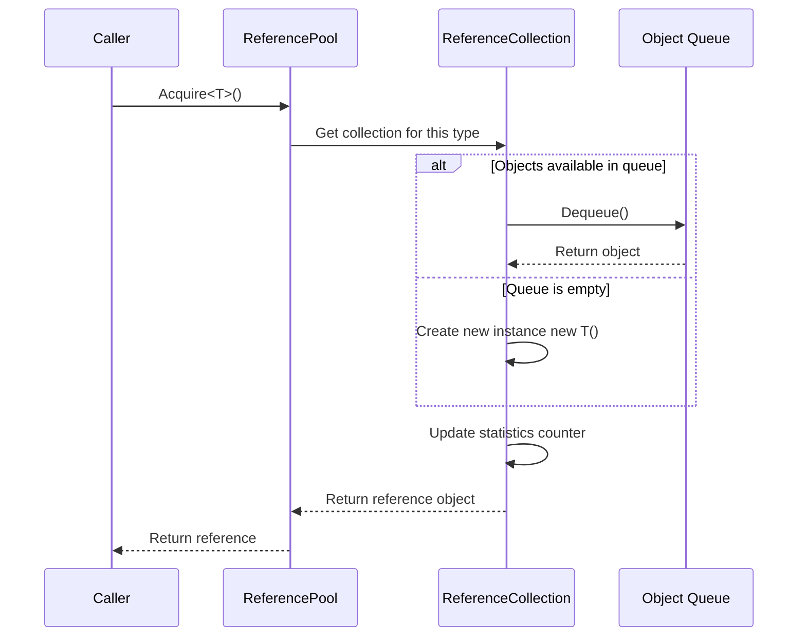
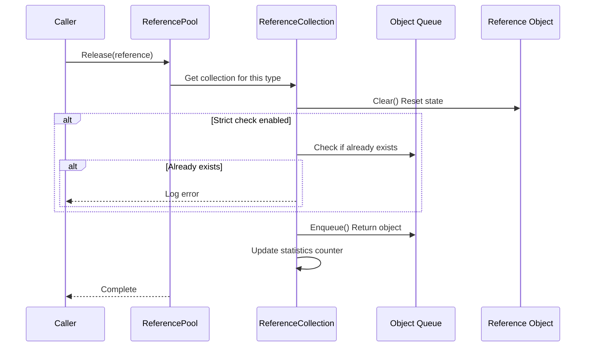

# Reference Pool System

The reference pool system is one of the core components of the GameFrameX framework, used to manage reusable reference objects, reducing garbage collection (GC) performance overhead through object reuse.

## Overview

In game development, frequent object creation and destruction is one of the main causes of performance issues. Especially in high-frequency scenarios (such as particle systems, event systems, network message processing, etc.), thousands of temporary objects may be created per second, triggering frequent garbage collection and causing game stuttering.

The reference pool system solves this problem through:

1. **Object Reuse**: Acquire objects from the pool, return to pool after use, avoid frequent creation and destruction
2. **Type-based Management**: Each type has an independent sub-pool to ensure type safety
3. **State Reset**: Automatically call `Clear()` method to reset object state when returning
4. **Statistics Monitoring**: Provides complete acquire/release/add/remove statistics for performance tuning

## Architecture



### Core Components

| Component | Type | Description |
|-----------|------|-------------|
| `IReference` | Interface | Interface that all poolable objects must implement, contains `Clear()` method |
| `ReferencePool` | Static Class | Main API of the reference pool, provides acquire/release/add/remove operations |
| `ReferenceCollection` | Internal Class | Internal collection for managing references of a specific type |
| `ReferencePoolInfo` | Struct | Contains statistics of the reference pool |
| `ReferencePoolComponent` | Unity Component | Unity integration component for configuring and monitoring reference pools |

## How It Works

### Reference Acquisition Flow



### Reference Release Flow



### Strict Check Mode

The reference pool supports three strict check modes, configured via `ReferenceStrictCheckType` enum:

| Mode | Description | Use Case |
|------|-------------|----------|
| `AlwaysEnable` | Always enable strict check | Debugging phase to catch duplicate returns |
| `OnlyEnableWhenDevelopment` | Only enable in development builds | Debug during development, maintain performance in production |
| `OnlyEnableInEditor` | Only enable in editor | Pure editor debugging |
| `AlwaysDisable` | Always disable strict check | Production environment for maximum performance |

Strict check verifies whether the object is already in the pool when releasing a reference, avoiding memory issues caused by duplicate returns.

## Usage Examples

### Basic Usage

First, implement the `IReference` interface to create poolable reference classes:

```csharp
using GameFrameX.Runtime;

public class MyData : IReference
{
    public string Name;
    public int Value;
    public Dictionary<string, object> ExtraData;

    public void Clear()
    {
        Name = null;
        Value = 0;
        ExtraData?.Clear();
    }
}
```

Then use the reference pool to acquire and return objects:

```csharp
// Acquire reference from pool
MyData data = ReferencePool.Acquire<MyData>();
data.Name = "Test";
data.Value = 100;

// Return to pool after use
ReferencePool.Release(data);
```

### Warm Up Pool

You can warm up the pool at game start, pre-creating a certain number of reference objects:

```csharp
// Warm up: Pre-add 100 references for a type
ReferencePool.Add<MyData>(100);
```

### Get Pool Statistics

Monitor reference pool status at runtime:

```csharp
// Get statistics for all reference pools
ReferencePoolInfo[] infos = ReferencePool.GetAllReferencePoolInfos();

foreach (var info in infos)
{
    Debug.Log($"Type: {info.Type.Name}");
    Debug.Log($"Unused: {info.UnusedReferenceCount}");
    Debug.Log($"In Use: {info.UsingReferenceCount}");
    Debug.Log($"Acquire Count: {info.AcquireReferenceCount}");
    Debug.Log($"Release Count: {info.ReleaseReferenceCount}");
}
```

### Clear Pool

Clear all reference pools at appropriate times:

```csharp
// Clear all reference pools
ReferencePool.ClearAll();
```

### Use Unity Component Configuration

Add reference pool component in Unity scene:

```csharp
// Configure strict check mode in Inspector
// ReferencePoolComponent automatically initializes reference pool configuration
```

> Source: [ReferencePoolComponent.cs](https://github.com/GameFrameX/com.gameframex.unity/blob/main/Runtime/ReferencePool/ReferencePoolComponent.cs#L42-L95)

## API Reference

### `ReferencePool`

The static main class of the reference pool, providing all pool operations.

#### `Acquire<T>() where T : class, IReference, new(): T`

Acquire a reference of the specified type from the pool.

```csharp
T item = ReferencePool.Acquire<T>();
```
> Source: [ReferencePool.cs](https://github.com/GameFrameX/com.gameframex.unity/blob/main/Runtime/Base/ReferencePool/ReferencePool.cs#L129-L132)

**Parameters:**
- None (generic parameter `T` specifies the reference type)

**Returns:** The acquired reference instance

**Description:** Returns an available reference from the pool, or creates a new instance if none available

---

#### `Acquire(Type referenceType): IReference`

Acquire a reference of the specified type from the pool (using Type parameter).

```csharp
IReference item = ReferencePool.Acquire(typeof(MyData));
```
> Source: [ReferencePool.cs](https://github.com/GameFrameX/com.gameframex.unity/blob/main/Runtime/Base/ReferencePool/ReferencePool.cs#L143-L147)

**Parameters:**
- `referenceType` (Type): Type of the reference

**Returns:** The acquired reference instance

---

#### `Release(IReference reference): void`

Return a reference to the reference pool.

```csharp
ReferencePool.Release(myData);
```
> Source: [ReferencePool.cs](https://github.com/GameFrameX/com.gameframex.unity/blob/main/Runtime/Base/ReferencePool/ReferencePool.cs#L157-L167)

**Parameters:**
- `reference` (IReference): Reference to return

**Throws:**
- `GameFrameworkException`: When reference is null

---

#### `Add<T>(int count) where T : class, IReference, new(): void`

Add a specified number of references to the pool.

```csharp
// Warm up: Add 100 references
ReferencePool.Add<MyData>(100);
```
> Source: [ReferencePool.cs](https://github.com/GameFrameX/com.gameframex.unity/blob/main/Runtime/Base/ReferencePool/ReferencePool.cs#L178-L181)

**Parameters:**
- `count` (int): Number to add

---

#### `Remove<T>(int count) where T : class, IReference: void`

Remove a specified number of unused references from the pool.

```csharp
ReferencePool.Remove<MyData>(10);
```
> Source: [ReferencePool.cs](https://github.com/GameFrameX/com.gameframex.unity/blob/main/Runtime/Base/ReferencePool/ReferencePool.cs#L207-L210)

**Parameters:**
- `count` (int): Number to remove

---

#### `RemoveAll<T>() where T : class, IReference: void`

Remove all unused references of a specified type from the pool.

```csharp
ReferencePool.RemoveAll<MyData>();
```
> Source: [ReferencePool.cs](https://github.com/GameFrameX/com.gameframex.unity/blob/main/Runtime/Base/ReferencePool/ReferencePool.cs#L235-L238)

---

#### `ClearAll(): void`

Clear all references in all reference pools.

```csharp
ReferencePool.ClearAll();
```
> Source: [ReferencePool.cs](https://github.com/GameFrameX/com.gameframex.unity/blob/main/Runtime/Base/ReferencePool/ReferencePool.cs#L107-L118)

---

#### `GetAllReferencePoolInfos(): ReferencePoolInfo[]`

Get statistics for all reference pools.

```csharp
ReferencePoolInfo[] infos = ReferencePool.GetAllReferencePoolInfos();
```
> Source: [ReferencePool.cs](https://github.com/GameFrameX/com.gameframex.unity/blob/main/Runtime/Base/ReferencePool/ReferencePool.cs#L82-L98)

**Returns:** Array containing information for all reference pools

---

#### `EnableStrictCheck: bool`

Gets or sets whether strict check mode is enabled.

```csharp
// Enable strict check
ReferencePool.EnableStrictCheck = true;

// Check current state
if (ReferencePool.EnableStrictCheck)
{
    // ...
}
```
> Source: [ReferencePool.cs](https://github.com/GameFrameX/com.gameframex.unity/blob/main/Runtime/Base/ReferencePool/ReferencePool.cs#L56-L60)

---

#### `Count: int`

Gets the number of currently managed reference pools.

```csharp
int poolCount = ReferencePool.Count;
```
> Source: [ReferencePool.cs](https://github.com/GameFrameX/com.gameframex.unity/blob/main/Runtime/Base/ReferencePool/ReferencePool.cs#L69-L72)

---

### `IReference`

Interface that all poolable objects must implement.

```csharp
public interface IReference
{
    void Clear();
}
```
> Source: [IReference.cs](https://github.com/GameFrameX/com.gameframex.unity/blob/main/Runtime/Base/ReferencePool/IReference.cs#L40-L49)

#### `Clear(): void`

Clear the reference, reset the object to its initial state. This method is NOT called when the object is acquired from the pool; it is only automatically called by the system when the object is returned to the pool.

```csharp
public class MyData : IReference
{
    public string Name;
    public int Value;

    public void Clear()
    {
        Name = null;
        Value = 0;
    }
}
```

**Implementation Recommendations:**
- Reset all writable properties to default values
- Release or clear internal references to unmanaged resources (if any)
- Clear collection members (such as List, Dictionary)

---

### `ReferencePoolInfo`

Struct containing reference pool statistics.

> Source: [ReferencePoolInfo.cs](https://github.com/GameFrameX/com.gameframex.unity/blob/main/Runtime/Base/ReferencePool/ReferencePoolInfo.cs#L44-L162)

| Property | Type | Description |
|---------|------|-------------|
| `Type` | Type | Type managed by the reference pool |
| `UnusedReferenceCount` | int | Number of unused (available) references in the pool |
| `UsingReferenceCount` | int | Number of references currently in use |
| `AcquireReferenceCount` | int | Total number of reference acquisitions |
| `ReleaseReferenceCount` | int | Total number of reference releases |
| `AddReferenceCount` | int | Total number of reference additions |
| `RemoveReferenceCount` | int | Total number of reference removals |

---

### `ReferenceStrictCheckType`

Enum type for reference strict check mode.

> Source: [ReferenceStrictCheckType.cs](https://github.com/GameFrameX/com.gameframex.unity/blob/main/Runtime/ReferencePool/ReferenceStrictCheckType.cs#L40-L61)

| Value | Description |
|-------|-------------|
| `AlwaysEnable` | Always enable strict check |
| `OnlyEnableWhenDevelopment` | Only enable in development builds |
| `OnlyEnableInEditor` | Only enable in editor |
| `AlwaysDisable` | Always disable strict check |

---

## Performance Optimization Suggestions

### 1. Warm Up Pool

Warm up the pool when the game starts or during scene transitions:

```csharp
void WarmUpPools()
{
    // Warm up based on estimated usage
    ReferencePool.Add<MyData>(50);
    ReferencePool.Add<AnotherData>(30);
}
```

### 2. Implement Clear Method Efficiently

Ensure the `Clear()` method executes efficiently:

```csharp
// Recommended: Direct assignment instead of creating new instances
public void Clear()
{
    Name = null;
    Value = 0;
    ExtraData.Clear(); // Clear instead of assign to null
}

// Avoid: Creating new instances
public void Clear()
{
    ExtraData = new Dictionary<string, object>(); // Creates new object each time
}
```

### 3. Disable Strict Check in Production

Disable strict check in release builds for best performance:

```csharp
// Set in Release build
ReferencePool.EnableStrictCheck = false;

// Or via component configuration
// Set ReferencePoolComponent's Strict Check Type to AlwaysDisable
```

### 4. Monitor Pool Status

Regularly check pool status to identify potential memory issues:

```csharp
void LogPoolStats()
{
    foreach (var info in ReferencePool.GetAllReferencePoolInfos())
    {
        // Check for leaks (many in use but few unused)
        if (info.UsingReferenceCount > 100 && info.UnusedReferenceCount < 5)
        {
            Debug.LogWarning($"Potential leak: {info.Type.Name}");
        }
    }
}
```

## FAQ

### Q: What is the difference between reference pool and object pool?

The reference pool is specifically for objects implementing the `IReference` interface, emphasizing lightweight reuse. Object pool has a broader concept and can be used for any reusable object. GameFrameX provides both reference pool and object pool systems. For details, see [Object Pool System](./5-runtime.object-pool).

### Q: Why is Clear not called when acquiring?

Design decision: Keeping the object's most recent use data when acquiring can improve cache hit rate. If you need a clean object, you can manually call `Clear()` or acquire a new object after releasing the current one.

### Q: How to handle reference pool memory usage?

- Use `Remove()` method to remove excess idle references
- Use `ClearAll()` to clear all pools in appropriate scenarios
- Monitor `UnusedReferenceCount` to avoid too many idle objects

---

## Related Links

- [Object Pool System](./5-runtime.object-pool) - Another object reuse mechanism
- [Task Pool System](./5-runtime.task-pool) - Async task management
- [API Reference](./8-api-reference) - Complete API documentation