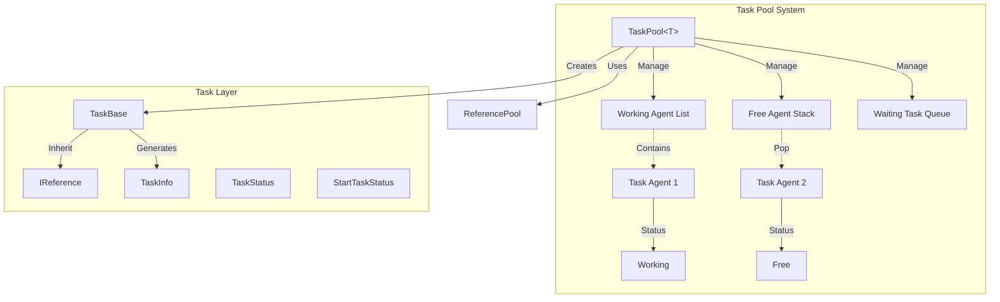
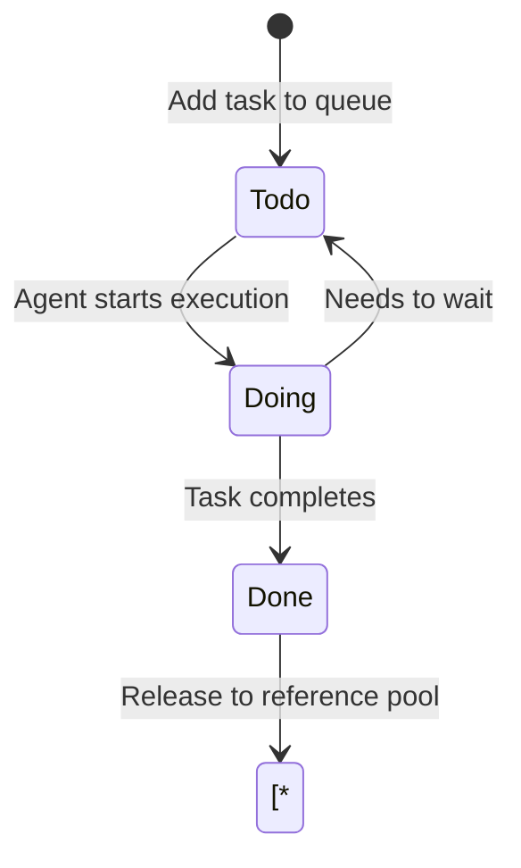
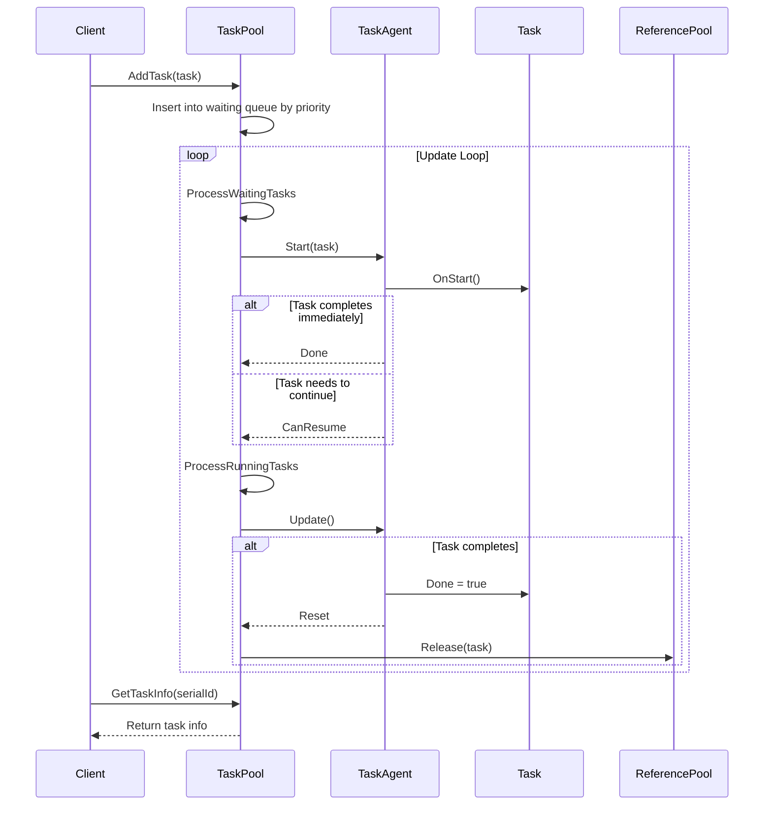

# Task Pool System

The Task Pool System is one of the core modules of the GameFrameX framework, providing generic task management and scheduling functionality. Through the task pool, developers can encapsulate time-consuming operations into tasks and process them in parallel using multiple task agents, improving game performance.

## Overview

The task pool system adopts an **Agent-Task** pattern design, containing the following core concepts:

- **Task Agent**: The actual worker that executes tasks, each agent can only process one task at a time
- **Task**: The executable unit that encapsulates specific business logic
- **Task Pool**: The core class that manages the task queue and task agent container

The system supports:
- Task priority scheduling (high priority tasks are processed first)
- Task status query (pending, executing, completed)
- Task tag management (query and remove tasks by tag)
- Pause/resume task pool
- Integration with reference pool for object reuse

## Architecture



### Core Components Description

| Component | Type | Description |
|-----------|------|-------------|
| `TaskPool<T>` | Class | Core task pool, manages task agents and task queue |
| `TaskBase` | Abstract Class | Task base class, defines common task properties |
| `ITaskAgent<T>` | Interface | Task agent interface, defines task execution methods |
| `TaskInfo` | Struct | Task information container |
| `TaskStatus` | Enum | Task status (Todo, Doing, Done) |
| `StartTaskStatus` | Enum | Task start result |

## Core Concepts

### Task Status Flow



### Task Priority

The task pool uses a **priority queue** to schedule tasks:
- Higher numeric values mean higher priority
- High priority tasks will cut in front of low priority tasks
- Default priority is 0

### Reference Pool Integration

Tasks are automatically released to the reference pool after completion, enabling object reuse:
- Task objects implement the `IReference` interface
- After completion, call `ReferencePool.Release(task)` to return

## Usage Examples

### 1. Define Custom Task

```csharp
using GameFrameX.Runtime;

// Inherit TaskBase to implement custom task
public class DownloadTask : TaskBase
{
    private string m_Url;
    private string m_SavePath;

    public void Initialize(int serialId, string tag, int priority, string url, string savePath)
    {
        base.Initialize(serialId, tag, priority, null);
        m_Url = url;
        m_SavePath = savePath;
    }

    public override string Description
    {
        get { return $"Download file: {m_Url}"; }
    }

    protected internal override void OnStart()
    {
        base.OnStart();
        // Start download logic
    }

    protected internal override void OnUpdate(float elapseSeconds, float realElapseSeconds)
    {
        base.OnUpdate(elapseSeconds, realElapseSeconds);
        // Update download progress
        // Set Done = true when complete
    }

    public override void Clear()
    {
        base.Clear();
        m_Url = null;
        m_SavePath = null;
    }
}
```
> Source: [TaskBase.cs](https://github.com/GameFrameX/com.gameframex.unity/blob/main/Runtime/Base/TaskPool/TaskBase.cs#L40-L182)

### 2. Implement Task Agent

```csharp
using GameFrameX.Runtime;

public class DownloadTaskAgent : ITaskAgent<DownloadTask>
{
    public DownloadTask Task { get; private set; }

    public void Initialize()
    {
        // Initialize agent resources
    }

    public void Update(float elapseSeconds, float realElapseSeconds)
    {
        if (Task == null || Task.Done)
        {
            return;
        }

        // Execute task logic
    }

    public StartTaskStatus Start(DownloadTask task)
    {
        Task = task;
        task.OnStart();

        if (task.Done)
        {
            return StartTaskStatus.Done;
        }

        return StartTaskStatus.CanResume;
    }

    public void Reset()
    {
        if (Task != null)
        {
            Task.OnRelease();
            Task = null;
        }
    }

    public void Shutdown()
    {
        // Release agent resources
    }
}
```
> Source: [ITaskAgent.cs](https://github.com/GameFrameX/com.gameframex.unity/blob/main/Runtime/Base/TaskPool/ITaskAgent.cs#L41-L94)

### 3. Use Task Pool

```csharp
// Create task pool instance
var taskPool = new TaskPool<DownloadTask>();

// Add task agents (can add multiple for parallel processing)
taskPool.AddAgent(new DownloadTaskAgent());
taskPool.AddAgent(new DownloadTaskAgent());
taskPool.AddAgent(new DownloadTaskAgent());

// Create and add task
var task = ReferencePool.Acquire<DownloadTask>();
task.Initialize(1, "Download", 10, "http://example.com/file.png", "Assets/file.png");
taskPool.AddTask(task);

// Call in Update
void Update()
{
    taskPool.Update(Time.deltaTime, Time.unscaledDeltaTime);
}

// Query task information
TaskInfo[] allTasks = taskPool.GetAllTaskInfos();
TaskInfo[] downloadTasks = taskPool.GetTaskInfos("Download");
TaskInfo singleTask = taskPool.GetTaskInfo(1);

// Pause/resume
taskPool.Paused = true;  // Pause
taskPool.Paused = false; // Resume

// Remove tasks
taskPool.RemoveTask(1);           // Remove task with specified serial number
taskPool.RemoveTasks("Download"); // Remove all tasks with specified tag
taskPool.RemoveAllTasks();        // Remove all tasks

// Shutdown task pool
taskPool.Shutdown();
```
> Source: [TaskPool.cs](https://github.com/GameFrameX/com.gameframex.unity/blob/main/Runtime/Base/TaskPool/TaskPool.cs#L44-L525)

## Core Flow

### Task Processing Flow



## API Reference

### TaskPool<T>

Task pool generic class.

```csharp
public sealed class TaskPool<T> where T : TaskBase
```
> Source: [TaskPool.cs](https://github.com/GameFrameX/com.gameframex.unity/blob/main/Runtime/Base/TaskPool/TaskPool.cs#L44-L525)

#### Properties

| Property | Type | Description |
|----------|------|-------------|
| `Paused` | `bool` | Gets or sets whether the task pool is paused |
| `TotalAgentCount` | `int` | Gets the total number of task agents |
| `FreeAgentCount` | `int` | Gets the number of free task agents |
| `WorkingAgentCount` | `int` | Gets the number of working task agents |
| `WaitingTaskCount` | `int` | Gets the number of waiting tasks |

#### Methods

##### `AddAgent(agent)`

Add a task agent.

```csharp
public void AddAgent(ITaskAgent<T> agent)
```

**Parameters:**
- `agent` (ITaskAgent<T>): The task agent to add

> Source: [TaskPool.cs#L172-L181](https://github.com/GameFrameX/com.gameframex.unity/blob/main/Runtime/Base/TaskPool/TaskPool.cs#L172-L181)

##### `AddTask(task)`

Add a task to the waiting queue.

```csharp
public void AddTask(T task)
```

**Parameters:**
- `task` (T): The task to add

> Source: [TaskPool.cs#L326-L348](https://github.com/GameFrameX/com.gameframex.unity/blob/main/Runtime/Base/TaskPool/TaskPool.cs#L326-L348)

##### `Update(elapseSeconds, realElapseSeconds)`

Task pool polling processing.

```csharp
public void Update(float elapseSeconds, float realElapseSeconds)
```

**Parameters:**
- `elapseSeconds` (float): Logical elapsed time
- `realElapseSeconds` (float): Real elapsed time

> Source: [TaskPool.cs#L136-L145](https://github.com/GameFrameX/com.gameframex.unity/blob/main/Runtime/Base/TaskPool/TaskPool.cs#L136-L145)

##### `GetTaskInfo(serialId)`

Get task information by serial number.

```csharp
public TaskInfo GetTaskInfo(int serialId)
```

**Parameters:**
- `serialId` (int): The task's serial number

**Returns:** TaskInfo - Task information struct

> Source: [TaskPool.cs#L191-L212](https://github.com/GameFrameX/com.gameframex.unity/blob/main/Runtime/Base/TaskPool/TaskPool.cs#L191-L212)

##### `GetTaskInfos(tag)`

Get task information array by tag.

```csharp
public TaskInfo[] GetTaskInfos(string tag)
```

**Parameters:**
- `tag` (string): Task tag

**Returns:** TaskInfo[] - Task information array

> Source: [TaskPool.cs#L222-L228](https://github.com/GameFrameX/com.gameframex.unity/blob/main/Runtime/Base/TaskPool/TaskPool.cs#L222-L228)

##### `GetAllTaskInfos()`

Get all task information.

```csharp
public TaskInfo[] GetAllTaskInfos()
```

**Returns:** TaskInfo[] - All task information array

> Source: [TaskPool.cs#L272-L289](https://github.com/GameFrameX/com.gameframex.unity/blob/main/Runtime/Base/TaskPool/TaskPool.cs#L272-L289)

##### `RemoveTask(serialId)`

Remove task by serial number.

```csharp
public bool RemoveTask(int serialId)
```

**Parameters:**
- `serialId` (int): The task's serial number

**Returns:** bool - Whether removal was successful

> Source: [TaskPool.cs#L358-L390](https://github.com/GameFrameX/com.gameframex.unity/blob/main/Runtime/Base/TaskPool/TaskPool.cs#L358-L390)

##### `RemoveTasks(tag)`

Remove all tasks with specified tag.

```csharp
public int RemoveTasks(string tag)
```

**Parameters:**
- `tag` (string): Task tag

**Returns:** int - Number of tasks removed

> Source: [TaskPool.cs#L400-L439](https://github.com/GameFrameX/com.gameframex.unity/blob/main/Runtime/Base/TaskPool/TaskPool.cs#L400-L439)

##### `RemoveAllTasks()`

Remove all tasks.

```csharp
public int RemoveAllTasks()
```

**Returns:** int - Number of tasks removed

> Source: [TaskPool.cs#L448-L471](https://github.com/GameFrameX/com.gameframex.unity/blob/main/Runtime/Base/TaskPool/TaskPool.cs#L448-L471)

##### `Shutdown()`

Shutdown and clean up the task pool.

```csharp
public void Shutdown()
```

> Source: [TaskPool.cs#L154-L162](https://github.com/GameFrameX/com.gameframex.unity/blob/main/Runtime/Base/TaskPool/TaskPool.cs#L154-L162)

---

### TaskBase

Task base class.

```csharp
public abstract class TaskBase : IReference
```
> Source: [TaskBase.cs](https://github.com/GameFrameX/com.gameframex.unity/blob/main/Runtime/Base/TaskPool/TaskBase.cs#L40-L182)

#### Properties

| Property | Type | Description |
|----------|------|-------------|
| `SerialId` | `int` | Gets the task's serial number |
| `Tag` | `string` | Gets the task's tag |
| `Priority` | `int` | Gets the task's priority |
| `UserData` | `object` | Gets user custom data for the task |
| `Done` | `bool` | Gets or sets whether the task is complete |
| `Description` | `string` | Gets task description (virtual property) |

#### Constants

| Constant | Value | Description |
|----------|-------|-------------|
| `DefaultPriority` | 0 | Default task priority |

---

### TaskStatus

Task status enum.

```csharp
public enum TaskStatus : byte
```
> Source: [TaskStatus.cs](https://github.com/GameFrameX/com.gameframex.unity/blob/main/Runtime/Base/TaskPool/TaskStatus.cs#L41-L66)

| Member | Value | Description |
|--------|-------|-------------|
| `Todo` | 0 | Not started |
| `Doing` | 1 | Executing |
| `Done` | 2 | Completed |

---

### StartTaskStatus

Task start status enum.

```csharp
public enum StartTaskStatus : byte
```
> Source: [StartTaskStatus.cs](https://github.com/GameFrameX/com.gameframex.unity/blob/main/Runtime/Base/TaskPool/StartTaskStatus.cs#L41-L74)

| Member | Value | Description |
|--------|-------|-------------|
| `Done` | 0 | Task can complete immediately |
| `CanResume` | 1 | Task can continue processing |
| `HasToWait` | 2 | Task needs to wait for other tasks |
| `UnknownError` | 3 | Unknown error |

---

### TaskInfo

Task information struct.

```csharp
public struct TaskInfo
```
> Source: [TaskInfo.cs](https://github.com/GameFrameX/com.gameframex.unity/blob/main/Runtime/Base/TaskPool/TaskInfo.cs#L44-L209)

#### Properties

| Property | Type | Description |
|----------|------|-------------|
| `IsValid` | `bool` | Gets whether the task info is valid |
| `SerialId` | `int` | Gets task serial number |
| `Tag` | `string` | Gets task tag |
| `Priority` | `int` | Gets task priority |
| `UserData` | `object` | Gets user data |
| `Status` | `TaskStatus` | Gets task status |
| `Description` | `string` | Gets task description |

---

### ITaskAgent<T>

Task agent interface.

```csharp
public interface ITaskAgent<T> where T : TaskBase
```
> Source: [ITaskAgent.cs](https://github.com/GameFrameX/com.gameframex.unity/blob/main/Runtime/Base/TaskPool/ITaskAgent.cs#L41-L94)

#### Properties

| Property | Type | Description |
|----------|------|-------------|
| `Task` | `T` | Gets the current task |

#### Methods

##### `Initialize()`

Initialize the task agent.

```csharp
void Initialize()
```

##### `Update(elapseSeconds, realElapseSeconds)`

Task agent polling.

```csharp
void Update(float elapseSeconds, float realElapseSeconds)
```

##### `Start(task)`

Start processing a task.

```csharp
StartTaskStatus Start(T task)
```

##### `Reset()`

Reset the task agent.

```csharp
void Reset()
```

##### `Shutdown()`

Shutdown the task agent.

```csharp
void Shutdown()
```

## Best Practices

### 1. Task Agent Pooling

Create an appropriate number of agents based on task type and load:

```csharp
// CPU-intensive tasks: recommended agent count = CPU core count
// IO-intensive tasks: can create more agents
int agentCount = SystemInfo.processorCount;
for (int i = 0; i < agentCount; i++)
{
    taskPool.AddAgent(new DownloadTaskAgent());
}
```

### 2. Task Priority Strategy

- Critical tasks (UI feedback, network callbacks): High priority (100)
- Regular tasks (resource loading): Medium priority (50)
- Background tasks (log reporting): Low priority (0)

### 3. Task Lifecycle Management

- Clean all references in the task's `Clear()` method
- Avoid holding large objects in tasks
- Remove unnecessary tasks in time to free memory

## Related Links

- [Object Pool System](./5-runtime.object-pool) - Object reuse mechanism
- [Reference Pool System](./5-runtime.reference-pool) - Reference object management
- [Event System](./5-runtime.event-system) - Framework event mechanism
- [Base Components](./5-runtime.base) - Framework base components
- [API Reference](./8-api-reference) - Complete API documentation