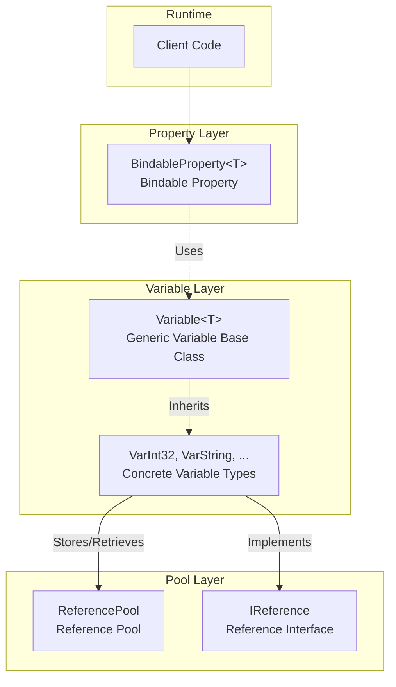
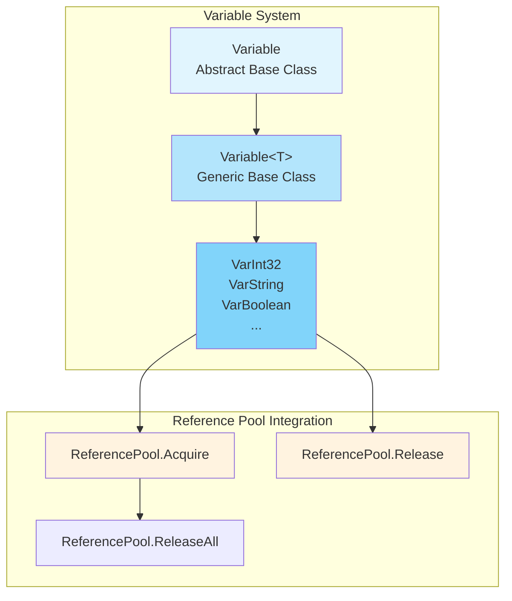

# Property System

The GameFrameX Property System provides a complete attribute and variable management mechanism, including two core components: BindableProperty and Variable. The system supports property value change listening, reference pool management, and generic type-safe operations.

## Overview

The property system is one of the base components of the GameFrameX framework, consisting mainly of two parts:

1. **`BindableProperty<T>`** - Bindable property, provides property value change notification mechanism, implemented based on the observer pattern
2. **Variable** System - Typed variable container, integrated with reference pool for efficient memory management

This system is suitable for the following scenarios:
- UI binding that requires listening to property value changes
- Game logic that requires efficient management of temporary variables
- Type-safe data passing
- High-performance scenarios that require reducing garbage collection pressure

## Architecture

The property system's architecture follows a modular design principle, consisting mainly of the following layers:



### Core Component Relationships

```mermaid
classDiagram
    class IReference {
        <<interface>>
        +Clear() void
    }

    class Variable {
        <<abstract>>
        +Type$ Type
        +GetValue() object
        +SetValue(object) void
        +Clear() void
    }

    class Variable<T> {
        <<abstract>>
        +Value$ T
        +GetValue() object
        +SetValue(object) void
        +Clear() void
    }

    class VarInt32 {
        +VarInt32()
        +implicit operator VarInt32(int)
        +implicit operator int(VarInt32)
    }

    class BindableProperty~T~ {
        -T _value
        -Action~T~ _onValueChanged
        +Value$ T
        +Add(Action~T~) BindableProperty~T~
        +RegisterWithInitValue(Action~T~) BindableProperty~T~
        +Remove(Action~T~) void
        +Clear() void
    }

    IReference <|.. Variable
    Variable <|-- Variable
    Variable~T~ --|> Variable
    Variable~T~ <|-- VarInt32
    BindableProperty~T~ --> Action : uses
```

## BindableProperty

`BindableProperty<T>` is the core component of the property system, providing property value change notification functionality. Designed based on the observer pattern, when a property value changes, registered callbacks are automatically triggered.

### Core Features

- **Generic Support** - Supports any type T
- **Value Change Listening** - Notifies changes through `Action<T>` callback mechanism
- **Method Chaining** - Supports Fluent API style registration
- **Automatic Comparison** - Uses `Equals` method to avoid unnecessary updates

### Usage Examples

#### Basic Usage

Create a bindable property and listen to value changes:

```csharp
using GameFrameX.Runtime;

// Create bindable property with default value 0
var health = new BindableProperty<int>(100);

// Register value change listener
health.Add(newValue =>
{
    Debug.Log($"Health changed: {newValue}");
});

// Modifying the value triggers the callback
health.Value = 90; // Output: "Health changed: 90"
health.Value = 80; // Output: "Health changed: 80"

// Same value does not trigger callback
health.Value = 80; // Does not trigger callback
```
> Source: [BindableProperty.cs](https://github.com/GameFrameX/com.gameframex.unity/blob/main/Runtime/Property/BindableProperty.cs#L1-L90)

#### Execute Callback Immediately on Registration

Use `RegisterWithInitValue` to execute callback immediately on registration, suitable for initialization scenarios:

```csharp
var score = new BindableProperty<int>(0);

// Register and get current value immediately
score.RegisterWithInitValue(currentScore =>
{
    Debug.Log($"Current score: {currentScore}");
});
// Output: "Current score: 0"
```
> Source: [BindableProperty.cs](https://github.com/GameFrameX/com.gameframex.unity/blob/main/Runtime/Property/BindableProperty.cs#L63-L68)

#### Remove Listener

```csharp
var health = new BindableProperty<int>(100);

Action<int> listener = newValue => Debug.Log($"Changed: {newValue}");
health.Add(listener);

// Remove specific listener
health.Remove(listener);

// Clear all listeners
health.Clear();
```
> Source: [BindableProperty.cs](https://github.com/GameFrameX/com.gameframex.unity/blob/main/Runtime/Property/BindableProperty.cs#L70-L88)

### Practical Application Scenarios

#### Data Binding in MVVM Pattern

```csharp
public class PlayerModel
{
    // Bindable property for data binding
    public BindableProperty<int> Health { get; } = new BindableProperty<int>(100);
    public BindableProperty<int> Gold { get; } = new BindableProperty<int>(0);
    public BindableProperty<string> Name { get; } = new BindableProperty<string>("");
}

public class PlayerView
{
    private PlayerModel _model;

    public void Bind(PlayerModel model)
    {
        _model = model;

        // Register health change listener
        _model.Health.Add(OnHealthChanged);

        // Register gold change listener
        _model.Gold.Add(OnGoldChanged);
    }

    private void OnHealthChanged(int health)
    {
        Debug.Log($"UI Update: Health = {health}");
    }

    private void OnGoldChanged(int gold)
    {
        Debug.Log($"UI Update: Gold = {gold}");
    }
}
```

#### State Change Listening in State Machine

```csharp
public class GameState
{
    public BindableProperty<GameStateType> CurrentState { get; }
        = new BindableProperty<GameStateType>(GameStateType.Init);

    public void ChangeState(GameStateType newState)
    {
        CurrentState.Value = newState;
    }
}

// State listener
gameState.CurrentState.Add(state =>
{
    switch (state)
    {
        case GameStateType.Playing:
            StartGame();
            break;
        case GameStateType.Paused:
            PauseGame();
            break;
    }
});
```

## Variable System

The Variable system provides a set of type-safe variable wrappers, combined with reference pool to achieve efficient memory management. Each Variable type implements the `IReference` interface and can be managed uniformly by the reference pool.

### Architecture Design



### Built-in Variable Types

GameFrameX provides 30+ predefined Variable types:

| Category | Types |
|----------|-------|
| Basic Numbers | VarInt16, VarInt32, VarInt64, VarUInt16, VarUInt32, VarUInt64 |
| Floating Point | VarSingle, VarDouble, VarDecimal |
| Other Numbers | VarByte, VarSByte, VarChar |
| String | VarString |
| Boolean | VarBoolean |
| Date Time | VarDateTime |
| Unity Basic | VarVector2, VarVector3, VarVector4, VarQuaternion, VarRect |
| Unity Objects | VarColor, VarColor32, VarGameObject, VarMaterial, VarTexture, VarTransform, VarUnityObject |
| Arrays | VarByteArray, VarCharArray |
| Object | VarObject |

### Usage Examples

#### Basic Usage

```csharp
using GameFrameX.Runtime;

// Create variable
VarInt32 score = ReferencePool.Acquire<VarInt32>();
score.Value = 100;

// Use implicit conversion
int value = score; // Get value
score = 200;      // Set value

// Release back to reference pool
ReferencePool.Release(score);
```
> Source: [VarInt32.cs](parameterNameValuePairs=)

#### Implicit Conversion

Variable types support C# implicit conversion, making code more concise:

```csharp
using GameFrameX.Runtime;

// Create Variable from raw type
VarString playerName = ReferencePool.Acquire<VarString>();
playerName.Value = "Player1";

// Implicit conversion - get value
string name = playerName; // name = "Player1"

// Implicit conversion - set value
playerName = "Player2";    // playerName.Value = "Player2"

// Release after use
ReferencePool.Release(playerName);
```
> Source: [VarString.cs](https://github.com/GameFrameX/com.gameframex.unity/blob/main/Runtime/Variable/VarString.cs#L42-L84)

#### Reference Pool Integration

The Variable system is deeply integrated with the reference pool, providing efficient memory management:

```csharp
// Acquire from reference pool
VarInt32 counter = ReferencePool.Acquire<VarInt32>();
counter.Value = 0;

// Use
counter.Value++;

// Release back to reference pool
ReferencePool.Release(counter);

// Variable automatically calls Clear method to reset state
// When acquired again, it's a clean object
VarInt32 counter2 = ReferencePool.Acquire<VarInt32>();
// counter2.Value has been reset to 0
```
> Source: [GenericVariable.cs](https://github.com/GameFrameX/com.gameframex.unity/blob/main/Runtime/Base/Variable/GenericVariable.cs#L106-L127)

### Variable Base Class Implementation

Core implementation of Variable class:

```csharp
public abstract class Variable<T> : Variable
{
    private T m_Value;

    // Type-safe value access
    public T Value
    {
        get { return m_Value; }
        set { m_Value = value; }
    }

    // Implement base class abstract methods
    public override object GetValue()
    {
        return m_Value;
    }

    public override void SetValue(object value)
    {
        m_Value = (T)value;
    }

    // Clear variable for returning to reference pool
    public override void Clear()
    {
        m_Value = default(T);
    }
}
```
> Source: [GenericVariable.cs](https://github.com/GameFrameX/com.gameframex.unity/blob/main/Runtime/Base/Variable/GenericVariable.cs#L45-L127)

## Core Flow

### BindableProperty Value Change Flow

```mermaid
sequenceDiagram
    participant C as Client
    participant BP as BindableProperty&lt;T&gt;<br/>Bindable Property
    participant CB as Callback<br/>Callback Function

    C->>BP: Create BindableProperty
    BP->>BP: Store default value

    C->>BP: Add(callback)
    BP->>BP: Register callback to _onValueChanged

    C->>BP: Value = newValue
    BP->>BP: Equals(oldValue, newValue)?

    alt Values not equal
        BP->>BP: Update _value
        BP->>CB: _onValueChanged.Invoke(newValue)
        CB-->>C: Execute callback logic
    else Values equal
        BP-->>C: Do not trigger callback
    end
```

### Variable Reference Pool Flow

```mermaid
sequenceDiagram
    participant C as Client
    participant RP as ReferencePool
    participant V as Variable&lt;T&gt;

    C->>RP: Acquire&lt;VarInt32&gt;()
    RP->>V: Create or reuse instance
    V->>RP: Return Variable instance
    RP-->>C: Return instance

    C->>V: Set/Get value
    V-->>C: Operation complete

    C->>RP: Release(variable)
    RP->>V: Clear() Reset state
    RP->>RP: Add to available queue
```

## API Reference

### `BindableProperty<T>`

```csharp
public sealed class BindableProperty<T>
```

Bindable property class, provides property value change notification functionality.

#### Constructor

| Constructor | Description |
|-------------|-------------|
| `BindableProperty()` | Default constructor |
| `BindableProperty(T defaultValue)` | Constructor with default value |

**Parameters:**
- `defaultValue` (T): Default property value

#### Properties

| Property | Type | Description |
|----------|------|-------------|
| `Value` | `T` | Gets or sets property value, triggers callback if value changes |

#### Methods

##### `Add(Action<T> callback): BindableProperty<T>`

Register value change callback.

**Parameters:**
- `callback` (`Action<T>`): Callback to execute when value changes

**Returns:** Returns self, supports method chaining

---

##### `RegisterWithInitValue(Action<T> callback): BindableProperty<T>`

Register callback and execute immediately on registration (commonly used for initialization).

**Parameters:**
- `callback` (`Action<T>`): Callback function

**Returns:** Returns self, supports method chaining

---

##### `Remove(Action<T> callback): void`

Remove specified callback.

**Parameters:**
- `callback` (`Action<T>`): Callback function to remove

---

##### `Clear(): void`

Clear all registered callbacks.

---

### `Variable<T>`

```csharp
public abstract class Variable<T> : Variable
```

Generic variable base class, encapsulates specific type and supports reference pool.

#### Properties

| Property | Type | Description |
|----------|------|-------------|
| `Type` | `Type` (override) | Gets variable type |
| `Value` | `T` | Gets or sets variable value |

#### Methods

##### `GetValue(): object`

Get variable value (base class abstract method implementation).

**Returns:** object wrapper of variable value

---

##### `SetValue(object value): void`

Set variable value (base class abstract method implementation).

**Parameters:**
- `value` (object): Value to set

---

##### `Clear(): void`

Clear variable value, reset to default (used for reference pool recycling).

---

### VarInt32 Example

```csharp
public sealed class VarInt32 : Variable<int>
{
    public VarInt32() { }

    // Implicit conversion: int -> VarInt32
    public static implicit operator VarInt32(int value)
    {
        VarInt32 varValue = ReferencePool.Acquire<VarInt32>();
        varValue.Value = value;
        return varValue;
    }

    // Implicit conversion: VarInt32 -> int
    public static implicit operator int(VarInt32 value)
    {
        return value.Value;
    }
}
```
> Source: [VarInt32.cs](https://github.com/GameFrameX/com.gameframex.unity/blob/main/Runtime/Variable/VarInt32.cs#L41-L81)

## Best Practices

### BindableProperty Usage Recommendations

1. **Use in Model Layer** - BindableProperty is suitable as data carrier for data models
2. **Avoid Frequent Creation** - Create during class initialization, avoid creating in Update
3. **Remove Listeners Promptly** - Call `Clear()` or `Remove()` when object is destroyed to avoid memory leaks

### Variable Usage Recommendations

1. **Use with Reference Pool** - Variable is designed for reference pool, must acquire through `ReferencePool.Acquire`, release through `ReferencePool.Release`
2. **Choose Appropriate Type** - Use corresponding Var type for better performance and type safety
3. **Note Lifecycle** - Variable instance should not be used after Release

### Performance Optimization

```csharp
// Not recommended: Create new instance every time
public void ProcessScore(int score)
{
    VarInt32 var = new VarInt32();
    var.Value = score;
    // Process...
}

// Recommended: Use reference pool
public void ProcessScore(int score)
{
    VarInt32 var = ReferencePool.Acquire<VarInt32>();
    var.Value = score;
    // Process...
    ReferencePool.Release(var); // Release after use
}
```

## Related Links

- [Base Components](./5-runtime.base) - BaseComponent component documentation
- [Reference Pool System](./5-runtime.reference-pool) - ReferencePool detailed documentation
- [Event System](./5-runtime.event-system) - Event system documentation
- [Object Pool System](./5-runtime.object-pool) - Object pool system documentation