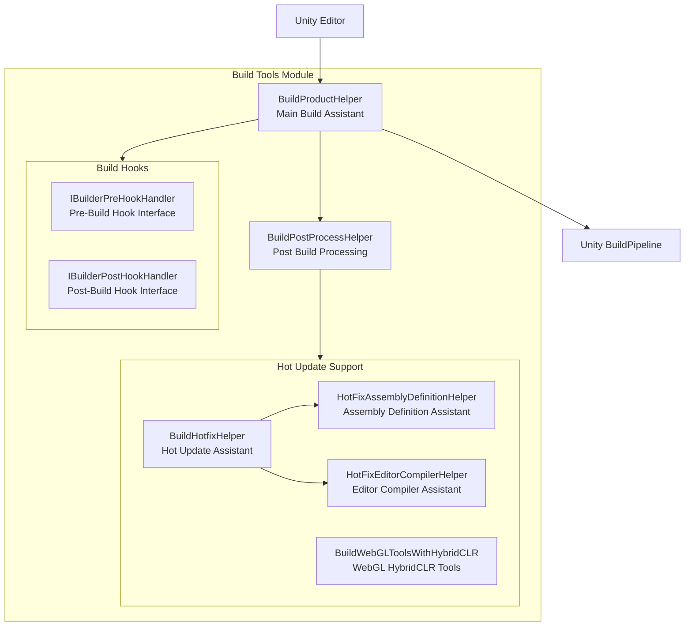
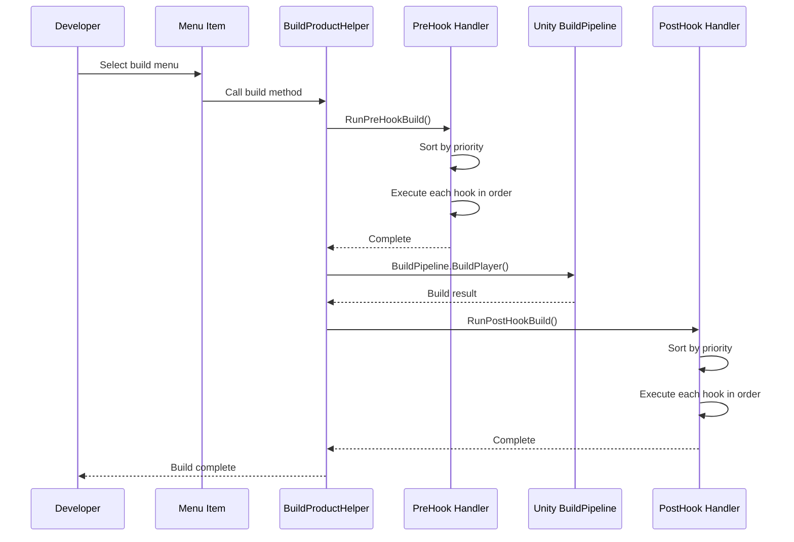

# Build Tools

GameFrameX provides a complete set of Unity editor build tools, supporting multi-platform building, hot update (HybridCLR) integration, and build hook extensions.

## Overview

The build tools module is located in the `Editor/` directory, containing the following core components:

- **BuildProductHelper** - Main build assistant, provides multi-platform building functionality
- **BuildHotfixHelper** - Hot update code management assistant
- **Hook Mechanism** - Extension hook interface for pre/post build
- **BuildWebGLToolsWithHybridCLR** - WebGL HybridCLR support tools

These tools provide a unified build entry point through Unity Editor menu `GameFrameX/Build`, simplifying cross-platform build processes.

## Architecture



### Core Component Description

| Component | File Path | Description |
|-----------|-----------|-------------|
| BuildProductHelper | `Editor/BuildProduct/BuildProductHelper.cs` | Main build assistant, supports Windows, Mac, Android, iOS, WebGL platform builds |
| BuildPostProcessHelper | `Editor/BuildProduct/BuildPostProcessHelper.cs` | Auto update version number after build |
| IBuilderPreHookHandler | `Editor/BuildProduct/IBuilderPreHookHandler.cs` | Pre-build hook interface |
| IBuilderPostHookHandler | `Editor/BuildProduct/IBuilderPostHookHandler.cs` | Post-build hook interface |
| BuildHotfixHelper | `Editor/BuildHotfix/BuildHotfixHelper.cs` | Hot update code copy and management |
| HotFixEditorCompilerHelper | `Editor/BuildHotfix/HotFixEditorCompilerHelper.cs` | Editor compiler control |
| HotFixAssemblyDefinitionHelper | `Editor/BuildHotfix/HotFixAssemblyDefinitionHelper.cs` | Assembly definition file modification |
| BuildWebGLToolsWithHybridCLR | `Editor/BuildWebGLTools/BuildWebGLToolsWithHybridCLR.cs` | WebGL HybridCLR support |

## Menu Items

Build tools provide a unified build entry point through Unity Editor menu, located under `GameFrameX/Build` menu:

| Menu Item | Function |
|-----------|----------|
| Windows X64 | Build Windows x64 executable |
| Windows X32 | Build Windows x32 executable |
| Mac Os | Build macOS application |
| WebGL | Build WebGL version |
| Apk | Build Android APK |
| AAB | Build Android AAB package |
| AndroidStudio Project Debug | Export Android Studio Debug project |
| AndroidStudio Project Release | Export Android Studio Release project |
| Xcode Project Debug | Export Xcode Debug project |
| Xcode Project Release | Export Xcode Release project |
| Copy HotFix Code | Copy hot update code to Bundles/Code directory |
| Copy AOT Code | Copy AOT code to Bundles/AOTCode directory |
| HotFix Editor Compiler Add | Add editor compiler directive for hot update assembly |
| HotFix Editor Compiler Remove | Remove editor compiler directive for hot update assembly |

## Core Functions

### Multi-Platform Build

BuildProductHelper supports building for the following platforms:

```csharp
// Windows x64 build
[MenuItem("GameFrameX/Build/Windows X64", false, 100)]
public static void BuildPlayerToWindows64BuildTarget()

// Windows x32 build
[MenuItem("GameFrameX/Build/Windows X32", false, 100)]
public static void BuildPlayerToWindows32BuildTarget()

// macOS build
[MenuItem("GameFrameX/Build/Mac Os", false, 200)]
public static void BuildPlayerToMacBuildTarget()

// WebGL build
[MenuItem("GameFrameX/Build/WebGL", false, 300)]
private static void BuildPlayerToWebGL()

// Android APK build
[MenuItem("GameFrameX/Build/Apk", false, 400)]
private static void BuildPlayerToAndroid()

// Android AAB build
[MenuItem("GameFrameX/Build/AAB", false, 400)]
private static void BuildAppBundleForAndroid()

// Android Studio project export (Debug/Release)
[MenuItem("GameFrameX/Build/AndroidStudio Project Debug", false, 500)]
private static void ExportToAndroidStudioToDevelop()

[MenuItem("GameFrameX/Build/AndroidStudio Project Release", false, 500)]
private static void ExportToAndroidStudioToRelease()

// Xcode project export (Debug/Release)
[MenuItem("GameFrameX/Build/Xcode Project Debug", false, 250)]
private static void ExportToXcodeToDevelop()

[MenuItem("GameFrameX/Build/Xcode Project Release", false, 250)]
private static void ExportToXcodeToRelease()
```
> Source: [BuildProductHelper.cs](https://github.com/GameFrameX/com.gameframex.unity/blob/main/Editor/BuildProduct/BuildProductHelper.cs#L101-L662)

### Build Hook Mechanism

By implementing `IBuilderPreHookHandler` and `IBuilderPostHookHandler` interfaces, you can execute custom logic before and after builds:

```csharp
using UnityEditor;

namespace MyProject.Editor
{
    /// <summary>
    /// Pre-build hook example
    /// </summary>
    public class MyPreBuildHook : IBuilderPreHookHandler
    {
        /// <summary>
        /// Priority, higher value means lower priority
        /// </summary>
        public int Priority => 0;

        /// <summary>
        /// Execute pre-build logic
        /// </summary>
        /// <param name="target">Build target platform</param>
        /// <param name="path">Build output path</param>
        public void Run(BuildTarget target, string path)
        {
            // Custom logic to execute before build
            UnityEngine.Debug.Log($"Starting build {target} to {path}");
        }
    }

    /// <summary>
    /// Post-build hook example
    /// </summary>
    public class MyPostBuildHook : IBuilderPostHookHandler
    {
        /// <summary>
        /// Priority
        /// </summary>
        public int Priority => 0;

        /// <summary>
        /// Execute post-build logic
        /// </summary>
        /// <param name="target">Build target platform</param>
        /// <param name="path">Build output path</param>
        public void Run(BuildTarget target, string path)
        {
            // Custom logic to execute after build
            UnityEngine.Debug.Log($"Build completed {target} output path {path}");
        }
    }
}
```
> Sources:
> - [IBuilderPreHookHandler.cs](https://github.com/GameFrameX/com.gameframex.unity/blob/main/Editor/BuildProduct/IBuilderPreHookHandler.cs#L39-L52)
> - [IBuilderPostHookHandler.cs](https://github.com/GameFrameX/com.gameframex.unity/blob/main/Editor/BuildProduct/IBuilderPostHookHandler.cs#L39-L52)

**Hook Execution Flow:**



### Hot Update Support (HybridCLR)

GameFrameX has built-in support for HybridCLR hot update solution:

#### Enable/Disable HybridCLR

```csharp
// Disable HybridCLR
[MenuItem("GameFrameX/Scripting Define Symbols/Disable HybridCLR", false, 5000)]
public static void DisableHybridCLR()
{
    ScriptingDefineSymbols.AddScriptingDefineSymbol(HybridCLRScriptingDefineSymbol);
}

// Enable HybridCLR
[MenuItem("GameFrameX/Scripting Define Symbols/Enable HybridCLR", false, 5001)]
public static void EnableHybridCLR()
{
    ScriptingDefineSymbols.RemoveScriptingDefineSymbol(HybridCLRScriptingDefineSymbol);
}
```
> Source: [BuildHotfixHelper.cs](https://github.com/GameFrameX/com.gameframex.unity/blob/main/Editor/BuildHotfix/BuildHotfixHelper.cs#L107-L125)

#### Copy Hot Update Code

```csharp
// Copy hot update DLL to Assets/Bundles/Code
[MenuItem("GameFrameX/Build/Copy HotFix Code", false, 10)]
public static void CopyHotfixCode()
{
    // Copy Unity.HotFix.dll from Library/ScriptAssemblies to Assets/Bundles/Code
}

// Copy AOT code to Assets/Bundles/AOTCode
[MenuItem("GameFrameX/Build/Copy AOT Code", false, 11)]
public static void CopyAOTCode()
{
    // Copy AOT DLL from HybridCLRData/AssembliesPostIl2CppStrip
}
```
> Source: [BuildHotfixHelper.cs](https://github.com/GameFrameX/com.gameframex.unity/blob/main/Editor/BuildHotfix/BuildHotfixHelper.cs#L43-L104)

### Editor Compiler Control

During the build process, you need to temporarily control the compilation scope of hot update assemblies:

```csharp
// Remove editor compiler directive for hot update assembly
[MenuItem("GameFrameX/Build/HotFix Editor Compiler Remove", false, 15)]
public static void RemoveEditor()
{
    var path = "Assets/Hotfix/Unity.HotFix.asmdef";
    HotFixAssemblyDefinitionHelper.RemoveEditor(path);
}

// Add editor compiler directive for hot update assembly
[MenuItem("GameFrameX/Build/HotFix Editor Compiler Add", false, 16)]
public static void AddEditor()
{
    var path = "Assets/Hotfix/Unity.HotFix.asmdef";
    HotFixAssemblyDefinitionHelper.AddEditor(path);
}
```
> Source: [HotFixEditorCompilerHelper.cs](https://github.com/GameFrameX/com.gameframex.unity/blob/main/Editor/BuildHotfix/HotFixEditorCompilerHelper.cs#L8-L29)

### Post-Build Auto Processing

BuildPostProcessHelper automatically updates version numbers after each build:

```csharp
[PostProcessBuild(999)]
public static void OnPostProcessBuild(BuildTarget target, string path)
{
    if (target == BuildTarget.Android)
    {
        // Android: bundleVersionCode + 1
        PlayerSettings.Android.bundleVersionCode = Convert.ToInt32(PlayerSettings.Android.bundleVersionCode) + 1;
    }

    if (target == BuildTarget.iOS)
    {
        // iOS: buildNumber + 1
        PlayerSettings.iOS.buildNumber = (Convert.ToInt32(PlayerSettings.iOS.buildNumber) + 1).ToString();
    }
}
```
> Source: [BuildPostProcessHelper.cs](https://github.com/GameFrameX/com.gameframex.unity/blob/main/Editor/BuildProduct/BuildPostProcessHelper.cs#L43-L57)

### Build Output Path Management

Build output paths are automatically generated according to the following rules:

```csharp
// Path format: Builds/{platform}/{package name}/{version}/{timestamp}
var pathName = $"{Application.identifier}_{_buildTime}_v_{PlayerSettings.bundleVersion}";

// Android special format
if (EditorUserBuildSettings.activeBuildTarget == BuildTarget.Android)
{
    pathName = $"{_buildTime}_code_{PlayerSettings.Android.bundleVersionCode}";
}

// iOS/macOS special format
else if (EditorUserBuildSettings.activeBuildTarget == BuildTarget.iOS ||
         EditorUserBuildSettings.activeBuildTarget == BuildTarget.StandaloneOSX)
{
    pathName = $"{_buildTime}_code_{PlayerSettings.iOS.buildNumber}";
}
```
> Source: [BuildProductHelper.cs](https://github.com/GameFrameX/com.gameframex.unity/blob/main/Editor/BuildProduct/BuildProductHelper.cs#L703-L746)

## Usage Examples

### Basic Build Flow

1. **Select target platform**: Open scene in Unity Editor
2. **Set build target**: Select target platform through `File > Build Settings`
3. **Execute build**: Select corresponding build option through `GameFrameX/Build` menu
4. **View output**: After build completes, view output in `Builds/{platform}/` directory

### Use Build Hook Extension

Create a custom build hook to clean old resources before building:

```csharp
using UnityEditor;
using GameFrameX.Editor;

public class CustomBuildHook : IBuilderPreHookHandler
{
    public int Priority => 10; // Lower priority

    public void Run(BuildTarget target, string path)
    {
        // Clean old build cache
        string cachePath = $"{path}/Cache";
        if (System.IO.Directory.Exists(cachePath))
        {
            System.IO.Directory.Delete(cachePath, true);
        }

        UnityEngine.Debug.Log($"Pre-build cleanup complete: {target}");
    }
}
```

### Programmatic Build via API

You can implement automated builds through code:

```csharp
using GameFrameX.Editor;

// Build Android APK
string apkPath = BuildProductHelper.BuildPlayerAndroid();

// Build WebGL
string webglPath = BuildProductHelper.BuildPlayerWebGL();

// Build Xcode project
string xcodePath = BuildProductHelper.BuildPlayerXcode();
```
> Source: [BuildProductHelper.cs](https://github.com/GameFrameX/com.gameframex.unity/blob/main/Editor/BuildProduct/BuildProductHelper.cs#L281-L368)

## Related Links

- [Mini-Game Platform Adaptation](./6-editor-tools.mini-game-platform) - Learn how to adapt to mini-game platforms like WeChat, ByteDance
- [Package Management Tools](./6-editor-tools.package-management) - Learn about package management functionality
- [Runtime Module Overview](./5-runtime.base) - Learn about runtime base components
- [Event System](./5-runtime.event-system) - Learn about event system
- [Object Pool System](./5-runtime.object-pool) - Learn about object pool system