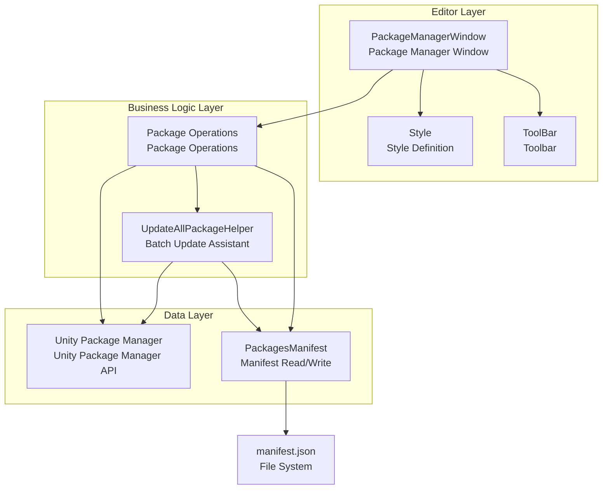
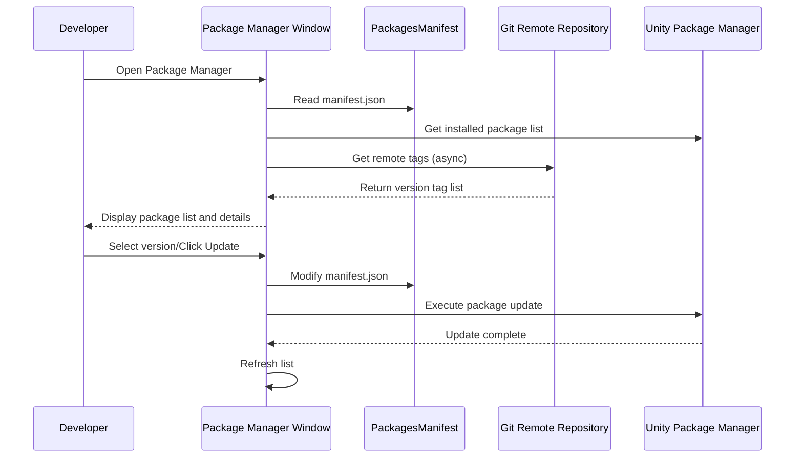

# Package Management Tools

GameFrameX Package Management Tools are a complete set of Unity editor extensions specifically designed for managing Git-based dependency packages. They provide a visual package management interface and batch update functionality, helping developers manage project dependencies more efficiently.

## Overview

GameFrameX Package Management Tools are Unity editor extensions integrated under the `GameFrameX` menu. These tools primarily solve the following problems:

1. **Visual Package Management** - View all installed Git packages and their detailed information through a graphical interface
2. **Version Switching** - Freely switch between different versions of the same package (upgrade/downgrade)
3. **Batch Update** - One-click update all Git packages to the latest version
4. **Mirror Switching** - Support quick switching between GitHub and Gitee mirrors

### Core Features

| Feature | Description |
|---------|-------------|
| Package List Display | Display all installed Git packages |
| Package Details View | View package name, version, author, description and other information |
| Version Switching | Support upgrade/downgrade to specified version |
| Batch Update | One-click update all packages to latest version |
| Mirror Switching | Support GitHub/Gitee mirror switching |
| Refresh Function | Reload package list |

## Architecture Design



### Component Description

| Component | File Path | Responsibility |
|-----------|-----------|----------------|
| PackageManagerWindow | Editor/PackageManager/PackageManagerWindow.cs | Main window interface, provides package list and details display |
| PackageManagerWindow.Package | Editor/PackageManager/PackageManagerWindow.Package.cs | Package operation logic, including loading, version fetching |
| PackageManagerWindow.ToolBar | Editor/PackageManager/PackageManagerWindow.ToolBar.cs | Toolbar UI, provides refresh, update, mirror switching |
| PackageManagerWindow.Style | Editor/PackageManager/PackageManagerWindow.Style.cs | Style definition |
| PackagesManifest | Editor/PackageManager/PackagesManifest.cs | manifest.json read/write wrapper |
| UpdateAllPackageHelper | Editor/UpdatePackages/UpdateAllPackageHelper.cs | Batch update functionality |

## Core Functions Detail

### Open Package Manager

Open the package manager window through menu `GameFrameX → Package Manager`.

```csharp
[MenuItem("GameFrameX/Package Manager", false, 2000)]
public static void ShowWindow()
{
    var window = GetWindow<PackageManagerWindow>("GameFrameX");
    window.minSize = new UnityEngine.Vector2(800, 600);
    window.Show();
}
```
> Source: [PackageManagerWindow.cs](https://github.com/GameFrameX/com.gameframex.unity/blob/main/Editor/PackageManager/PackageManagerWindow.cs#L11-L17)

### Package Info Model

```csharp
public sealed class PackageManagerInfo
{
    /// <summary>
    /// Package name
    /// </summary>
    public string Name { get; }

    /// <summary>
    /// Package git URL
    /// </summary>
    public string GitUrl { get; }

    /// <summary>
    /// Package info
    /// </summary>
    public PackageInfo Package { get; }

    /// <summary>
    /// Version list, Tags
    /// </summary>
    public List<string> Versions { get; }
}
```
> Source: [PackageManagerWindow.Package.cs](https://github.com/GameFrameX/com.gameframex.unity/blob/main/Editor/PackageManager/PackageManagerWindow.Package.cs#L20-L49)

### Get Git Tag Versions

The tool fetches all tags from the remote repository by calling git ls-remote:

```csharp
private void FetchGitTags(string gitUrl, PackageManagerInfo package)
{
    isLoadingPackageTagList = true;
    Task.Run(() =>
    {
        ProcessStartInfo startInfo = new ProcessStartInfo
        {
            FileName = "git",
            Arguments = $"ls-remote --tags {gitUrl}",
            RedirectStandardOutput = true,
            UseShellExecute = false,
            CreateNoWindow = true
        };
        using (Process process = Process.Start(startInfo))
        {
            using (StreamReader reader = process.StandardOutput)
            {
                string result = reader.ReadToEnd();
                string[] tags = result.Split('\n');
                foreach (var tag in tags)
                {
                    if (!string.IsNullOrEmpty(tag) && !tag.Contains("^{"))
                    {
                        // Extract tag name
                        var tagName = tag.Split('\t')[1].Replace("refs/tags/", "").Trim();
                        package.Versions.Add(tagName);
                    }
                }
                package.Versions.Sort((x, y) => -x.CompareTo(y));
            }
        }
        isLoadingPackageTagList = false;
    });
}
```
> Source: [PackageManagerWindow.Package.cs](https://github.com/GameFrameX/com.gameframex.unity/blob/main/Editor/PackageManager/PackageManagerWindow.Package.cs#L103-L144)

### Version Update/Downgrade

```csharp
void UpdateToVersion(string packageName, string version)
{
    StartLoadPackages();
    PackagesManifest saveManifest = new PackagesManifest
    {
        Dependencies = new Dictionary<string, string>(PackagesManifest.Dependencies),
    };
    foreach (var dependency in PackagesManifest.Dependencies)
    {
        if (dependency.Key.Equals(packageName, StringComparison.OrdinalIgnoreCase))
        {
            string packageUrl = dependency.Value;
            if (packageUrl.Contains(".git"))
            {
                int indexTag = packageUrl.LastIndexOf("#", StringComparison.InvariantCulture);
                string url;
                if (indexTag >= 0)
                {
                    // Has version number
                    url = packageUrl.Substring(0, indexTag);
                    url = $"{url}#{version}";
                }
                else
                {
                    url = packageUrl.Split(new[] { ".git", }, StringSplitOptions.RemoveEmptyEntries)[0];
                    url = $"{url}.git#{version}";
                }
                saveManifest.Dependencies[dependency.Key] = url;
                UpdateAllPackageHelper.UpdatePackages(packageName, url);
                continue;
            }
            saveManifest.Dependencies[dependency.Key] = packageUrl;
        }
    }
    SavePackages(saveManifest);
    UpdateAllPackageHelper.StartUpdate();
    AssetDatabase.Refresh();
}
```
> Source: [PackageManagerWindow.cs](https://github.com/GameFrameX/com.gameframex.unity/blob/main/Editor/PackageManager/PackageManagerWindow.cs#L230-L271)

## Usage Flow



## Batch Update Function

### Menu Entry

```csharp
[MenuItem("GameFrameX/Update All Packages", false, 2000)]
public static void UpdatePackages()
{
    var result = EditorUtility.DisplayDialog("Update Package Prompt", "Update all packages?\n After update completes, you need to [restart, restart, restart] Unity", "Yes", "No");
    if (result)
    {
        var manifestPath = Path.Combine(Application.dataPath, "..", "Packages", "manifest.json");
        UpdatePackagesFromManifest(manifestPath);
    }
}
```
> Source: [UpdateAllPackageHelper.cs](https://github.com/GameFrameX/com.gameframex.unity/blob/main/Editor/UpdatePackages/UpdateAllPackageHelper.cs#L24-L33)

### Update Progress Handler

```csharp
private static void UpdatingProgressHandler()
{
    if (_addRequest.IsCompleted)
    {
        if (_addRequest.Status == StatusCode.Success)
        {
            UnityEngine.Debug.Log($"Updated package: {_addRequest.Result.packageId}");
        }
        else if (_addRequest.Status >= StatusCode.Failure)
        {
            UnityEngine.Debug.LogError($"Failed to update package: {_addRequest.Error.message}");
        }
        EditorApplication.update -= UpdatingProgressHandler;
        UpdateNextPackage();
    }
}
```
> Source: [UpdateAllPackageHelper.cs](https://github.com/GameFrameX/com.gameframex.unity/blob/main/Editor/UpdatePackages/UpdateAllPackageHelper.cs#L110-L126)

## Mirror Switching Function

The tool supports switching between GitHub and Gitee mirrors to adapt to different network environments:

```csharp
private void OnGUIByToolBar()
{
    GUILayout.BeginHorizontal(EditorStyles.toolbar);
    GUILayout.Label("Mirror List:", EditorStyles.label, GUILayout.Width(100));
    int newDropdownIndex = EditorGUILayout.Popup(_selectedDropdownIndex, _dropdownOptions, EditorStyles.toolbarDropDown);
    if (newDropdownIndex != _selectedDropdownIndex)
    {
        var confirmed = EditorUtility.DisplayDialog("Switch Prompt",
            $"You will switch all package download addresses to mirror:\n{_dropdownOptions[newDropdownIndex]}\nMay encounter some libraries not available. Please submit Issue feedback", "Confirm", "Cancel");

        if (confirmed)
        {
            _selectedDropdownIndex = newDropdownIndex;
            // Update all package URLs
            foreach (var manifestDependency in PackagesManifest.Dependencies)
            {
                if (manifestDependency.Value.StartsWith("https://"))
                {
                    var path = manifestDependency.Value.Replace("https://", string.Empty).Replace("\\", "/");
                    var index = path.IndexOf("/", System.StringComparison.OrdinalIgnoreCase);
                    if (index >= 0)
                    {
                        path = path.Substring(index);
                    }
                    dependencies[manifestDependency.Key] = $"https://{_dropdownOptions[_selectedDropdownIndex]}{path}";
                }
            }
            PackagesManifest.Dependencies = dependencies;
            SavePackages(PackagesManifest);
        }
    }
    // ... Refresh and update buttons
}
```
> Source: [PackageManagerWindow.ToolBar.cs](https://github.com/GameFrameX/com.gameframex.unity/blob/main/Editor/PackageManager/PackageManagerWindow.ToolBar.cs#L13-L49)

## FAQ

### Q: Do I need to restart Unity after updating packages?

Yes, due to Unity package manager limitations, you need to **restart Unity Editor** after updating packages for changes to take effect. The tool will display a prompt dialog to remind you.

### Q: Why do some packages not show version lists?

This may be because:
1. Remote repository has no Git Tag created
2. Network issues prevent fetching remote tags
3. Git repository does not support ls-remote operation

If you encounter this problem, you can click the "Missing Tag or version tag? I want to report" button to submit an Issue.

### Q: What should I do if some packages cannot be downloaded after switching mirrors?

Since Gitee mirror may not be fully synchronized with GitHub repository, some packages may fail to download after switching. Please submit an Issue and the developer will handle it as soon as possible.

### Q: How to cancel an ongoing batch update?

During batch update, there is a close button in the upper right corner of the Progress Bar, click it to cancel the update.

## Related Links

- [Build Tools](./6-editor-tools.build-tools)
- [Mini-Game Platform Adaptation](./6-editor-tools.mini-game-platform)
- [Inspector Tools](./6-editor-tools.inspector-tools)
- [Image Cropping Tool](./6-editor-tools.cropping-tool)
- [Unity Package Manager Documentation](https://docs.unity3d.com/Manual/Packages.html)