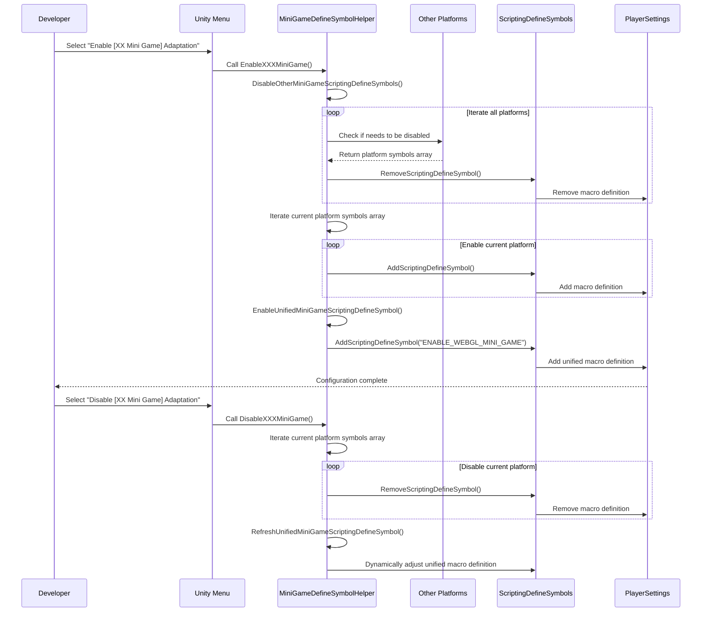

# Mini-Game Platform Adaptation

The Mini-Game Platform Adaptation module provides a unified macro definition management solution for 21 mainstream mini-game platforms. Through this module, developers can switch target platforms with one click, and the system will automatically handle mutual exclusivity between platforms, generating unified WebGL mini-game macro definitions.

## Overview

When developing Unity WebGL mini-games, different platforms require different scripting define symbols to enable platform-specific code adaptation. The traditional approach requires manual configuration in PlayerSettings, which is both tedious and error-prone.

The mini-game platform adaptation module solves these problems through the following design:

- **One-click switching**: Quickly enable/disable target platform through Unity menu bar
- **Auto mutual exclusion**: Automatically disable other platforms when enabling a new platform, avoiding macro definition conflicts
- **Unified identifier**: Automatically manages `ENABLE_WEBGL_MINI_GAME` unified macro, facilitating cross-platform generic code writing
- **Platform classification**: Organized by domestic mini-games, international mini-games, device OEMs, and game platforms for easy management

## Architecture Design

```mermaid
graph TB
    subgraph Core["Core Layer - MiniGameDefineSymbolHelper.cs"]
        Main["Main Class Definition<br/>MiniGameDefineSymbolHelper"]
        GetAll["Get All Platform Symbols<br/>GetAllMiniGameScriptingDefineSymbols"]
        DisableOthers["Disable Other Platforms<br/>DisableOtherMiniGameScriptingDefineSymbols"]
        EnableUnified["Enable Unified Symbol<br/>EnableUnifiedMiniGameScriptingDefineSymbol"]
        RefreshUnified["Refresh Unified Symbol<br/>RefreshUnifiedMiniGameScriptingDefineSymbol"]
    end

    subgraph Domestic["Domestic Mini Games - DomesticMiniGames"]
        WC["WeChat"]
        DY["DouYin"]
        KS["KuaiShou"]
        BD["Baidu"]
        AL["Alipay"]
        MT["Meituan"]
        BL["Bilibili"]
        JD["JingDong"]
        TB["Taobao"]
        TT["TapTap"]
    end

    subgraph International["International Mini Games - InternationalMiniGames"]
        CG["CrazyGames"]
        DC["Discord"]
        FB["Facebook"]
        GP["Google Play"]
        PK["Poki"]
        TTInt["TikTok"]
        YT["YouTube"]
    end

    subgraph Device["Device OEMs - DeviceOEMs"]
        HW["Huawei"]
        OP["OPPO"]
        VI["Vivo"]
        XM["Xiaomi"]
    end

    subgraph Utilities["Utility Layer - ScriptingDefineSymbols"]
        Util["ScriptingDefineSymbols<br/>Utility Class"]
    end

    Main --> GetAll
    Main --> DisableOthers
    Main --> EnableUnified
    Main --> RefreshUnified

    GetAll --> WC
    GetAll --> DY
    GetAll --> KS
    GetAll --> BD
    GetAll --> AL
    GetAll --> MT
    GetAll --> BL
    GetAll --> JD
    GetAll --> TB
    GetAll --> TT
    GetAll --> CG
    GetAll --> DC
    GetAll --> FB
    GetAll --> GP
    GetAll --> PK
    GetAll --> TTInt
    GetAll --> YT
    GetAll --> HW
    GetAll --> OP
    GetAll --> VI
    GetAll --> XM

    DisableOthers --> Util
    EnableUnified --> Util
    RefreshUnified --> Util
```



### Architecture Description

The core layer `MiniGameDefineSymbolHelper` is the main controller of the entire module, providing the following core functions:

1. **Get all platform symbols** (`GetAllMiniGameScriptingDefineSymbols`): Collects all registered mini-game platform macro definitions
2. **Disable other platforms** (`DisableOtherMiniGameScriptingDefineSymbols`): Implements mutual exclusivity between platforms
3. **Enable unified symbol** (`EnableUnifiedMiniGameScriptingDefineSymbol`): Manages `ENABLE_WEBGL_MINI_GAME` unified macro
4. **Refresh unified symbol** (`RefreshUnifiedMiniGameScriptingDefineSymbol`): Dynamically adjusts unified macro based on current platform status

The platform layer is divided into four folders by function, with each platform extending the main class in the form of partial class, generating corresponding enable/disable options in the Unity menu bar through `[MenuItem]` attribute.

## Core Function Flow



### Design Intent

This flow design follows these principles:

1. **Mutual exclusivity**: Through `DisableOtherMiniGameScriptingDefineSymbols`, ensures only one platform is active at a time, preventing compilation errors caused by macro definition conflicts

2. **Unification**: Each platform automatically adds `ENABLE_WEBGL_MINI_GAME` unified macro when enabled, allowing developers to write platform-independent core logic using this macro

3. **Dynamic refresh**: When disabling a platform, it checks if there are other platforms still active; if not, it automatically disables the unified macro, avoiding invalid macro definitions

## Supported Platforms

### Domestic Mini Games

| Platform | Macros | Menu Path |
|----------|--------|-----------|
| WeChat | `ENABLE_WECHAT_MINI_GAME`, `WEIXINMINIGAME` | GameFrameX → Scripting Define Symbols → Domestic Mini Games |
| DouYin | `ENABLE_DOUYIN_MINI_GAME`, `DOUYINMINIGAME`, `TTSDK_MIX_ENGINE` | GameFrameX → Scripting Define Symbols → Domestic Mini Games |
| KuaiShou | `ENABLE_KUAISHOU_MINI_GAME`, `KUAISHOUMINIGAME` | GameFrameX → Scripting Define Symbols → Domestic Mini Games |
| Baidu | `ENABLE_BAIDU_MINI_GAME`, `BAIDUMINIGAME` | GameFrameX → Scripting Define Symbols → Domestic Mini Games |
| Alipay | `ENABLE_ALIPAY_MINI_GAME`, `ALIPAYMINIGAME` | GameFrameX → Scripting Define Symbols → Domestic Mini Games |
| Meituan | `ENABLE_MEITUAN_MINI_GAME`, `MEITUANMINIGAME` | GameFrameX → Scripting Define Symbols → Domestic Mini Games |
| Bilibili | `ENABLE_BILIBILI_MINI_GAME`, `BILIBILIMINIGAME` | GameFrameX → Scripting Define Symbols → Domestic Mini Games |
| JingDong | `ENABLE_JINGDONG_MINI_GAME`, `JINGDONGMINIGAME` | GameFrameX → Scripting Define Symbols → Domestic Mini Games |
| Taobao | `ENABLE_TAOBAO_MINI_GAME`, `TAOBAOMINIGAME` | GameFrameX → Scripting Define Symbols → Domestic Mini Games |
| TapTap | `ENABLE_TAPTAP_MINI_GAME`, `TAPTAPMINIGAME` | GameFrameX → Scripting Define Symbols → Game Platforms |

### International Mini Games

| Platform | Macros | Menu Path |
|----------|--------|-----------|
| CrazyGames | `ENABLE_CRAZYGAMES_MINI_GAME`, `CRAZYGAMESMINIGAME` | GameFrameX → Scripting Define Symbols → International Mini Games |
| Discord | `ENABLE_DISCORD_MINI_GAME`, `DISCORDMINIGAME` | GameFrameX → Scripting Define Symbols → International Mini Games |
| Facebook | `ENABLE_FACEBOOK_MINI_GAME`, `FACEBOOKMINIGAME` | GameFrameX → Scripting Define Symbols → International Mini Games |
| Google Play | `ENABLE_GOOGLEPLAY_MINI_GAME`, `GOOGLEPLAYMINIGAME` | GameFrameX → Scripting Define Symbols → International Mini Games |
| Poki | `ENABLE_POKI_MINI_GAME`, `POKIMINIGAME` | GameFrameX → Scripting Define Symbols → International Mini Games |
| TikTok | `ENABLE_TIKTOK_MINI_GAME`, `TIKTOKMINIGAME` | GameFrameX → Scripting Define Symbols → International Mini Games |
| YouTube | `ENABLE_YOUTUBE_MINI_GAME`, `YOUTUBEMINIGAME` | GameFrameX → Scripting Define Symbols → International Mini Games |

### Device OEMs

| Platform | Macros | Menu Path |
|----------|--------|-----------|
| Huawei | `ENABLE_HUAWEI_MINI_GAME`, `HUAWEIMINIGAME` | GameFrameX → Scripting Define Symbols → Device OEMs |
| OPPO | `ENABLE_OPPO_MINI_GAME`, `OPPOSMINIGAME` | GameFrameX → Scripting Define Symbols → Device OEMs |
| Vivo | `ENABLE_VIVO_MINI_GAME`, `VIVOMINIGAME` | GameFrameX → Scripting Define Symbols → Device OEMs |
| Xiaomi | `ENABLE_XIAOMI_MINI_GAME`, `XIAOMIMINIGAME` | GameFrameX → Scripting Define Symbols → Device OEMs |

## Usage Examples

### Basic Usage: Enable Platform

In Unity editor, enable adaptation by selecting the corresponding platform option in the menu bar:

```
GameFrameX → Scripting Define Symbols → Domestic Mini Games → Enable WeChat Mini Game
```

After enabling, the system will automatically:
1. Disable macro definitions of all other mini-game platforms
2. Enable WeChat mini-game macro definitions (`ENABLE_WECHAT_MINI_GAME`, `WEIXINMINIGAME`)
3. Enable unified macro definition (`ENABLE_WEBGL_MINI_GAME`)

### Use Platform Macros in Code

```csharp
#if ENABLE_WECHAT_MINI_GAME
using WeChatMiniGame API;
// WeChat mini game specific code
#elif ENABLE_DOUYIN_MINI_GAME
using DouYinMiniGameAPI;
// DouYin mini game specific code
#elif ENABLE_WEBGL_MINI_GAME
// Generic WebGL mini game logic
#endif
```

> Source: [MiniGameDefineSymbolHelper.WeChat.cs](https://github.com/GameFrameX/com.gameframex.unity/blob/main/Editor/MiniGame/DomesticMiniGames/MiniGameDefineSymbolHelper.WeChat.cs#L20-L40)

### Disable Platform

```
GameFrameX → Scripting Define Symbols → Domestic Mini Games → Disable WeChat Mini Game
```

After disabling, the system will remove the platform's macro definitions and check if the unified macro definition needs adjustment.

### Platform Macro Definition Example

WeChat mini-game platform macro definition configuration:

```csharp
/// <summary>
/// WeChat mini game adaptation macro definitions.
/// </summary>
public static readonly string[] EnableWeChatMiniGameScriptingDefineSymbol = new[]
{
    "ENABLE_WECHAT_MINI_GAME",
    "WEIXINMINIGAME"
};
```

> Source: [MiniGameDefineSymbolHelper.WeChat.cs](https://github.com/GameFrameX/com.gameframex.unity/blob/main/Editor/MiniGame/DomesticMiniGames/MiniGameDefineSymbolHelper.WeChat.cs#L10-L14)

DouYin platform includes additional Toutiao Engine symbols:

```csharp
/// <summary>
/// DouYin mini game adaptation macro definitions.
/// </summary>
public static readonly string[] EnableDouYinMiniGameScriptingDefineSymbol = new[]
{
    "ENABLE_DOUYIN_MINI_GAME",
    "DOUYINMINIGAME",
    "TTSDK_MIX_ENGINE"
};
```

> Source: [MiniGameDefineSymbolHelper.DouYin.cs](https://github.com/GameFrameX/com.gameframex.unity/blob/main/Editor/MiniGame/DomesticMiniGames/MiniGameDefineSymbolHelper.DouYin.cs#L10-L14)

### Core Implementation Logic

Core mutual exclusion logic when enabling platform:

```csharp
/// <summary>
/// Disables define symbols of other mini game platforms except the current one.
/// </summary>
/// <param name="currentMiniGameScriptingDefineSymbols">Current platform macro definition collection</param>
private static void DisableOtherMiniGameScriptingDefineSymbols(string[] currentMiniGameScriptingDefineSymbols)
{
#if UNITY_WEBGL
    var closedCount = 0;
    foreach (var defineSymbols in GetAllMiniGameScriptingDefineSymbols())
    {
        if (defineSymbols == null || object.ReferenceEquals(defineSymbols, currentMiniGameScriptingDefineSymbols))
        {
            continue;
        }

        foreach (var define in defineSymbols)
        {
            if (!ScriptingDefineSymbols.HasScriptingDefineSymbol(BuildTargetGroup.WebGL, define))
            {
                continue;
            }

            ScriptingDefineSymbols.RemoveScriptingDefineSymbol(define);
            closedCount++;
            UnityEngine.Debug.Log($"Mini game macro [{define}] has been disabled");
        }
    }

    UnityEngine.Debug.Log($"Mini game macro mutual exclusion cleanup complete, disabled {closedCount} macros");
#endif
}
```

> Source: [MiniGameDefineSymbolHelper.cs](https://github.com/GameFrameX/com.gameframex.unity/blob/main/Editor/MiniGame/MiniGameDefineSymbolHelper.cs#L52-L88)

## Configuration Notes

### Unified Macro Definition

All projects with any mini-game platform enabled will automatically get `ENABLE_WEBGL_MINI_GAME` macro definition. This macro is used to write platform-independent core logic:

```csharp
#if ENABLE_WEBGL_MINI_GAME
// Code shared by all mini-game platforms
// For example: unified resource loading interface, general event system, etc.
#endif
```

### Menu Item Priority

Menu items are organized by platform category, with priorities set as follows:

| Category | Priority Range | Description |
|----------|---------------|-------------|
| Domestic Mini Games | 2000-2099 | Domestic Mini Games |
| Game Platforms | 2500-2599 | Game Platforms |
| International Mini Games | 3200-3499 | International Mini Games |
| Device OEMs | 3700-3999 | Device OEMs |

### Notes

1. **WebGL only**: All mini-game platform macro definitions are only valid under WebGL build target, code has `#if UNITY_WEBGL` protection
2. **Mutual exclusion design**: Mini-game platforms are mutually exclusive; enabling a new platform will automatically disable the old one
3. **Macro definition format**: Platform macro definitions usually contain two parts:
   - `ENABLE_XXX_MINI_GAME`: Unified format for easy identification
   - `XXXMINIGAME`: Platform-specific format corresponding to each platform SDK

## Related Links

- [Build Tools](./6-editor-tools.build-tools) - Learn about other build-related features
- [Package Management Tools](./6-editor-tools.package-management) - Learn about project dependency management
- [Inspector Tools](./6-editor-tools.inspector-tools) - Learn about runtime monitoring tools
- [API Reference](./8-api-reference) - View complete API definitions