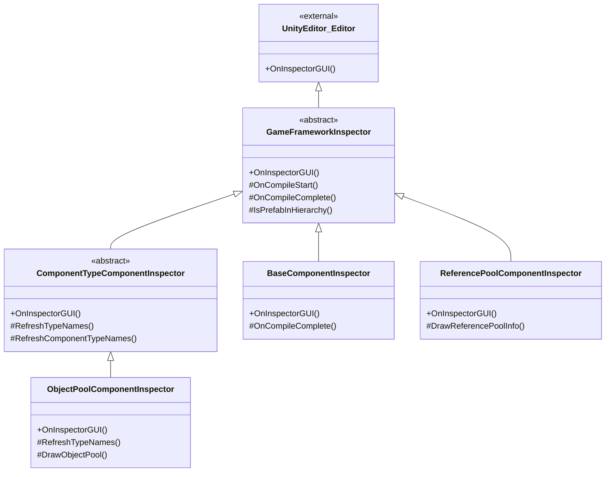

# Inspector Tools

Inspector tools are a series of custom Inspector extensions provided by GameFrameX for Unity editor, used to intuitively view and configure runtime status and parameters of game framework components in the editor.

## Overview

GameFrameX's Inspector tools extend Unity's native Inspector system to provide more user-friendly and feature-rich configuration interfaces for core framework components. These custom Inspectors not only allow component property configuration in editor mode but also display internal states of object pool, reference pool and other systems in real-time during runtime, helping developers better debug and optimize game performance.

Inspector tools primarily include the following functions:
- **Base Component Inspector**: Configure global helper types (text, version, log, compression, JSON) and runtime parameters (frame rate, game speed)
- **Object Pool Inspector**: Display object pool status during runtime, support manual release and CSV data export
- **Reference Pool Inspector**: Display reference pool statistics grouped by assembly, support data export
- **Inspector Lock Shortcut**: Quick toggle Inspector lock status through menu shortcut

## Architecture

Inspector tools adopt an object-oriented inheritance structure, defining common functionality through abstract base classes, with specific Inspector implementations providing customized interface display.



### Core Component Description

| Class | Responsibility | Inheritance |
|-------|----------------|-------------|
| `GameFrameworkInspector` | Abstract base class for all custom Inspectors, provides compilation state detection and Prefab hierarchy judgment | Inherits from `UnityEditor.Editor` |
| `ComponentTypeComponentInspector` | Abstract base class for component type selector, used for scenarios requiring dynamic component type selection | Inherits from `GameFrameworkInspector` |
| `BaseComponentInspector` | Custom Inspector for `BaseComponent`, configures global helper types and runtime parameters | Inherits from `GameFrameworkInspector` |
| `ObjectPoolComponentInspector` | Custom Inspector for `ObjectPoolComponent`, displays object pool runtime status | Inherits from `ComponentTypeComponentInspector` |
| `ReferencePoolComponentInspector` | Custom Inspector for `ReferencePoolComponent`, displays reference pool statistics | Inherits from `GameFrameworkInspector` |

## Function Details

### Base Inspector Base Class

`GameFrameworkInspector` is the base class for all custom Inspectors, providing common functionality such as compilation state detection and Prefab hierarchy judgment.

```csharp
public abstract class GameFrameworkInspector : UnityEditor.Editor
{
    protected const string NoneOptionName = "<None>";
    private bool m_IsCompiling = false;

    public override void OnInspectorGUI()
    {
        if (m_IsCompiling && !EditorApplication.isCompiling)
        {
            m_IsCompiling = false;
            OnCompileComplete();
        }
        else if (!m_IsCompiling && EditorApplication.isCompiling)
        {
            m_IsCompiling = true;
            OnCompileStart();
        }
    }

    protected bool IsPrefabInHierarchy(UnityEngine.Object obj)
    {
        // Determine if object is in Prefab hierarchy view
    }
}
```
> Source: [GameFrameworkInspector.cs](https://github.com/GameFrameX/com.gameframex.unity/blob/main/Editor/Inspector/GameFrameworkInspector.cs#L1-L57)

**Design Intent:**
- Listen to Unity compilation state changes, automatically refresh type list after compilation completes
- Provides Prefab hierarchy judgment method to ensure runtime Inspector functionality is only available on scene objects

### BaseComponent Inspector

`BaseComponentInspector` provides a rich configuration interface for the base component, including global helper type selection and runtime parameter control.

```csharp
[CustomEditor(typeof(BaseComponent))]
internal sealed class BaseComponentInspector : GameFrameworkInspector
{
    private static readonly float[] GameSpeed = new float[] { 0f, 0.01f, 0.1f, 0.25f, 0.5f, 1f, 1.5f, 2f, 4f, 8f };

    public override void OnInspectorGUI()
    {
        base.OnInspectorGUI();
        serializedObject.Update();

        // Global helper type configuration
        EditorGUILayout.BeginVertical("box");
        {
            EditorGUILayout.LabelField("Global Helpers", EditorStyles.boldLabel);
            int textHelperSelectedIndex = EditorGUILayout.Popup("Text Helper", m_TextHelperTypeNameIndex, m_TextHelperTypeNames);
            // ... Other helper type configurations
        }
        EditorGUILayout.EndVertical();

        // Frame rate configuration
        int frameRate = EditorGUILayout.IntSlider("Frame Rate", m_FrameRate.intValue, 1, 120);

        // Game speed configuration
        float gameSpeed = EditorGUILayout.Slider("Game Speed", m_GameSpeed.floatValue, 0f, 8f);

        serializedObject.ApplyModifiedProperties();
    }
}
```
> Source: [BaseComponentInspector.cs](https://github.com/GameFrameX/com.gameframex.unity/blob/main/Editor/Inspector/BaseComponentInspector.cs#L40-L193)

**Function Features:**
- **Helper type configuration**: Dynamically select helper types (Text, Version, Log, Compression, JSON) through dropdown menu
- **Frame rate control**: Slider to control game frame rate (1-120)
- **Game speed**: Slider + preset buttons to control time scale (0x - 8x)
- **Run in background**: Toggle to control whether app runs in background
- **Screen never sleep**: Toggle to control whether device sleep is prevented

### Object Pool Inspector

`ObjectPoolComponentInspector` displays detailed status information of the object pool during runtime.

```csharp
[CustomEditor(typeof(ObjectPoolComponent))]
internal sealed class ObjectPoolComponentInspector : ComponentTypeComponentInspector
{
    private readonly HashSet<string> m_OpenedItems = new HashSet<string>();

    public override void OnInspectorGUI()
    {
        base.OnInspectorGUI();

        if (!EditorApplication.isPlaying)
        {
            EditorGUILayout.HelpBox("Available during runtime only.", MessageType.Info);
            return;
        }

        ObjectPoolComponent t = (ObjectPoolComponent)target;
        if (IsPrefabInHierarchy(t.gameObject))
        {
            EditorGUILayout.LabelField("Object Pool Count", t.Count.ToString());
            ObjectPoolBase[] objectPools = t.GetAllObjectPools(true);
            foreach (ObjectPoolBase objectPool in objectPools)
            {
                DrawObjectPool(objectPool);
            }
        }
    }
}
```
> Source: [ObjectPoolComponentInspector.cs](https://github.com/GameFrameX/com.gameframex.unity/blob/main/Editor/Inspector/ObjectPoolComponentInspector.cs#L43-L72)

**Function Features:**
- **Runtime only**: Display detailed information only during game runtime
- **Collapsible list**: Each object pool can be expanded to view details
- **Real-time statistics**: Display pool capacity, usage count, available release count, expiration time, etc.
- **Manual release**: Provide Release and Release All Unused buttons
- **CSV export**: Support exporting object pool data to CSV file for analysis

### Reference Pool Inspector

`ReferencePoolComponentInspector` displays reference pool statistics grouped by assembly.

```csharp
[CustomEditor(typeof(ReferencePoolComponent))]
internal sealed class ReferencePoolComponentInspector : GameFrameworkInspector
{
    private readonly Dictionary<string, List<ReferencePoolInfo>> m_ReferencePoolInfos = new Dictionary<string, List<ReferencePoolInfo>>();

    public override void OnInspectorGUI()
    {
        base.OnInspectorGUI();
        serializedObject.Update();

        ReferencePoolComponent t = (ReferencePoolComponent)target;

        if (EditorApplication.isPlaying && IsPrefabInHierarchy(t.gameObject))
        {
            // Display strict check toggle
            bool enableStrictCheck = EditorGUILayout.Toggle("Enable Strict Check", t.EnableStrictCheck);

            // Display reference pool info grouped by assembly
            foreach (KeyValuePair<string, List<ReferencePoolInfo>> assemblyReferencePoolInfo in m_ReferencePoolInfos)
            {
                bool currentState = EditorGUILayout.Foldout(lastState, assemblyReferencePoolInfo.Key);
                // Display detailed statistics
            }
        }
    }
}
```
> Source: [ReferencePoolComponentInspector.cs](https://github.com/GameFrameX/com.gameframex.unity/blob/main/Editor/Inspector/ReferencePoolComponentInspector.cs#L42-L151)

**Function Features:**
- **Assembly grouping**: Display reference pools grouped by assembly name
- **Detailed statistics**: Display unused/in-use/acquired/released/added/removed reference counts
- **Strict check toggle**: Control whether strict check is enabled at runtime
- **Short/full class name toggle**: Choose to display short class name or full class name
- **CSV export**: Support data export functionality

### Inspector Lock Shortcut

`InspectorLockShortcut` provides an editor window for quickly toggling Inspector lock state.

```csharp
public sealed class InspectorLockShortcut : EditorWindow
{
    [MenuItem("Window/Toggle Inspector Lock %l")]
    private static void ToggleInspectorLock()
    {
        // Get Inspector window
        var inspectorType = typeof(UnityEditor.Editor).Assembly.GetType("UnityEditor.InspectorWindow");
        var inspectorWindow = EditorWindow.GetWindow(inspectorType);
        // Use reflection to call isLocked property
        var isLockedProperty = inspectorType.GetProperty("isLocked");
        var isLocked = (bool)isLockedProperty.GetValue(inspectorWindow);
        isLockedProperty.SetValue(inspectorWindow, !isLocked);
    }
}
```
> Source: [InspectorLockShortcut.cs](https://github.com/GameFrameX/com.gameframex.unity/blob/main/Editor/InspectorLockShortcut/InspectorLockShortcut.cs#L5-L18)

**Function Features:**
- **Shortcut**: Use `Ctrl+L` (or `Cmd+L` on Mac) to quickly toggle
- **Menu entry**: Display "Toggle Inspector Lock" option under `Window` menu
- **Reflection implementation**: Implement lock functionality through reflection to call Unity internal API

## Usage Methods

### View Base Component Configuration

1. Create an empty object in Unity scene and add `BaseComponent` component
2. Select the object and view custom Inspector in Inspector panel
3. Select various helper types through dropdown menu
4. Adjust frame rate and game speed sliders

### View Runtime Object Pool Status

1. Run game scene
2. Select the game object containing `ObjectPoolComponent`
3. Expand each object pool to view detailed information
4. Click Release button to manually release objects
5. Click Export CSV Data to export data for analysis

### View Runtime Reference Pool Status

1. Run game scene
2. Select the game object containing `ReferencePoolComponent`
3. Expand by assembly to view various reference statistics
4. Toggle Show Full Class Name to view full class name
5. Export CSV data for performance analysis

### Lock Inspector

1. Press `Ctrl+L` (or through Window > Toggle Inspector Lock menu)
2. Inspector panel will lock to the currently selected object
3. Press shortcut again to unlock

## Extend Inspector

The framework provides extensible base classes that developers can use to create custom Inspectors.

### Inherit GameFrameworkInspector

```csharp
[CustomEditor(typeof(MyComponent))]
public class MyComponentInspector : GameFrameworkInspector
{
    public override void OnInspectorGUI()
    {
        base.OnInspectorGUI();
        serializedObject.Update();

        // Custom Inspector logic

        serializedObject.ApplyModifiedProperties();
    }

    protected override void OnCompileComplete()
    {
        base.OnCompileComplete();
        // Refresh data after compilation
    }
}
```

### Inherit ComponentTypeComponentInspector

```csharp
[CustomEditor(typeof(MyComponentWithType))]
public class MyComponentWithTypeInspector : ComponentTypeComponentInspector
{
    protected override void RefreshTypeNames()
    {
        RefreshComponentTypeNames(typeof(IMyInterface));
    }

    protected override void Enable()
    {
        // Additional initialization logic
    }
}
```

## Related Links

- [Runtime Module Overview](./5-runtime.base)
- [Object Pool System](./5-runtime.object-pool)
- [Reference Pool System](./5-runtime.reference-pool)
- [Build Tools](./6-editor-tools.build-tools)
- [Package Management Tools](./6-editor-tools.package-management)