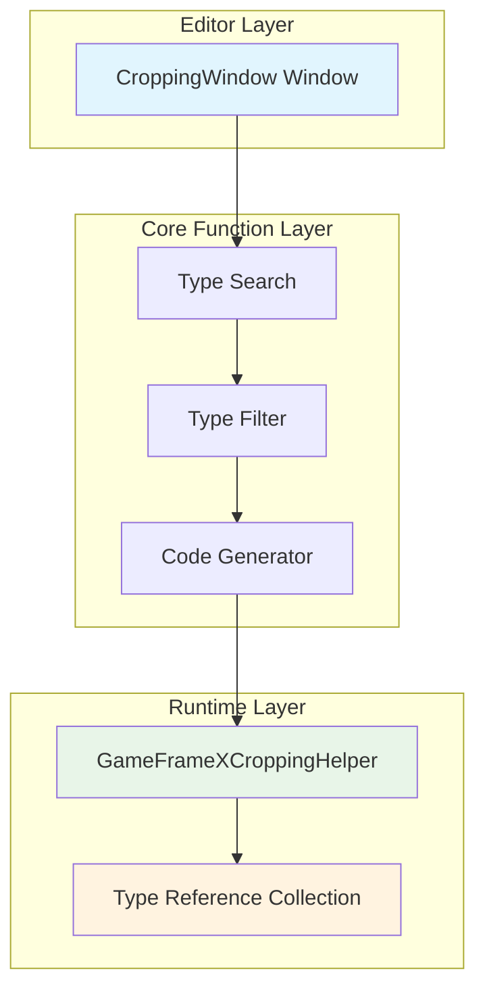
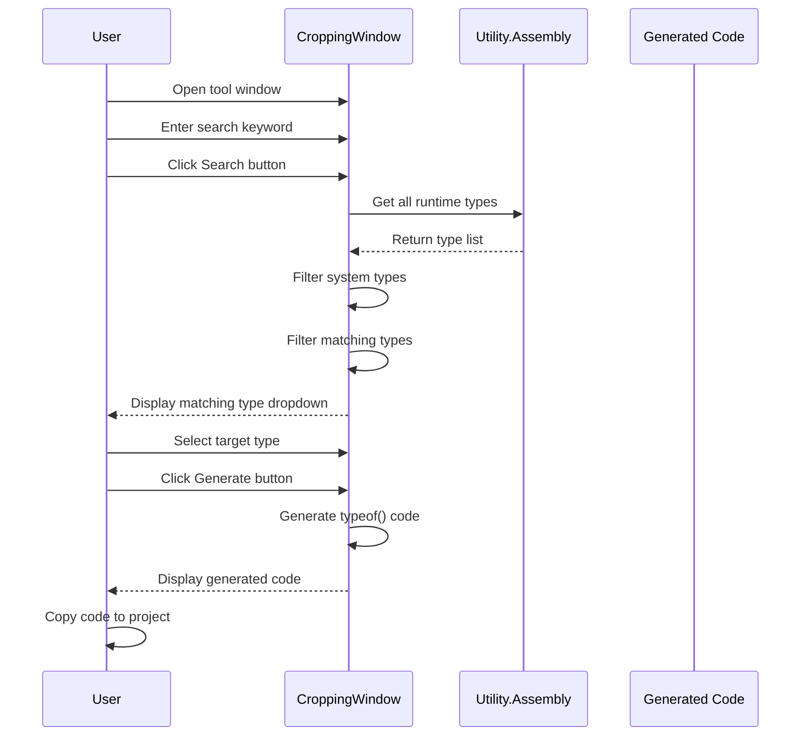

# Image Cropping Tool

The Image Cropping Tool (actually named "Anti-Stripping Code Generation Tool") is a Unity editor extension provided by GameFrameX, used to solve the problem of code being incorrectly stripped during IL2CPP builds.

## Overview

When building with IL2CPP in Unity projects, the compiler automatically strips code that is not directly referenced (called "code stripping"). However, when code is used through reflection or other dynamic means, these types may be incorrectly stripped, causing `MissingMethodException` or type resolution failures at runtime.

The image cropping tool solves this problem by:
1. Providing a visual interface to search for types in assemblies
2. Generating `typeof(TypeName)` code to maintain references to types
3. Adding the generated code to the project to prevent IL2CPP from stripping these types

## Architecture



### Core Components

| Component | File Path | Responsibility |
|-----------|-----------|----------------|
| CroppingWindow | `Editor/Cropping/CroppingWindow.cs` | Editor window UI, type search, code generation |
| GameFrameXCroppingHelper | `Runtime/GameFrameXCroppingHelper.cs` | Runtime type reference preservation template |

## Workflow



## Usage Guide

### Open Tool Window

Click `GameFrameX` → `Cropping(Prevent Stripping Code Generation)` in Unity editor menu bar to open the tool window.

```csharp
// Menu item definition
[MenuItem("GameFrameX/Cropping(Prevent Stripping Code Generation)", false, 2001)]
public static void ShowWindow()
{
    var window = GetWindow<CroppingWindow>("Cropping");
    window.minSize = new UnityEngine.Vector2(800, 600);
    window.maxSize = window.minSize;
    window.maximized = false;
    window.Show();
}
```
> Source: [CroppingWindow.cs](https://github.com/GameFrameX/com.gameframex.unity/blob/main/Editor/Cropping/CroppingWindow.cs#L45-L55)

### Search Types

1. Enter the type name keyword to search in the "Query Type" text box
2. Click the `Search` button
3. The tool will scan all runtime assemblies, excluding system types (UnityEngine, UnityEditor, System, etc.)
4. Select the type to process from the dropdown

```csharp
// Type search logic
string searchText = _searchText.ToLower();
var types = Utility.Assembly.GetTypes();
var result = new List<string>();
foreach (var type in types)
{
    var fullName = type.FullName.ToLower();
    var isFind = false;
    foreach (var ignoredType in _ignoredTypes)
    {
        if (fullName.Contains(ignoredType))
        {
            isFind = true;
            break;
        }
    }
    if (isFind) continue;

    if (fullName.Contains(searchText))
    {
        result.Add(type.FullName);
    }
}
```
> Source: [CroppingWindow.cs](https://github.com/GameFrameX/com.gameframex.unity/blob/main/Editor/Cropping/CroppingWindow.cs#L76-L102)

### Generate Anti-Stripping Code

1. Select the target type from the dropdown (usually select root namespace type of the assembly)
2. Click the `Generate` button
3. The tool will generate `typeof()` reference code for all types in that assembly
4. Copy the generated code to the project's `CroppingHelper.cs` file

```csharp
// Code generation logic
private void Generate(string targetTypeName)
{
    var targetType = Utility.Assembly.GetType(targetTypeName);
    if (targetType != null)
    {
        var types = targetType.Assembly.GetTypes();
        types = types.OrderBy(m => m.FullName).ToArray();
        StringBuilder stringBuilder = new StringBuilder();
        foreach (var type in types)
        {
            if (type.IsNestedPrivate) continue;
            if (type.FullName.Contains("PrivateImplementationDetails")) continue;

            stringBuilder.AppendLine(" _ = typeof(" + type.FullName.Replace("+", ".").Replace("`1", "<>").Replace("`2", "<,>") + ");");
        }
        _generatedText = stringBuilder.ToString();
    }
}
```
> Source: [CroppingWindow.cs](https://github.com/GameFrameX/com.gameframex.unity/blob/main/Editor/Cropping/CroppingWindow.cs#L136-L163)

### Use Generated Code

Copy the generated code to a script file in the Unity project:

```csharp
using UnityEngine;

namespace GameFrameX.Runtime
{
    public class GameFrameXCroppingHelper : MonoBehaviour
    {
        private void Start()
        {
            // Generated code example
            _ = typeof(GameFrameX.Runtime.SomeClass);
            _ = typeof(GameFrameX.Runtime.AnotherClass);
            // ... More types
        }
    }
}
```
> Source: [GameFrameXCroppingHelper.cs](https://github.com/GameFrameX/com.gameframex.unity/blob/main/Runtime/GameFrameXCroppingHelper.cs#L1-L10)

## Excluded System Types

The tool excludes types from the following assemblies by default to avoid generating unnecessary code:

| Exclusion Prefix | Description |
|------------------|-------------|
| unityengine | Unity core engine types |
| unityeditor | Unity editor types |
| mono | Mono runtime types |
| system | .NET System types |
| dnlib | Assembly parsing library |
| unity.hotfix | Hot update types |
| unity.baselib | Base library types |
| .editor | Editor related |
| jetbrains | JetBrains tool types |
| nunit | NUnit test framework |

```csharp
private readonly string[] _ignoredTypes = new string[] {
    "unityengine".ToLower(),
    "unityeditor".ToLower(),
    "mono".ToLower(),
    "system".ToLower(),
    "dnlib".ToLower(),
    "unity.hotfix".ToLower(),
    "unity.baselib".ToLower(),
    ".editor".ToLower(),
    "jetbrains".ToLower(),
    "nunit".ToLower()
};
```
> Source: [CroppingWindow.cs](https://github.com/GameFrameX/com.gameframex.unity/blob/main/Editor/Cropping/CroppingWindow.cs#L58)

## Common Usage Scenarios

### Scenario 1: Reflection Call Types

When using reflection to dynamically create objects or call methods:

```csharp
// This code may cause types to be stripped
var type = Type.GetType("GameFrameX.Runtime.DynamicClass");
var instance = Activator.CreateInstance(type);
```

### Scenario 2: JSON Serialization

When using JSON serialization libraries, type information may be lost:

```csharp
// Newtonsoft.Json or other serialization library
string json = JsonConvert.SerializeObject(someObject);
// Type needs to exist for deserialization
var obj = JsonConvert.DeserializeObject<DynamicType>(json);
```

### Scenario 3: Interface and Implementation Separation

When using dependency injection or factory pattern:

```csharp
// Load assembly through config file or reflection
var assembly = Assembly.Load("GameFrameX.Plugin");
var type = assembly.GetType("GameFrameX.Plugin.IPlugin");
```

## Configure Generated Code Template

The generated code will exclude the following types:

1. **Nested private types** (`IsNestedPrivate`) - Usually internal implementation details
2. **PrivateImplementationDetails** - Compiler-generated helper types

```csharp
foreach (var type in types)
{
    if (type.IsNestedPrivate)
    {
        continue;  // Skip nested private types
    }

    if (type.FullName.Contains("PrivateImplementationDetails"))
    {
        continue;  // Skip compiler-generated details
    }

    // Generate typeof() code
}
```
> Source: [CroppingWindow.cs](https://github.com/GameFrameX/com.gameframex.unity/blob/main/Editor/Cropping/CroppingWindow.cs#L147-L156)

## Related Links

- [Build Tools](./6-editor-tools.build-tools) - Unity project build automation tools
- [Package Management Tools](./6-editor-tools.package-management) - Unity package management tools
- [Inspector Tools](./6-editor-tools.inspector-tools) - Custom Inspector panel tools
- [Object Pool System](./5-runtime.object-pool) - Object pool management system
- [Reference Pool System](./5-runtime.reference-pool) - Reference pool management system