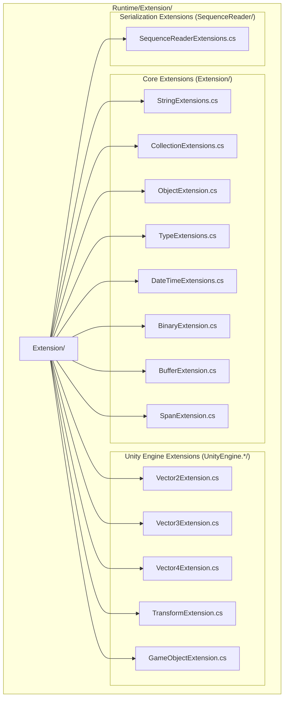

# Extension Methods Library

The GameFrameX Extension Methods Library provides a rich set of extension methods for .NET base types and Unity engine types, designed to simplify common programming tasks and improve development efficiency. All extension methods are marked with `[UnityEngine.Scripting.Preserve]` attribute to ensure they are not stripped during Unity builds.

## Overview

The extension methods library is one of the core base components of the GameFrameX framework, providing enhanced functionality for standard library types and Unity engine types. These extension methods follow C# extension method syntax conventions and are provided as static classes, available directly at any location that supports extension methods.

### Design Goals

The extension methods library follows these core principles:

1. **Simplify common operations**: Encapsulate complex operations into concise API calls
2. **Improve performance**: Provide performance-optimized versions for high-frequency operations (e.g., fast string comparison)
3. **Type safety**: Fully utilize generics and strong typing to ensure compile-time safety
4. **Unity compatibility**: All methods consider Unity platform-specific requirements

### Directory Structure

The extension methods library's source code organization structure is as follows:



## Core Function Categories

The extension methods library provides functions in the following main categories:

### 1. String Extension Methods

String extension methods provide fast comparison, format conversion, and encoding conversion for strings.

**Main Functions:**

- Fast string comparison: `EqualsFast`, `StartsWithFast`, `EndsWithFast` - Compare from string end, better performance than standard methods
- String encoding conversion: `ToBytes`, `ToByteArray`, `ToUtf8` - Support default encoding and UTF-8 encoding
- Hexadecimal conversion: `HexToBytes` - Convert hex string to byte array
- Null checks: `IsNullOrEmpty`, `IsNullOrWhiteSpace`, `IsNotNullOrEmpty`, `IsNotNullOrWhiteSpace`
- Formatting and cleaning: `Format`, `TrimEmpty`, `TrimZhCn` - Remove whitespace or Chinese characters
- Naming conversion: `ConvertToSnakeCase` - Convert camelCase to snake_case
- String splitting: `SplitToIntArray`, `SplitTo2IntArray` - Split string to integer array

```csharp
// Fast string comparison example
string str = "Hello World";
bool isMatch = str.EqualsFast("hello world"); // Returns false (case sensitive)
bool startsWithHello = str.StartsWithFast("Hello"); // Returns true
bool endsWithWorld = str.EndsWithFast("World"); // Returns true

// String to byte array
byte[] bytes = str.ToUtf8(); // UTF-8 encoding
byte[] defaultBytes = str.ToByteArray(); // Default encoding

// Hex string to byte array
string hex = "48656C6C6F";
byte[] hexBytes = hex.HexToBytes(); // [72, 101, 108, 108, 111]

// Null checks
string nullStr = null;
bool emptyCheck = nullStr.IsNullOrEmpty(); // true
bool whitespaceCheck = "   ".IsNullOrWhiteSpace(); // true
```
> Source: [StringExtensions.cs](https://github.com/GameFrameX/com.gameframex.unity/blob/main/Runtime/Extension/Extension/StringExtensions.cs#L31-L58)

### 2. Collection Extension Methods

Collection extension methods provide convenient operations for Dictionary, List, HashSet and other collection types.

**Main Functions:**

- Dictionary extensions:
  - `Merge` - Merge key-value pairs, support custom merge function
  - `GetOrAdd` - Get or add element, support default value and factory method
  - `RemoveIf` - Remove elements by condition
- List extensions:
  - `Shuffle` - Fisher-Yates shuffle algorithm to randomize list order
  - `RemoveIf` - Remove elements by condition
  - `ListToString` - Convert list to delimiter-separated string
- HashSet extensions:
  - `AddRange` - Batch add elements
- ICollection extensions:
  - `IsNullOrEmpty` - Check if collection is empty

```csharp
// Dictionary usage example
var dict = new Dictionary<string, int>();
dict.Merge("score", 100, (old, newVal) => old + newVal); // Merge values
int value = dict.GetOrAdd("newKey", k => 100); // Get or create

// List usage example
var list = new List<int> { 1, 2, 3, 4, 5 };
list.Shuffle(); // Random shuffle
list.RemoveIf(x => x > 3); // Remove elements greater than 3
string result = list.ListToString(","); // "1,2,3,"
```
> Source: [CollectionExtensions.cs](https://github.com/GameFrameX/com.gameframex.unity/blob/main/Runtime/Extension/Extension/CollectionExtensions.cs#L33-L77)

### 3. Object Extension Methods

Object extension methods provide null checks and validation for objects.

**Main Functions:**

- `IsNull` - Check if object is null
- `IsNotNull` - Check if object is not null
- `CheckNull` - Check if object is null, throw ArgumentNullException if null

```csharp
object obj = null;
bool isNull = obj.IsNull(); // true
bool isNotNull = obj.IsNotNull(); // false

object validObj = new object();
validObj.CheckNull("validObj"); // Does not throw exception
```
> Source: [ObjectExtension.cs](https://github.com/GameFrameX/com.gameframex.unity/blob/main/Runtime/Extension/Extension/ObjectExtension.cs#L18-L47)

### 4. Type Extension Methods

Type extension methods are used to check if a type implements a specific interface.

**Main Functions:**

- `IsImplWithInterface` - Check if type implements specified interface, supports checking direct implementation only or including inheritance chain

```csharp
// Check if type implements interface
Type type = typeof(List<string>);
bool implements = type.IsImplWithInterface(typeof(IEnumerable<object>), false); // true
bool directOnly = type.IsImplWithInterface(typeof(IList<string>), true); // true
```
> Source: [TypeExtensions.cs](https://github.com/GameFrameX/com.gameframex.unity/blob/main/Runtime/Extension/Extension/TypeExtensions.cs#L30-L58)

### 5. DateTime Extension Methods

DateTime extension methods provide date-related calculation functions.

**Main Functions:**

- `GetDaysFrom` - Calculate days difference from specified date to current date
- `GetDaysFromDefault` - Calculate days difference from January 1, 1970 to current date

```csharp
DateTime now = DateTime.Now;
int days = now.GetDaysFrom(new DateTime(2020, 1, 1)); // Days since January 1, 2020
int unixDays = now.GetDaysFromDefault(); // Days corresponding to Unix timestamp
```
> Source: [DateTimeExtensions.cs](https://github.com/GameFrameX/com.gameframex.unity/blob/main/Runtime/Extension/Extension/DateTimeExtensions.cs#L23-L40)

### 6. Binary Extension Methods

Binary extension methods provide 7-bit encoded integer and encrypted string read/write for BinaryReader and BinaryWriter.

**Main Functions:**

- 7-bit encoded integer read/write:
  - `Read7BitEncodedInt32` / `Write7BitEncodedInt32`
  - `Read7BitEncodedUInt32` / `Write7BitEncodedUInt32`
  - `Read7BitEncodedInt64` / `Write7BitEncodedInt64`
  - `Read7BitEncodedUInt64` / `Write7BitEncodedUInt64`
- Encrypted string read/write:
  - `ReadEncryptedString` - Read encrypted string
  - `WriteEncryptedString` - Write encrypted string

7-bit encoding is a variable-length encoding method used to save space during serialization; small integers occupy fewer bytes.

### 7. Buffer Extension Methods

Buffer extension methods provide typed read/write operations for byte arrays, supporting big-endian byte order (network byte order).

**Write Methods:**

- `WriteInt`, `WriteUInt`, `WriteShort`, `WriteUShort`
- `WriteLong`, `WriteFloat`, `WriteDouble`
- `WriteByte`, `WriteSByte`, `WriteBool`
- `WriteBytes`, `WriteBytesWithoutLength`, `WriteString`

**Read Methods:**

- `ReadInt`, `ReadUInt`, `ReadShort`, `ReadUShort`
- `ReadLong`, `ReadFloat`, `ReadDouble`
- `ReadByte`, `ReadSByte`, `ReadBool`
- `ReadBytes`, `ReadString`

**Conversion Methods:**

- `ToHex`, `ToHex(format)`, `ToHex(offset, count)` - Byte array to hex string
- `ToDefaultString`, `ToUtf8String` - Byte array to string

```csharp
byte[] buffer = new byte[1024];
int offset = 0;

// Write various types
buffer.WriteInt(12345, ref offset);
buffer.WriteFloat(3.14f, ref offset);
buffer.WriteString("Hello", ref offset);

// Read various types
offset = 0;
int intVal = buffer.ReadInt(ref offset);
float floatVal = buffer.ReadFloat(ref offset);
string strVal = buffer.ReadString(ref offset);

// Byte array to hex string
byte[] data = new byte[] { 0x48, 0x65, 0x6C, 0x6C, 0x6F };
string hex = data.ToHex(); // "48656C6C6F"
```
> Source: [BufferExtension.cs](https://github.com/GameFrameX/com.gameframex.unity/blob/main/Runtime/Extension/Extension/BufferExtension.cs#L90-L103)

### 8. Span Extension Methods

Span extension methods provide read/write operations similar to BufferExtension for `Span<byte>`, used in high-performance scenarios.

## Unity Engine Extensions

### 1. Vector Extension Methods

Vector extension methods provide conversion between vectors of different dimensions.

**Vector2 Extensions:**

- `ToVector3` - Convert to Vector3 (y component set to 0 or specified value)
- `ToVector4` - Convert to Vector4 (z, w components set to 0)
- `AsVector3` - Convert to Vector3 (z component set to 0)

**Vector3 Extensions:**

- `ToVector2` - Convert to Vector2 (take x, z components)
- `ToVector3(Vector3Int)` - Convert from Vector3Int
- `ToVector4` - Convert to Vector4 (w component set to 0)

**Vector4 Extensions:**

- `ToVector2` - Convert to Vector2 (take x, y components)
- `ToVector3` - Convert to Vector3 (take x, y, z components)

```csharp
Vector2 v2 = new Vector2(1, 2);
Vector3 v3 = v2.ToVector3(); // (1, 0, 2)
Vector3 v3WithY = v2.ToVector3(5); // (1, 5, 2)
Vector4 v4 = v2.ToVector4(); // (1, 2, 0, 0)

Vector3 v3 = new Vector3(1, 2, 3);
Vector2 v2FromV3 = v3.ToVector2(); // (1, 3)
```
> Source: [UnityEngine.Vector2Extension.cs](https://github.com/GameFrameX/com.gameframex.unity/blob/main/Runtime/Extension/UnityEngine.Vector2/UnityEngine.Vector2Extension.cs#L17-L35)

### 2. Transform Extension Methods

Transform extension methods provide convenient Transform component operations.

**Position Operations:**

- World position set: `SetPositionX`, `SetPositionY`, `SetPositionZ`
- World position add: `AddPositionX`, `AddPositionY`, `AddPositionZ`
- Local position set: `SetLocalPositionX`, `SetLocalPositionY`, `SetLocalPositionZ`
- Local position add: `AddLocalPositionX`, `AddLocalPositionY`, `AddLocalPositionZ`

**Scale Operations:**

- Scale set: `SetLocalScaleX`, `SetLocalScaleY`, `SetLocalScaleZ`
- Scale add: `AddLocalScaleX`, `AddLocalScaleY`, `AddLocalScaleZ`

**Other Operations:**

- `FindChildName` - Recursively find child node
- `LookAt2D` - Face target in 2D space
- `Reset` - Reset Transform (position, rotation, scale)
- `SetParentAndReset` - Set parent and reset

```csharp
Transform transform = someObject.transform;

// Set single coordinate component
transform.SetPositionX(5f);
transform.AddPositionY(2f);

// Set local coordinate
transform.SetLocalPositionZ(0f);

// Set scale
transform.SetLocalScaleX(2f);

// Find child node
Transform child = transform.FindChildName("ChildName");

// 2D look at
transform.LookAt2D(new Vector2(10, 5));

// Reset
transform.Reset();
```
> Source: [UnityEngine.TransformExtension.cs](https://github.com/GameFrameX/com.gameframex.unity/blob/main/Runtime/Extension/UnityEngine.Transform/UnityEngine.TransformExtension.cs#L55-L92)

### 3. GameObject and Component Extension Methods

GameObject and Component extension methods provide convenient operations for game objects and components.

**Component Operations:**

- `GetOrAddComponent<T>` - Get or add component
- `GetOrAddComponent(Type)` - Get or add specified type component
- `DestroyComponent<T>` - Destroy specified type component
- `DestroyComponent` - Destroy self component

**GameObject Operations:**

- `InScene` - Check if GameObject is in scene
- `SetLayerRecursively` - Recursively set game object and its children's layer

```csharp
GameObject go = someGameObject;

// Get or add component
Rigidbody rb = go.GetOrAddComponent<Rigidbody>();
AudioSource audio = go.GetOrAddComponent<AudioSource>();

// Destroy component
go.DestroyComponent<Rigidbody>();

// Check if in scene
bool inScene = go.InScene(); // true means in scene, false means prefab

// Recursively set layer
go.SetLayerRecursively(LayerMask.NameToLayer("UI"));
```
> Source: [UnityEngage.GameObjectExtension.cs](https://github.com/GameFrameX/com.gameframex.unity/blob/main/Runtime/Extension/UnityEngage.GameObject/UnityEngage.GameObjectExtension.cs#L60-L90)

## Usage Examples

### Comprehensive Example

The following example shows how to use the extension methods library in actual projects:

```csharp
using GameFrameX.Runtime;
using UnityEngine;
using System.Collections.Generic;

public class ExtensionMethodDemo : MonoBehaviour
{
    void Start()
    {
        // String operations
        string json = "{\"name\":\"Player\",\"score\":100}";
        if (json.IsNotNullOrWhiteSpace())
        {
            Debug.Log($"JSON valid, length: {json.ToUtf8().Length}");
        }

        // Collection operations
        var scores = new Dictionary<string, int>
        {
            { "Player1", 100 },
            { "Player2", 200 }
        };

        // Merge scores
        scores.Merge("Player1", 50, (old, newVal) => old + newVal);

        // Get or add new player
        int player3Score = scores.GetOrAdd("Player3", k => 0);

        // Unity object operations
        var child = transform.FindChildName("HealthBar");
        child?.SetPositionX(0);

        // Get or add component
        var animator = gameObject.GetOrAddComponent<Animator>();

        // List operations
        var items = new List<string> { "Sword", "Shield", "Potion" };
        items.Shuffle(); // Random sort
        Debug.Log(items.ListToString(", "));
    }
}
```

## Performance Optimization Notes

The extension methods library contains several performance-optimized versions of methods:

1. **Fast string comparison**: `EqualsFast`, `StartsWithFast`, `EndsWithFast` methods compare from the end of the string, which may provide better performance when comparing strings with common suffixes/prefixes.

2. **Buffer direct operations**: Using `Span<T>` and unsafe pointer operations to avoid boundary checks, providing near-native performance.

3. **7-bit encoded integers**: Uses variable-length encoding for integers, small integers occupy fewer bytes, suitable for scenarios with many integer serializations.

## Related Links

- [Base Components](./5-runtime.base) - GameFrameX base component system
- [Helper Classes](./5-runtime.helper-classes) - Helper utility classes
- [Utility Classes](./5-runtime.utility-classes) - Utility class collection
- [GitHub Repository](https://github.com/GameFrameX/com.gameframex.unity)