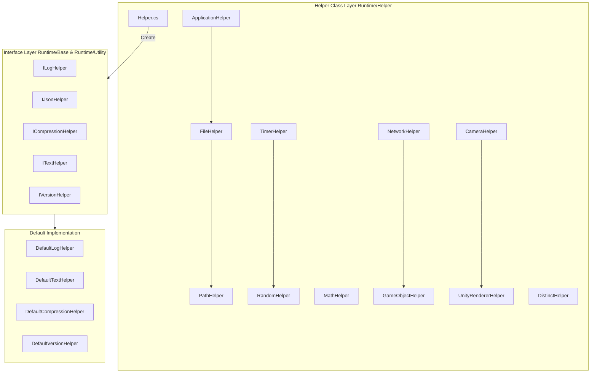

# Helper Classes

The GameFrameX framework provides a module of helper classes covering practical utility methods in areas such as application, file, path, math, random number, timer, network, game object, camera, rendering, and more.

## Overview

Helper classes are the basic utility layer of the GameFrameX framework, providing developers with commonly used static utility methods for daily development. These helper classes are carefully designed to encapsulate common operations in Unity development and general programming in a unified and convenient way, allowing developers to focus more on implementing business logic.

### Design Goals

The GameFrameX helper class system follows these principles:

1. **Unified entry point**: Provides a unified helper creation mechanism through the `Helper` factory class
2. **Platform adaptation**: Automatically handles differences across different Unity platforms (Editor, Windows, Mac, Android, iOS, WebGL, etc.)
3. **Performance optimization**: Uses mechanisms like `ThreadLocalRandom` to ensure thread safety
4. **Extensibility**: Supports custom implementations through interfaces (such as `ILogHelper`, `IJsonHelper`)

### Helper Class Categories

GameFrameX's helper classes can be divided into the following categories:

| Category | Helper Class | Description |
|----------|--------------|-------------|
| Application | `ApplicationHelper` | Platform detection, app control, URL opening |
| File/Path | `FileHelper`, `PathHelper` | File read/write, directory operations, path joining |
| Math | `MathHelper`, `PositionHelper` | Rectangle intersection detection, position calculation |
| Random | `RandomHelper` | Various random number generation methods |
| Timer | `TimerHelper` | Unix timestamp, local time, server time synchronization |
| Network | `NetworkHelper` | Network reachability detection, WiFi/mobile network detection |
| GameObject | `GameObjectHelper` | GameObject creation, destruction, search |
| Rendering | `CameraHelper`, `UnityRendererHelper` | Screenshot capture, renderer visibility detection |
| Data Processing | `DistinctHelper`, `NewtonsoftJsonHelper`, `ZipHelper` | Deduplication, JSON serialization, compression |

## Architecture

GameFrameX helper classes adopt a layered architecture design, with core components including static utility classes and replaceable interface implementations.



### Core Component Description

#### Helper.cs - Helper Factory

`Helper.cs` is the core factory class for the entire helper class system, providing a MonoBehaviour-based helper creation mechanism.

> Source: [Helper.cs](https://github.com/GameFrameX/com.gameframex.unity/blob/main/Runtime/Helper/Helper.cs#L44-L155)

```csharp
public static T CreateHelper<T>(string helperTypeName, T customHelper) where T : MonoBehaviour
{
    return CreateHelper(helperTypeName, customHelper, 0);
}

public static T CreateHelper<T>(string helperTypeName, T customHelper, int index) where T : MonoBehaviour
{
    // Create instance based on type name or custom helper
}
```

**Design Intent**: Allows developers to dynamically replace default implementations at runtime through the factory pattern, improving framework extensibility.

#### Static Utility Classes

All static helper classes are marked with `[UnityEngine.Scripting.Preserve]` attribute to ensure they are not removed during code stripping (IL2CPP).

## Core Function Details

### Application Layer Helper

`ApplicationHelper` provides platform detection and application control functionality, important tools for developing cross-platform games.

> Source: [ApplicationHelper.cs](https://github.com/GameFrameX/com.gameframex.unity/blob/main/Runtime/Helper/ApplicationHelper.cs#L1-L305)

```csharp
// Platform detection
public static bool IsEditor => ...;
public static bool IsAndroid => ...;
public static bool IsIOS => ...;
public static bool IsWebGL => ...;
public static bool IsWindows => ...;
public static bool IsMacOsx => ...;
public static bool IsLinux => ...;

// Mini-game platform detection
public static bool IsWebGLWeChatMiniGame => ...;
public static bool IsWebGLDouYinMiniGame => ...;

// App control
public static void Quit() => ...;
public static void OpenURL(string url) => ...;
public static void OpenSetting() => ...;
```

### File Operation Helper

`FileHelper` provides cross-platform file read/write operations, automatically handling issues with reading Android APK resources.

> Source: [FileHelper.cs](https://github.com/GameFrameX/com.gameframex.unity/blob/main/Runtime/Helper/FileHelper.cs#L16-L357)

```csharp
// File reading
public static byte[] ReadAllBytes(string path) => ...;
public static string ReadAllText(string path) => ...;
public static string[] ReadAllLines(string path) => ...;

// File writing
public static void WriteAllBytes(string path, byte[] buffer) => ...;
public static void WriteAllText(string path, string content) => ...;
public static void WriteAllLines(string path, string[] lines) => ...;

// File operations
public static void Copy(string sourceFileName, string destFileName, bool overwrite = false) => ...;
public static void Delete(string path) => ...;
public static void Move(string sourceFileName, string destFileName) => ...;
public static bool IsExists(string path) => ...;

// Directory operations
public static void GetAllFiles(List<string> files, string dir) => ...;
public static void CleanDirectory(string dir) => ...;
public static void CopyDirectory(string srcDir, string targetDir) => ...;
```

**Design Intent**: Unifies cross-platform file operation interface, automatically handling special cases of Android StreamingAssets read-only paths.

### Path Helper

`PathHelper` provides path normalization and joining functionality.

> Source: [PathHelper.cs](https://github.com/GameFrameX/com.gameframex.unity/blob/main/Runtime/Helper/PathHelper.cs#L14-L130)

```csharp
// Common paths
public static string AppHotfixResPath => ...;  // Hot update resource path
public static string AppResPath => ...;        // StreamingAssets path
public static string AppResPath4Web => ...;   // Web request specific path

// Path operations
public static string NormalizePath(string path) => ...;
public static string Combine(params string[] paths) => ...;
```

### Timer Helper

`TimerHelper` provides complete time processing functionality, including Unix timestamp conversion, server time synchronization, etc.

> Source: [TimerHelper.cs](https://github.com/GameFrameX/com.gameframex.unity/blob/main/Runtime/Helper/TimerHelper.cs#L36-L525)

```csharp
// Timestamp acquisition
public static long UnixTimeSeconds() => ...;
public static long UnixTimeMilliseconds() => ...;
public static long NowTimeSeconds() => ...;
public static long NowTimeMilliseconds() => ...;

// Client/server time
public static long ClientNow() => ...;
public static long ClientNowSeconds() => ...;
public static long ServerNow() => ...;

// Time conversion
public static long LocalTimeToUnixTimeSeconds(DateTime time) => ...;
public static long LocalTimeToUnixTimeMilliseconds(DateTime time) => ...;
public static DateTime UtcToLocalDateTime(long utcTimestamp) => ...;
public static DateTime UtcToUtcDateTime(long utcTimestamp) => ...;

// Server time synchronization
public static void SetDifferenceTime(long timeSpan) => ...;
public static void SetDifferenceTime(DateTime serverTime, bool isUtc = false) => ...;
```

### Random Number Helper

`RandomHelper` provides thread-safe random number generation.

> Source: [RandomHelper.cs](https://github.com/GameFrameX/com.gameframex.unity/blob/main/Runtime/Helper/RandomHelper.cs#L12-L80)

```csharp
// Random number generation
public static void SetSeed(int seed) => ...;
public static int Next(int lower, int upper) => ...;
public static float Next() => ...;
public static long NextInt64() => ...;
public static ulong NextUInt64() => ...;
```

### Math Helper

`MathHelper` provides rectangle intersection detection and other functions.

> Source: [MathHelper.cs](https://github.com/GameFrameX/com.gameframex.unity/blob/main/Runtime/Helper/MathHelper.cs#L13-L148)

```csharp
// Rectangle intersection detection
public static bool CheckIntersect(RectInt src, RectInt target) => ...;
public static bool CheckIntersect(int x1, int y1, int w1, int h1, int x2, int y2, int w2, int h2) => ...;
public static bool CheckIntersectPoints(int x1, int y1, int w1, int h1, int x2, int y2, int w2, int h2, int[] intersectPoints) => ...;
```

### Network Helper

`NetworkHelper` provides network state detection.

> Source: [NetworkHelper.cs](https://github.com/GameFrameX/com.gameframex.unity/blob/main/Runtime/Helper/NetworkHelper.cs#L14-L77)

```csharp
// Network state detection
public static string[] GetAddressIPs() => ...;
public static bool IsReachable() => ...;
public static bool IsWifi() => ...;
public static bool IsViaCarrierData() => ...;
```

### GameObject Helper

`GameObjectHelper` provides GameObject creation, destruction, search and other operations.

> Source: [GameObjectHelper.cs](https://github.com/GameFrameX/com.gameframex.unity/blob/main/Runtime/Helper/GameObjectHelper.cs#L14-L213)

```csharp
// Create
public static GameObject Create(Transform parent, string name) => ...;
public static GameObject Create(GameObject parent, string name) => ...;

// Destroy
public static void Destroy(GameObject gameObject) => ...;
public static void DestroyObject(this GameObject gameObject) => ...;
public static void DestroyComponent(Component component) => ...;

// Find
public static GameObject FindChildGamObjectByName(string nodeName, string sceneName = null) => ...;
public static GameObject FindChildGamObjectByName(GameObject gameObject, string name) => ...;

// Transform operations
public static void RemoveChildren(GameObject go) => ...;
public static void ResetTransform(GameObject gameObject) => ...;

// Layer settings
public static void SetLayer(GameObject gameObject, int layer, bool children = true) => ...;
public static void SetSortingGroupLayer(GameObject gameObject, string sortingLayer) => ...;
```

### Rendering Helper

`CameraHelper` and `UnityRendererHelper` provide screenshot capture and renderer visibility detection.

> Source: [CameraHelper.cs](https://github.com/GameFrameX/com.gameframex.unity/blob/main/Runtime/Helper/CameraHelper.cs#L14-L47)

```csharp
// Screenshot capture
public static Texture2D GetCaptureScreenshot(Camera main, float scale = 0.5f) => ...;
```

> Source: [UnityRendererHelper.cs](https://github.com/GameFrameX/com.gameframex.unity/blob/main/Runtime/Helper/UnityRendererHelper.cs#L12-L42)

```csharp
// Visibility detection
public static bool IsVisibleFrom(Renderer renderer, Camera camera) => ...;
public static bool IsVisibleFrom(MeshRenderer renderer, Camera camera) => ...;
```

### Data Processing Helper

`DistinctHelper` provides key-based collection deduplication functionality.

> Source: [DistinctHelper.cs](https://github.com/GameFrameX/com.gameframex.unity/blob/main/Runtime/Helper/DistinctHelper.cs#L13-L39)

```csharp
// Deduplication
public static IEnumerable<TSource> DistinctBy<TSource, TKey>(
    this IEnumerable<TSource> source,
    Func<TSource, TKey> keySelector) => ...;
```

## Usage Examples

### Platform Detection and Adaptation

```csharp
using GameFrameX.Runtime;

// Detect current platform
if (ApplicationHelper.IsAndroid)
{
    Debug.Log("Running on Android platform");
}
else if (ApplicationHelper.IsIOS)
{
    Debug.Log("Running on iOS platform");
}
else if (ApplicationHelper.IsWebGL)
{
    Debug.Log("Running on WebGL platform");
}

// Detect mini-game platform
if (ApplicationHelper.IsWebGLWeChatMiniGame)
{
    Debug.Log("Running on WeChat mini-game platform");
}

// Get platform name
string platform = ApplicationHelper.PlatformName;
```

### File Read/Write Operations

```csharp
using GameFrameX.Runtime;

// Read file
string content = FileHelper.ReadAllText("path/to/file.txt");
byte[] data = FileHelper.ReadAllBytes("path/to/file.bin");
string[] lines = FileHelper.ReadAllLines("path/to/file.txt");

// Write file
FileHelper.WriteAllText("path/to/output.txt", "Hello World");
FileHelper.WriteAllBytes("path/to/output.bin", data);

// Check if file exists
if (FileHelper.IsExists("path/to/file.txt"))
{
    Debug.Log("File exists");
}
```

### Timestamp Processing

```csharp
using GameFrameX.Runtime;

// Get current timestamp
long unixSeconds = TimerHelper.UnixTimeSeconds();
long unixMillis = TimerHelper.UnixTimeMilliseconds();

// Timestamp conversion
DateTime dateTime = TimerHelper.UtcToLocalDateTime(1699999999);
long timestamp = TimerHelper.LocalTimeToUnixTimeSeconds(DateTime.Now);

// Server time synchronization (call after getting time from server)
TimerHelper.SetDifferenceTime(serverTimestamp);

// Get server time
long serverTime = TimerHelper.ServerNow();
DateTime serverDateTime = TimerHelper.ServerToday();
```

### GameObject Operations

```csharp
using GameFrameX.Runtime;

// Create GameObject
GameObject parent = someParent;
GameObject newObj = GameObjectHelper.Create(parent, "NewObject");

// Reset transform
GameObjectHelper.ResetTransform(newObj);

// Set layer
GameObjectHelper.SetLayer(newObj, LayerMask.NameToLayer("UI"), true);

// Find child object
GameObject child = GameObjectHelper.FindChildGamObjectByName(parent, "ChildName");

// Destroy children
GameObjectHelper.RemoveChildren(parent);
```

### Renderer Visibility Detection

```csharp
using GameFrameX.Runtime;

// Check if object is within camera view
Camera mainCamera = Camera.main;
Renderer[] renderers = FindObjectsOfType<Renderer>();

foreach (var renderer in renderers)
{
    if (UnityRendererHelper.IsVisibleFrom(renderer, mainCamera))
    {
        Debug.Log("Object is within camera view");
    }
}
```

### Screenshot Capture

```csharp
using GameFrameX.Runtime;

// Capture screenshot
Texture2D screenshot = CameraHelper.GetCaptureScreenshot(Camera.main, 0.5f);

// Save screenshot
byte[] pngData = screenshot.EncodeToPNG();
FileHelper.WriteAllBytes(Application.persistentDataPath + "/screenshot.png", pngData);
```

### Collection Deduplication

```csharp
using GameFrameX.Runtime;

// Deduplicate based on specific key
var list = new List<Player>();
list.Add(new Player { Id = 1, Name = "Alice" });
list.Add(new Player { Id = 1, Name = "Alice" });
list.Add(new Player { Id = 2, Name = "Bob" });

// Deduplicate by Id
var distinctList = list.DistinctBy(p => p.Id).ToList();
```

## API Reference

### Helper

#### `CreateHelper<T>(string helperTypeName, T customHelper): T`

Create helper instance.

**Parameters:**
- `helperTypeName` (string): Helper type name
- `customHelper` (T): Custom helper instance

**Returns:** Created helper instance

### ApplicationHelper

| Method/Property | Return Type | Description |
|----------------|-------------|-------------|
| `IsEditor` | `bool` | Whether running in Unity editor |
| `IsAndroid` | `bool` | Whether running on Android platform |
| `IsIOS` | `bool` | Whether running on iOS platform |
| `IsWebGL` | `bool` | Whether running on WebGL platform |
| `IsWindows` | `bool` | Whether running on Windows platform |
| `PlatformName` | `string` | Get current platform name |
| `Quit()` | `void` | Quit application |
| `OpenURL(string url)` | `void` | Open specified URL |

### FileHelper

| Method | Description |
|--------|-------------|
| `ReadAllBytes(string path)` | Read file as byte array |
| `ReadAllText(string path)` | Read file as text content |
| `WriteAllBytes(string path, byte[] buffer)` | Write byte array |
| `WriteAllText(string path, string content)` | Write text content |
| `Copy(string source, string dest, bool overwrite)` | Copy file |
| `Delete(string path)` | Delete file |
| `IsExists(string path)` | Check if file exists |
| `GetAllFiles(List<string> files, string dir)` | Get all files in directory |
| `CleanDirectory(string dir)` | Clean directory |

### TimerHelper

| Method | Description |
|--------|-------------|
| `UnixTimeSeconds()` | Get current UTC Unix timestamp (seconds) |
| `UnixTimeMilliseconds()` | Get current UTC Unix timestamp (milliseconds) |
| `ServerNow()` | Get server current time |
| `ClientNow()` | Get client current time (milliseconds) |
| `UtcToLocalDateTime(long timestamp)` | Convert UTC timestamp to local time |
| `SetDifferenceTime(long timeSpan)` | Set server time difference |

### RandomHelper

| Method | Description |
|--------|-------------|
| `SetSeed(int seed)` | Set random seed |
| `Next(int lower, int upper)` | Get random integer in specified range |
| `Next()` | Get random float between 0-1 |
| `NextInt64()` | Get random Int64 range number |

### GameObjectHelper

| Method | Description |
|--------|-------------|
| `Create(Transform parent, string name)` | Create GameObject |
| `Destroy(GameObject gameObject)` | Destroy GameObject |
| `FindChildGamObjectByName(string name)` | Find child object by name |
| `RemoveChildren(GameObject go)` | Destroy all children |
| `ResetTransform(GameObject gameObject)` | Reset transform component |
| `SetLayer(GameObject gameObject, int layer, bool children)` | Set layer |

### MathHelper

| Method | Description |
|--------|-------------|
| `CheckIntersect(RectInt src, RectInt target)` | Detect rectangle intersection |
| `CheckIntersect(int x1, int y1, int w1, int h1, int x2, int y2, int w2, int h2)` | Detect rectangle intersection (parameter form) |

### NetworkHelper

| Method | Description |
|--------|-------------|
| `IsReachable()` | Detect if network is available |
| `IsWifi()` | Whether connected via WiFi |
| `IsViaCarrierData()` | Whether connected via mobile data |
| `GetAddressIPs()` | Get local IP address list |

### CameraHelper

| Method | Description |
|--------|-------------|
| `GetCaptureScreenshot(Camera main, float scale)` | Capture camera screenshot |

### UnityRendererHelper

| Method | Description |
|--------|-------------|
| `IsVisibleFrom(Renderer renderer, Camera camera)` | Detect if renderer is within camera view |

### DistinctHelper

| Method | Description |
|--------|-------------|
| `DistinctBy<TSource, TKey>(IEnumerable, Func)` | Deduplicate based on key selector |

## Related Links

- [Extension Methods Library](./5-runtime.extension-methods) - Learn more about extension methods
- [Utility Classes](./5-runtime.utility-classes) - Framework core utility classes
- [Base Components](./5-runtime.base) - Framework core components
- [Event System](./5-runtime.event-system) - Framework event mechanism