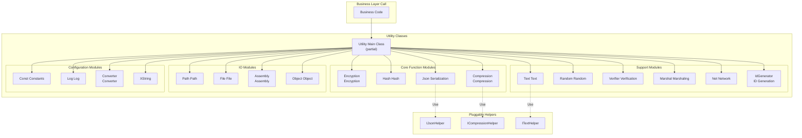

# Utility Classes

GameFrameX framework provides a core set of static utility functions covering encryption/decryption, hash calculation, JSON serialization, compression/decompression, string processing, random number generation, data verification, network operations, ID generation, and other commonly used functions.

## Overview

Utility classes are the infrastructure layer of the GameFrameX framework, providing low-level technical support for upper-layer business logic. These utility classes use **static class design**, can be called directly without instantiation, greatly simplifying daily development work.

### Design Philosophy

1. **Stateless utility methods**: All methods are stateless static methods, safely callable in parallel
2. **Extensible architecture**: Key functions use Helper plug-in mechanism, supporting user custom implementations
3. **Partial Class organization**: Uses C# partial class feature to distribute code by functional modules across multiple files, improving maintainability

### Module Categories

Utility classes cover the following functional areas:

| Category | Description |
|----------|-------------|
| Encryption module | XOR encryption |
| Hash module | MD5, SHA1, SHA256, HMAC-SHA256, MurmurHash3, XxHash |
| Data format | JSON serialization/deserialization, compression/decompression |
| Text processing | String formatting, type conversion, extended strings |
| Verification module | CRC32, CRC64 checksum calculation |
| Random number | Random integer, float, byte array generation |
| System operations | Struct marshaling, network port/IP operations, unique ID generation |
| Input/Output | Path processing, file operations |
| Reflection operations | Assembly loading, object operations |

## Architecture



## Core Function Details

### Encryption Module

Provides XOR encryption functionality, suitable for lightweight data obfuscation scenarios.

```csharp
// XOR encryption example
byte[] originalData = new byte[] { 0x01, 0x02, 0x03, 0x04 };
byte[] key = new byte[] { 0xAA, 0xBB, 0xCC, 0xDD };

// Encrypt
byte[] encrypted = Utility.Encryption.GetXorBytes(originalData, key);

// Decrypt (XOR encryption is symmetric)
byte[] decrypted = Utility.Encryption.GetXorBytes(encrypted, key);
```
> Source: [Utility.Encryption.cs](https://github.com/GameFrameX/com.gameframex.unity/blob/main/Runtime/Utility/Utility.Encryption.cs#L82-L90)

### Hash Module

Supports multiple hash algorithms for data integrity verification and password storage:

- **MD5**: 128-bit hash value, suitable for file integrity verification
- **SHA1**: 160-bit hash value
- **SHA256**: 256-bit hash value, higher security factor
- **HMAC-SHA256**: Keyed hash, used for message authentication
- **MurmurHash3**: High-performance non-cryptographic hash
- **XxHash**: Extremely high-performance non-cryptographic hash

```csharp
// Calculate MD5 hash of string
string input = "Hello GameFrameX";
string md5Hash = Utility.Hash.MD5.Hash(input);

// Verify hash value
bool isValid = Utility.Hash.MD5.IsVerify(input, md5Hash);

// Calculate file MD5
string fileHash = Utility.Hash.MD5.FileHash("path/to/file");
```
> Source: [Utility.Hash.Md5.cs](https://github.com/GameFrameX/com.gameframex.unity/blob/main/Runtime/Utility/Utility.Hash.Md5.cs#L38-L42)

### JSON Module

Provides JSON serialization and deserialization functionality, supporting pluggable Helper implementations:

```csharp
// Set custom JSON Helper
Utility.Json.SetJsonHelper(new NewtonsoftJsonHelper());

// Serialize object to JSON
var user = new User { Name = "Zhang San", Age = 25 };
string json = Utility.Json.ToJson(user);

// Deserialize JSON to object
var user2 = Utility.Json.ToObject<User>(json);

// Deserialize to specified type
object obj = Utility.Json.ToObject(typeof(User), json);
```
> Source: [Utility.Json.cs](https://github.com/GameFrameX/com.gameframex.unity/blob/main/Runtime/Utility/Utility.Json.cs#L68-L88)

### Compression Module

Provides data compression and decompression functionality:

```csharp
// Set compression Helper
Utility.Compression.SetCompressionHelper(new DefaultCompressionHelper());

// Compress byte array
byte[] originalData = File.ReadAllBytes("data.bin");
byte[] compressed = Utility.Compression.Compress(originalData);

// Decompress
byte[] decompressed = Utility.Compression.Decompress(compressed);

// Compress stream
using (var inputStream = File.OpenRead("data.bin"))
using (var outputStream = new MemoryStream())
{
    Utility.Compression.Compress(inputStream, outputStream);
}
```
> Source: [Utility.Compression.cs](https://github.com/GameFrameX/com.gameframex.unity/blob/main/Runtime/Utility/Utility.Compression.cs#L67-L75)

### Text Module

Provides safe string formatting functionality, supporting formatting with up to 16 parameters:

```csharp
// Basic formatting
string result = Utility.Text.Format("Hello {0}, you have {1} messages", "Zhang San", 5);

// Multi-parameter formatting
string result2 = Utility.Text.Format(
    "Name: {0}, Age: {1}, Score: {2}, Rank: {3}",
    "Li Si", 25, 98.5, "A"
);

// Set custom Text Helper
Utility.Text.SetTextHelper(new DefaultTextHelper());
```
> Source: [Utility.Text.cs](https://github.com/GameFrameX/com.gameframex.unity/blob/main/Runtime/Utility/Utility.Text.cs#L68-L81)

### Random Number Module

Provides high-quality random number generation:

```csharp
// Set random seed
Utility.Random.SetSeed(12345);

// Generate random number between 0 and Int32.MaxValue
int rand1 = Utility.Random.GetRandom();

// Generate random number between 0 and 100 (excluding 100)
int rand2 = Utility.Random.GetRandom(100);

// Generate random number between 50 and 100
int rand3 = Utility.Random.GetRandom(50, 100);

// Generate random float between 0.0 and 1.0
double randFloat = Utility.Random.GetRandomDouble();

// Generate random byte array
byte[] buffer = new byte[16];
Utility.Random.GetRandomBytes(buffer);
```
> Source: [Utility.Random.cs](https://github.com/GameFrameX/com.gameframex.unity/blob/main/Runtime/Utility/Utility.Random.cs#L71-L103)

### Verifier Module

Provides CRC32/CRC64 checksum calculation for data integrity verification:

```csharp
// Calculate CRC32 of byte array
byte[] data = new byte[] { 0x01, 0x02, 0x03, 0x04 };
int crc32 = Utility.Verifier.GetCrc32(data);

// Calculate CRC32 of stream
using (var stream = File.OpenRead("data.bin"))
{
    int crc = Utility.Verifier.GetCrc32(stream);
}

// Calculate CRC64
ulong crc64 = Utility.Verifier.GetCrc64(data);

// CRC32 byte array conversion
byte[] crcBytes = Utility.Verifier.GetCrc32Bytes(crc32);
```
> Source: [Utility.Verifier.cs](https://github.com/GameFrameX/com.gameframex.unity/blob/main/Runtime/Utility/Utility.Verifier.cs#L95-L103)

### Net Module

Provides network operation utility functions:

```csharp
// Get first available port
int availablePort = Utility.Net.GetFirstAvailablePort(8000, 9000);

// Check if port is available
bool isAvailable = Utility.Net.PortIsAvailable(8080);

// Get list of used ports
List<int> usedPorts = Utility.Net.PortIsUsed();

// Get local IP address
string localIP = Utility.Net.GetIP();

// Get IPv4 address of domain
string ipv4 = Utility.Net.GetHostIPv4("example.com");

// Get IPv6 address of domain
string ipv6 = Utility.Net.GetHostIPv6("example.com");
```
> Source: [Utility.Net.cs](https://github.com/GameFrameX/com.gameframex.unity/blob/main/Runtime/Utility/Utility.Net.cs#L145-L158)

### ID Generation Module

Provides distributed unique ID generation functionality, using timestamp + counter strategy:

```csharp
// Generate unique long type ID
long uniqueId = Utility.IdGenerator.GetNextUniqueId();

// Generate unique int type ID
int uniqueIntId = Utility.IdGenerator.GetNextUniqueIntId();

// Time base: January 1, 2020 UTC
DateTime startTime = Utility.IdGenerator.UtcTimeStart;
```
> Source: [Utility.IdGenerator.cs](https://github.com/GameFrameX/com.gameframex.unity/blob/main/Runtime/Utility/Utility.IdGenerator.cs#L45-L49)

### Marshal Module

Provides conversion between structs and byte arrays, used for low-level data processing:

```csharp
// Define struct
[StructLayout(LayoutKind.Sequential)]
public struct PlayerData
{
    public int Id;
    public int Level;
    public long Experience;
}

// Struct to byte array
PlayerData player = new PlayerData { Id = 1, Level = 10, Experience = 5000 };
byte[] bytes = Utility.Marshal.StructureToBytes(player);

// Byte array to struct
PlayerData player2 = Utility.Marshal.BytesToStructure<PlayerData>(bytes);

// Cache management
Utility.Marshal.EnsureCachedHGlobalSize(4096);
Utility.Marshal.FreeCachedHGlobal();
```
> Source: [Utility.Marshal.cs](https://github.com/GameFrameX/com.gameframex.unity/blob/main/Runtime/Utility/Utility.Marshal.cs#L102-L105)

## Usage Examples

### Comprehensive Usage Example

The following example shows how to use Utility classes in actual projects:

```csharp
using GameFrameX.Runtime;

// 1. Initialize Helpers (optional, if custom implementation needed)
Utility.Json.SetJsonHelper(new NewtonsoftJsonHelper());
Utility.Compression.SetCompressionHelper(new DefaultCompressionHelper());
Utility.Text.SetTextHelper(new DefaultTextHelper());

// 2. Data processing flow
public class DataProcessor
{
    public void ProcessData(byte[] rawData)
    {
        // Calculate CRC32 checksum
        int crc = Utility.Verifier.GetCrc32(rawData);
        Console.WriteLine($"CRC32: {crc}");

        // Calculate MD5 hash
        string md5 = Utility.Hash.MD5.Hash(rawData.ToString());

        // Compress data
        byte[] compressed = Utility.Compression.Compress(rawData);

        // Generate unique ID
        long dataId = Utility.IdGenerator.GetNextUniqueId();

        // Serialize to JSON
        var dataInfo = new
        {
            Id = dataId,
            Crc = crc,
            Md5 = md5,
            Size = compressed.Length
        };
        string json = Utility.Json.ToJson(dataInfo);

        // Format output
        string message = Utility.Text.Format(
            "Data processing complete - ID: {0}, CRC: {1}, Compressed size: {2} bytes",
            dataId, crc, compressed.Length
        );
    }
}
```

### Common Game Development Scenarios

```csharp
// Scenario 1: Resource version verification
public bool VerifyResource(string filePath, string expectedHash)
{
    string actualHash = Utility.Hash.MD5.FileHash(filePath);
    return Utility.Hash.MD5.IsVerify(expectedHash, actualHash);
}

// Scenario 2: Encrypted config data storage
public void SaveEncryptedConfig(byte[] configData, byte[] key)
{
    byte[] encrypted = Utility.Encryption.GetXorBytes(configData, key);
    byte[] compressed = Utility.Compression.Compress(encrypted);
    File.WriteAllBytes("config.dat", compressed);
}

// Scenario 3: Randomly generate game items
public Item GenerateRandomItem()
{
    int itemType = Utility.Random.GetRandom(1, 100);
    int itemLevel = Utility.Random.GetRandom(1, 10);
    long itemId = Utility.IdGenerator.GetNextUniqueId();

    return new Item
    {
        Id = itemId,
        Type = itemType,
        Level = itemLevel
    };
}
```

## Related Links

- [Helper Classes](./5-runtime.helper-classes) - Helper components for Unity-specific scenarios
- [Extension Methods Library](./5-runtime.extension-methods) - Chained extension methods
- [Event System](./5-runtime.event-system) - Event-driven architecture
- [Object Pool System](./5-runtime.object-pool) - Object reuse management