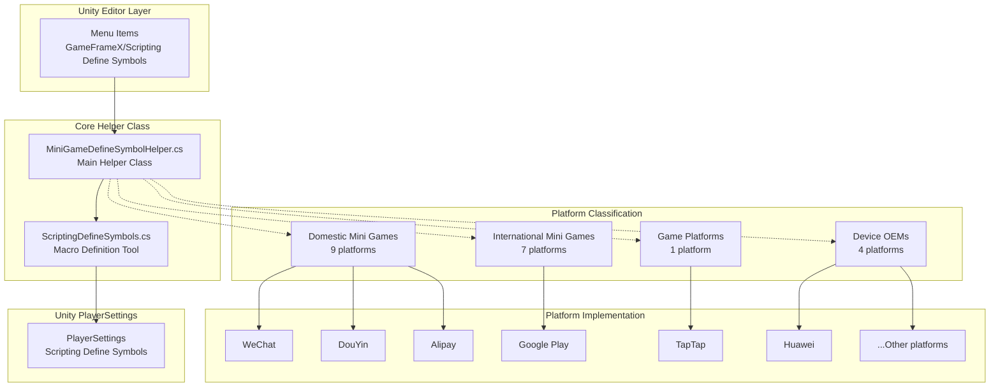
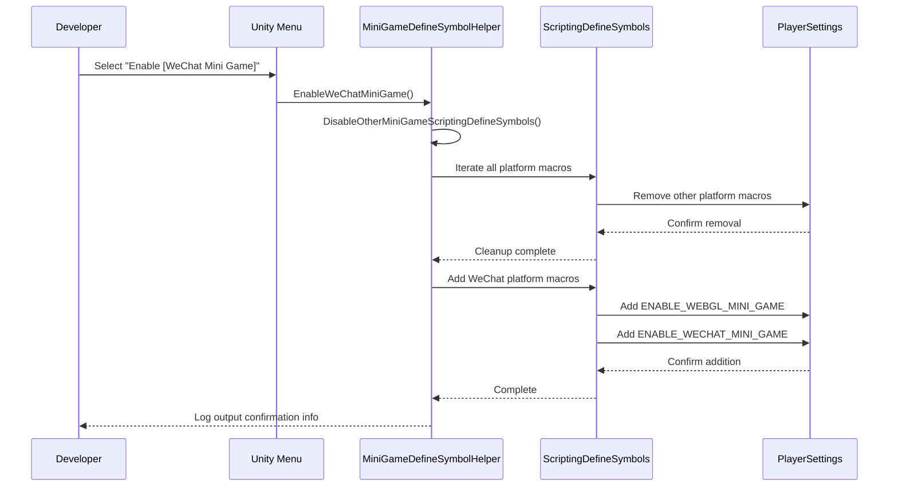

# Platform Support

GameFrameX provides comprehensive multi-platform support, covering operating system platforms and mini-game platforms. Through conditional compilation mechanism and unified macro definition management, developers can easily achieve seamless switching between different platforms.

## Overview

GameFrameX's platform support system uses Unity's Scripting Define Symbols technology to achieve one-click switching support for 21 mainstream mini-game platforms. The system design follows these core principles:

- **Mutual exclusion mechanism**: Mini-game platforms are mutually exclusive, only one platform can be active at a time
- **Unified identifier**: All mini-game platforms share the unified macro `ENABLE_WEBGL_MINI_GAME`
- **Menu integration**: Provides visual platform switching operations through Unity menu
- **Conditional compilation**: Uses `#if` preprocessor directives for platform-specific code

## Architecture

The platform support system's architecture is built around `MiniGameDefineSymbolHelper`, using partial class pattern for modular extension.



**Architecture Description:**

1. **Editor layer**: Triggers platform switching operations through Unity menu
2. **Core helper class**:
   - `MiniGameDefineSymbolHelper`: Main helper class managing all platform macro definitions
   - `ScriptingDefineSymbols`: Low-level utility class encapsulating PlayerSettings API
3. **Platform classification**: Divides 21 platforms into 4 groups by region and type
4. **Unity PlayerSettings**: Final storage location for macro definitions

## Core Mechanism

### Macro Definition System

GameFrameX uses a two-layer macro definition system to manage platform switching:

```mermaid
flowchart LR
    subgraph DefineLayers["Macro Definition Layers"]
        Unified["Unified Macro<br/>ENABLE_WEBGL_MINI_GAME"]
        Platform["Platform Macro<br/>ENABLE_XXX_MINI_GAME<br/>XXXMINIGAME"]
    end

    Unified -->|"Activation Time"| Auto["When any platform is enabled<br/>automatically activated"]
    Platform -->|"Conditional Compilation"| #if UNITY_WEBGL<br/>& ENABLE_XXX_MINI_GAME

    style Unified fill:#e1f5fe
    style Platform fill:#fff3e0
```

**Macro Definition Description:**

| Macro Type | Name | Purpose |
|------------|------|---------|
| Unified Macro | `ENABLE_WEBGL_MINI_GAME` | Identifies current build as WebGL mini-game |
| Platform Macro | `ENABLE_XXX_MINI_GAME` | Identifies specific mini-game platform |
| Platform Macro | `XXXMINIGAME` | Platform shorthand identifier (for third-party SDK adaptation) |

### Platform Mutual Exclusion Mechanism



## Supported Platforms

### Operating System Platforms

GameFrameX supports building for the following operating system platforms:

| Platform | Status | Supported Version | Build Target Group |
|----------|--------|-------------------|-------------------|
| Windows | Supported | Unity 2019.4+ | Standalone |
| macOS | Supported | Unity 2019.4+ | Standalone |
| Linux | Supported | Unity 2019.4+ | Standalone |
| iOS | Supported | Unity 2019.4+ | iOS |
| Android | Supported | Unity 2019.4+ | Android |
| WebGL | Supported | Unity 2019.4+ | WebGL |

### Mini-Game Platforms

GameFrameX provides one-click switching for 21 mini-game platforms, covering four major categories: domestic, international, device OEMs, and game platforms.

#### Domestic Mini Games (9)

| Platform | Macro | Region | Menu Path |
|----------|-------|--------|-----------|
| WeChat Mini Program | `ENABLE_WECHAT_MINI_GAME` / `WEIXINMINIGAME` | China | Domestic Mini Games |
| Alipay Mini Program | `ENABLE_ALIPAY_MINI_GAME` / `ALIPAYMINIGAME` | China | Domestic Mini Games |
| DouYin Mini Program | `ENABLE_DOUYIN_MINI_GAME` / `DOUYINMINIGAME` | China | Domestic Mini Games |
| KuaiShou Mini Program | `ENABLE_KUAISHOU_MINI_GAME` / `KUAISHOUMINIGAME` | China | Domestic Mini Games |
| Baidu Mini Program | `ENABLE_BAIDU_MINI_GAME` / `BAIDUMINIGAME` | China | Domestic Mini Games |
| JingDong Mini Program | `ENABLE_JINGDONG_MINI_GAME` / `JINGDONGMINIGAME` | China | Domestic Mini Games |
| Taobao Mini Program | `ENABLE_TAOBAO_MINI_GAME` / `TAOBAOMINIGAME` | China | Domestic Mini Games |
| Meituan Mini Program | `ENABLE_MEITUAN_MINI_GAME` / `MEITUANMINIGAME` | China | Domestic Mini Games |
| Bilibili Mini Program | `ENABLE_BILIBILI_MINI_GAME` / `BILIBILIMINIGAME` | China | Domestic Mini Games |

#### International Mini Games (7)

| Platform | Macro | Region | Menu Path |
|----------|-------|--------|-----------|
| Discord | `ENABLE_DISCORD_MINI_GAME` / `DISCORDMINIGAME` | Global | International Mini Games |
| YouTube | `ENABLE_YOUTUBE_MINI_GAME` / `YOUTUBEMINIGAME` | Global | International Mini Games |
| Facebook | `ENABLE_FACEBOOK_MINI_GAME` / `FACEBOOKMINIGAME` | Global | International Mini Games |
| Google Play | `ENABLE_GOOGLEPLAY_MINI_GAME` / `GOOGLEPLAYMINIGAME` | Global | International Mini Games |
| TikTok | `ENABLE_TIKTOK_MINI_GAME` / `TIKTOKMINIGAME` | Global | International Mini Games |
| CrazyGames | `ENABLE_CRAZYGAMES_MINI_GAME` / `CRAZYGAMESMINIGAME` | Global | International Mini Games |
| Poki | `ENABLE_POKI_MINI_GAME` / `POKIMINIGAME` | Global | International Mini Games |

#### Device OEMs (4)

| Platform | Macro | Region | Menu Path |
|----------|-------|--------|-----------|
| Huawei Mini Game | `ENABLE_HUAWEI_MINI_GAME` / `HUAWEIMINIGAME` | China | Device OEMs |
| OPPO Mini Game | `ENABLE_OPPO_MINI_GAME` / `OPPOSMINIGAME` | China | Device OEMs |
| Vivo Mini Game | `ENABLE_VIVO_MINI_GAME` / `VIVOMINIGAME` | China | Device OEMs |
| Xiaomi Mini Game | `ENABLE_XIAOMI_MINI_GAME` / `XIAOMIMINIGAME` | China | Device OEMs |

#### Game Platforms (1)

| Platform | Macro | Region | Menu Path |
|----------|-------|--------|-----------|
| TapTap Mini Game | `ENABLE_TAPTAP_MINI_GAME` / `TAPTAPMINIGAME` | China | Game Platforms |

## Usage Guide

### Enable Mini-Game Platform

In Unity editor, you can quickly switch mini-game platforms through menu operations:

```
GameFrameX/
└── Scripting Define Symbols/
    ├── Domestic Mini Games/
    │   ├── Enable WeChat Mini Game
    │   ├── Enable Alipay Mini Game
    │   ├── Enable DouYin Mini Game
    │   ├── Enable KuaiShou Mini Game
    │   ├── Enable Baidu Mini Game
    │   ├── Enable JingDong Mini Game
    │   ├── Enable Meituan Mini Game
    │   ├── Enable Taobao Mini Game
    │   └── Enable Bilibili Mini Game
    ├── International Mini Games/
    │   ├── Enable Discord Mini Game
    │   ├── Enable YouTube Mini Game
    │   ├── Enable Facebook Mini Game
    │   ├── Enable Google Play Mini Game
    │   ├── Enable TikTok Mini Game
    │   ├── Enable CrazyGames Mini Game
    │   └── Enable Poki Mini Game
    ├── Device OEMs/
    │   ├── Enable Huawei Mini Game
    │   ├── Enable OPPO Mini Game
    │   ├── Enable Vivo Mini Game
    │   └── Enable Xiaomi Mini Game
    └── Game Platforms/
        └── Enable TapTap Mini Game
```

### Use Conditional Compilation

In code, you can use conditional compilation directives to implement platform-specific logic:

```csharp
#if ENABLE_WEBGL_MINI_GAME
    // Code shared by all mini-game platforms
#endif

#if ENABLE_WECHAT_MINI_GAME
    // WeChat mini-game specific code
    // Can use WeChat mini-game exclusive APIs
#endif

#if ENABLE_TAPTAP_MINI_GAME
    // TapTap mini-game specific code
    // Can use TapTap platform SDK
#endif

#if ENABLE_GOOGLEPLAY_MINI_GAME
    // Google Play mini-game specific code
    // Can use Google Play gaming services
#endif
```

> Source: [MiniGameDefineSymbolHelper.WeChat.cs](https://github.com/GameFrameX/com.gameframex.unity/blob/main/Editor/MiniGame/DomesticMiniGames/MiniGameDefineSymbolHelper.WeChat.cs#L14-L39)
> Source: [MiniGameDefineSymbolHelper.TapTap.cs](https://github.com/GameFrameX/com.gameframex.unity/blob/main/Editor/MiniGame/GamePlatforms/MiniGameDefineSymbolHelper.TapTap.cs#L14-L39)

### Disable Mini-Game Platform

Similarly, you can disable an enabled mini-game platform through the menu:

```
GameFrameX/
└── Scripting Define Symbols/
    ├── Domestic Mini Games/
    │   └── Disable WeChat Mini Game
    ├── International Mini Games/
    │   └── Disable Google Play Mini Game
    ├── Device OEMs/
    │   └── Disable Huawei Mini Game
    └── Game Platforms/
        └── Disable TapTap Mini Game
```

## Core API Reference

### `MiniGameDefineSymbolHelper`

Mini-game platform macro definition management main class.

#### `EnableWeChatMiniGame()`

```csharp
#if UNITY_WEBGL
[MenuItem("GameFrameX/Scripting Define Symbols/Domestic Mini Games/Enable WeChat Mini Game", false, 2000)]
#endif
public static void EnableWeChatMiniGame()
```

Enable WeChat mini-game adaptation. When enabled, it automatically:
1. Disable macro definitions of all other mini-game platforms
2. Enable WeChat mini-game specific macro definitions
3. Enable unified WebGL mini-game macro definition

> Source: [MiniGameDefineSymbolHelper.WeChat.cs](https://github.com/GameFrameX/com.gameframex.unity/blob/main/Editor/MiniGame/DomesticMiniGames/MiniGameDefineSymbolHelper.WeChat.cs#L20-L40)

#### `DisableWeChatMiniGame()`

```csharp
#if UNITY_WEBGL
[MenuItem("GameFrameX/Scripting Define Symbols/Domestic Mini Games/Disable WeChat Mini Game", false, 2001)]
#endif
public static void DisableWeChatMiniGame()
```

Disable WeChat mini-game adaptation.

> Source: [MiniGameDefineSymbolHelper.WeChat.cs](https://github.com/GameFrameX/com.gameframex.unity/blob/main/Editor/MiniGame/DomesticMiniGames/MiniGameDefineSymbolHelper.WeChat.cs#L46-L64)

### `ScriptingDefineSymbols`

Script macro definition low-level operation utility class.

#### `HasScriptingDefineSymbol(buildTargetGroup, scriptingDefineSymbol): bool`

```csharp
public static bool HasScriptingDefineSymbol(BuildTargetGroup buildTargetGroup, string scriptingDefineSymbol)
```

Check if specified scripting define symbol exists for the specified platform.

**Parameters:**
- `buildTargetGroup` (BuildTargetGroup): Target platform group
- `scriptingDefineSymbol` (string): Macro definition to check

**Returns:** Whether specified macro definition exists

> Source: [ScriptingDefineSymbols.cs](https://github.com/GameFrameX/com.gameframex.unity/blob/main/Editor/Misc/ScriptingDefineSymbols.cs#L57-L74)

#### `AddScriptingDefineSymbol(buildTargetGroup, scriptingDefineSymbol): void`

```csharp
public static void AddScriptingDefineSymbol(BuildTargetGroup buildTargetGroup, string scriptingDefineSymbol)
```

Add scripting define symbol for specified platform.

**Parameters:**
- `buildTargetGroup` (BuildTargetGroup): Target platform group
- `scriptingDefineSymbol` (string): Macro definition to add

> Source: [ScriptingDefineSymbols.cs](https://github.com/GameFrameX/com.gameframex.unity/blob/main/Editor/Misc/ScriptingDefineSymbols.cs#L81-L99)

#### `RemoveScriptingDefineSymbol(buildTargetGroup, scriptingDefineSymbol): void`

```csharp
public static void RemoveScriptingDefineSymbol(BuildTargetGroup buildTargetGroup, string scriptingDefineSymbol)
```

Remove scripting define symbol from specified platform.

**Parameters:**
- `buildTargetGroup` (BuildTargetGroup): Target platform group
- `scriptingDefineSymbol` (string): Macro definition to remove

> Source: [ScriptingDefineSymbols.cs](https://github.com/GameFrameX/com.gameframex.unity/blob/main/Editor/Misc/ScriptingDefineSymbols.cs#L106-L125)

#### `GetScriptingDefineSymbols(buildTargetGroup): string[]`

```csharp
public static string[] GetScriptingDefineSymbols(BuildTargetGroup buildTargetGroup)
```

Get scripting define symbol array for specified platform.

**Parameters:**
- `buildTargetGroup` (BuildTargetGroup): Target platform group

**Returns:** Macro definition array

> Source: [ScriptingDefineSymbols.cs](https://github.com/GameFrameX/com.gameframex.unity/blob/main/Editor/Misc/ScriptingDefineSymbols.cs#L166-L169)

## Best Practices

### Platform Adaptation Recommendations

1. **Use unified WebGL macro**: For code common to all mini-game platforms, use `ENABLE_WEBGL_MINI_GAME` for conditional compilation

2. **Separate platform-specific code**: Place code for different platforms in separate directories or files for easier maintenance

3. **Interface abstraction**: For scenarios requiring platform-specific API calls, recommend using interface abstraction or dependency injection pattern

4. **Test coverage**: Each target platform should be fully tested to ensure conditional compilation code executes correctly

### FAQ

**Q: When enabling a new platform, will the previous platform's macro definitions be automatically disabled?**

Yes, the system uses mutual exclusion mechanism; enabling any mini-game platform will automatically disable macro definitions of all other mini-game platforms.

**Q: Can I enable multiple mini-game platforms simultaneously?**

No. Since APIs and SDKs between mini-game platforms conflict, the system is designed in mutual exclusion mode; only one platform can be active at a time.

**Q: How to view the currently enabled platform?**

You can view the macro definition list for the WebGL platform through Unity menu `Edit > Project Settings > Player > Other Settings > Scripting Define Symbols`.

## Related Links

- [Editor Tools](./6-editor-tools.mini-game-platform) - Mini-game platform adaptation detailed documentation
- [Build Tools](./6-editor-tools.build-tools) - Build product related tools
- [API Reference](./8-api-reference) - Complete API documentation
- [Project Homepage](https://github.com/GameFrameX/com.gameframex.unity)
- [Official Documentation](https://gameframex.doc.alianblank.com)