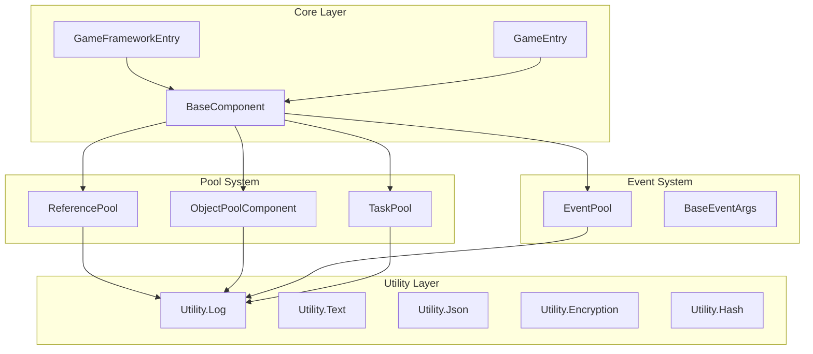

# API Reference

This document provides complete reference for all public APIs of the GameFrameX framework, including core classes, interfaces, method signatures, and usage instructions.

## Overview

The GameFrameX framework uses modular architecture design, with core APIs mainly divided into the following sections:

- **Framework Entry**: `GameFrameworkEntry` and `GameEntry` provide framework initialization and component management
- **Base Component**: `BaseComponent` provides game runtime base settings
- **Reference Pool**: `ReferencePool` provides high-performance memory management
- **Event System**: `EventPool<T>` provides type-safe event mechanism
- **Task Pool**: `TaskPool<T>` provides async task management
- **Object Pool**: `ObjectPoolComponent` provides game object reuse
- **Utility Classes**: `Utility` namespace provides various auxiliary functions

## Architecture Diagram



---

## Framework Entry

### GameFrameworkEntry

Framework module manager, responsible for registration, retrieval and update of framework-level modules.

> Source: [Runtime/Base/GameFrameworkEntry.cs](https://github.com/GameFrameX/com.gameframex.unity/blob/main/Runtime/Base/GameFrameworkEntry.cs#L44-L209)

#### Core Methods

##### `Update(elapseSeconds: float, realElapseSeconds: float): void`

Poll all registered framework modules.

```csharp
GameFrameworkEntry.Update(deltaTime, unscaledDeltaTime);
```
> Source: [GameFrameworkEntry.cs#L58-L64](https://github.com/GameFrameX/com.gameframex.unity/blob/main/Runtime/Base/GameFrameworkEntry.cs#L58-L64)

##### `Shutdown(): void`

Shutdown and clean up all game framework modules, release reference pools and caches.

```csharp
GameFrameworkEntry.Shutdown();
```
> Source: [GameFrameworkEntry.cs#L73-L84](https://github.com/GameFrameX/com.gameframex.unity/blob/main/Runtime/Base/GameFrameworkEntry.cs#L73-L84)

##### `GetModule<T>(): T`

Get framework module of specified interface type. If module does not exist, it will be automatically created.

```csharp
var objectPoolMgr = GameFrameworkEntry.GetModule<IObjectPoolManager>();
```
> Source: [GameFrameworkEntry.cs#L95-L120](https://github.com/GameFrameX/com.gameframex.unity/blob/main/Runtime/Base/GameFrameworkEntry.cs#L95-L120)

##### `RegisterModule(interfaceType: Type, implType: Type): void`

Register framework module interface and implementation type mapping.

```csharp
GameFrameworkEntry.RegisterModule(typeof(IObjectPoolManager), typeof(ObjectPoolManager));
```
> Source: [GameFrameworkEntry.cs#L153-L169](https://github.com/GameFrameX/com.gameframex.unity/blob/main/Runtime/Base/GameFrameworkEntry.cs#L153-L169)

---

### GameEntry

Unity component manager, provides registration and retrieval of game framework components.

> Source: [Runtime/Base/GameEntry.cs](https://github.com/GameFrameX/com.gameframex.unity/blob/main/Runtime/Base/GameEntry.cs#L46-L196)

#### Core Methods

##### `GetComponent<T>(): T`

Get game framework component of specified type.

```csharp
var objectPoolComp = GameEntry.GetComponent<ObjectPoolComponent>();
```
> Source: [GameEntry.cs#L67-L70](https://github.com/GameFrameX/com.gameframex.unity/blob/main/Runtime/Base/GameEntry.cs#L67-L70)

##### `Shutdown(shutdownType: ShutdownType): void`

Shutdown game framework.

```csharp
GameEntry.Shutdown(ShutdownType.Quit);
```
> Source: [GameEntry.cs#L131-L162](https://github.com/GameFrameX/com.gameframex.unity/blob/main/Runtime/Base/GameEntry.cs#L131-L162)

---

## Base Component

### BaseComponent

Game base component, provides core functions such as frame rate control, game speed management, background running settings.

> Source: [Runtime/Base/BaseComponent.cs](https://github.com/GameFrameX/com.gameframex.unity/blob/main/Runtime/Base/BaseComponent.cs#L48-L403)

#### Properties

| Property | Type | Description |
|----------|------|-------------|
| `FrameRate` | `int` | Gets or sets game frame rate |
| `GameSpeed` | `float` | Gets or sets game speed (0 means paused) |
| `IsGamePaused` | `bool` | Gets whether game is paused |
| `IsNormalGameSpeed` | `bool` | Gets whether game is running at normal speed |
| `RunInBackground` | `bool` | Gets or sets whether background running is allowed |
| `NeverSleep` | `bool` | Gets or sets whether sleep is prevented |

#### Methods

##### `PauseGame(): void`

Pause game.

```csharp
var baseComp = GameEntry.GetComponent<BaseComponent>();
baseComp.PauseGame();
```
> Source: [BaseComponent.cs#L220-L229](https://github.com/GameFrameX/com.gameframex.unity/blob/main/Runtime/Base/BaseComponent.cs#L220-L229)

##### `ResumeGame(): void`

Resume game.

```csharp
baseComp.ResumeGame();
```
> Source: [BaseComponent.cs#L235-L243](https://github.com/GameFrameX/com.gameframex.unity/blob/main/Runtime/Base/BaseComponent.cs#L235-L243)

##### `ResetNormalGameSpeed(): void`

Reset to normal game speed.

```csharp
baseComp.ResetNormalGameSpeed();
```
> Source: [BaseComponent.cs#L249-L257](https://github.com/GameFrameX/com.gameframex.unity/blob/main/Runtime/Base/BaseComponent.cs#L249-L257)

---

## Reference Pool

### ReferencePool

Reference pool manager, used for object reuse to reduce GC overhead.

> Source: [Runtime/Base/ReferencePool/ReferencePool.cs](https://github.com/GameFrameX/com.gameframex.unity/blob/main/Runtime/Base/ReferencePool/ReferencePool.cs#L44-L296)

#### Properties

| Property | Type | Description |
|----------|------|-------------|
| `EnableStrictCheck` | `bool` | Gets or sets whether strict type check is enabled |
| `Count` | `int` | Gets number of reference pools |

#### Core Methods

##### `Acquire<T>(): T`

Acquire reference of specified type from reference pool.

```csharp
var myRef = ReferencePool.Acquire<MyReferenceClass>();
```
> Source: [ReferencePool.cs#L129-L132](https://github.com/GameFrameX/com.gameframex.unity/blob/main/Runtime/Base/ReferencePool/ReferencePool.cs#L129-L132)

##### `Release(reference: IReference): void`

Return reference to reference pool.

```csharp
ReferencePool.Release(myRef);
```
> Source: [ReferencePool.cs#L157-L167](https://github.com/GameFrameX/com.gameframex.unity/blob/main/Runtime/Base/ReferencePool/ReferencePool.cs#L157-L167)

##### `Add<T>(count: int): void`

Append specified number of references to reference pool.

```csharp
ReferencePool.Add<MyReferenceClass>(10);
```
> Source: [ReferencePool.cs#L178-L181](https://github.com/GameFrameX/com.gameframex.unity/blob/main/Runtime/Base/ReferencePool/ReferencePool.cs#L178-L181)

##### `Remove<T>(count: int): void`

Remove specified number of references from reference pool.

```csharp
ReferencePool.Remove<MyReferenceClass>(5);
```
> Source: [ReferencePool.cs#L207-L210](https://github.com/GameFrameX/com.gameframex.unity/blob/main/Runtime/Base/ReferencePool/ReferencePool.cs#L207-L210)

##### `ClearAll(): void`

Clear all reference pools.

```csharp
ReferencePool.ClearAll();
```
> Source: [ReferencePool.cs#L107-L118](https://github.com/GameFrameX/com.gameframex.unity/blob/main/Runtime/Base/ReferencePool/ReferencePool.cs#L107-L118)

##### `GetAllReferencePoolInfos(): ReferencePoolInfo[]`

Get information of all reference pools.

```csharp
var infos = ReferencePool.GetAllReferencePoolInfos();
```
> Source: [ReferencePool.cs#L82-L98](https://github.com/GameFrameX/com.gameframex.unity/blob/main/Runtime/Base/ReferencePool/ReferencePool.cs#L82-L98)

---

### IReference

Reference interface, all objects that can be placed in reference pool must implement this interface.

> Source: [Runtime/Base/ReferencePool/IReference.cs](https://github.com/GameFrameX/com.gameframex.unity/blob/main/Runtime/Base/ReferencePool/IReference.cs#L40-L52)

```csharp
public class MyReferenceClass : IReference
{
    public void Clear() { /* Reset state */ }
}
```
> Source: [IReference.cs#L40-L52](https://github.com/GameFrameX/com.gameframex.unity/blob/main/Runtime/Base/ReferencePool/IReference.cs#L40-L52)

---

## Event System

### `EventPool<T>`

Type-safe event pool, supports thread-safe event distribution.

> Source: [Runtime/Base/EventPool/EventPool.cs](https://github.com/GameFrameX/com.gameframex.unity/blob/main/Runtime/Base/EventPool/EventPool.cs#L47-L395)

#### Constructor

##### `EventPool(mode: EventPoolMode)`

Create event pool instance.

```csharp
var eventPool = new EventPool<T>(EventPoolMode.AllowMultiHandler | EventPoolMode.AllowDuplicateHandler);
```
> Source: [EventPool.cs#L65-L73](https://github.com/GameFrameX/com.gameframex.unity/blob/main/Runtime/Base/EventPool/EventPool.cs#L65-L73)

#### Properties

| Property | Type | Description |
|----------|------|-------------|
| `EventHandlerCount` | `int` | Gets number of event handlers |
| `EventCount` | `int` | Gets number of pending events in queue |

#### Core Methods

##### `Subscribe(id: string, handler: EventHandler<T>): void`

Subscribe to event.

```csharp
eventPool.Subscribe("PlayerDead", OnPlayerDead);
```
> Source: [EventPool.cs#L208-L234](https://github.com/GameFrameX/com.gameframex.unity/blob/main/Runtime/Base/EventPool/EventPool.cs#L208-L234)

##### `Unsubscribe(id: string, handler: EventHandler<T>): void`

Unsubscribe from event.

```csharp
eventPool.Unsubscribe("PlayerDead", OnPlayerDead);
```
> Source: [EventPool.cs#L245-L280](https://github.com/GameFrameX/com.gameframex.unity/blob/main/Runtime/Base/EventPool/EventPool.cs#L245-L280)

##### `Fire(sender: object, e: T): void`

Fire event (thread-safe, async distribution).

```csharp
var eventArgs = ReferencePool.Acquire<PlayerDeadEventArgs>();
eventArgs.PlayerId = 123;
eventPool.Fire(this, eventArgs);
```
> Source: [EventPool.cs#L304-L313](https://github.com/GameFrameX/com.gameframex.unity/blob/main/Runtime/Base/EventPool/EventPool.cs#L304-L313)

##### `FireNow(sender: object, e: T): void`

Fire event immediately (sync distribution).

```csharp
eventPool.FireNow(this, eventArgs);
```
> Source: [EventPool.cs#L324-L335](https://github.com/GameFrameX/com.gameframex.unity/blob/main/Runtime/Base/EventPool/EventPool.cs#L324-L335)

##### `Check(id: string, handler: EventHandler<T>): bool`

Check if specified event handler exists.

```csharp
bool exists = eventPool.Check("PlayerDead", OnPlayerDead);
```
> Source: [EventPool.cs#L186-L197](https://github.com/GameFrameX/com.gameframex.unity/blob/main/Runtime/Base/EventPool/EventPool.cs#L186-L197)

##### `Update(elapseSeconds: float, realElapseSeconds: float): void`

Poll event pool, process events in queue.

```csharp
eventPool.Update(deltaTime, unscaledDeltaTime);
```
> Source: [EventPool.cs#L114-L121](https://github.com/GameFrameX/com.gameframex.unity/blob/main/Runtime/Base/EventPool/EventPool.cs#L114-L121)

##### `Shutdown(): void`

Shutdown and clean up event pool.

```csharp
eventPool.Shutdown();
```
> Source: [EventPool.cs#L129-L140](https://github.com/GameFrameX/com.gameframex.unity/blob/main/Runtime/Base/EventPool/EventPool.cs#L129-L140)

---

### BaseEventArgs

Event args base class, all custom event args should inherit from this class.

> Source: [Runtime/Base/EventPool/BaseEventArgs.cs](https://github.com/GameFrameX/com.gameframex.unity/blob/main/Runtime/Base/EventPool/BaseEventArgs.cs)

```csharp
public sealed class PlayerDeadEventArgs : BaseEventArgs
{
    public int PlayerId { get; set; }
    public string PlayerName { get; set; }

    public override void Clear()
    {
        PlayerId = 0;
        PlayerName = null;
    }
}
```

---

### EventPoolMode

Event pool mode enum.

> Source: [Runtime/Base/EventPool/EventPoolMode.cs](https://github.com/GameFrameX/com.gameframex.unity/blob/main/Runtime/Base/EventPool/EventPoolMode.cs#L44-L56)

```csharp
[Flags]
public enum EventPoolMode : byte
{
    /// Does not allow empty handler
    AllowNoHandler = 1,
    /// Allows multiple handlers
    AllowMultiHandler = 2,
    /// Allows duplicate handlers
    AllowDuplicateHandler = 4,
}
```

---

## Task Pool

### `TaskPool<T>`

Task pool manager, used for managing async task execution.

> Source: [Runtime/Base/TaskPool/TaskPool.cs](https://github.com/GameFrameX/com.gameframex.unity/blob/main/Runtime/Base/TaskPool/TaskPool.cs#L44-L525)

#### Constructor

##### `TaskPool()`

Create task pool instance.

```csharp
var taskPool = new TaskPool<DownloadTask>();
```
> Source: [TaskPool.cs#L58-L64](https://github.com/GameFrameX/com.gameframex.unity/blob/main/Runtime/Base/TaskPool/TaskPool.cs#L58-L64)

#### Properties

| Property | Type | Description |
|----------|------|-------------|
| `Paused` | `bool` | Gets or sets whether task pool is paused |
| `TotalAgentCount` | `int` | Gets total number of task agents |
| `FreeAgentCount` | `int` | Gets number of free task agents |
| `WorkingAgentCount` | `int` | Gets number of working task agents |
| `WaitingTaskCount` | `int` | Gets number of waiting tasks |

#### Core Methods

##### `AddAgent(agent: ITaskAgent<T>): void`

Add task agent.

```csharp
taskPool.AddAgent(new DownloadTaskAgent());
```
> Source: [TaskPool.cs#L172-L181](https://github.com/GameFrameX/com.gameframex.unity/blob/main/Runtime/Base/TaskPool/TaskPool.cs#L172-L181)

##### `AddTask(task: T): void`

Add task.

```csharp
var task = ReferencePool.Acquire<DownloadTask>();
task.Url = "http://example.com/file.png";
task.Priority = 100;
taskPool.AddTask(task);
```
> Source: [TaskPool.cs#L327-L348](https://github.com/GameFrameX/com.gameframex.unity/blob/main/Runtime/Base/TaskPool/TaskPool.cs#L327-L348)

##### `RemoveTask(serialId: int): bool`

Remove task by serial number.

```csharp
bool removed = taskPool.RemoveTask(taskSerialId);
```
> Source: [TaskPool.cs#L359-L390](https://github.com/GameFrameX/com.gameframex.unity/blob/main/Runtime/Base/TaskPool/TaskPool.cs#L359-L390)

##### `RemoveTasks(tag: string): int`

Remove tasks by tag.

```csharp
int count = taskPool.RemoveTasks("download");
```
> Source: [TaskPool.cs#L401-L439](https://github.com/GameFrameX/com.gameframex.unity/blob/main/Runtime/Base/TaskPool/TaskPool.cs#L401-L439)

##### `RemoveAllTasks(): int`

Remove all tasks.

```csharp
int count = taskPool.RemoveAllTasks();
```
> Source: [TaskPool.cs#L449-L471](https://github.com/GameFrameX/com.gameframex.unity/blob/main/Runtime/Base/TaskPool/TaskPool.cs#L449-L471)

##### `GetTaskInfo(serialId: int): TaskInfo`

Get task information for specified serial number.

```csharp
var info = taskPool.GetTaskInfo(serialId);
```
> Source: [TaskPool.cs#L192-L212](https://github.com/GameFrameX/com.gameframex.unity/blob/main/Runtime/Base/TaskPool/TaskPool.cs#L192-L212)

##### `GetAllTaskInfos(): TaskInfo[]`

Get all task information.

```csharp
var infos = taskPool.GetAllTaskInfos();
```
> Source: [TaskPool.cs#L273-L289](https://github.com/GameFrameX/com.gameframex.unity/blob/main/Runtime/Base/TaskPool/TaskPool.cs#L273-L289)

##### `Update(elapseSeconds: float, realElapseSeconds: float): void`

Poll task pool, process tasks.

```csharp
taskPool.Update(deltaTime, unscaledDeltaTime);
```
> Source: [TaskPool.cs#L136-L145](https://github.com/GameFrameX/com.gameframex.unity/blob/main/Runtime/Base/TaskPool/TaskPool.cs#L136-L145)

##### `Shutdown(): void`

Shutdown and clean up task pool.

```csharp
taskPool.Shutdown();
```
> Source: [TaskPool.cs#L154-L162](https://github.com/GameFrameX/com.gameframex.unity/blob/main/Runtime/Base/TaskPool/TaskPool.cs#L154-L162)

---

### TaskBase

Task base class, all custom tasks should inherit from this class.

> Source: [Runtime/Base/TaskPool/TaskBase.cs](https://github.com/GameFrameX/com.gameframex.unity/blob/main/Runtime/Base/TaskPool/TaskBase.cs)

```csharp
public class DownloadTask : TaskBase
{
    public string Url { get; set; }
    public byte[] Result { get; set; }

    public override void Clear()
    {
        Url = null;
        Result = null;
        base.Clear();
    }
}
```

---

### `ITaskAgent<T>`

Task agent interface.

> Source: [Runtime/Base/TaskPool/ITaskAgent.cs](https://github.com/GameFrameX/com.gameframex.unity/blob/main/Runtime/Base/TaskPool/ITaskAgent.cs#L41-L56)

```csharp
public interface ITaskAgent<T> where T : TaskBase
{
    TaskBase Task { get; }
    void Initialize();
    void Update(float elapseSeconds, float realElapseSeconds);
    void Shutdown();
    void Reset();
    StartTaskStatus Start(T task);
}
```

---

## Object Pool

### ObjectPoolComponent

Unity object pool component, provides game object reuse management.

> Source: [Runtime/ObjectPool/ObjectPoolComponent.cs](https://github.com/GameFrameX/com.gameframex.unity/blob/main/Runtime/ObjectPool/ObjectPoolComponent.cs#L45-L1135)

#### Properties

| Property | Type | Description |
|----------|------|-------------|
| `Count` | `int` | Gets number of object pools |

#### Core Methods

##### `HasObjectPool<T>(): bool`

Check if object pool of specified type exists.

```csharp
bool exists = objectPoolComp.HasObjectPool<MyObject>();
```
> Source: [ObjectPoolComponent.cs#L80-L83](https://github.com/GameFrameX/com.gameframex.unity/blob/main/Runtime/ObjectPool/ObjectPoolComponent.cs#L80-L83)

##### `GetObjectPool<T>(): IObjectPool<T>`

Get object pool of specified type.

```csharp
var pool = objectPoolComp.GetObjectPool<MyObject>();
```
> Source: [ObjectPoolComponent.cs#L137-L140](https://github.com/GameFrameX/com.gameframex.unity/blob/main/Runtime/ObjectPool/ObjectPoolComponent.cs#L137-L140)

##### `CreateSingleSpawnObjectPool<T>(): IObjectPool<T>`

Create single spawn object pool.

```csharp
var pool = objectPoolComp.CreateSingleSpawnObjectPool<MyObject>("MyObjectPool");
```
> Source: [ObjectPoolComponent.cs#L257-L260](https://github.com/GameFrameX/com.gameframex.unity/blob/main/Runtime/ObjectPool/ObjectPoolComponent.cs#L257-L260)

##### `CreateMultiSpawnObjectPool<T>(): IObjectPool<T>`

Create multi spawn object pool.

```csharp
var pool = objectPoolComp.CreateMultiSpawnObjectPool<MyObject>("MyObjectPool", 10, 300f);
```
> Source: [ObjectPoolComponent.cs#L655-L658](https://github.com/GameFrameX/com.gameframex.unity/blob/main/Runtime/ObjectPool/ObjectPoolComponent.cs#L655-L658)

##### `DestroyObjectPool<T>(): bool`

Destroy object pool.

```csharp
bool destroyed = objectPoolComp.DestroyObjectPool<MyObject>();
```
> Source: [ObjectPoolComponent.cs#L1053-L1056](https://github.com/GameFrameX/com.gameframex.unity/blob/main/Runtime/ObjectPool/ObjectPoolComponent.cs#L1053-L1056)

##### `Release(): void`

Release releasable objects in object pool.

```csharp
objectPoolComp.Release();
```
> Source: [ObjectPoolComponent.cs#L1120-L1124](https://github.com/GameFrameX/com.gameframex.unity/blob/main/Runtime/ObjectPool/ObjectPoolComponent.cs#L1120-L1124)

##### `ReleaseAllUnused(): void`

Release all unused objects in object pool.

```csharp
objectPoolComp.ReleaseAllUnused();
```
> Source: [ObjectPoolComponent.cs#L1130-L1134](https://github.com/GameFrameX/com.gameframex.unity/blob/main/Runtime/ObjectPool/ObjectPoolComponent.cs#L1130-L1134)

---

### `IObjectPool<T>`

Object pool interface.

> Source: [Runtime/ObjectPool/IObjectPool.cs](https://github.com/GameFrameX/com.gameframex.unity/blob/main/Runtime/ObjectPool/IObjectPool.cs#L40-L58)

```csharp
public interface IObjectPool<T> where T : ObjectBase
{
    string Name { get; }
    int Count { get; }
    int CanReleaseCount { get; }
    T Spawn();
    void Release(T obj);
    void ReleaseAllUnused();
}
```

---

### ObjectBase

Object pool object base class.

> Source: [Runtime/ObjectPool/ObjectBase.cs](https://github.com/GameFrameX/com.gameframex.unity/blob/main/Runtime/ObjectPool/ObjectBase.cs)

```csharp
public class MyObject : ObjectBase
{
    public string Data { get; set; }

    public override void Clear()
    {
        Data = null;
    }

    public override void OnSpawn() { }
    public override void OnRelease() { }
}
```

---

## Utility Classes

### Utility.Log

Log utility class, provides level-based log output.

> Source: [Runtime/Utility/Log.cs](https://github.com/GameFrameX/com.gameframex.unity/blob/main/Runtime/Utility/Log.cs#L40-L2000+)

#### Log Levels

| Method | Description |
|--------|-------------|
| `Debug(message)` | Debug level log |
| `Info(message)` | Info level log |
| `Warning(message)` | Warning level log |
| `Error(message)` | Error level log |
| `Fatal(message)` | Fatal error log |

```csharp
Log.Info("Player {0} entered the game", playerName);
Log.Warning("Resource loading failed: {0}", url);
Log.Error("Network request timeout");
```
> Source: [Log.cs#L557-L560](https://github.com/GameFrameX/com.gameframex.unity/blob/main/Runtime/Utility/Log.cs#L557-L560)

---

### Utility.Text

Text formatting utility.

> Source: [Runtime/Utility/Utility.Text.cs](https://github.com/GameFrameX/com.gameframex.unity/blob/main/Runtime/Utility/Utility.Text.cs)

```csharp
string formatted = Utility.Text.Format("{0} + {1} = {2}", 1, 2, 3);
```

---

### Utility.Json

JSON serialization utility.

> Source: [Runtime/Utility/Utility.Json.cs](https://github.com/GameFrameX/com.gameframex.unity/blob/main/Runtime/Utility/Utility.Json.cs)

```csharp
string json = Utility.Json.ToJson(myObject);
var obj = Utility.Json.FromJson<MyClass>(json);
```

---

### Utility.Encryption

Encryption/decryption utility.

> Source: [Runtime/Utility/Utility.Encryption.cs](https://github.com/GameFrameX/com.gameframex.unity/blob/main/Runtime/Utility/Utility.Encryption.cs)

```csharp
// AES encryption
byte[] encrypted = Utility.Encryption.Aes.Encrypt(data, key, iv);

// AES decryption
byte[] decrypted = Utility.Encryption.Aes.Decrypt(encrypted, key, iv);
```

---

### Utility.Hash

Hash utility.

> Source: [Runtime/Utility/Utility.Hash.Md5.cs](https://github.com/GameFrameX/com.gameframex.unity/blob/main/Runtime/Utility/Utility.Hash.Md5.cs#L25-L50)

```csharp
string md5 = Utility.Hash.MD5.Hash(data);
string sha1 = Utility.Hash.Sha1.Hash(data);
ulong xxhash = Utility.Hash.XXHash.Hash64(data, seed);
```

---

### Utility.Marshal

Memory operation utility.

> Source: [Runtime/Utility/Utility.Marshal.cs](https://github.com/GameFrameX/com.gameframex.unity/blob/main/Runtime/Utility/Utility.Marshal.cs#L45-L100)

```csharp
IntPtr ptr = Utility.Marshal.Alloc(size);
Utility.Marshal.Copy(data, 0, ptr, data.Length);
Utility.Marshal.FreeCachedHGlobal();
```

---

### Utility.File

File operation utility.

> Source: [Runtime/Utility/Utility.File.cs](https://github.com/GameFrameX/com.gameframex.unity/blob/main/Runtime/Utility/Utility.File.cs#L12-L100)

```csharp
string[] lines = Utility.File.ReadAllLines(path);
byte[] data = Utility.File.ReadAllBytes(path);
Utility.File.WriteAllBytes(path, data);
```

---

### Utility.Path

Path operation utility.

> Source: [Runtime/Utility/Utility.Path.cs](https://github.com/GameFrameX/com.gameframex.unity/blob/main/Runtime/Utility/Utility.Path.cs#L45-L100)

```csharp
string normalizePath = Utility.Path.GetRegularPath(path);
string combinePath = Utility.Path.Combine(dir, file);
```

---

### Utility.Random

Random number utility.

> Source: [Runtime/Utility/Utility.Random.cs](https://github.com/GameFrameX/com.gameframex.unity/blob/main/Runtime/Utility/Utility.Random.cs#L46-L100)

```csharp
int randomInt = Utility.Random.GetRandom(0, 100);
float randomFloat = Utility.Random.GetRandomFloat(0f, 1f);
```

---

## Enumeration Types

### ShutdownType

Shutdown type.

> Source: [Runtime/Base/ShutdownType.cs](https://github.com/GameFrameX/com.gameframex.unity/blob/main/Runtime/Base/ShutdownType.cs#L41-L54)

```csharp
public enum ShutdownType : byte
{
    /// Do nothing
    None = 0,
    /// Restart game after shutdown
    Restart = 1,
    /// Quit game after shutdown
    Quit = 2,
}
```

---

### GameFrameworkLogLevel

Log level.

> Source: [Runtime/Base/Log/GameFrameworkLogLevel.cs](https://github.com/GameFrameX/com.gameframex.unity/blob/main/Runtime/Base/Log/GameFrameworkLogLevel.cs#L42-L56)

```csharp
public enum GameFrameworkLogLevel : byte
{
    Debug = 0,
    Info = 1,
    Warning = 2,
    Error = 3,
    Fatal = 4,
}
```

---

### TaskStatus

Task status.

> Source: [Runtime/Base/TaskPool/TaskStatus.cs](https://github.com/GameFrameX/com.gameframex.unity/blob/main/Runtime/Base/TaskPool/TaskStatus.cs#L41-L51)

```csharp
public enum TaskStatus : byte
{
    /// Not started
    Todo = 0,
    /// In progress
    Doing = 1,
    /// Completed
    Done = 2,
}
```

---

### StartTaskStatus

Task start status.

> Source: [Runtime/Base/TaskPool/StartTaskStatus.cs](https://github.com/GameFrameX/com.gameframex.unity/blob/main/Runtime/Base/TaskPool/StartTaskStatus.cs#L41-L54)

```csharp
public enum StartTaskStatus : byte
{
    /// Can proceed
    CanStart = 0,
    /// Needs to wait
    HasToWait = 1,
    /// Complete immediately
    Done = 2,
    /// Can resume
    CanResume = 3,
    /// Unknown error
    UnknownError = 4,
}
```

---

## Related Links

- [Overview](./1-overview)
- [Core Concepts](./4-core-concepts)
- [Runtime Module - Event System](./5-runtime.event-system)
- [Runtime Module - Object Pool System](./5-runtime.object-pool)
- [Runtime Module - Reference Pool System](./5-runtime.reference-pool)
- [Runtime Module - Task Pool System](./5-runtime.task-pool)
- [Runtime Module - Utility Classes](./5-runtime.utility-classes)
- [FAQ](./9-troubleshooting)