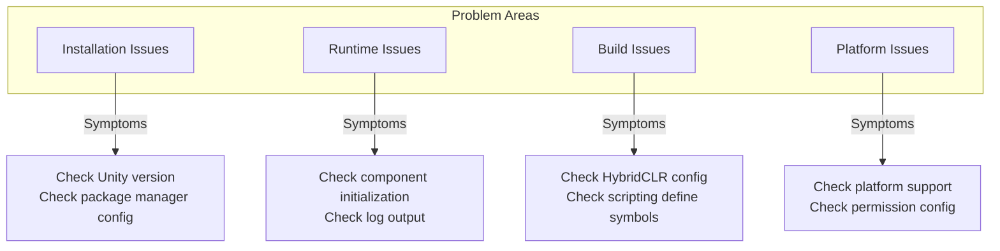

# FAQ

This document collects common issues and their solutions that may be encountered when using the GameFrameX Unity framework.

## Overview

GameFrameX is a feature-rich Unity game framework, and various technical issues may be encountered during use. This document aims to help developers quickly locate and resolve common problems, improving development efficiency.

## Architecture



## Installation Issues

### Unity Version Incompatibility

**Problem**: Compilation errors or abnormal functionality after importing the framework.

**Cause Analysis**:
- Unity version is lower than framework's minimum required version (2019.4+)
- .NET API compatibility level is set incorrectly

**Solution**:

1. Check Unity version:
   - Ensure using Unity 2019.4 or higher
   - Recommended to use LTS version for best stability

2. Set API compatibility level:
   - Open `Edit` → `Project Settings` → `Player`
   - In `Other Settings`, set `Api Compatibility Level` to `.NET Standard 2.0` or higher

> Source: [README.zh-CN.md](https://github.com/GameFrameX/com.gameframex.unity/blob/main/README.zh-CN.md#L57-L61)

### Package Manager Installation Failed

**Problem**: Network error or installation failure when adding package via UPM.

**Solution**:

1. Use recommended installation method:
   - Open Unity editor
   - Select `Window` → `Package Manager`
   - Click the `+` button in the upper left corner
   - Select `Add package from git URL`
   - Enter: `https://github.com/GameFrameX/com.gameframex.unity.git`

2. Alternative - Manual installation:
   - Download latest version from GitHub Releases
   - Extract to project's `Packages` directory

> Source: [README.zh-CN.md](https://github.com/GameFrameX/com.gameframex.unity/blob/main/README.zh-CN.md#L349-L364)

## Runtime Issues

### Component Get Returns Null

**Problem**: `GameEntry.GetComponent<T>()` returns null.

**Cause Analysis**:
- Corresponding component not added to scene
- Component not initialized correctly
- Component addition order is incorrect

**Solution**:

1. Ensure component is added to scene:
   - Create empty object in scene, add necessary components
   - Check if component inherits from `GameFrameworkComponent`

2. Check component initialization code:
   > Source: [Runtime/Base/ObjectPoolComponent.cs](https://github.com/GameFrameX/com.gameframex.unity/blob/main/Runtime/ObjectPool/ObjectPoolComponent.cs#L61-L72)

```csharp
protected override void Awake()
{
    ImplementationComponentType = Type.GetType(componentType);
    InterfaceComponentType = typeof(IObjectPoolManager);
    base.Awake();
    m_ObjectPoolManager = GameFrameworkEntry.GetModule<IObjectPoolManager>();
    if (m_ObjectPoolManager == null)
    {
        Log.Fatal("Object pool manager is invalid.");
        return;
    }
}
```

3. Ensure GameEntry is correctly initialized

### Object Pool Usage Issues

**Problem**: Object pool cannot get or release objects normally.

**Cause Analysis**:
- Object type does not inherit from `ObjectBase`
- Object pool not created correctly
- Pool capacity set unreasonably

**Solution**:

1. Ensure object type correctly inherits:
   > Source: [Runtime/ObjectPool/ObjectBase.cs](https://github.com/GameFrameX/com.gameframex.unity/blob/main/Runtime/ObjectPool/ObjectBase.cs)

2. Create and use object pool correctly:
```csharp
// Get object pool component
var objectPool = GameEntry.GetComponent<ObjectPoolComponent>();

// Create object pool
objectPool.CreatePool<MyObject>("MyObjectPool", 10, 100);

// Get object from pool
var obj = objectPool.Spawn<MyObject>("MyObjectPool");

// Return object to pool
objectPool.Unspawn(obj);
```

> Source: [README.zh-CN.md](https://github.com/GameFrameX/com.gameframex.unity/blob/main/README.zh-CN.md#L394-L411)

### Event System Not Responding

**Problem**: Subscribed events cannot be triggered.

**Cause Analysis**:
- Event ID does not match
- Not correctly subscribed/unsubscribed
- Event has expired and been cleaned up

**Solution**:

1. Ensure event ID is correctly defined:
```csharp
// Define event args
public class PlayerDeadEventArgs : BaseEventArgs
{
    public int PlayerId { get; set; }
    public float Damage { get; set; }
}

// Subscribe to event
GameEntry.Event.Subscribe(PlayerDeadEventArgs.EventId, OnPlayerDead);

// Fire event
GameEntry.Event.Fire(this, PlayerDeadEventArgs.Create(playerId, damage));

// Unsubscribe
GameEntry.Event.Unsubscribe(PlayerDeadEventArgs.EventId, OnPlayerDead);
```

> Source: [README.zh-CN.md](https://github.com/GameFrameX/com.gameframex.unity/blob/main/README.zh-CN.md#L450-L468)

2. Unsubscribe at appropriate times to avoid memory leaks

## Build Issues

### HybridCLR Hot Update Build Failed

**Problem**: Compilation error or file not found during hot update build.

**Cause Analysis**:
- HybridCLR not correctly installed
- AOT code not correctly generated
- Hot fix DLL path configured incorrectly

**Solution**:

1. Confirm HybridCLR is correctly installed:
   - Check if `Project Settings` → `HybridCLR` exists
   - Ensure HybridCLR plugin is installed

2. Use build tools provided by framework:
   ```
   GameFrameX/
   └── Build/
       ├── Build Hotfix (Build Hotfix)
       ├── Build Product (Build Product)
       └── Build WebGL With HybridCLR (WebGL Hot Update Build)
   ```

3. Copy hot fix code:
   - Use menu `GameFrameX/Build/Copy HotFix Code` to copy hot fix DLL
   - Use menu `GameFrameX/Build/Copy AOT Code` to copy AOT code

> Source: [Editor/BuildHotfix/BuildHotfixHelper.cs](https://github.com/GameFrameX/com.gameframex.unity/blob/main/Editor/BuildHotfix/BuildHotfixHelper.cs#L43-L65)

### AOT Code Directory Not Found

**Problem**: Prompt "HybridCLR data directory not found" when copying AOT code.

**Cause Analysis**:
- Project has not performed IL2CPP build
- HybridCLR did not correctly generate AOT data
- Build target platform is incorrect

**Solution**:

1. Ensure project is configured with IL2CPP:
   - Open `Project Settings` → `Player` → `Other Settings`
   - Confirm `Scripting Backend` is set to `IL2CPP`

2. First generate AOT metadata:
   - Execute `Generate AOT Hocking` in HybridCLR menu

3. Check build target platform:
   > Source: [Editor/BuildHotfix/BuildHotfixHelper.cs](https://github.com/GameFrameX/com.gameframex.unity/blob/main/Editor/BuildHotfix/BuildHotfixHelper.cs#L73-L91)

```csharp
DirectoryInfo directoryInfo = new DirectoryInfo(Application.dataPath);
string path = Path.Combine(directoryInfo.Parent.FullName, "HybridCLRData", "AssembliesPostIl2CppStrip", EditorUserBuildSettings.activeBuildTarget.ToString());

DirectoryInfo aotCodeDir = new DirectoryInfo(path);
if (!aotCodeDir.Exists)
{
    Debug.LogError($"HybridCLR data directory not found:{path}");
    return;
}
```

### WebGL Build Related Issues

**Problem**: WebGL platform build fails or runs abnormally.

**Solution**:

1. Use dedicated WebGL build tool:
   - `GameFrameX/Build WebGL With HybridCLR` - WebGL build with hot update

2. Check if WebGL module is installed:
   - Open Unity Hub → Install → Add Module → WebGL Build Support

### Scripting Define Symbol Conflict

**Problem**: Multiple platform macro definitions take effect simultaneously causing compilation errors.

**Cause Analysis**:
- Mini-game platform macro definition mutual exclusion mechanism not effective
- Manually added macro definitions conflict with framework

**Solution**:

1. Use framework menu to switch platform:
   ```
   GameFrameX/
   └── Scripting Define Symbols/
       ├── Domestic Mini Games
       ├── International Mini Games
       ├── Device OEMs
       └── Game Platforms
   ```

2. Framework automatically handles mutual exclusion logic:
   > Source: [Editor/MiniGame/MiniGameDefineSymbolHelper.cs](https://github.com/GameFrameX/com.gameframex.unity/blob/main/Editor/MiniGame/MiniGameDefineSymbolHelper.cs#L52-L88)

```csharp
/// <summary>
/// Disables define symbols of other mini game platforms except the current one.
/// </summary>
private static void DisableOtherMiniGameScriptingDefineSymbols(string[] currentMiniGameScriptingDefineSymbols)
{
#if UNITY_WEBGL
    var closedCount = 0;
    foreach (var defineSymbols in GetAllMiniGameScriptingDefineSymbols())
    {
        if (defineSymbols == null || object.ReferenceEquals(defineSymbols, currentMiniGameScriptingDefineSymbols))
        {
            continue;
        }

        foreach (var define in defineSymbols)
        {
            if (!ScriptingDefineSymbols.HasScriptingDefineSymbol(BuildTargetGroup.WebGL, define))
            {
                continue;
            }

            ScriptingDefineSymbols.RemoveScriptingDefineSymbol(define);
            closedCount++;
        }
    }
    Debug.Log($"Mini game macro mutual exclusion cleanup complete, disabled {closedCount} macros");
#endif
}
```

## Platform Issues

### iOS Platform Compilation Error

**Problem**: Compilation error or native plugin problem when building for iOS platform.

**Solution**:

1. Check iOS native plugins:
   - Ensure `Plugins/iOS/GameFrameX/GameFrameX.mm` exists
   - Check plugin import settings

2. Set correct permissions:
   - Configure necessary permission descriptions in Xcode
   - Check Info.plist configuration

### Android Platform Crash

**Problem**: Android platform app crashes after startup.

**Solution**:

1. Check IL2CPP configuration:
   - Ensure correct ABI settings are used
   - Check armeabi-v7a and arm64-v8a support

2. Check permission configuration:
   - Ensure necessary Android permissions are declared

### Mini-Game Platform Adaptation Issues

**Problem**: Function abnormality after switching mini-game platform.

**Cause Analysis**:
- Target platform's macro definition not correctly enabled
- Platform-specific API not correctly called
- Resource path configuration issue

**Solution**:

1. Confirm platform macro definition is enabled:
   - Select target platform through menu `GameFrameX/Scripting Define Symbols/`
   - Check Console to confirm macro definition enabled log

2. Use conditional compilation to handle platform differences:
```csharp
#if ENABLE_WECHAT_MINI_GAME
    // WeChat mini-game specific code
#elif ENABLE_ALIPAY_MINI_GAME
    // Alipay mini-game specific code
#endif
```

3. Check unified macro definition:
   - All mini-game platforms share `ENABLE_WEBGL_MINI_GAME` macro definition

> Source: [README.zh-CN.md](https://github.com/GameFrameX/com.gameframex.unity/blob/main/README.zh-CN.md#L583-L588)

## Logging and Debugging

### Enable Detailed Logging

**Problem**: Need to view more detailed runtime information for debugging.

**Solution**:

1. Use framework logging system:
   > Source: [Runtime/Base/Log/GameFrameworkLog.cs](https://github.com/GameFrameX/com.gameframex.unity/blob/main/Runtime/Base/Log/GameFrameworkLog.cs)

2. Configure log level:
```csharp
// Set during game initialization
Log.SetLogLevel(LogLevel.Debug);
```

3. View framework built-in logs:
   - Framework uses `GameFrameworkLog` for log output
   - Can change log behavior through custom `ILogHelper`

### Exception Capture and Handling

**Problem**: Need to capture and handle framework exceptions.

**Solution**:

1. Use framework-defined exception types:
   > Source: [Runtime/Base/GameFrameworkException.cs](https://github.com/GameFrameX/com.gameframex.unity/blob/main/Runtime/Base/GameFrameworkException.cs)

```csharp
try
{
    // Framework-related operations
}
catch (GameFrameworkException ex)
{
    Log.Error($"Framework exception: {ex.Message}");
}
catch (Exception ex)
{
    Log.Error($"System exception: {ex.Message}");
}
```

2. Use parameter validation:
   > Source: [Runtime/Base/GameFrameworkGuard.cs](https://github.com/GameFrameX/com.gameframex.unity/blob/main/Runtime/Base/GameFrameworkGuard.cs)

```csharp
// Parameter non-null check
GameFrameworkGuard.NotNull(value, nameof(value));
GameFrameworkGuard.NotNullOrEmpty(text, nameof(text));
// Range check
GameFrameworkGuard.NotRange(value, 0, 100, nameof(value));
```

## Performance Issues

### Memory Leak

**Problem**: Memory continues to grow after long-term operation.

**Possible Causes**:
- Events not unsubscribed
- Object pool objects not returned
- Reference pool objects not released

**Solution**:

1. Correctly manage event subscriptions:
```csharp
void OnDestroy()
{
    // Unsubscribe from all
    GameEntry.Event.Unsubscribe<PlayerDeadEventArgs>(OnPlayerDead);
}
```

2. Correctly use object pool:
```csharp
// Return after use
objectPool.Unspawn(obj);

// Or use using statement (if supported)
```

3. Use Inspector for monitoring:
   - Framework provides visual Inspector panels for object pool and reference pool
   - View through `Window` → `GameFrameX` → `Inspector`

### Performance Optimization Suggestions

1. Use object pool to reuse frequently created/destroyed objects
2. Use reference pool to reduce GC pressure
3. Use extension methods to optimize Unity object operations
4. Reasonably use task pool for async operations

## Common Error Messages Reference

| Error Message | Possible Cause | Solution |
|---------------|---------------|----------|
| `Object pool manager is invalid` | Component not correctly initialized | Check if ObjectPoolComponent is added to scene |
| `HybridCLR data directory not found` | IL2CPP build not executed | Execute complete build process |
| `can not be null` | Parameter is null | Use GameFrameworkGuard for checking |
| `Component get returns null` | Component not added to scene | Confirm component is correctly added to scene |
| `Mini-game macro conflict` | Multiple platforms enabled simultaneously | Use framework menu to switch platforms |

## Get More Help

- **Official Documentation**: [https://gameframex.doc.alianblank.com](https://gameframex.doc.alianblank.com)
- **GitHub Issues**: [https://github.com/GameFrameX/com.gameframex.unity/issues](https://github.com/GameFrameX/com.gameframex.unity/issues)
- **QQ Discussion Group**: 467608841
- **Feature Suggestions**: [GitHub Discussions](https://github.com/GameFrameX/com.gameframex.unity/discussions)

## Related Links

- [Installation Guide](./2-installation)
- [Quick Start](./3-quick-start)
- [Core Concepts](./4-core-concepts)
- [Runtime Modules](./5-runtime.base)
- [Editor Tools](./6-editor-tools.build-tools)
- [Platform Support](./7-platforms)
- [API Reference](./8-api-reference)