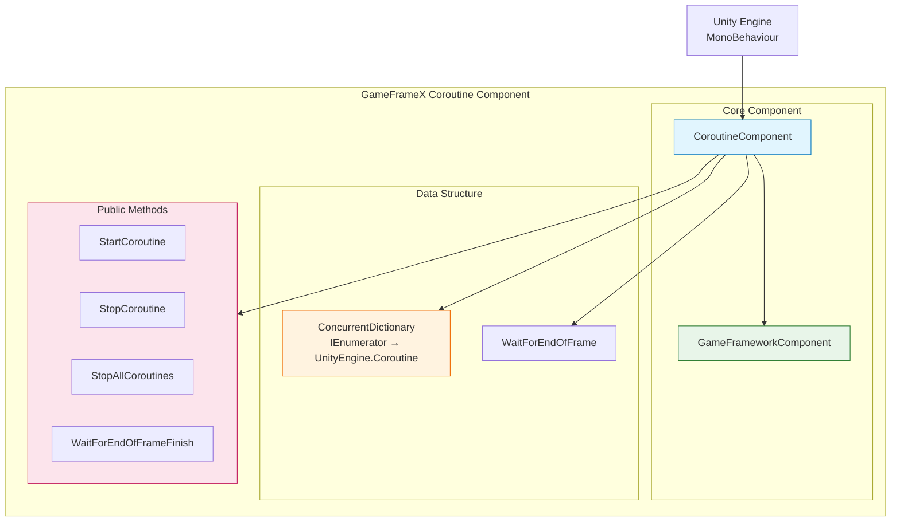
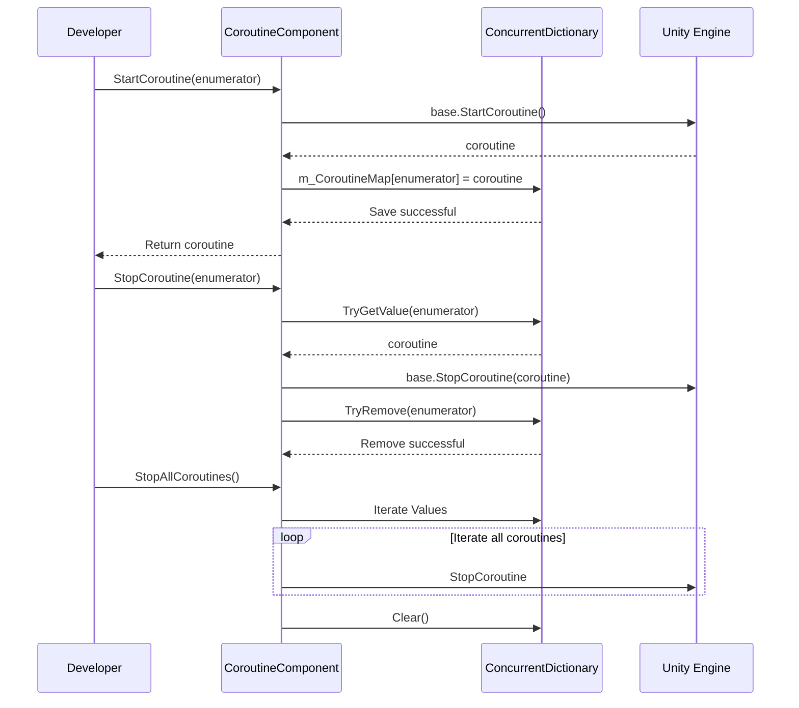

# Overview

GameFrameX Coroutine component is a Unity extension component that provides enhanced coroutine management functionality. By using a concurrent dictionary to track executing coroutines, it provides better control and access for starting, stopping, and cleaning up coroutines.

## Overview

**CoroutineComponent** is one of the core components of the GameFrameX game development framework, specifically designed for managing and executing Unity coroutines. This component extends Unity's built-in coroutine management functionality, solving some pain points in native coroutine management.

### Problems Solved

Native coroutine management in Unity has the following issues:

1. **Tracking Difficult**: Hard to get the status of started coroutines
2. **Stopping Complex**: Stopping coroutines using `IEnumerator` is not intuitive
3. **Memory Leak Risk**: Coroutines not properly stopped may cause memory leaks
4. **Cannot Batch Manage**: Cannot easily stop all coroutines

### Core Features

| Feature | Description |
|---------|-------------|
| Coroutine Tracking | Uses `ConcurrentDictionary` to record all started coroutines |
| Safe Stopping | Supports stopping coroutines via iterator and coroutine object |
| Batch Management | Provides functionality to stop all coroutines |
| End of Frame Callback | Provides convenient method to execute callbacks after current frame rendering |
| Singleton Restriction | Uses `[DisallowMultipleComponent]` to prevent duplicate additions |

## Architecture



### Component Structure Description

**CoroutineComponent** inherits from `GameFrameworkComponent`, integrating GameFrameX framework core functionality. The component maintains a `ConcurrentDictionary` internally to map the user-passed `IEnumerator` with Unity's internal `Coroutine` object, enabling more convenient coroutine management.

### Core Files

| File | Path | Description |
|------|------|-------------|
| CoroutineComponent.cs | Runtime/Coroutine/ | Main component implementation |
| CoroutineComponentInspector.cs | Editor/Inspector/ | Unity Editor inspector |
| GameFrameXCoroutineCroppingHelper.cs | Runtime/ | IL2CPP code preservation helper class |

## Core Features

### 1. Coroutine Start

`StartCoroutine` method overrides Unity MonoBehaviour's method of the same name, recording the coroutine to the internal dictionary while starting it:

```csharp
public new UnityEngine.Coroutine StartCoroutine(IEnumerator enumerator)
{
    var ret = base.StartCoroutine(enumerator);
    m_CoroutineMap[enumerator] = ret;
    return ret;
}
```

> Source: [CoroutineComponent.cs](https://github.com/GameFrameX/com.gameframex.unity.coroutine/blob/main/Runtime/Coroutine/CoroutineComponent.cs#L25-L30)

**Design Intent**: By saving the mapping relationship at startup, specific coroutines can be precisely stopped later through `IEnumerator`, solving the problem that native Unity coroutine API cannot stop by IEnumerator.

### 2. Coroutine Stop

The component provides two methods to stop coroutines:

**Stop via IEnumerator:**
```csharp
public new void StopCoroutine(IEnumerator enumerator)
{
    if (m_CoroutineMap.TryGetValue(enumerator, out var coroutine))
    {
        base.StopCoroutine(coroutine);
        m_CoroutineMap.TryRemove(enumerator, out _);
    }
    base.StopCoroutine(enumerator);
}
```

> Source: [CoroutineComponent.cs](https://github.com/GameFrameX/com.gameframex.unity.coroutine/blob/main/Runtime/Coroutine/CoroutineComponent.cs#L36-L45)

**Stop via UnityEngine.Coroutine:**
```csharp
public new void StopCoroutine(UnityEngine.Coroutine coroutine)
{
    base.StopCoroutine(coroutine);
    foreach (var item in m_CoroutineMap)
    {
        if (item.Value == coroutine)
        {
            m_CoroutineMap.TryRemove(item.Key, out _);
            break;
        }
    }
}
```

> Source: [CoroutineComponent.cs](https://github.com/GameFrameX/com.gameframex.unity.coroutine/blob/main/Runtime/Coroutine/CoroutineComponent.cs#L51-L62)

**Design Intent**: Provide flexible stopping methods, developers can choose the appropriate stopping method based on the reference type they hold (IEnumerator or Coroutine).

### 3. Stop All Coroutines

```csharp
public new void StopAllCoroutines()
{
    foreach (var coroutine in m_CoroutineMap.Values)
    {
        base.StopCoroutine(coroutine);
    }
    m_CoroutineMap.Clear();
    base.StopAllCoroutines();
}
```

> Source: [CoroutineComponent.cs](https://github.com/GameFrameX/com.gameframex.unity.coroutine/blob/main/Runtime/Coroutine/CoroutineComponent.cs#L67-L76)

**Design Intent**: When switching scenes or destroying objects, ensure all coroutines are cleanly stopped, preventing memory leaks and wild pointer issues.

### 4. End of Frame Callback

```csharp
public void WaitForEndOfFrameFinish(System.Action callback)
{
    StartCoroutine(_WaitForEndOfFrameFinish(callback));
}
```

> Source: [CoroutineComponent.cs](https://github.com/GameFrameX/com.gameframex.unity.coroutine/blob/main/Runtime/Coroutine/CoroutineComponent.cs#L94-L97)

**Design Intent**: Provide a convenient way to execute callbacks after the current frame rendering is complete. This is especially useful for scenarios that need to wait for UI updates to complete before calculations.

## Coroutine Management Flow



## Usage Examples

### Basic Usage

```csharp
IEnumerator YourCoroutine()
{
    // Coroutine execution content
    yield return null;
}

// Add component to game object
CoroutineComponent coroutineComponent = gameObject.AddComponent<CoroutineComponent>();

// Start coroutine
coroutineComponent.StartCoroutine(YourCoroutine());

// Stop coroutine
coroutineComponent.StopCoroutine(YourCoroutine());
```

> Source: [README.md](https://github.com/GameFrameX/com.gameframex.unity.coroutine/blob/main/README.md#L29-L42)

### End of Frame Callback

```csharp
void YourCallback()
{
    // Callback execution content
}

coroutineComponent.WaitForEndOfFrameFinish(YourCallback);
```

> Source: [README.md](https://github.com/GameFrameX/com.gameframex.unity.coroutine/blob/main/README.md#L59-L70)

## Notes

1. **Singleton Restriction**: Component uses `[DisallowMultipleComponent]` attribute, ensuring only one CoroutineComponent instance per GameObject.

2. **Manual Registration**: Sets `IsAutoRegister = false` in `Awake` method, meaning this component will not automatically register with the framework's core system.

3. **Code Preservation**: `GameFrameXCoroutineCroppingHelper` class ensures CoroutineComponent is not stripped during IL2CPP builds.

## Related Links

- [Installation](./2-installation.index)
- [Usage Guide](./3-getting-started.index)
- [API Reference](./4-api-reference.coroutine-component)
- [FAQ](./5-troubleshooting.index)
- [GitHub Repository](https://github.com/GameFrameX/com.gameframex.unity.coroutine.git)
- [GameFrameX Official Website](https://gameframex.doc.alianblank.com)