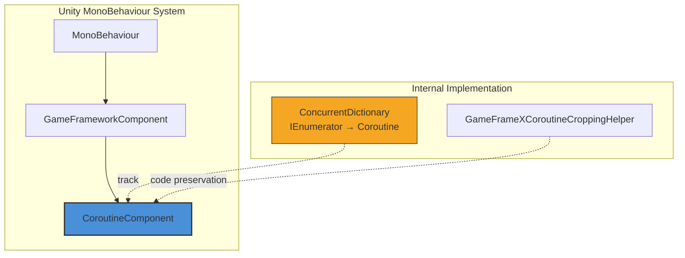

# CoroutineComponent

CoroutineComponent is one of the core components of the GameFrameX framework, providing interfaces that extend Unity's built-in coroutine management functionality. By using a concurrent dictionary to track executing coroutines, it provides better control for stopping and cleaning up coroutines.

## Overview

`CoroutineComponent` is a Unity `MonoBehaviour` component that inherits from `GameFrameworkComponent`. It encapsulates Unity's native coroutine functionality, adding coroutine tracking and management capabilities, helping developers more conveniently control coroutine lifecycle and prevent memory leak issues caused by not properly stopping coroutines.

### Core Features

- **Coroutine Tracking**: Uses `ConcurrentDictionary` to thread-safely track all started coroutines
- **Flexible Stopping**: Supports stopping individual coroutines via iterator or coroutine object
- **Batch Management**: Provides one-click stop all coroutines functionality
- **End of Frame Callback**: Provides a convenient method to execute callbacks after the current frame rendering is complete

## Architecture



### Component Hierarchy

- **MonoBehaviour**: Unity component base class
- **GameFrameworkComponent**: GameFrameX framework component base class
- **CoroutineComponent**: Coroutine management component (current document topic)

### Core Data Structure

`CoroutineComponent` uses `ConcurrentDictionary<IEnumerator, UnityEngine.Coroutine>` to maintain the coroutine mapping table:

```csharp
private readonly ConcurrentDictionary<IEnumerator, UnityEngine.Coroutine> m_CoroutineMap = new ConcurrentDictionary<IEnumerator, UnityEngine.Coroutine>();
```

> Source: [CoroutineComponent.cs](https://github.com/GameFrameX/com.gameframex.unity.coroutine/blob/main/Runtime/Coroutine/CoroutineComponent.cs#L18)

## Core Features

### Start Coroutine

`StartCoroutine` method overrides the Unity base class implementation. Not only does it start the coroutine, but it also adds it to the internal tracking dictionary:

```csharp
public new UnityEngine.Coroutine StartCoroutine(IEnumerator enumerator)
{
    var ret = base.StartCoroutine(enumerator);
    m_CoroutineMap[enumerator] = ret;
    return ret;
}
```

> Source: [CoroutineComponent.cs](https://github.com/GameFrameX/com.gameframex.unity.coroutine/blob/main/Runtime/Coroutine/CoroutineComponent.cs#L25-L30)

**Design Intent**: By tracking the mapping relationship between each iterator and its corresponding coroutine, precise coroutine stopping control is achieved.

### Stop Coroutine

The component provides two ways to stop coroutines:

**Method 1: Stop via Iterator**

```csharp
public new void StopCoroutine(IEnumerator enumerator)
{
    if (m_CoroutineMap.TryGetValue(enumerator, out var coroutine))
    {
        base.StopCoroutine(coroutine);
        m_CoroutineMap.TryRemove(enumerator, out _);
    }
    base.StopCoroutine(enumerator);
}
```

> Source: [CoroutineComponent.cs](https://github.com/GameFrameX/com.gameframex.unity.coroutine/blob/main/Runtime/Coroutine/CoroutineComponent.cs#L36-L45)

**Method 2: Stop via Coroutine Object**

```csharp
public new void StopCoroutine(UnityEngine.Coroutine coroutine)
{
    base.StopCoroutine(coroutine);
    foreach (var item in m_CoroutineMap)
    {
        if (item.Value == coroutine)
        {
            m_CoroutineMap.TryRemove(item.Key, out _);
            break;
        }
    }
}
```

> Source: [CoroutineComponent.cs](https://github.com/GameFrameX/com.gameframex.unity.coroutine/blob/main/Runtime/Coroutine/CoroutineComponent.cs#L51-L62)

### Stop All Coroutines

```csharp
public new void StopAllCoroutines()
{
    foreach (var coroutine in m_CoroutineMap.Values)
    {
        base.StopCoroutine(coroutine);
    }
    m_CoroutineMap.Clear();
    base.StopAllCoroutines();
}
```

> Source: [CoroutineComponent.cs](https://github.com/GameFrameX/com.gameframex.unity.coroutine/blob/main/Runtime/Coroutine/CoroutineComponent.cs#L67-L76)

**Design Intent**: Ensure all coroutines are properly stopped and internal tracking data is cleaned up, preventing memory leaks.

### End of Frame Callback

`WaitForEndOfFrameFinish` method allows executing callbacks after the current frame rendering is complete:

```csharp
private readonly WaitForEndOfFrame _waitForEndOfFrame = new WaitForEndOfFrame();

public void WaitForEndOfFrameFinish(System.Action callback)
{
    StartCoroutine(_WaitForEndOfFrameFinish(callback));
}
```

> Source: [CoroutineComponent.cs](https://github.com/GameFrameX/com.gameframex.unity.coroutine/blob/main/Runtime/Coroutine/CoroutineComponent.cs#L78-L97)

**Design Intent**: Provide convenient end-of-frame callback functionality, commonly used for operations that need to execute after the entire frame rendering is complete, such as UI update data synchronization.

## Usage Examples

### Basic Usage

```csharp
using GameFrameX.Coroutine.Runtime;
using UnityEngine;
using System.Collections;

public class CoroutineExample : MonoBehaviour
{
    private CoroutineComponent _coroutineComponent;

    private void Start()
    {
        // Get or add CoroutineComponent
        _coroutineComponent = gameObject.GetComponent<CoroutineComponent>();
        if (_coroutineComponent == null)
        {
            _coroutineComponent = gameObject.AddComponent<CoroutineComponent>();
        }

        // Start coroutine
        IEnumerator myCoroutine = MyCoroutine();
        _coroutineComponent.StartCoroutine(myCoroutine);
    }

    private IEnumerator MyCoroutine()
    {
        Debug.Log("Coroutine started");
        yield return new WaitForSeconds(1f);
        Debug.Log("Continuing after 1 second");
        yield return null;
        Debug.Log("Continuing next frame");
    }
}
```

### Stop Coroutine Example

```csharp
using GameFrameX.Coroutine.Runtime;
using UnityEngine;
using System.Collections;

public class StopCoroutineExample : MonoBehaviour
{
    private CoroutineComponent _coroutineComponent;
    private IEnumerator _runningCoroutine;

    private void Start()
    {
        _coroutineComponent = gameObject.AddComponent<CoroutineComponent>();
        
        // Start coroutine and save reference
        _runningCoroutine = LongRunningCoroutine();
        _coroutineComponent.StartCoroutine(_runningCoroutine);
        
        // Auto-stop after 5 seconds
        Invoke("StopMyCoroutine", 5f);
    }

    private IEnumerator LongRunningCoroutine()
    {
        int count = 0;
        while (true)
        {
            Debug.Log($"Running: {count++}");
            yield return new WaitForSeconds(1f);
        }
    }

    private void StopMyCoroutine()
    {
        // Stop coroutine via iterator
        if (_runningCoroutine != null)
        {
            _coroutineComponent.StopCoroutine(_runningCoroutine);
        }
    }
}
```

### End of Frame Callback Example

```csharp
using GameFrameX.Coroutine.Runtime;
using UnityEngine;
using UnityEngine.UI;

public class FrameEndCallbackExample : MonoBehaviour
{
    public Text statusText;
    private CoroutineComponent _coroutineComponent;

    private void Start()
    {
        _coroutineComponent = gameObject.AddComponent<CoroutineComponent>();
        
        // Update UI after frame rendering
        _coroutineComponent.WaitForEndOfFrameFinish(() =>
        {
            statusText.text = "UI Updated";
        });
    }
}
```

## API Reference

### Properties

| Property | Type | Description |
|----------|------|-------------|
| m_CoroutineMap | `ConcurrentDictionary<IEnumerator, UnityEngine.Coroutine>` | Mapping table storing all active coroutines |

### Methods

### `StartCoroutine(IEnumerator enumerator): UnityEngine.Coroutine`

Start a coroutine and add it to the tracking table.

**Parameters:**
- `enumerator` (IEnumerator): Coroutine iterator

**Returns:** UnityEngine.Coroutine - The started coroutine object

**Example:**
```csharp
IEnumerator coroutine = MyRoutine();
UnityEngine.Coroutine running = coroutineComponent.StartCoroutine(coroutine);
```

---

### `StopCoroutine(IEnumerator enumerator): void`

Stop a coroutine via iterator reference.

**Parameters:**
- `enumerator` (IEnumerator): Iterator of the coroutine to stop

**Description:** This method removes the coroutine reference from the tracking table as well, ensuring complete cleanup.

**Example:**
```csharp
IEnumerator myCoroutine = MyRoutine();
coroutineComponent.StartCoroutine(myCoroutine);
// ... some logic later
coroutineComponent.StopCoroutine(myCoroutine);
```

---

### `StopCoroutine(UnityEngine.Coroutine coroutine): void`

Stop a coroutine via coroutine object.

**Parameters:**
- `coroutine` (UnityEngine.Coroutine): Coroutine object to stop

**Description:** If the coroutine exists in the tracking table, the mapping relationship is also cleaned up.

**Example:**
```csharp
var running = coroutineComponent.StartCoroutine(MyRoutine());
coroutineComponent.StopCoroutine(running);
```

---

### `StopAllCoroutines(): void`

Stop all coroutines started by this component.

**Description:** This method traverses and stops all tracked coroutines while clearing the internal tracking table.

**Example:**
```csharp
// Clean up all coroutines during scene transition
coroutineComponent.StopAllCoroutines();
```

---

### `WaitForEndOfFrameFinish(System.Action callback): void`

Execute callback after the current frame rendering is complete.

**Parameters:**
- `callback` (System.Action): Callback method to execute

**Description:** Internally uses `WaitForEndOfFrame` to implement. Commonly used for operations that need to execute after the entire rendering process is complete.

**Example:**
```csharp
coroutineComponent.WaitForEndOfFrameFinish(() =>
{
    Debug.Log("Current frame has finished rendering");
});
```

---

## Component Configuration

### Unity Editor Configuration

`CoroutineComponent` has the following characteristics in the Unity Editor:

| Characteristic | Value | Description |
|----------------|-------|-------------|
| Menu Path | Game Framework/Coroutine | Menu location when adding component |
| Allow Duplicates | No | Limited by `[DisallowMultipleComponent]` |
| Auto Registration | No | `IsAutoRegister = false`, requires manual addition |

### Code Preservation (IL2CPP)

To prevent the component from being removed due to IL2CPP code stripping, the framework provides the `GameFrameXCoroutineCroppingHelper` helper class:

```csharp
[Preserve]
public class GameFrameXCoroutineCroppingHelper : MonoBehaviour
{
    [Preserve]
    private void Start()
    {
        _ = typeof(CoroutineComponent);
    }
}
```

> Source: [GameFrameXCoroutineCroppingHelper.cs](https://github.com/GameFrameX/com.gameframex.unity.coroutine/blob/main/Runtime/GameFrameXCoroutineCroppingHelper.cs#L7-L14)

**Design Intent**: By referencing the `CoroutineComponent` type, ensure this type is not removed during IL2CPP builds.

## Related Links

- [Overview](../1-overview.index)
- [Installation](../2-installation.index)
- [Usage Guide](../3-getting-started.index)
- [Troubleshooting](../5-troubleshooting.index)
- [GitHub Repository](https://github.com/GameFrameX/com.gameframex.unity.coroutine.git)