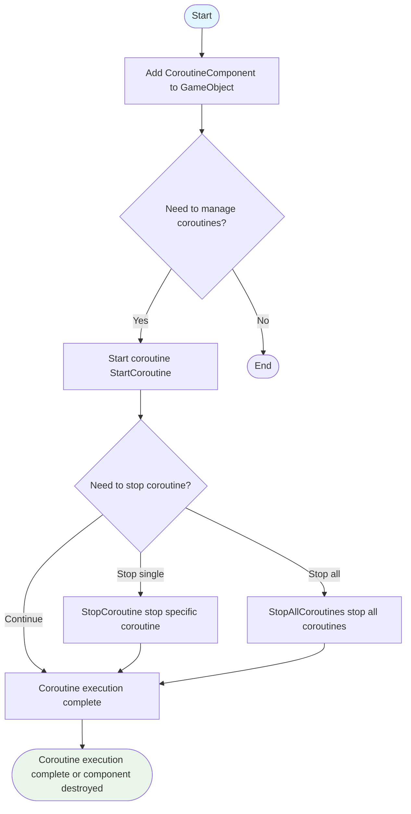
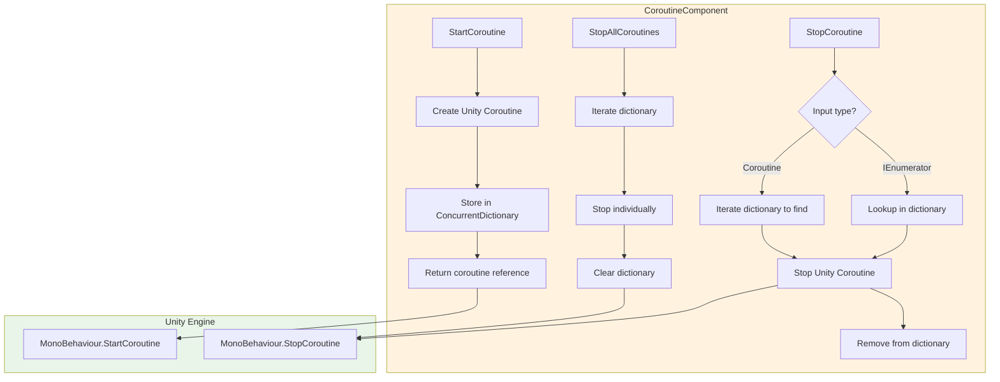

# Usage Guide

This guide will help you quickly get started with the CoroutineComponent, mastering core methods for managing and controlling coroutines in Unity projects.

## Overview

CoroutineComponent is a coroutine management component provided by the GameFrameX framework, extending Unity's built-in coroutine functionality. This component tracks all started coroutines using a concurrent dictionary (ConcurrentDictionary), providing more refined lifecycle control capabilities and helping developers avoid coroutine leaks and management chaos issues.

**Why Use CoroutineComponent?**

In large Unity projects, coroutine management often becomes a maintenance difficulty. When switching scenes or destroying objects, coroutines not properly stopped can cause memory leaks, logic errors, or even crashes. CoroutineComponent provides a unified coroutine management interface, making starting, stopping, and tracking coroutines simple and controllable.

## Core Features Overview

| Feature | Description |
|---------|-------------|
| Start Coroutine | Start coroutine using iterator and auto-track |
| Stop Single Coroutine | Stop via iterator reference or coroutine object |
| Stop All Coroutines | One-click cleanup of all running coroutines |
| End of Frame Callback | Execute callback after current frame rendering is complete |

## Workflow

The following flowchart shows a typical workflow of CoroutineComponent:



## Basic Usage

### Step 1: Add Component to Scene

In Unity Editor, you can add CoroutineComponent by:

1. Right-click in the Hierarchy panel on the game object
2. Select **Game Framework -> Coroutine** menu item
3. Component will be added to the selected game object

> **Note**: Due to `[DisallowMultipleComponent]` attribute, each game object can only have one CoroutineComponent.

### Step 2: Use in Code

Get the component instance in the script and use coroutine functionality:

```csharp
using System.Collections;
using GameFrameX.Coroutine.Runtime;
using UnityEngine;

public class Example : MonoBehaviour
{
    private CoroutineComponent _coroutineComponent;

    private void Start()
    {
        // Get or add CoroutineComponent
        _coroutineComponent = gameObject.GetComponent<CoroutineComponent>();
        if (_coroutineComponent == null)
        {
            _coroutineComponent = gameObject.AddComponent<CoroutineComponent>();
        }
    }
}
```
> Source: [CoroutineComponent.cs](https://github.com/GameFrameX/com.gameframex.unity.coroutine/blob/main/Runtime/Coroutine/CoroutineComponent.cs#L25-L30)

## Usage Examples

### Example 1: Start and Stop Coroutine

The following example shows how to start a coroutine and stop it under certain conditions:

```csharp
using System.Collections;
using GameFrameX.Coroutine.Runtime;
using UnityEngine;

public class CoroutineExample : MonoBehaviour
{
    private CoroutineComponent _coroutineComponent;
    private IEnumerator _runningCoroutine;

    private void Start()
    {
        _coroutineComponent = gameObject.AddComponent<CoroutineComponent>();
        
        // Start coroutine and save reference
        _runningCoroutine = MyProcessCoroutine();
        _coroutineComponent.StartCoroutine(_runningCoroutine);
    }

    private IEnumerator MyProcessCoroutine()
    {
        while (true)
        {
            Debug.Log("Coroutine executing...");
            yield return null;
        }
    }

    private void OnDestroy()
    {
        // Ensure coroutines are stopped when object is destroyed
        if (_runningCoroutine != null)
        {
            _coroutineComponent.StopCoroutine(_runningCoroutine);
        }
    }
}
```
> Sources:
> - [CoroutineComponent.cs](https://github.com/GameFrameX/com.gameframex.unity.coroutine/blob/main/Runtime/Coroutine/CoroutineComponent.cs#L25-L30)
> - [CoroutineComponent.cs](https://github.com/GameFrameX/com.gameframex.unity.coroutine/blob/main/Runtime/Coroutine/CoroutineComponent.cs#L36-L45)

### Example 2: Stop All Coroutines

When you need to clean up all running coroutines (e.g., during scene transition):

```csharp
using System.Collections;
using GameFrameX.Coroutine.Runtime;
using UnityEngine;

public class CleanupExample : MonoBehaviour
{
    private CoroutineComponent _coroutineComponent;

    private void Start()
    {
        _coroutineComponent = gameObject.AddComponent<CoroutineComponent>();
        
        // Start multiple coroutines
        _coroutineComponent.StartCoroutine(TaskA());
        _coroutineComponent.StartCoroutine(TaskB());
        _coroutineComponent.StartCoroutine(TaskC());
    }

    private IEnumerator TaskA()
    {
        for (int i = 0; i < 10; i++)
        {
            Debug.Log("Task A: " + i);
            yield return null;
        }
    }

    private IEnumerator TaskB()
    {
        for (int i = 0; i < 10; i++)
        {
            Debug.Log("Task B: " + i);
            yield return null;
        }
    }

    private IEnumerator TaskC()
    {
        for (int i = 0; i < 10; i++)
        {
            Debug.Log("Task C: " + i);
            yield return null;
        }
    }

    public void OnSceneChange()
    {
        // Stop all coroutines
        _coroutineComponent.StopAllCoroutines();
        Debug.Log("All coroutines stopped");
    }
}
```
> Source: [CoroutineComponent.cs](https://github.com/GameFrameX/com.gameframex.unity.coroutine/blob/main/Runtime/Coroutine/CoroutineComponent.cs#L67-L76)

### Example 3: End of Frame Callback

Use `WaitForEndOfFrameFinish` to execute operations after frame rendering, commonly used for screenshots, UI updates, etc.:

```csharp
using GameFrameX.Coroutine.Runtime;
using UnityEngine;

public class EndOfFrameExample : MonoBehaviour
{
    private CoroutineComponent _coroutineComponent;

    private void Start()
    {
        _coroutineComponent = gameObject.AddComponent<CoroutineComponent>();
    }

    private void OnGUI()
    {
        if (GUI.Button(new Rect(10, 10, 200, 50), "Capture Screenshot"))
        {
            CaptureScreenshot();
        }
    }

    private void CaptureScreenshot()
    {
        // Execute screenshot after frame rendering
        _coroutineComponent.WaitForEndOfFrameFinish(() =>
        {
            ScreenCapture.CaptureScreenshot("screenshot.png");
            Debug.Log("Screenshot saved");
        });
    }
}
```
> Source: [CoroutineComponent.cs](https://github.com/GameFrameX/com.gameframex.unity.coroutine/blob/main/Runtime/Coroutine/CoroutineComponent.cs#L94-L97)

### Example 4: Stop via Coroutine Object

If you only have a reference to Unity's Coroutine object, you can also stop it directly:

```csharp
using System.Collections;
using GameFrameX.Coroutine.Runtime;
using UnityEngine;

public class StopByCoroutineExample : MonoBehaviour
{
    private CoroutineComponent _coroutineComponent;
    private UnityEngine.Coroutine _unityCoroutine;

    private void Start()
    {
        _coroutineComponent = gameObject.AddComponent<CoroutineComponent>();
        
        // Start coroutine
        _unityCoroutine = _coroutineComponent.StartCoroutine(LongRunningTask());
    }

    private IEnumerator LongRunningTask()
    {
        Debug.Log("Task started");
        yield return new WaitForSeconds(5f);
        Debug.Log("Task completed");
    }

    private void Update()
    {
        // Stop coroutine when space is pressed
        if (Input.GetKeyDown(KeyCode.Space))
        {
            if (_unityCoroutine != null)
            {
                _coroutineComponent.StopCoroutine(_unityCoroutine);
                Debug.Log("Coroutine stopped");
            }
        }
    }
}
```
> Source: [CoroutineComponent.cs](https://github.com/GameFrameX/com.gameframex.unity.coroutine/blob/main/Runtime/Coroutine/CoroutineComponent.cs#L51-L62)

## Internal Implementation Mechanism

Understanding the component's internal implementation helps use it better:



The component uses `ConcurrentDictionary<IEnumerator, UnityEngine.Coroutine>` to maintain the coroutine mapping table. This design ensures:
- **Thread Safety**: Safe access in multi-threaded environments
- **Bidirectional Tracking**: Can stop via iterator or coroutine object
- **Auto Cleanup**: Automatically removes from dictionary when stopping coroutine

## Best Practices

### 1. Clean Up Coroutines in OnDestroy

Always stop coroutines in MonoBehaviour's `OnDestroy` lifecycle method to avoid memory leaks:

```csharp
private void OnDestroy()
{
    // Method 1: Stop all coroutines
    _coroutineComponent.StopAllCoroutines();
    
    // Method 2: Stop specific coroutines
    // _coroutineComponent.StopCoroutine(_myCoroutine);
}
```

### 2. Avoid Duplicate Coroutine Starts

Check if already running before starting coroutine:

```csharp
private bool _isCoroutineRunning = false;

private void TryStartCoroutine()
{
    if (!_isCoroutineRunning)
    {
        _isCoroutineRunning = true;
        _coroutineComponent.StartCoroutine(MyCoroutine());
    }
}

private IEnumerator MyCoroutine()
{
    try
    {
        yield return null;
    }
    finally
    {
        _isCoroutineRunning = false;
    }
}
```

### 3. Cleanup During Scene Transition

Stop all coroutines before scene transition to ensure clean transition:

```csharp
// In scene manager's transition logic
public void ChangeScene(string sceneName)
{
    // Stop all coroutines
    _coroutineComponent.StopAllCoroutines();
    
    // Load new scene
    SceneManager.LoadScene(sceneName);
}
```

## Related Links

- [Overview](./1-overview.index) - Learn CoroutineComponent's complete features and design philosophy
- [Installation](./2-installation.index) - Detailed installation steps and dependency configuration
- [API Reference](./4-api-reference.coroutine-component) - Complete API method signatures and parameter descriptions
- [Troubleshooting](./5-troubleshooting.index) - Common issues and solutions

## Code Example References

Code examples in this guide are based on the following source files:

- [CoroutineComponent.cs](https://github.com/GameFrameX/com.gameframex.unity.coroutine/blob/main/Runtime/Coroutine/CoroutineComponent.cs) - Core coroutine component implementation
- [CoroutineComponentInspector.cs](https://github.com/GameFrameX/com.gameframex.unity.coroutine/blob/main/Editor/Inspector/CoroutineComponentInspector.cs) - Unity Editor inspector window