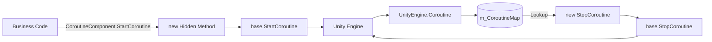

# How It Works: Coroutine Tracking and Component Lifecycle

`CoroutineComponent` overlays a layer of reference tracking on top of native Unity APIs, establishing a one-to-one mapping between "started coroutines" and "IEnumerator instances," thereby ensuring that subsequent precise stops can be performed using the same `IEnumerator` reference. The component itself participates in the GameFrameX framework's lifecycle scheduling as a `GameFrameworkComponent`.

## Core Mechanisms

### 1. Reference Tracking with ConcurrentDictionary

The component internally maintains a thread-safe dictionary where the key is `IEnumerator` and the value is `UnityEngine.Coroutine`.

```csharp
private readonly ConcurrentDictionary<IEnumerator, UnityEngine.Coroutine> m_CoroutineMap
    = new ConcurrentDictionary<IEnumerator, UnityEngine.Coroutine>();
```

Source: [CoroutineComponent.cs](https://github.com/GameFrameX/com.gameframex.unity.coroutine/blob/main/Runtime/Coroutine/CoroutineComponent.cs#L21)

`StartCoroutine` hides the base class method using the `new` keyword: it first calls `base.StartCoroutine`, then writes the returned `UnityEngine.Coroutine` into the dictionary:

```csharp
public new UnityEngine.Coroutine StartCoroutine(IEnumerator enumerator)
{
    var ret = base.StartCoroutine(enumerator);
    m_CoroutineMap[enumerator] = ret;
    return ret;
}
```

Source: [CoroutineComponent.cs](https://github.com/GameFrameX/com.gameframex.unity.coroutine/blob/main/Runtime/Coroutine/CoroutineComponent.cs#L28-L33)

### 2. Using `new` to Hide Base Class Methods Ensures a Single Tracking Entry Point

All four Start/Stop methods override the `MonoBehaviour` base class members using the `new` keyword. If called through a non-`CoroutineComponent` reference (for example, directly `gameObject.GetComponent<MonoBehaviour>().StartCoroutine(...)`), the tracking dictionary will not be written to, and subsequent `StopCoroutine` calls will fail to hit.

| Method | Behavior |
|------|------|
| `StartCoroutine(IEnumerator)` | Starts and stores in `m_CoroutineMap` |
| `StopCoroutine(IEnumerator)` | Looks up the `UnityEngine.Coroutine` in the dictionary then calls `base.StopCoroutine`; if not found, falls back to `base.StopCoroutine(enumerator)` |
| `StopCoroutine(UnityEngine.Coroutine)` | Directly calls `base.StopCoroutine`, then linearly scans the dictionary to remove the corresponding entry |
| `StopAllCoroutines()` | First stops coroutines in the dictionary one by one, clears the dictionary, then calls `base.StopAllCoroutines()` as a fallback cleanup for untracked coroutines |

Source: [CoroutineComponent.cs](https://github.com/GameFrameX/com.gameframex.unity.coroutine/blob/main/Runtime/Coroutine/CoroutineComponent.cs#L39-L82)

### 3. Component Lifecycle Integration

`CoroutineComponent` inherits from `GameFrameworkComponent` and carries the `[GameFrameXAutoComponent(-6500)]` attribute, indicating that it is automatically registered by the framework into the global component system based on priority.

```csharp
[DisallowMultipleComponent]
[AddComponentMenu("GameFrameX/Coroutine")]
[GameFrameXAutoComponent(-6500)]
public class CoroutineComponent : GameFrameworkComponent
```

Source: [CoroutineComponent.cs](https://github.com/GameFrameX/com.gameframex.unity.coroutine/blob/main/Runtime/Coroutine/CoroutineComponent.cs#L12-L15)

In `Awake`, automatic registration is explicitly disabled to avoid conflicts with the framework's registration logic:

```csharp
protected override void Awake()
{
    IsAutoRegister = false;
    base.Awake();
}
```

Source: [CoroutineComponent.cs](https://github.com/GameFrameX/com.gameframex.unity.coroutine/blob/main/Runtime/Coroutine/CoroutineComponent.cs#L106-L110)

### 4. End-of-Frame Callback Wrapper

The component additionally provides `WaitForEndOfFrameFinish`, which internally yields a reused `WaitForEndOfFrame` instance and then triggers the callback:

```csharp
private readonly WaitForEndOfFrame _waitForEndOfFrame = new WaitForEndOfFrame();

private IEnumerator WaitForEndOfFrameFinishInternal(System.Action callback)
{
    yield return _waitForEndOfFrame;
    callback?.Invoke();
}

public void WaitForEndOfFrameFinish(System.Action callback)
{
    StartCoroutine(WaitForEndOfFrameFinishInternal(callback));
}
```

Source: [CoroutineComponent.cs](https://github.com/GameFrameX/com.gameframex.unity.coroutine/blob/main/Runtime/Coroutine/CoroutineComponent.cs#L84-L104)

If a coroutine is terminated by `StopCoroutine` or `StopAllCoroutines` before the end of the frame, the `callback` will not execute.

### 5. IL2CPP Link Protection

`GameFrameXCoroutineCroppingHelper` is an empty `MonoBehaviour` that references the `CoroutineComponent` type only in `Start`. The purpose is to mark `CoroutineComponent` as preserved in IL2CPP / stripping scenarios, preventing it from being mistakenly removed by static analysis:

```csharp
[Preserve]
public class GameFrameXCoroutineCroppingHelper : MonoBehaviour
{
    [Preserve]
    private void Start()
    {
        _ = typeof(CoroutineComponent);
    }
}
```

Source: [GameFrameXCoroutineCroppingHelper.cs](https://github.com/GameFrameX/com.gameframex.unity.coroutine/blob/main/Runtime/GameFrameXCoroutineCroppingHelper.cs#L1-L14)

## Data Flow



## Invocation Constraints

- `IEnumerator` uses reference equality as the dictionary key, so `StopCoroutine` must be passed the exact same `IEnumerator` instance as `StartCoroutine`; otherwise, it will take the "not found" fallback branch.
- `StartCoroutine`/`StopCoroutine` must be invoked through a reference of type `CoroutineComponent`; calling the base class `MonoBehaviour` methods directly will not be tracked.
- The dictionary uses `ConcurrentDictionary`, so even if `IEnumerator` is constructed on a non-main thread (such as iterators generated by the task system), writes and lookups are thread-safe; however, the actual starting/stopping of `UnityEngine.Coroutine` is still constrained to the Unity main thread.

## Related Links

- For information on how components integrate with the GameFrameX framework, see the source code of `GameFrameworkComponent` and `[GameFrameXAutoComponent]`.
- For native Unity coroutine semantics, refer to the official Unity documentation for `MonoBehaviour.StartCoroutine`.