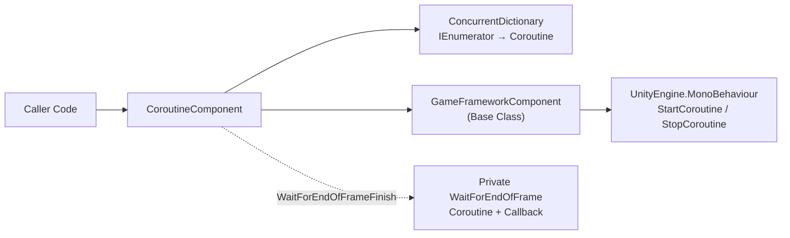

# Getting to Know the Coroutine Component

`CoroutineComponent` is a wrapper component around Unity's native coroutine API in the GameFrameX framework. Its core value lies in **tracking and managing** all coroutines started through it — it can precisely stop individual coroutines by iterator or `UnityEngine.Coroutine` handle, clean them all up at once, and also provides a convenient "end-of-frame callback" interface.

## Quick Start

### 1. Install the Package

Add the GameFrameX registry to the `scopedRegistries` of `Packages/manifest.json` in your Unity project, then declare it in `dependencies`:

```json
{
  "scopedRegistries": [
    {
      "name": "GameFrameX",
      "url": "https://gameframex.upm.alianblank.uk",
      "scopes": ["com.gameframex"]
    }
  ],
  "dependencies": {
    "com.gameframex.unity.coroutine": "1.0.3"
  }
}
```

Source: [README.zh-CN.md](https://github.com/GameFrameX/com.gameframex.unity.coroutine/blob/main/README.zh-CN.md#L50-L65)

### 2. Add the Component to a Scene Object

Since the class is decorated with `[DisallowMultipleComponent]` and `[AddComponentMenu("GameFrameX/Coroutine")]`, only one instance can be attached to the same GameObject; the framework also auto-registers it via `[GameFrameXAutoComponent(-6500)]`.

```csharp
CoroutineComponent coroutineComponent = gameObject.AddComponent<CoroutineComponent>();
```

Source: [CoroutineComponent.cs](https://github.com/GameFrameX/com.gameframex.unity.coroutine/blob/main/Runtime/Coroutine/CoroutineComponent.cs#L12-L15)

### 3. Start and Manage Coroutines

```csharp
IEnumerator YourCoroutine()
{
    // Coroutine execution content
    yield return null;
}

coroutineComponent.StartCoroutine(YourCoroutine());
```

Source: [README.zh-CN.md](https://github.com/GameFrameX/com.gameframex.unity.coroutine/blob/main/README.zh-CN.md#L82-L91)

## How It Works at a Glance

Internally, the component uses a `ConcurrentDictionary<IEnumerator, UnityEngine.Coroutine>` to maintain an "iterator → Unity coroutine handle" mapping. All `StartCoroutine`/`StopCoroutine`/`StopAllCoroutines` hide the base class methods via the `new` keyword — they first operate on this mapping, then delegate the actual Unity calls to the `GameFrameworkComponent` base class.



## Core API Overview

| Method | Purpose | Key Points |
|------|------|--------|
| `StartCoroutine(IEnumerator)` | Starts a coroutine and adds it to the tracking table | Returns `UnityEngine.Coroutine` |
| `StopCoroutine(IEnumerator)` | Stops by iterator | Must pass the same `IEnumerator` instance used in `StartCoroutine` |
| `StopCoroutine(UnityEngine.Coroutine)` | Stops by handle | Internally iterates the dictionary to find the corresponding key and removes it |
| `StopAllCoroutines()` | Stops all tracked and untracked coroutines | First stops tracked items, clears the dictionary, then calls the base class |
| `WaitForEndOfFrameFinish(Action)` | Executes the callback after the current frame finishes rendering | If stopped by `StopCoroutine` before the frame ends, the callback will not trigger |

## What's Next

- Want to follow the steps to run your first coroutine: see "How to Start and Stop Coroutines"
- Encountering issues like `StopCoroutine` not working or callbacks not firing: see "What to Do About Coroutine Issues"
- Need complete API signatures and default values: see "CoroutineComponent API Reference"