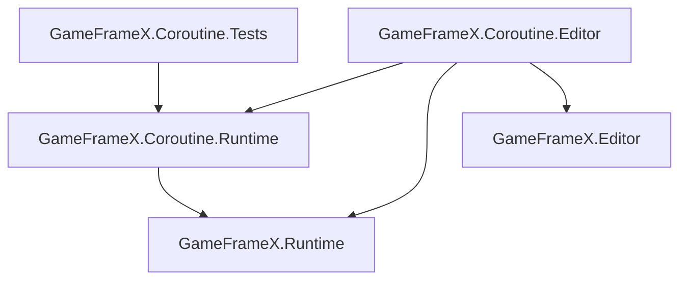

# Package Configuration and Assembly Reference

This page documents all metadata and assembly definitions for the `com.gameframex.unity.coroutine` package, used for troubleshooting dependencies, version compatibility, and assembly reference issues.

## Package Metadata (package.json)

| Field | Value |
|------|-----|
| `name` | `com.gameframex.unity.coroutine` |
| `displayName` | `Game Frame X Coroutine` |
| `category` | `GameFrameX` |
| `version` | `1.2.0` |
| `unity` | `2019.4` (minimum supported version) |
| `keywords` | `GameFrameX`, `Coroutine` |
| `dependencies` | `com.gameframex.unity: 2.5.1` |
| `publishConfig.access` | `public` |
| `publishConfig.registry` | `https://npm.cnb.cool/GameFrameX/npm/-/packages/` |
| `documentationUrl` | `https://gameframex.doc.alianblank.com` |
| `changelogUrl` | `https://github.com/gameframex/com.gameframex.unity.coroutine/blob/main/CHANGELOG.md` |
| `licensesUrl` | `https://github.com/gameframex/com.gameframex.unity.coroutine/blob/main/LICENSE.md` |

## Assembly List

The package contains three assemblies (`.asmdef`). All assemblies have `autoReferenced` set to `true`, meaning other scripts in the same project can directly use types from them without manually adding references.

| Assembly Name | File | Target Platform | References |
|---------|------|---------|------|
| `GameFrameX.Coroutine.Runtime` | [Runtime/GameFrameX.Coroutine.Runtime.asmdef](https://github.com/GameFrameX/com.gameframex.unity.coroutine/blob/main/Runtime/GameFrameX.Coroutine.Runtime.asmdef) | All Platforms | `GameFrameX.Runtime` |
| `GameFrameX.Coroutine.Editor` | [Editor/GameFrameX.Coroutine.Editor.asmdef](https://github.com/GameFrameX/com.gameframex.unity.coroutine/blob/main/Editor/GameFrameX.Coroutine.Editor.asmdef) | `Editor` | `GameFrameX.Coroutine.Runtime`, `GameFrameX.Editor`, `GameFrameX.Runtime` |
| `GameFrameX.Coroutine.Tests` | [Tests/GameFrameX.Coroutine.Tests.asmdef](https://github.com/GameFrameX/com.gameframex.unity.coroutine/blob/main/Tests/GameFrameX.Coroutine.Tests.asmdef) | `Editor` | `GameFrameX.Coroutine.Runtime` |

## Key Fields of Each Assembly

| Field | Runtime | Editor | Tests |
|------|---------|--------|-------|
| `rootNamespace` | `GameFrameX.Coroutine.Runtime` | (Not set) | `GameFrameX.Coroutine.Tests` |
| `includePlatforms` | (Empty, all platforms) | `Editor` | `Editor` |
| `allowUnsafeCode` | `true` | `false` | `false` |
| `overrideReferences` | `false` | `false` | `false` |
| `autoReferenced` | `true` | `true` | `true` |
| `precompiledReferences` | (Empty) | (Empty) | (Empty) |
| `defineConstraints` | (Empty) | (Empty) | (Empty) |

## Dependency Graph

## Quick Troubleshooting

| Symptom | Cause | Fix |
|------|------|------|
| Cannot find the `GameFrameX.Coroutine` namespace | The package is not imported or the upstream `com.gameframex.unity` package is not enabled | Confirm in `manifest.json` that both `com.gameframex.unity.coroutine` and `com.gameframex.unity@2.5.1` are present |
| Editor platform compilation error: `GameFrameX.Editor` not found | The upstream Editor assembly is not imported | Confirm that `com.gameframex.unity@2.5.1` is installed and provides `GameFrameX.Editor` |
| Referencing the Editor assembly on a non-Editor platform | The Editor assembly restricts `includePlatforms: ["Editor"]` | Move the corresponding code to the Runtime assembly or wrap it with `#if UNITY_EDITOR` |
| Want to disable auto-reference | `autoReferenced: true` | Explicitly add `GameFrameX.Coroutine.Runtime` to the `references` field of your own `.asmdef` |

## Package Source References

- [package.json](https://github.com/GameFrameX/com.gameframex.unity.coroutine/blob/main/package.json)
- [Runtime/GameFrameX.Coroutine.Runtime.asmdef](https://github.com/GameFrameX/com.gameframex.unity.coroutine/blob/main/Runtime/GameFrameX.Coroutine.Runtime.asmdef)
- [Editor/GameFrameX.Coroutine.Editor.asmdef](https://github.com/GameFrameX/com.gameframex.unity.coroutine/blob/main/Editor/GameFrameX.Coroutine.Editor.asmdef)
- [Tests/GameFrameX.Coroutine.Tests.asmdef](https://github.com/GameFrameX/com.gameframex.unity.coroutine/blob/main/Tests/GameFrameX.Coroutine.Tests.asmdef)