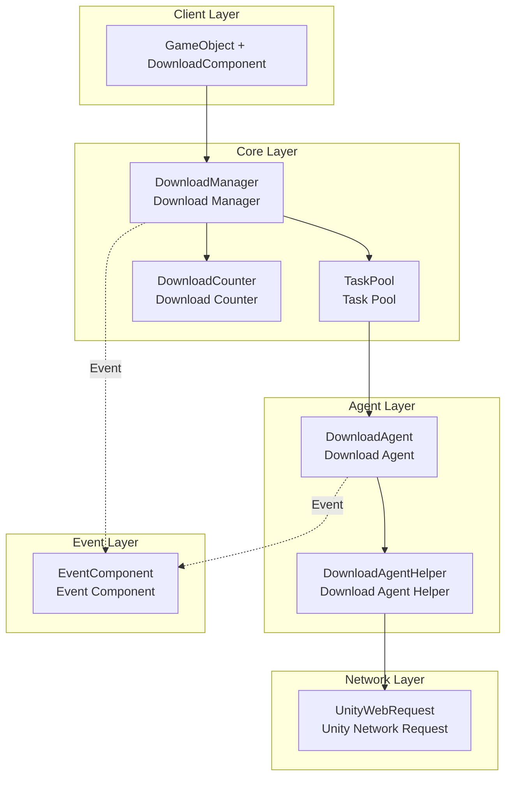
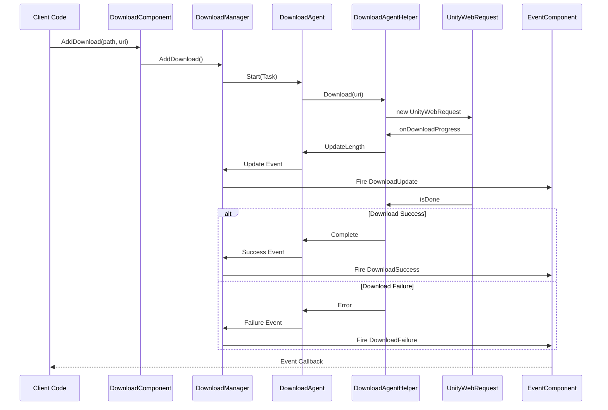

# Plugin Introduction

The GameFrameX Download task component is one of the core modules of the GameFrameX game framework, providing an efficient and reliable resource download solution specifically designed for Unity game projects. The component features a modular design that supports enterprise-level capabilities such as multi-threaded concurrent downloads, breakpoint resume, and task priority management.

## Overview

The GameFrameX Download component is a fully-featured download management system designed to help Unity developers easily implement remote download and update functionality for game resources. The component follows the principles of high cohesion and low coupling, providing full-lifecycle status tracking through an event-driven mechanism, enabling developers to flexibly control the creation, management, and monitoring of download tasks.

The core value of this component lies in providing out-of-the-box download functionality. Developers do not need to worry about the complexity of the underlying network implementation and can complete complex download tasks with simple API calls. At the same time, the component supports custom download agent helpers, allowing developers to replace or extend the download implementation based on project requirements.

From an architectural perspective, the Download component is built on top of the GameFrameX framework's module system and is tightly integrated with the Event component, transmitting download status changes externally through a unified event mechanism. This design completely separates download logic from business logic, resulting in cleaner and more maintainable code.

## Core Features

This download component provides comprehensive enterprise-level download management capabilities to meet various complex game resource download scenarios. The following are the main features of the component:

### Multi-Task Concurrent Downloads

The component internally uses a TaskPool mechanism to manage download tasks and supports configuring multiple download agents to work simultaneously. Developers can adjust the concurrency level according to actual needs, balancing download speed and system resource consumption. The task pool automatically schedules task execution order, ensuring high-priority tasks are processed first while reasonably allocating system bandwidth resources.

```csharp
// Configure the number of download agents, default value is 3
[SerializeField] private int m_DownloadAgentHelperCount = 3;
```
> Source: [DownloadComponent.cs](https://github.com/GameFrameX/com.gameframex.unity.download/blob/main/Runtime/Download/DownloadComponent.cs#L37)

### Breakpoint Resume Support

The component has built-in breakpoint resume functionality. During the download process, data is first written to a `.download` temporary file. When a download is interrupted (whether due to network issues or application exit) and restarted, the system automatically detects the already downloaded portion and resumes from the breakpoint, avoiding wasted bandwidth and time from re-downloading.

```csharp
// Detect and continue unfinished downloads
if (File.Exists(downloadFile))
{
    m_FileStream = File.OpenWrite(downloadFile);
    m_FileStream.Seek(0L, SeekOrigin.End);
    m_StartLength = m_SavedLength = m_FileStream.Length;
}
```
> Source: [DownloadManager.DownloadAgent.cs](https://github.com/GameFrameX/com.gameframex.unity.download/blob/main/Runtime/Download/Download/DownloadManager.DownloadAgent.cs#L173-L178)

### Task Priority Management

Each download task can be assigned a priority (an integer value, where higher values indicate higher priority). The task pool schedules download order based on priority. In game update scenarios, critical resources (such as initial scenes and core configurations) can be set to high priority to ensure important content is downloaded first.

### Real-Time Progress Tracking

The component provides a complete download event system, including four states: download start, progress update, download success, and download failure. Developers can subscribe to these events to get real-time download progress, speed statistics, and other information, and use this to update the user interface or execute corresponding business logic.

### Download Speed Statistics

The built-in download counter module can calculate the current download speed (bytes/second) in real time. This feature is very helpful for displaying download progress to users and optimizing the download experience. Developers can retrieve the current download speed value through the `CurrentSpeed` property.

```csharp
/// <summary>
/// Get the current download speed.
/// </summary>
public float CurrentSpeed
{
    get { return m_DownloadManager.CurrentSpeed; }
}
```
> Source: [DownloadComponent.cs](https://github.com/GameFrameX/com.gameframex.unity.download/blob/main/Runtime/Download/DownloadComponent.cs#L105-L108)

### Task Tag Management

Supports setting tags for download tasks, allowing batch querying or removal of related tasks by tag. This feature is particularly useful when managing similar types of resources (such as language packs, map data), enabling unified operations on a specific category of resources at once.

## Architecture Design

The GameFrameX Download component adopts a layered architecture design, where each layer has clear responsibilities and communicates with other layers through interfaces, achieving good decoupling.



### Layer Responsibilities

**Client Layer (DownloadComponent)**

The client layer is the entry point for direct developer interaction, represented as a component on a Unity game object. DownloadComponent inherits from GameFrameworkComponent and is responsible for initializing the download manager, registering event callbacks, handling task addition and removal, and other front-end work. It encapsulates the complex internal implementation into a simple API for business code to call.

As a Unity component, DownloadComponent provides rich serialized fields for configuring download parameters in the editor, such as download agent type, agent count, timeout, and more. This design allows developers to complete basic component configuration without writing code.

**Core Layer (DownloadManager + TaskPool + DownloadCounter)**

The core layer is the brain of the download functionality, consisting of three core components: the Download Manager (DownloadManager), Task Pool (TaskPool), and Download Counter (DownloadCounter).

DownloadManager inherits from GameFrameworkModule and is a modular component of the framework. It implements the IDownloadManager interface, providing management functions such as adding, removing, updating, and querying download tasks, as well as pausing, resuming, and configuring parameters. DownloadManager internally maintains a task pool instance and delegates the actual download execution to the task pool.

TaskPool is a generic task pool implementation specifically designed to manage DownloadTasks. It is responsible for maintaining the pending task queue, assigning tasks to idle download agents, handling task priority sorting, and more. TaskPool supports dynamically adding and removing agents and can automatically schedule tasks based on available agent count and task queue status.

DownloadCounter is used to track download speed. It maintains a time window that records the amount of data downloaded over a recent period, thereby calculating the real-time download speed. This sliding window algorithm can quickly reflect changes in network conditions.

**Agent Layer (DownloadAgent + DownloadAgentHelper)**

The agent layer is responsible for the actual network download operations and is the layer that truly communicates with external servers.

DownloadAgent is the internal implementation class of the download agent, implementing the ITaskAgent interface. Each download agent is bound to a download agent helper and is responsible for handling a specific download task. DownloadAgent manages the entire lifecycle of the download, including creating temporary files, handling breakpoint resume, writing download data, detecting timeouts, and more.

DownloadAgentHelper is the abstract interface for download operations, defining the methods that a download helper must implement. DownloadAgentHelperBase is the Unity base class implementation of this interface, providing MonoBehaviour lifecycle management and basic event definitions.

**Network Layer (UnityWebRequest)**

The network layer is the lowest layer of the architecture, responsible for establishing connections with remote servers and transmitting data. The default implementation uses Unity's UnityWebRequest class, a cross-platform HTTP client that performs well on all Unity-supported platforms.

Developers can create custom network implementations by inheriting DownloadAgentHelperBase or implementing the IDownloadAgentHelper interface to meet special requirements.

**Event Layer (EventComponent)**

The event layer is not part of the download component itself but depends on the GameFrameX framework's Event component. Various status changes generated during the download process are propagated outward through the event system. DownloadComponent is responsible for converting internal events into framework events and firing them. This design allows download status to be subscribed to and responded to by any business module.

### Event Flow Mechanism



## Core Concepts

### Download Task (DownloadTask)

A download task is a data structure that encapsulates all information for a single download request. Each task contains: download path (local storage location), download address (remote URL), tag, priority, user custom data, and other attributes. During the download process, the task maintains its state (pending, executing, completed, error, etc.).

Tasks use a serial ID (SerialId) as a unique identifier. Developers can use the serial ID to query the status of a specific task or remove a task at runtime.

### Download Agent (DownloadAgent)

A download agent is the entity that executes downloads. Each agent can only handle one download task at a time. The agent is responsible for managing the complete lifecycle of the download: creating local temporary files, initiating network requests, handling download progress, maintaining breakpoint resume state, detecting timeouts, handling completion or errors, and more.

Multiple agents can exist in the system simultaneously to achieve concurrent downloads. The configuration of the agent count requires a trade-off between download speed and system resource usage.

### Download Agent Helper (DownloadAgentHelper)

The download agent helper is an abstraction of network download capabilities. It defines the interface for interacting with specific network implementations. The framework provides a default implementation based on UnityWebRequest, and developers can also use other network libraries (such as HttpClient, curl, etc.) by implementing the interface.

The helper is designed as a replaceable component. This strategy pattern allows switching network implementations in different runtime environments and requirements without modifying upper-level code.

### Task Pool (TaskPool)

The task pool is the core scheduler of download management, responsible for maintaining the state and queue of all download tasks. The task pool manages priority sorting of pending tasks, assigns tasks to available download agents, handles cleanup after task completion, and provides interfaces for querying task status.

The design of the task pool follows the object pool pattern, reducing the overhead of frequent object creation and destruction by reusing agent resources, thereby improving system performance.

## Usage Flow

### Component Initialization

Create an empty game object in the Unity scene, then add the DownloadComponent. The component will obtain the download manager module during the Awake phase and initialize the specified number of download agent helpers during the Start phase.

```csharp
protected override void Awake()
{
    ImplementationComponentType = Utility.Assembly.GetType(componentType);
    InterfaceComponentType = typeof(IDownloadManager);
    base.Awake();
    m_DownloadManager = GameFrameworkEntry.GetModule<IDownloadManager>();
    // ...
}
```
> Source: [DownloadComponent.cs](https://github.com/GameFrameX/com.gameframex.unity.download/blob/main/Runtime/Download/DownloadComponent.cs#L142-L152)

### Adding Download Tasks

Add download tasks by calling DownloadComponent's AddDownload method. This method has multiple overloads, supporting specifying only the path and address, or additionally specifying a tag, priority, and custom data.

```csharp
// Basic usage: add download task
int serialId = downloadComponent.AddDownload("local storage path", "download link");

// Usage with priority
int serialId = downloadComponent.AddDownload("local storage path", "download link", 10);

// Usage with tag
int serialId = downloadComponent.AddDownload("local storage path", "download link", "resource");

// Full parameter usage
int serialId = downloadComponent.AddDownload("local storage path", "download link", "resource", 10, customData);
```
> Source: [DownloadComponent.cs](https://github.com/GameFrameX/com.gameframex.unity.download/blob/main/Runtime/Download/DownloadComponent.cs#L238-L350)

The AddDownload method returns the task's serial ID (SerialId), which is an incrementing unique identifier that can be used to query task status or remove tasks later.

### Asynchronously Waiting for Download Completion

The component provides a Task-based asynchronous waiting mechanism suitable for use with the async/await pattern:

```csharp
// Asynchronously wait for download completion
public async Task<bool> DownloadAsync(string downloadPath, string downloadUri)
{
    var serialId = AddDownload(downloadPath, downloadUri);
    if (m_Downloads.TryGetValue(serialId, out var value))
    {
        return await value.TCS.Task;
    }
    return false;
}
```
> Source: [DownloadComponent.cs](https://github.com/GameFrameX/com.gameframex.unity.download/blob/main/Runtime/Download/DownloadComponent.cs#L273-L282)

### Subscribing to Download Events

Subscribe to download progress and results through GameFrameX's event system:

```csharp
// Subscribe to download success event
eventComponent.Subscribe(DownloadSuccessEventArgs.EventId, OnDownloadSuccess);

// Subscribe to download failure event
eventComponent.Subscribe(DownloadFailureEventArgs.EventId, OnDownloadFailure);

// Download success callback
private void OnDownloadSuccess(object sender, GameEventArgs e)
{
    DownloadSuccessEventArgs ne = (DownloadSuccessEventArgs)e;
    Debug.Log($"Download complete: {ne.DownloadPath}, size: {ne.CurrentLength}");
}
```
> Source: [README.md](https://github.com/GameFrameX/com.gameframex.unity.download/blob/main/README.md#L88-L106)

### Removing Download Tasks

You can manage download tasks by serial ID, tag, or remove all:

```csharp
// Remove a single task by serial ID
bool result = downloadComponent.RemoveDownload(serialId);

// Remove multiple tasks by tag
int count = downloadComponent.RemoveDownloads("resource");

// Remove all tasks
int count = downloadComponent.RemoveAllDownloads();
```
> Source: [DownloadComponent.cs](https://github.com/GameFrameX/com.gameframex.unity.download/blob/main/Runtime/Download/DownloadComponent.cs#L357-L392)

## Configuration

### DownloadComponent Configuration Options

| Option | Type | Default | Description |
|--------|------|---------|-------------|
| DownloadAgentHelperTypeName | string | UnityWebRequestDownloadAgentHelper | Download agent helper type name |
| CustomDownloadAgentHelper | DownloadAgentHelperBase | null | Custom download agent helper instance |
| DownloadAgentHelperCount | int | 3 | Number of download agents, concurrent download count |
| Timeout | float | 30f | Single task timeout (seconds) |
| FlushSize | int | 1048576 (1MB) | Buffer threshold size for writing to disk |

### FlushSize Purpose

FlushSize controls how frequently data is written from the memory buffer to disk. Setting a smaller value saves download data more frequently, reducing data loss from unexpected interruptions but increases disk I/O operations. A larger value has the opposite effect. It is recommended to adjust this parameter based on actual scenarios and network conditions.

### Timeout Purpose

Timeout sets the no-response timeout for a single download task. After a network connection is established, if no data is received within the specified time, the task is considered timed out and triggers a failure callback. A reasonable timeout setting can prevent downloads from waiting indefinitely when the network is unstable.

## Dependencies

The GameFrameX Download component depends on the following modules:

- **GameFrameX.Runtime** - Core runtime library, provides framework base functionality
- **GameFrameX.Event** - Event system, used for download status event notifications

```json
{
   "com.gameframex.unity.event": "https://github.com/GameFrameX/com.gameframex.unity.event.git",
   "com.gameframex.unity.download": "https://github.com/GameFrameX/com.gameframex.unity.download.git"
}
```
> Source: [README.md](https://github.com/GameFrameX/com.gameframex.unity.download/blob/main/README.md#L112-L118)

## Platform Support

This component uses UnityWebRequest as the default network implementation, natively supporting all platforms that Unity supports:

- Windows / macOS / Linux
- Android
- iOS
- WebGL
- PS4 / PS5
- Xbox One / Xbox Series X|S
- Nintendo Switch

## Related Links

- [Features](./1-overview.features) - Learn more about features
- [Installation Guide](./2-installation) - Plugin installation instructions
- [Basic Setup](./3-getting-started.basic-setup) - Quick configuration
- [First Example](./3-getting-started.first-example) - Complete code example
- [Architecture Overview](./4-core-concepts.architecture) - In-depth architecture analysis
- [DownloadComponent Details](./4-core-concepts.download-component) - Component API reference
- [Download Agent Details](./4-core-concepts.download-agent) - Agent implementation mechanism
- [Properties Reference](./5-api-reference.properties) - Property list
- [Methods Reference](./5-api-reference.methods) - Method signatures
- [Download Events](./6-events.download-events) - Event details
- [Agent Events](./6-events.agent-events) - Agent layer events
- [Editor Configuration](./7-configuration.editor-configuration) - Editor settings
- [Agent Configuration](./7-configuration.agent-configuration) - Agent configuration details
- [Troubleshooting](./8-troubleshooting) - Troubleshooting guide
