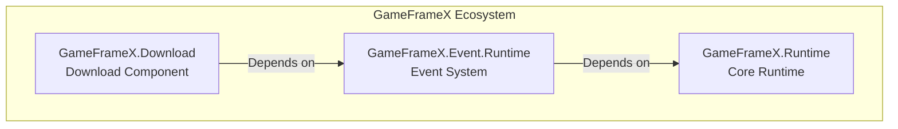

# Installation

This document describes how to install the Game Frame X Download component in a Unity project.

## Overview

Game Frame X Download is the download management component of the GameFrameX framework, providing a complete multi-task download solution. This component supports breakpoint resume, download priority, real-time progress updates, and provides complete notification of download status through the event system.

> **Note**: This component depends on the **Event component** (`com.gameframex.unity.event`), which must also be installed during installation.

### System Requirements

| Requirement | Minimum Version |
|------------|-----------------|
| Unity | 2017.1+ |
| GameFrameX.Runtime | Latest stable version |
| GameFrameX.Event | Latest stable version |

## Pre-Installation

Before starting the installation, please ensure:

1. Unity 2017.1 or later is installed
2. You have a basic understanding of Unity Package Manager
3. You have edit access to the project's `Packages/manifest.json` file

## Installation Methods

### Method 1: Install via manifest.json (Recommended)

This is the most recommended installation method, facilitating version management and team collaboration.

1. Open the project's `Packages/manifest.json` file
2. Add the following content under the `dependencies` node:

```json
{
  "dependencies": {
    "com.gameframex.unity.event": "https://github.com/GameFrameX/com.gameframex.unity.event.git",
    "com.gameframex.unity.download": "https://github.com/GameFrameX/com.gameframex.unity.download.git"
  }
}
```

3. After saving the file, Unity will automatically download and install the dependency packages
4. Wait for Unity to finish compiling

> Source: [README.md](https://github.com/GameFrameX/com.gameframex.unity.download/blob/main/README.md#L112-L118)

### Method 2: Install via Unity Package Manager

If you prefer using the Unity editor's graphical interface:

1. Open the Unity editor
2. Navigate to the **Window -> Package Manager** menu
3. Click the **+** button in the top left corner
4. Select **Add package from git URL...**
5. Enter the following URL in the input field:

```
https://github.com/GameFrameX/com.gameframex.unity.download.git
```

6. Click the **Add** button to start installation
7. The Event component must be installed first; repeat steps 3-6 and add the following URL:

```
https://github.com/GameFrameX/com.gameframex.unity.event.git
```

8. Wait for download and installation to complete

### Method 3: Place Source Code Directly

Suitable for cases where you need to modify the source code or use offline:

1. Download or clone the source code from the GitHub repository:

```bash
git clone https://github.com/GameFrameX/com.gameframex.unity.download.git
```

2. Copy the downloaded folder to the Unity project's `Packages` directory
3. Unity will automatically recognize and load the package
4. Ensure the Event component source code or precompiled package is also installed

## Dependency Description

When installing the Download component, the system will automatically resolve the following dependencies:



| Dependency Package | Description | Required |
|-------------------|-------------|----------|
| `GameFrameX.Runtime` | Core runtime, provides base framework functionality | Required |
| `GameFrameX.Event.Runtime` | Event system, handles download status notifications | Required |
| `GameFrameX.Editor` | Editor tools (only needed during development) | Optional |

## Installation Verification

After installation is complete, you can verify successful installation through the following methods:

### Method 1: Check Package Manager

Open **Window -> Package Manager** and confirm the following packages are correctly installed:

- `Game Frame X Download` - Version number should be 1.1.0
- `Game Frame X Event` - Event component

### Method 2: Check Script Compilation

Create a simple test script in the project and confirm the following namespace can be referenced without errors:

```csharp
using GameFrameX.Download.Runtime;
// If compilation succeeds, the installation is successful
```

### Method 3: Check Component Menu

In the Unity editor:

1. Create a new GameObject
2. Right-click the Inspector panel
3. Check if the **Game Framework -> Download** option appears in the menu

## Project Configuration

### Assembly Definition

After installation, the system will automatically configure the following assembly definition files:

| Assembly | Path | Purpose |
|----------|------|---------|
| `GameFrameX.Download.Runtime` | `Runtime/GameFrameX.Download.Runtime.asmdef` | Runtime assembly |
| `GameFrameX.Download.Editor` | `Editor/GameFrameX.Download.Editor.asmdef` | Editor assembly |

The runtime assembly dependency configuration is as follows:

```json
{
  "name": "GameFrameX.Download.Runtime",
  "references": [
    "GameFrameX.Runtime",
    "GameFrameX.Event.Runtime"
  ]
}
```

> Source: [Runtime/GameFrameX.Download.Runtime.asmdef](https://github.com/GameFrameX/com.gameframex.unity.download/blob/main/Runtime/GameFrameX.Download.Runtime.asmdef#L1-L17)

## Common Issues

### Q1: Compilation errors after installation?

Please ensure:
1. The Event component dependency has been correctly installed
2. The Unity version meets the requirements (2017.1+)
3. Try executing **File -> Build Settings -> Switch Platform** to recompile

### Q2: Download functionality not working?

Check if the following conditions are met:
1. The `DownloadComponent` has been added to the scene
2. The `EventComponent` has also been added
3. Network permissions are configured (see below)

### Q3: How to configure network permissions?

For download functionality that requires internet access, create or modify `AndroidManifest.xml` in the `Assets/Plugins/Android` directory and add network permissions:

```xml
<uses-permission android:name="android.permission.INTERNET" />
```

## Next Steps

After installation is complete, it is recommended to continue reading the following documentation:

- [Basic Setup](./3-getting-started.basic-setup) - Learn basic component configuration
- [First Example](./3-getting-started.first-example) - Create your first download task
- [Core Concepts](./4-core-concepts.architecture) - Deep dive into the framework architecture

## Related Links

- [GitHub Repository](https://github.com/GameFrameX/com.gameframex.unity.download.git)
- [Official Documentation](https://gameframex.doc.alianblank.com)
- [Event Component](https://github.com/GameFrameX/com.gameframex.unity.event)
- [Issue Feedback](mailto:alianblank@outlook.com)
