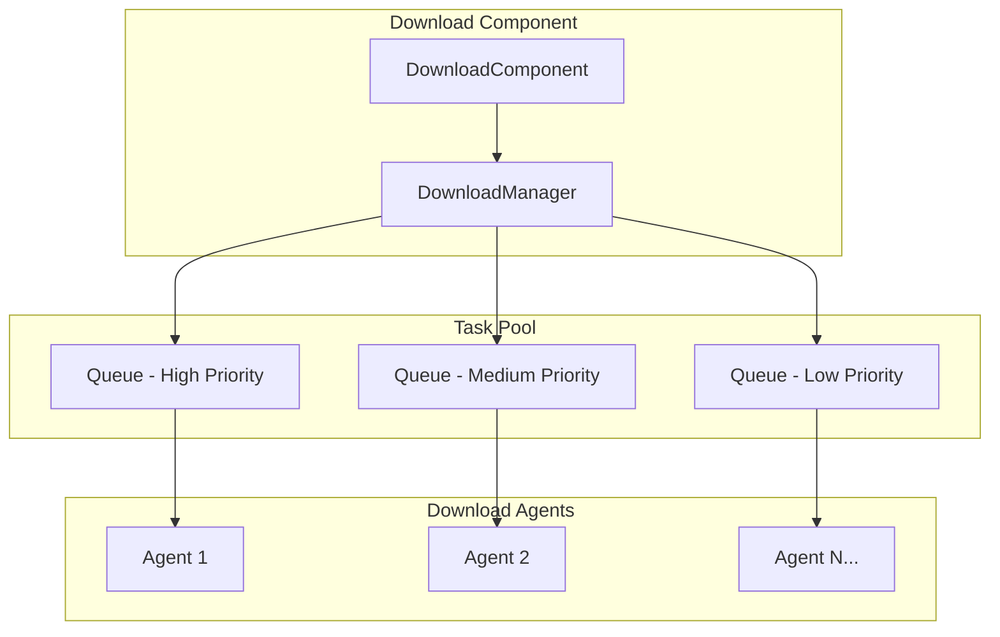
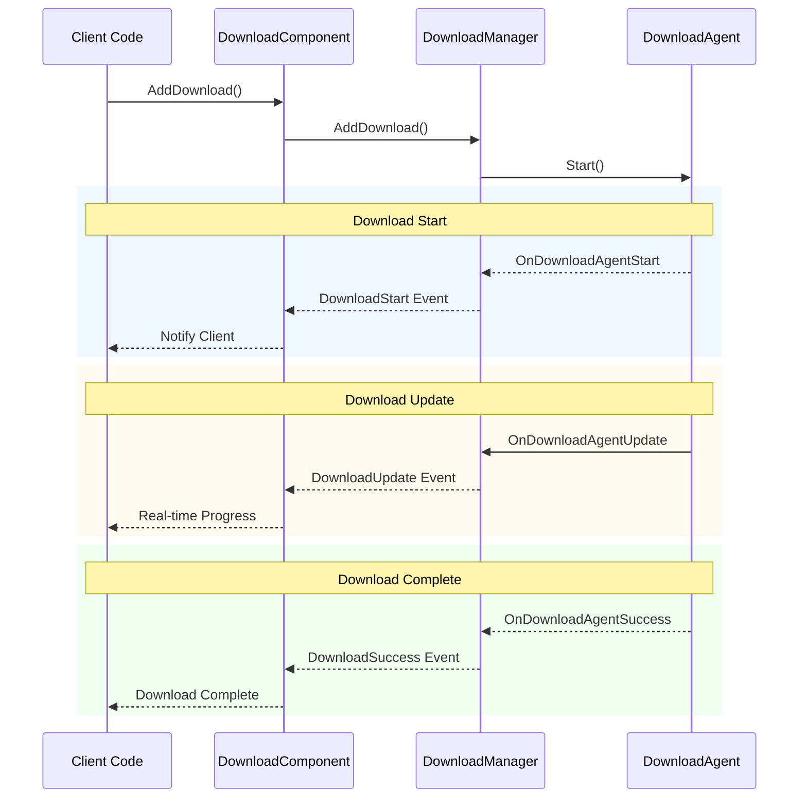
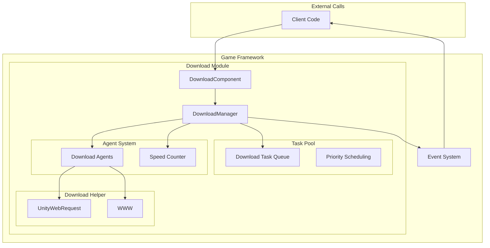

# Features

The GameFrameX Download component is a powerful Unity resource download management module that provides complete download task queue management, breakpoint resume, priority scheduling, and real-time progress monitoring.

## Overview

The download component is one of the core modules of the GameFrameX framework, specifically designed to handle game resource download needs. The component is based on a task pool architecture, supports multi-threaded concurrent downloads, can manage multiple download tasks simultaneously, and pushes download status updates in real time through an event mechanism.

> For more information about the component introduction and architecture design, please refer to [Plugin Introduction](./1-overview.introduction) and [Architecture Overview](./4-core-concepts.architecture).

## Core Features

### 1. Multi-Task Queue Management

The download component uses a TaskPool architecture that supports managing multiple download tasks simultaneously. The task queue has the following characteristics:

- **FIFO Queue**: Tasks are processed in first-in-first-out order
- **Priority Scheduling**: Higher priority tasks are executed first
- **Task Status Tracking**: Real-time recording of each task's status (pending, executing, completed, error)
- **Serial ID Identification**: Each task has a unique serial ID for easy tracking and management



> Source: [DownloadManager.cs](https://github.com/GameFrameX/com.gameframex.unity.download/blob/main/Runtime/Download/Download/DownloadManager.cs#L22-L44)

### 2. Breakpoint Resume Support

Breakpoint resume is one of the core features of the download component, significantly improving the reliability of large file downloads:

- **Automatic Detection**: The system automatically detects whether an unfinished download file (`.download` suffix) exists locally
- **Range Requests**: Uses HTTP Range headers to continue downloading from the last stopped position
- **Incremental Download**: Only downloads the new portion of the file, saving bandwidth and time
- **Status Verification**: Automatically verifies file integrity after download completion

```csharp
// Core breakpoint resume logic in DownloadAgent.cs
if (File.Exists(downloadFile))
{
    m_FileStream = File.OpenWrite(downloadFile);
    m_FileStream.Seek(0L, SeekOrigin.End);
    m_StartLength = m_SavedLength = m_FileStream.Length;
    m_DownloadedLength = 0L;
}
// Continue downloading from breakpoint position
if (m_StartLength > 0L)
{
    m_Helper.Download(m_Task.DownloadUri, m_StartLength, m_Task.UserData);
}
```

> Source: [DownloadManager.DownloadAgent.cs#L168-L204](https://github.com/GameFrameX/com.gameframex.unity.download/blob/main/Runtime/Download/Download/DownloadManager.DownloadAgent.cs#L168-L204)

### 3. Multiple Download Agents in Parallel

The download component supports configuring multiple download agents for parallel downloads:

- **Configurable Count**: 1-16 agents can be configured through the editor
- **Working Status Monitoring**: Real-time access to agent working status
- **Load Balancing**: Tasks are automatically assigned to idle agents
- **Independent Operation**: Each agent operates independently without interference

| Property | Description |
|----------|-------------|
| TotalAgentCount | Total number of download agents |
| FreeAgentCount | Number of available (idle) agents |
| WorkingAgentCount | Number of working agents |
| WaitingTaskCount | Number of tasks waiting to execute |

```csharp
// Initialize multiple download agents in the Start method
for (int i = 0; i < m_DownloadAgentHelperCount; i++)
{
    AddDownloadAgentHelper(i);
}
```

> Source: [DownloadComponent.cs#L178-L181](https://github.com/GameFrameX/com.gameframex.unity.download/blob/main/Runtime/Download/DownloadComponent.cs#L178-L181)

### 4. Real-Time Download Speed Monitoring

The component has a built-in download speed calculator that provides accurate real-time download rates:

- **Sliding Window Algorithm**: Uses time windows to calculate instantaneous speed
- **On-Demand Updates**: Speed values are dynamically updated based on actual download data
- **Multi-Agent Aggregation**: Speeds from multiple agents are automatically accumulated

```csharp
public float CurrentSpeed
{
    get { return m_DownloadCounter.CurrentSpeed; }
}
```

> Source: [DownloadManager.cs#L117-L120](https://github.com/GameFrameX/com.gameframex.unity.download/blob/main/Runtime/Download/Download/DownloadManager.cs#L117-L120)

### 5. Event-Driven Notifications

A complete lifecycle event system covering the entire download process:



| Event | Description | Trigger Timing |
|-------|-------------|----------------|
| DownloadStart | Download started | When an agent starts processing a task |
| DownloadUpdate | Download updated | When a data chunk is received |
| DownloadSuccess | Download succeeded | When the file is fully downloaded |
| DownloadFailure | Download failed | When an error or timeout occurs |

> For detailed event parameters, please refer to [Download Events](./6-events.download-events).

### 6. Pause and Resume

Global pause functionality, allowing you to pause/resume all download tasks at any time:

```csharp
// Pause all downloads
downloadComponent.Paused = true;

// Resume downloads
downloadComponent.Paused = false;
```

> Source: [DownloadComponent.cs#L46-L50](https://github.com/GameFrameX/com.gameframex.unity.download/blob/main/Runtime/Download/DownloadComponent.cs#L46-L50)

### 7. Tag-Based Management

Supports organizing download tasks using tags:

- **Query by Tag**: Get all download tasks with a specific tag
- **Remove by Tag**: Remove all tasks with a specific tag at once
- **Flexible Organization**: Organize tasks by resource type, update batch, etc.

```csharp
// Add a download task with a tag
int serialId = downloadComponent.AddDownload(downloadPath, downloadUri, "resources");

// Get task info for a specific tag
TaskInfo[] tasks = downloadComponent.GetDownloadInfos("resources");

// Remove all tasks with a specific tag
downloadComponent.RemoveDownloads("resources");
```

> Source: [DownloadComponent.cs#L250-L253](https://github.com/GameFrameX/com.gameframex.unity.download/blob/main/Runtime/Download/DownloadComponent.cs#L250-L253)

### 8. Timeout and Buffer Configuration

Flexible download parameter configuration:

| Option | Description | Default |
|--------|-------------|---------|
| Timeout | Download timeout (seconds) | 30 |
| FlushSize | Buffer threshold for writing to disk (bytes) | 1 MB |

- **Timeout**: Timeout duration for a single request with no response
- **FlushSize**: Forces data to be written to disk when the memory buffer reaches this size, preventing data loss

```csharp
// Configure timeout (at runtime)
downloadComponent.Timeout = 60f;

// Configure FlushSize (at runtime)
downloadComponent.FlushSize = 2 * 1024 * 1024; // 2MB
```

> Source: [DownloadComponent.cs#L87-L100](https://github.com/GameFrameX/com.gameframex.unity.download/blob/main/Runtime/Download/DownloadComponent.cs#L87-L100)

### 9. Multiple Download Agent Helpers

The component provides two download implementations:

1. **UnityWebRequestDownloadAgentHelper** (Recommended)
   - Modern Unity network request API
   - Supports Unity 2017.2+
   - Complete breakpoint resume support

2. **WWWDownloadAgentHelper** (Legacy)
   - Traditional WWW class
   - Supports versions prior to Unity 2018.3
   - Breakpoint resume depends on server support

```csharp
// Resume download from breakpoint using UnityWebRequest
m_UnityWebRequest.SetRequestHeader("Range", 
    GameFrameX.Runtime.Utility.Text.Format("bytes={0}-", fromPosition));
m_UnityWebRequest.downloadHandler = new DownloadHandler(this);
```

> Source: [UnityWebRequestDownloadAgentHelper.cs#L104-L121](https://github.com/GameFrameX/com.gameframex.unity.download/blob/main/Runtime/Download/UnityWebRequestDownloadAgentHelper.cs#L104-L121)

## System Architecture



## Feature Comparison

| Feature | Description | Status |
|---------|-------------|--------|
| Multi-Task Queue | Manage multiple download tasks simultaneously | Supported |
| Breakpoint Resume | Continue downloading from the last position | Supported |
| Priority Scheduling | Higher priority tasks processed first | Supported |
| Real-Time Speed | Display current download speed | Supported |
| Event Notifications | Real-time push of download status | Supported |
| Multi-Agent Parallel | 1-16 agents for concurrent downloads | Supported |
| Pause/Resume | Pause and resume all tasks | Supported |
| Tag Management | Organize download tasks by tag | Supported |
| Timeout Control | Configure network timeout duration | Supported |
| Buffer Management | Control disk write frequency | Supported |

## Related Links

- [Plugin Introduction](./1-overview.introduction) - Learn about the plugin background and design philosophy
- [Architecture Overview](./4-core-concepts.architecture) - Deep dive into system architecture
- [DownloadComponent](./4-core-concepts.download-component) - Core component details
- [Download Agent](./4-core-concepts.download-agent) - Download agent mechanism
- [API Reference](./5-api-reference.properties) - Complete API documentation
- [Installation Guide](./2-installation) - Quick installation and configuration
