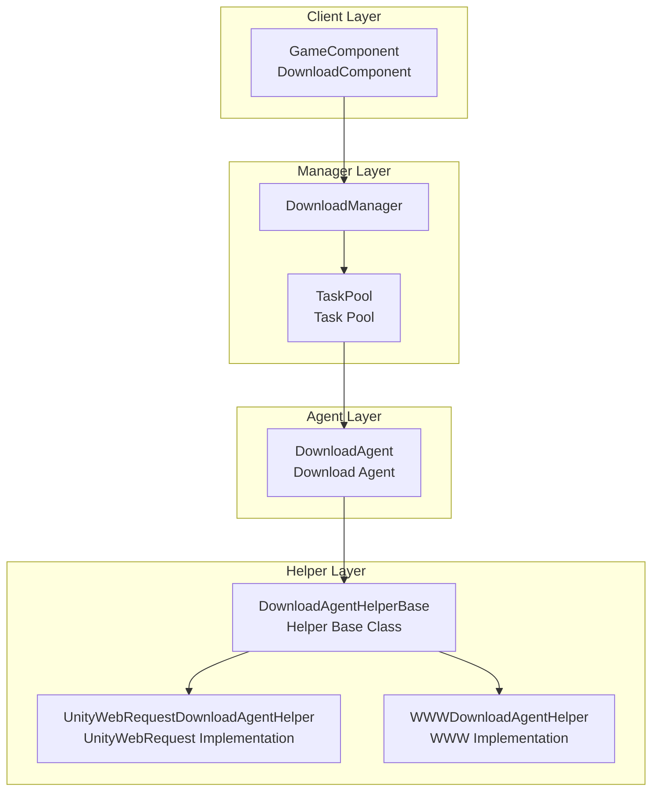
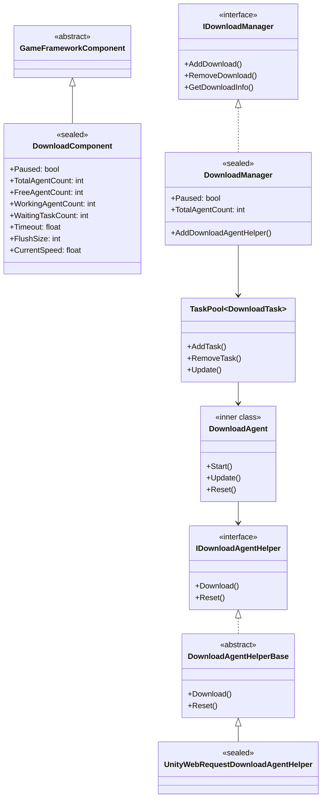
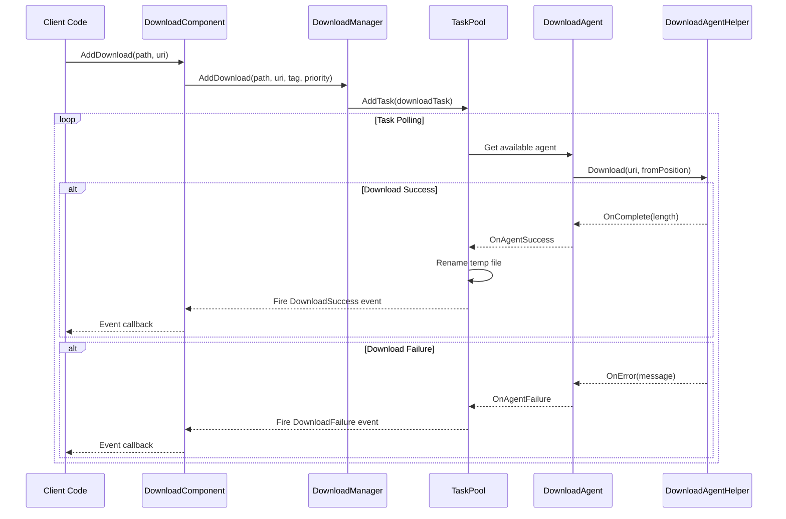
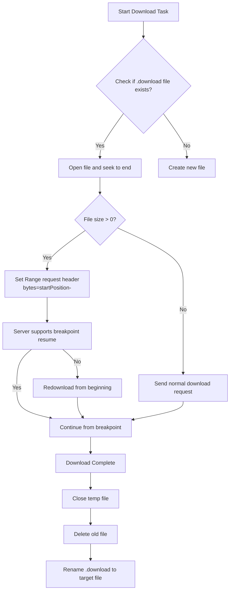
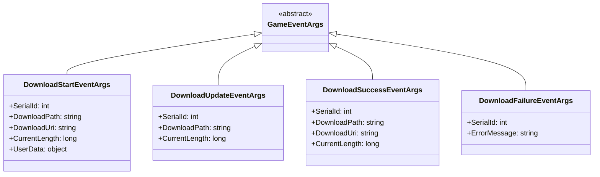

# Architecture Overview

The GameFrameX Download plugin is a fully-featured Unity download management framework that provides unified task scheduling, download agent management, breakpoint resume, and multi-threaded download capabilities.

## Overview

The GameFrameX Download plugin is one of the core components of the GameFrameX framework, specifically designed to provide efficient and reliable resource download solutions for Unity games. The plugin features a modular design that separates download task management, agent scheduling, and underlying network communication for easy extension and maintenance.

**Design Goals:**
- Provide a unified download task management interface
- Support multi-threaded concurrent downloads
- Implement breakpoint resume functionality
- Support pluggable download agent implementations
- Provide a complete event system for progress monitoring

## Architecture Design

The plugin adopts a layered architecture design, divided into four main layers from top to bottom:



### Architecture Layer Description

| Layer | Component | Responsibility |
|-------|-----------|----------------|
| Client Layer | DownloadComponent | Exposes download functionality externally, integrates into Unity's component system |
| Manager Layer | DownloadManager | Unified management of download tasks, events, and agent pools |
| Agent Layer | DownloadAgent | Handles the lifecycle of individual download tasks |
| Helper Layer | DownloadAgentHelper | Low-level network communication implementation |

## Core Components

### Component Relationship Diagram



### Core Component Responsibilities

#### 1. DownloadComponent

`DownloadComponent` is the entry point of the plugin, inheriting from `GameFrameworkComponent` and mounted directly in Unity scenes. It is responsible for:

- Initializing the `DownloadManager` module
- Creating and managing `DownloadAgentHelper` instances
- Exposing download APIs externally
- Subscribing to and forwarding download events

> Source: [DownloadComponent.cs](https://github.com/GameFrameX/com.gameframex.unity.download/blob/main/Runtime/Download/DownloadComponent.cs#L1-L443)

Key properties:

```csharp
// Get available download agent count
public int FreeAgentCount { get; }

// Get working download agent count
public int WorkingAgentCount { get; }

// Get waiting download task count
public int WaitingTaskCount { get; }

// Get current download speed (bytes/second)
public float CurrentSpeed { get; }
```

#### 2. DownloadManager

`DownloadManager` is the core module, inheriting from `GameFrameworkModule` and implementing the `IDownloadManager` interface. Main features:

- Managing the task pool (TaskPool)
- Registering and scheduling download agents
- Maintaining the download counter (DownloadCounter)
- Firing download events

> Source: [DownloadManager.cs](https://github.com/GameFrameX/com.gameframex.unity.download/blob/main/Runtime/Download/Download/DownloadManager.cs#L1-L430)

```csharp
public sealed partial class DownloadManager : GameFrameworkModule, IDownloadManager
{
    private readonly TaskPool<DownloadTask> m_TaskPool;
    private readonly DownloadCounter m_DownloadCounter;
}
```

#### 3. DownloadAgent

`DownloadAgent` is an inner class that implements the `ITaskAgent<DownloadTask>` interface and is responsible for the complete lifecycle of a single download task:

- Creating download temporary files (.download suffix)
- Handling breakpoint resume logic
- Writing download data to disk
- Handling timeout detection

> Source: [DownloadManager.DownloadAgent.cs](https://github.com/GameFrameX/com.gameframex.unity.download/blob/main/Runtime/Download/Download/DownloadManager.DownloadAgent.cs#L1-L358)

#### 4. DownloadAgentHelper

The helper uses the strategy pattern design, supporting multiple underlying implementations:

- `IDownloadAgentHelper`: Helper interface
- `DownloadAgentHelperBase`: Abstract base class
- `UnityWebRequestDownloadAgentHelper`: UnityWebRequest-based implementation (recommended)
- `WWWDownloadAgentHelper`: WWW-based implementation (deprecated)

> Source: [IDownloadAgentHelper.cs](https://github.com/GameFrameX/com.gameframex.unity.download/blob/main/Runtime/Download/Download/IDownloadAgentHelper.cs#L1-L66)
> Source: [UnityWebRequestDownloadAgentHelper.cs](https://github.com/GameFrameX/com.gameframex.unity.download/blob/main/Runtime/Download/UnityWebRequestDownloadAgentHelper.cs#L1-L230)

## Core Flows

### Download Task Flow



### Breakpoint Resume Flow

When a download file already exists, the download agent automatically detects and resumes the download:



## Event System

The plugin provides a complete event system for monitoring download progress and status:



### Event Trigger Timing

| Event | Trigger Timing |
|-------|----------------|
| DownloadStart | Download agent starts processing the task |
| DownloadUpdate | Download data is updated (multiple times per frame) |
| DownloadSuccess | Download completed and written to disk |
| DownloadFailure | Download failed or errored |

> For detailed event parameter descriptions, see the [Download Events](./6-events.download-events) document.

## Configuration Options

DownloadComponent provides the following configurable options:

| Property | Type | Default | Description |
|----------|------|---------|-------------|
| DownloadAgentHelperTypeName | string | UnityWebRequestDownloadAgentHelper | Download agent helper type |
| DownloadAgentHelperCount | int | 3 | Number of download agent instances |
| Timeout | float | 30f | Download timeout (seconds) |
| FlushSize | int | 1MB | Buffer flush size |

> For detailed configuration descriptions, see the [Editor Configuration](./7-configuration.editor-configuration) and [Download Agent Configuration](./7-configuration.agent-configuration) documents.

## Extension Mechanism

### Custom Download Agent

You can create custom download implementations by inheriting `DownloadAgentHelperBase`:

```csharp
public class CustomDownloadAgentHelper : DownloadAgentHelperBase
{
    public override void Download(string downloadUri, object userData)
    {
        // Implement custom download logic
    }
    
    public override void Download(string downloadUri, long fromPosition, object userData)
    {
        // Implement breakpoint resume
    }
    
    public override void Download(string downloadUri, long fromPosition, long toPosition, object userData)
    {
        // Implement range download
    }
    
    public override void Reset()
    {
        // Clean up resources
    }
}
```

> For detailed extension instructions, see the [Download Agent](./4-core-concepts.download-agent) document.

## Performance Characteristics

### Concurrent Downloads

The plugin supports multi-agent concurrent downloads through the `DownloadAgentHelperCount` configuration for the number of agents. The task pool automatically assigns tasks to idle agents.

### Speed Calculation

Download speed is calculated using a moving average algorithm:

```csharp
m_DownloadCounter = new DownloadCounter(1f, 10f);  // 1 second update interval, 10 second average
```

> For detailed implementation, see the [DownloadCounter](./4-core-concepts.download-component) document.

### Breakpoint Resume

- Uses `.download` temporary files during download
- Supports detecting existing temporary files and resuming downloads
- Automatically renames to target file after download completion

## Related Links

- [DownloadComponent](./4-core-concepts.download-component) - Download component details
- [Download Agent](./4-core-concepts.download-agent) - Agent implementation details
- [Download Events](./6-events.download-events) - Event system details
- [Editor Configuration](./7-configuration.editor-configuration) - Editor configuration
- [Download Agent Configuration](./7-configuration.agent-configuration) - Agent configuration
- [API Reference](./5-api-reference.properties) - Properties API
- [API Reference](./5-api-reference.methods) - Methods API
