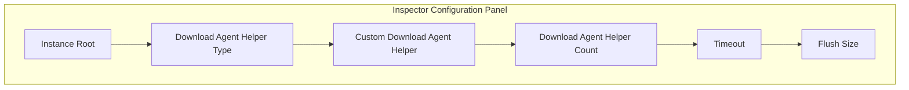
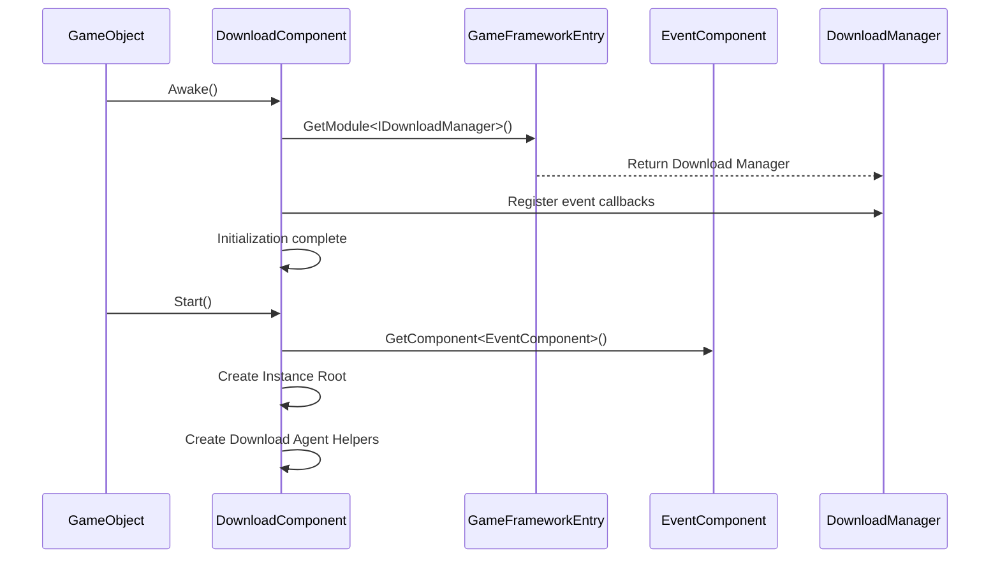

# Basic Setup

This document describes the basic configuration methods for the GameFrameX Download plugin, including component addition, parameter settings, and initialization flow.

## Overview

The Download component is the download management module in the GameFrameX framework, responsible for handling all download-related tasks. Before using the download functionality, you need to properly configure the `DownloadComponent`. This component uses a multi-agent concurrent download mechanism, supporting breakpoint resume, priority scheduling, and real-time progress updates.

## Adding DownloadComponent

### Adding via Unity Editor

Create an empty game object in the Unity scene, then add the `Download` component:

1. In the Unity editor, right-click the Hierarchy panel
2. Select **GameObject** -> **Create Empty** to create an empty game object
3. Click the **Add Component** button in the Inspector panel
4. Search for and select **Game Framework** -> **Download**
5. The component will be automatically added to the game object

```csharp
// Component definition source
[DisallowMultipleComponent]
[AddComponentMenu("Game Framework/Download")]
public sealed class DownloadComponent : GameFrameworkComponent
```

> Source: [DownloadComponent.cs](https://github.com/GameFrameX/com.gameframex.unity.download/blob/main/Runtime/Download/DownloadComponent.cs#L21-L23)

### Adding Dynamically via Code

You can also dynamically create the component at runtime:

```csharp
// Dynamically add DownloadComponent
var downloadGameObject = new GameObject("Download");
var downloadComponent = downloadGameObject.AddComponent<DownloadComponent>();
```

> Source: [DownloadComponent.cs](https://github.com/GameFrameX/com.gameframex.unity.download/blob/main/Runtime/Download/DownloadComponent.cs#L142-L160)

## Configuration Options Details

### Editor Configuration Properties

In the Unity editor's Inspector panel, DownloadComponent contains the following configurable properties:



| Property | Type | Default | Description |
|----------|------|---------|-------------|
| Instance Root | Transform | null | Parent Transform for download agent instances, automatically created if empty |
| Download Agent Helper Type | string | UnityWebRequestDownloadAgentHelper | Type name of the download agent helper |
| Custom Download Agent Helper | DownloadAgentHelperBase | null | Custom download agent helper instance |
| Download Agent Helper Count | int | 3 | Number of concurrent download agents, range 1-16 |
| Timeout | float | 30 | Download timeout (seconds), range 0-120 |
| Flush Size | int | 1048576 | Buffer threshold size for writing to disk (bytes), default 1MB |

> Source: [DownloadComponentInspector.cs](https://github.com/GameFrameX/com.gameframex.unity.download/blob/main/Editor/Inspector/DownloadComponentInspector.cs#L29-L69)

### Detailed Configuration Descriptions

#### 1. Instance Root

Specifies the parent Transform for download agent GameObjects. If not set, the system will automatically create an empty object named "Download Agent Instances" as the parent node.

```csharp
if (m_InstanceRoot == null)
{
    m_InstanceRoot = new GameObject("Download Agent Instances").transform;
    m_InstanceRoot.SetParent(gameObject.transform);
    m_InstanceRoot.localScale = Vector3.one;
}
```

> Source: [DownloadComponent.cs](https://github.com/GameFrameX/com.gameframex.unity.download/blob/main/Runtime/Download/DownloadComponent.cs#L171-L176)

#### 2. Download Agent Helper Type

Specifies the type of helper used to perform the actual download operations. The plugin includes the following implementations:

| Type Name | Description |
|-----------|-------------|
| UnityWebRequestDownloadAgentHelper | Uses Unity's UnityWebRequest for downloading (recommended) |
| WWWDownloadAgentHelper | Uses the deprecated WWW class for downloading (for legacy versions) |

#### 3. Download Agent Helper Count

Sets the number of concurrent download agents. Each agent can only handle one download task at a time, but multiple agents can run simultaneously for parallel downloads.

```csharp
// Create 3 download agents by default
for (int i = 0; i < m_DownloadAgentHelperCount; i++)
{
    AddDownloadAgentHelper(i);
}
```

> Source: [DownloadComponent.cs](https://github.com/GameFrameX/com.gameframex.unity.download/blob/main/Runtime/Download/DownloadComponent.cs#L178-L181)

**Recommended Configuration:**
- Small resources (< 10MB): 2-3 agents
- Medium resources (10-100MB): 3-5 agents
- Large resources (> 100MB): 5-8 agents
- Maximum supported: 16 agents

#### 4. Timeout

Sets the maximum wait time for a single download task (in seconds). After this time, the download will be considered failed and trigger an error event.

```csharp
[SerializeField]
private float m_Timeout = 30f;
```

> Source: [DownloadComponent.cs](https://github.com/GameFrameX/com.gameframex.unity.download/blob/main/Runtime/Download/DownloadComponent.cs#L39)

**Configuration Recommendations:**
- LAN downloads: 10-15 seconds
- Internet downloads: 30-60 seconds
- Large file downloads: 60-120 seconds

#### 5. Flush Size

Sets the threshold size for writing the download buffer to disk. This parameter is only effective when breakpoint resume is enabled, controlling the data flush frequency.

```csharp
private const int OneMegaBytes = 1024 * 1024;
[SerializeField]
private int m_FlushSize = OneMegaBytes;
```

> Source: [DownloadComponent.cs](https://github.com/GameFrameX/com.gameframex.unity.download/blob/main/Runtime/Download/DownloadComponent.cs#L25-L26#L41)

**Configuration Recommendations:**
- Small files: 512KB - 1MB
- Medium files: 1MB - 2MB
- Large files: 2MB - 5MB

## Component Initialization Flow

DownloadComponent initialization is divided into two phases:



### Phase 1: Awake

```csharp
protected override void Awake()
{
    ImplementationComponentType = Utility.Assembly.GetType(componentType);
    InterfaceComponentType = typeof(IDownloadManager);
    base.Awake();
    m_DownloadManager = GameFrameworkEntry.GetModule<IDownloadManager>();
    
    // Register download events
    m_DownloadManager.DownloadStart += OnDownloadStart;
    m_DownloadManager.DownloadUpdate += OnDownloadUpdate;
    m_DownloadManager.DownloadSuccess += OnDownloadSuccess;
    m_DownloadManager.DownloadFailure += OnDownloadFailure;
    
    m_DownloadManager.FlushSize = m_FlushSize;
    m_DownloadManager.Timeout = m_Timeout;
}
```

> Source: [DownloadComponent.cs](https://github.com/GameFrameX/com.gameframex.unity.download/blob/main/Runtime/Download/DownloadComponent.cs#L142-L160)

### Phase 2: Start

```csharp
private void Start()
{
    // Get the Event component (required)
    m_EventComponent = GameEntry.GetComponent<EventComponent>();
    if (m_EventComponent == null)
    {
        Log.Fatal("Event component is invalid.");
        return;
    }

    // Create instance root node
    if (m_InstanceRoot == null)
    {
        m_InstanceRoot = new GameObject("Download Agent Instances").transform;
        m_InstanceRoot.SetParent(gameObject.transform);
        m_InstanceRoot.localScale = Vector3.one;
    }

    // Create download agent helpers
    for (int i = 0; i < m_DownloadAgentHelperCount; i++)
    {
        AddDownloadAgentHelper(i);
    }
}
```

> Source: [DownloadComponent.cs](https://github.com/GameFrameX/com.gameframex.unity.download/blob/main/Runtime/Download/DownloadComponent.cs#L162-L182)

## Download Agent Helper

### Default Implementation: UnityWebRequestDownloadAgentHelper

The plugin uses `UnityWebRequestDownloadAgentHelper` as the default download agent helper. It is based on Unity's `UnityWebRequest` API and supports:

- HTTP/HTTPS protocols
- Breakpoint resume (via Range header)
- SSL certificate verification (bypassed by default)
- Progress tracking

```csharp
public partial class UnityWebRequestDownloadAgentHelper : DownloadAgentHelperBase, IDisposable
{
    // Download using UnityWebRequest
    m_UnityWebRequest = new UnityWebRequest(downloadUri);
    m_UnityWebRequest.certificateHandler = new DownloadCertificateHandler();
    m_UnityWebRequest.downloadHandler = new DownloadHandler(this);
    m_UnityWebRequest.SendWebRequest();
}
```

> Source: [UnityWebRequestDownloadAgentHelper.cs](https://github.com/GameFrameX/com.gameframex.unity.download/blob/main/Runtime/Download/UnityWebRequestDownloadAgentHelper.cs#L80-L96)

### Creating a Custom Download Agent

To create a custom download agent, inherit from `DownloadAgentHelperBase` and implement the relevant interfaces:

```csharp
public abstract class DownloadAgentHelperBase : MonoBehaviour, IDownloadAgentHelper
{
    // Event definitions
    public abstract event EventHandler<DownloadAgentHelperUpdateBytesEventArgs> DownloadAgentHelperUpdateBytes;
    public abstract event EventHandler<DownloadAgentHelperUpdateLengthEventArgs> DownloadAgentHelperUpdateLength;
    public abstract event EventHandler<DownloadAgentHelperCompleteEventArgs> DownloadAgentHelperComplete;
    public abstract event EventHandler<DownloadAgentHelperErrorEventArgs> DownloadAgentHelperError;

    // Download methods
    public abstract void Download(string downloadUri, object userData);
    public abstract void Download(string downloadUri, long fromPosition, object userData);
    public abstract void Download(string downloadUri, long fromPosition, long toPosition, object userData);
    
    // Reset method
    public abstract void Reset();
}
```

> Source: [DownloadAgentHelperBase.cs](https://github.com/GameFrameX/com.gameframex.unity.download/blob/main/Runtime/Download/DownloadAgentHelperBase.cs#L17-L72)

## Configuration Property API

DownloadComponent provides the following public properties for code access:

### Runtime Properties

| Property | Type | Description |
|----------|------|-------------|
| Paused | bool | Get or set whether downloads are paused |
| TotalAgentCount | int | Get total number of download agents |
| FreeAgentCount | int | Get number of available download agents |
| WorkingAgentCount | int | Get number of working download agents |
| WaitingTaskCount | int | Get number of waiting download tasks |
| Timeout | float | Get or set download timeout duration (seconds) |
| FlushSize | int | Get or set buffer threshold for writing to disk |
| CurrentSpeed | float | Get current download speed (bytes/second) |

```csharp
// Example: Get current download status
var downloadComponent = GameEntry.GetComponent<DownloadComponent>();
Debug.Log($"Available agents: {downloadComponent.FreeAgentCount}");
Debug.Log($"Waiting tasks: {downloadComponent.WaitingTaskCount}");
Debug.Log($"Download speed: {downloadComponent.CurrentSpeed} bytes/s");
```

> Source: [DownloadComponent.cs](https://github.com/GameFrameX/com.gameframex.unity.download/blob/main/Runtime/Download/DownloadComponent.cs#L46-L108)

## Dependency Requirements

DownloadComponent depends on the following components and services:

1. **EventComponent** - Required component for triggering download event notifications
2. **GameFrameworkEntry** - Framework entry point, provides module initialization
3. **GameFrameworkModule** - Base module class

```csharp
// Check dependencies
private void Start()
{
    m_EventComponent = GameEntry.GetComponent<EventComponent>();
    if (m_EventComponent == null)
    {
        Log.Fatal("Event component is invalid.");
        return;
    }
}
```

> Source: [DownloadComponent.cs](https://github.com/GameFrameX/com.gameframex.unity.download/blob/main/Runtime/Download/DownloadComponent.cs#L164-L169)

## Best Practice Configuration

### Development Environment

```csharp
// Development environment recommended configuration
Timeout = 60f;           // Longer timeout for error tolerance
FlushSize = 512 * 1024;   // 512KB frequent flush for debugging
AgentCount = 3;           // Moderate concurrency
```

### Production Environment

```csharp
// Production environment recommended configuration
Timeout = 30f;            // Shorter timeout for fast failure and retry
FlushSize = 2 * 1024 * 1024;  // 2MB reduced IO frequency
AgentCount = 5;           // More concurrency for faster downloads
```

### Large File Downloads

```csharp
// Large file download configuration
Timeout = 120f;               // Longer timeout
FlushSize = 5 * 1024 * 1024;  // 5MB large buffer
AgentCount = 8;               // High concurrency
```

## Related Links

- [Installation Guide](./2-installation)
- [First Example](./3-getting-started.first-example)
- [Architecture Overview](./4-core-concepts.architecture)
- [DownloadComponent Core Concepts](./4-core-concepts.download-component)
- [Download Agent](./4-core-concepts.download-agent)
- [Editor Configuration](./7-configuration.editor-configuration)
- [Download Agent Configuration](./7-configuration.agent-configuration)
- [Download Events](./6-events.download-events)
