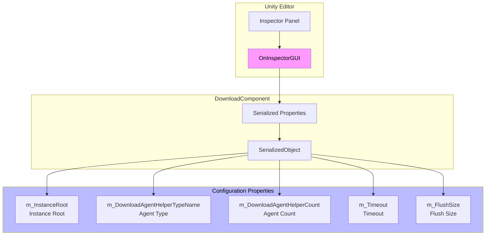
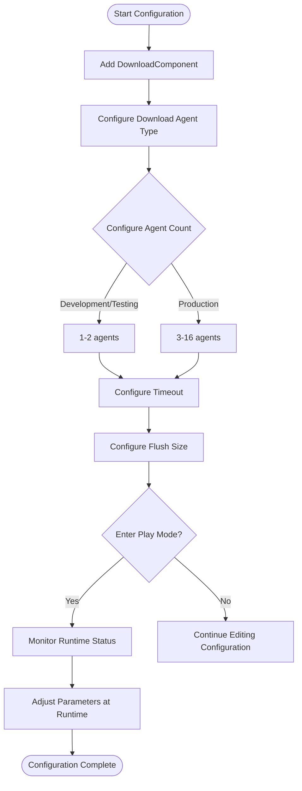

# Editor Configuration

This document details the configuration options for the GameFrameX Download component in the Unity editor, including the component's Inspector panel configuration and design intent.

## Overview

The GameFrameX Download component provides intuitive editor configuration through Unity's custom Inspector interface. Developers can configure key parameters such as download agent count, timeout duration, and buffer size in the editor without writing code.

> Source: [DownloadComponentInspector.cs](https://github.com/GameFrameX/com.gameframex.unity.download/blob/main/Editor/Inspector/DownloadComponentInspector.cs#L19-L156)

## Configuration Interface Details

### Adding DownloadComponent

In the Unity scene, add the Download component by:

1. Right-click in the Hierarchy panel and select **GameObject** -> **Create Empty**
2. Click **Add Component** in the Inspector panel
3. Search for and select **Download** (or `Game Framework/Download`)
4. The component will be automatically added to the game object

```csharp
// The component is registered to the Unity menu via the AddComponentMenu attribute
[AddComponentMenu("Game Framework/Download")]
public sealed class DownloadComponent : GameFrameworkComponent
```

> Source: [DownloadComponent.cs](https://github.com/GameFrameX/com.gameframex.unity.download/blob/main/Runtime/Download/DownloadComponent.cs#L22-L23)

### Inspector Configuration Panel

When a game object with DownloadComponent is selected in the scene, the Inspector panel displays the following configuration options:

```csharp
private SerializedProperty m_InstanceRoot = null;
private SerializedProperty m_DownloadAgentHelperCount = null;
private SerializedProperty m_Timeout = null;
private SerializedProperty m_FlushSize = null;

private HelperInfo<DownloadAgentHelperBase> m_DownloadAgentHelperInfo = new HelperInfo<DownloadAgentHelperBase>("DownloadAgent");
```

> Source: [DownloadComponentInspector.cs](https://github.com/GameFrameX/com.gameframex.unity.download/blob/main/Editor/Inspector/DownloadComponentInspector.cs#L22-L27)

## Configuration Options Details

### 1. Instance Root

| Property | Description |
|----------|-------------|
| **Type** | Transform |
| **Default** | null (auto-created) |
| **Runtime** | Readable |

**Description**: Specifies the parent Transform for download agent instances. If empty, the component will automatically create a game object named "Download Agent Instances" as the parent node.

```csharp
if (m_InstanceRoot == null)
{
    m_InstanceRoot = new GameObject("Download Agent Instances").transform;
    m_InstanceRoot.SetParent(gameObject.transform);
    m_InstanceRoot.localScale = Vector3.one;
}
```

> Source: [DownloadComponent.cs](https://github.com/GameFrameX/com.gameframex.unity.download/blob/main/Runtime/Download/DownloadComponent.cs#L171-L176)

---

### 2. Download Agent Helper Type

| Property | Description |
|----------|-------------|
| **Type** | string (type name) |
| **Default** | UnityGameFramework.Runtime.UnityWebRequestDownloadAgentHelper |
| **Runtime** | Read only |

**Description**: Specifies the agent helper type used to perform the actual download work. The plugin provides two built-in implementations:

- **UnityWebRequestDownloadAgentHelper**: Based on Unity's `UnityWebRequest` API, supports breakpoint resume
- **WWWDownloadAgentHelper**: Based on the legacy `WWW` class (deprecated)

```csharp
[SerializeField] private string m_DownloadAgentHelperTypeName = "UnityGameFramework.Runtime.UnityWebRequestDownloadAgentHelper";
```

> Source: [DownloadComponent.cs](https://github.com/GameFrameX/com.gameframex.unity.download/blob/main/Runtime/Download/DownloadComponent.cs#L33)

**Custom Agent**: Developers can also implement their own download agent helpers by inheriting the `DownloadAgentHelperBase` class and implementing the corresponding interfaces.

---

### 3. Download Agent Helper Count

| Property | Description |
|----------|-------------|
| **Type** | int |
| **Range** | 1 - 16 |
| **Default** | 3 |
| **Runtime** | Cannot be modified |

**Description**: Configures the number of concurrent download agents. Increasing the agent count improves parallel download capacity but also consumes more system resources.

```csharp
m_DownloadAgentHelperCount.intValue = EditorGUILayout.IntSlider("Download Agent Helper Count", m_DownloadAgentHelperCount.intValue, 1, 16);
```

> Source: [DownloadComponentInspector.cs](https://github.com/GameFrameX/com.gameframex.unity.download/blob/main/Editor/Inspector/DownloadComponentInspector.cs#L41)

**Configuration Recommendations**:
| Scenario | Recommended Value |
|----------|-------------------|
| Development/Testing | 1-2 |
| Mobile Games | 3-5 |
| PC/Console Games | 5-10 |
| Large File Multi-threaded Downloads | 10-16 |

---

### 4. Timeout

| Property | Description |
|----------|-------------|
| **Type** | float |
| **Range** | 0 - 120 seconds |
| **Default** | 30 seconds |
| **Runtime** | Can be modified |

**Description**: Sets the download request timeout. When the download time exceeds this value, the download task will fail and trigger an error event.

```csharp
float timeout = EditorGUILayout.Slider("Timeout", m_Timeout.floatValue, 0f, 120f);
if (timeout != m_Timeout.floatValue)
{
    if (EditorApplication.isPlaying)
    {
        t.Timeout = timeout;  // Runtime modification
    }
    else
    {
        m_Timeout.floatValue = timeout;  // Editor modification
    }
}
```

> Source: [DownloadComponentInspector.cs](https://github.com/GameFrameX/com.gameframex.unity.download/blob/main/Editor/Inspector/DownloadComponentInspector.cs#L45-L56)

**Design Intent**: The timeout setting prevents infinite waiting due to network issues. Modifications in editor mode are saved to the component configuration, while runtime modifications take effect immediately.

---

### 5. Flush Size

| Property | Description |
|----------|-------------|
| **Type** | int |
| **Default** | 1048576 (1 MB) |
| **Runtime** | Can be modified |

**Description**: Sets the threshold size for writing memory buffer data to disk. Only effective when breakpoint resume is enabled. This value determines how often data is written to disk; a larger value can improve performance but reduces the precision of breakpoint resume.

```csharp
private const int OneMegaBytes = 1024 * 1024;

[SerializeField] private int m_FlushSize = OneMegaBytes;
```

> Source: [DownloadComponent.cs](https://github.com/GameFrameX/com.gameframex.unity.download/blob/main/Runtime/Download/DownloadComponent.cs#L26#L41)

```csharp
int flushSize = EditorGUILayout.DelayedIntField("Flush Size", m_FlushSize.intValue);
```

> Source: [DownloadComponentInspector.cs](https://github.com/GameFrameX/com.gameframex.unity.download/blob/main/Editor/Inspector/DownloadComponentInspector.cs#L58)

**Configuration Recommendations**:
| Scenario | Recommended Value | Description |
|----------|-------------------|-------------|
| Small file downloads | 64KB - 256KB | More frequent writes, safer data |
| Large file downloads | 512KB - 2MB | Better performance, less disk IO |
| Unstable network | Smaller values | Reduces breakpoint resume failure probability |

---

## Runtime Status Monitoring

In play mode, the Inspector panel displays real-time status information of the current download component:

```csharp
if (EditorApplication.isPlaying && IsPrefabInHierarchy(t.gameObject))
{
    EditorGUILayout.LabelField("Paused", t.Paused.ToString());
    EditorGUILayout.LabelField("Total Agent Count", t.TotalAgentCount.ToString());
    EditorGUILayout.LabelField("Free Agent Count", t.FreeAgentCount.ToString());
    EditorGUILayout.LabelField("Working Agent Count", t.WorkingAgentCount.ToString());
    EditorGUILayout.LabelField("Waiting Agent Count", t.WaitingTaskCount.ToString());
    EditorGUILayout.LabelField("Current Speed", t.CurrentSpeed.ToString());
}
```

> Source: [DownloadComponentInspector.cs](https://github.com/GameFrameX/com.gameframex.unity.download/blob/main/Editor/Inspector/DownloadComponentInspector.cs#L71-L78)

### Runtime Property Descriptions

| Property | Type | Description |
|----------|------|-------------|
| Paused | bool | Whether downloads are paused |
| TotalAgentCount | int | Total number of download agents |
| FreeAgentCount | int | Number of available download agents |
| WorkingAgentCount | int | Number of working download agents |
| WaitingTaskCount | int | Number of waiting tasks |
| CurrentSpeed | float | Current download speed (bytes/second) |

---

## CSV Export Functionality

In runtime mode, the Inspector panel provides a download task information export feature:

```csharp
if (GUILayout.Button("Export CSV Data"))
{
    string exportFileName = EditorUtility.SaveFilePanel("Export CSV Data", string.Empty, "Download Task Data.csv", string.Empty);
    if (!string.IsNullOrEmpty(exportFileName))
    {
        // Export logic...
    }
}
```

> Source: [DownloadComponentInspector.cs](https://github.com/GameFrameX/com.gameframex.unity.download/blob/main/Editor/Inspector/DownloadComponentInspector.cs#L89-L112)

After clicking the button, you can export all current download task information to a CSV file, including the following fields:
- Download Path
- Serial Id
- Tag
- Priority
- Status

---

## Editor Configuration Architecture



---

## Configuration Flowchart



---

## Related Links

- [Download Agent Configuration](./7-configuration.agent-configuration) - Learn about detailed download agent configuration
- [DownloadComponent](./4-core-concepts.download-component) - Core component details
- [Download Agent](./4-core-concepts.download-agent) - Download agent working principles
- [API Reference](./5-api-reference.properties) - Property details
- [API Reference](./5-api-reference.methods) - Method details
