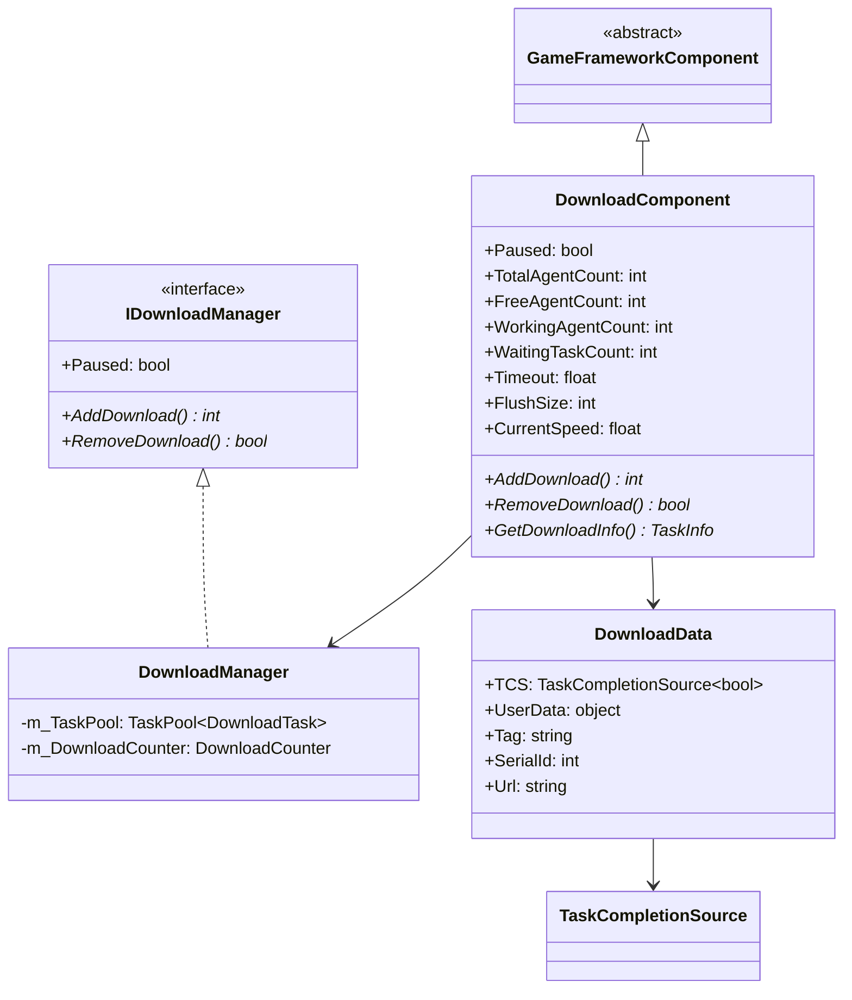
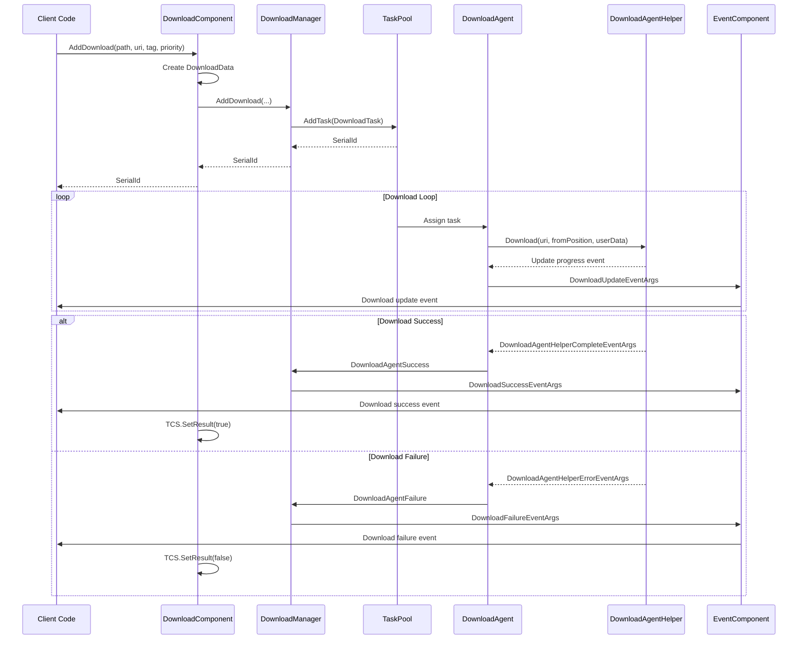
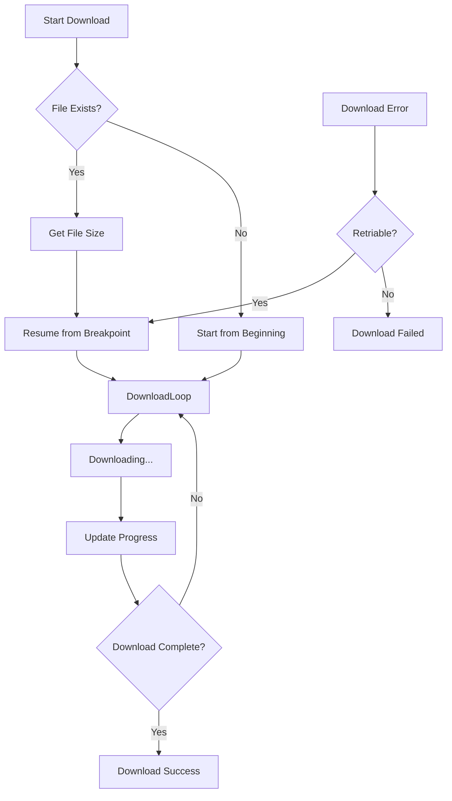

# DownloadComponent

DownloadComponent is the Unity component layer of the Game Framework download system, serving as a facade for the IDownloadManager interface and providing convenient download functionality integration for Unity projects.

## Overview

DownloadComponent is the core Unity component of the game framework's download module, inheriting from GameFrameworkComponent. It encapsulates the functionality of DownloadManager and integrates it with the Unity lifecycle. As a MonoBehaviour, developers can directly add it to game scenes, configuring and using it through the Inspector panel or code.

The core design objectives of this component are:
- Provide a concise Unity-friendly API interface
- Manage multiple DownloadAgent instances
- Notify download progress and status changes through the event system
- Support advanced features such as task priority, tag classification, and breakpoint resume

## Architecture

DownloadComponent plays the role of the entry layer in the entire download system. The following diagram shows its relationships with various components:

```mermaid
flowchart TD
    subgraph UnityLayer["Unity Layer"]
        DC[DownloadComponent]
        Inspector[DownloadComponentInspector]
    end

    subgraph Core["Core Module"]
        DM[DownloadManager]
        IDM[IDownloadManager Interface]
    end

    subgraph TaskPool["Task Pool"]
        TP[TaskPool&lt;DownloadTask&gt;]
        DA[DownloadAgent x N]
    end

    subgraph AgentHelper["Download Agent Helper"]
        DAHB[DownloadAgentHelperBase]
        UWR[UnityWebRequestDownloadAgentHelper]
        WWW[WWWDownloadAgentHelper]
    end

    subgraph Events["Event System"]
        EC[EventComponent]
        DE[DownloadEventArgs]
    end

    DC --> DM
    DC --> Inspector
    DM --> IDM
    IDM <|.. DM
    DM --> TP
    TP --> DA
    DA --> DAHB
    DAHB --> UWR
    DAHB --> WWW
    DM --> EC
    EC --> DE
```

### Component Layer Description

**Unity Layer**
- DownloadComponent: Main component providing Unity-friendly API
- DownloadComponentInspector: Editor Inspector for visual configuration

**Core Module**
- DownloadManager: Download manager implementation handling core logic
- IDownloadManager: Download manager interface defining specifications

**Task Pool Layer**
- TaskPool: General task pool managing download tasks and agents
- DownloadAgent: Download agent executing specific download tasks

**Agent Helper Layer**
- DownloadAgentHelperBase: Base class for download agent helpers
- UnityWebRequestDownloadAgentHelper: Implementation based on UnityWebRequest
- WWWDownloadAgentHelper: Implementation based on WWW (legacy compatibility)

### Core Class Diagram



## Core Features

### 1. Download Task Management

DownloadComponent provides rich download task management functionality:

```csharp
// Add basic download task
int serialId = downloadComponent.AddDownload(downloadPath, downloadUri);

// Add download task with tag
int serialId = downloadComponent.AddDownload(downloadPath, downloadUri, "resources");

// Add download task with priority
int serialId = downloadComponent.AddDownload(downloadPath, downloadUri, 100);

// Add download task with user data
int serialId = downloadComponent.AddDownload(downloadPath, downloadUri, userData);

// Complete parameters: path, URI, tag, priority, user data
int serialId = downloadComponent.AddDownload(downloadPath, downloadUri, "update", 100, userData);
```
> Source: [DownloadComponent.cs](https://github.com/GameFrameX/com.gameframex.unity.download/blob/main/Runtime/Download/DownloadComponent.cs#L238-L350)

### 2. Async Download Support

DownloadComponent supports async download mode, returning download results through Task:

```csharp
// Async download and wait for result
public async void StartDownload()
{
    var downloadComponent = GameEntry.GetComponent<DownloadComponent>();
    Task<bool> task = downloadComponent.Download(downloadPath, downloadUri);
    bool success = await task;
    Debug.Log($"Download {(success ? "succeeded" : "failed")}");
}
```
> Source: [DownloadComponent.cs](https://github.com/GameFrameX/com.gameframex.unity.download/blob/main/Runtime/Download/DownloadComponent.cs#L273-L282)

### 3. Task Query and Removal

```csharp
// Get download task info by serial ID
TaskInfo info = downloadComponent.GetDownloadInfo(serialId);

// Get all matching download tasks by tag
TaskInfo[] infos = downloadComponent.GetDownloadInfos("resources");

// Get all download tasks
TaskInfo[] allInfos = downloadComponent.GetAllDownloadInfos();

// Remove specified task
bool removed = downloadComponent.RemoveDownload(serialId);

// Remove all tasks with specified tag
int count = downloadComponent.RemoveDownloads("resources");

// Remove all tasks
downloadComponent.RemoveAllDownloads();
```
> Source: [DownloadComponent.cs](https://github.com/GameFrameX/com.gameframex.unity.download/blob/main/Runtime/Download/DownloadComponent.cs#L189-L392)

### 4. Download Status Monitoring

The component provides multiple read-only properties for monitoring download status:

```csharp
// Get download agent status
int totalCount = downloadComponent.TotalAgentCount;    // Total agent count
int freeCount = downloadComponent.FreeAgentCount;       // Free agent count
int workingCount = downloadComponent.WorkingAgentCount; // Working agent count
int waitingCount = downloadComponent.WaitaitingTaskCount; // Waiting task count

// Get current download speed (bytes/second)
float speed = downloadComponent.CurrentSpeed;

// Get/set pause status
downloadComponent.Paused = true;
```

### 5. Configuration Properties

| Property | Type | Default | Description |
|----------|------|---------|-------------|
| InstanceRoot | Transform | null | Root node for download agent instances |
| DownloadAgentHelperTypeName | string | UnityWebRequestDownloadAgentHelper | Download agent helper type |
| DownloadAgentHelperCount | int | 3 | Number of download agent instances (1-16) |
| Timeout | float | 30f | Download timeout (seconds, 0-120) |
| FlushSize | int | 1MB | Critical size for writing buffer to disk |

> Source: [DownloadComponentInspector.cs](https://github.com/GameFrameX/com.gameframex.unity.download/blob/main/Editor/Inspector/DownloadComponentInspector.cs#L39-L69)

## Download Flow

### Sequence Diagram



### Breakpoint Resume Flow

DownloadComponent supports breakpoint resume functionality, allowing downloads to continue from the last position after interruption:



Breakpoint resume is implemented by setting the HTTP Range header in DownloadAgentHelper:

```csharp
// Breakpoint resume implementation in UnityWebRequestDownloadAgentHelper.cs
m_UnityWebRequest.SetRequestHeader("Range", GameFrameX.Runtime.Utility.Text.Format("bytes={0}-", fromPosition));
```
> Source: [UnityWebRequestDownloadAgentHelper.cs](https://github.com/GameFrameX/com.gameframex.unity.download/blob/main/Runtime/Download/UnityWebRequestDownloadAgentHelper.cs#L114)

## Usage Examples

### Basic Usage

```csharp
using GameFrameX.Runtime;
using GameFrameX.Download.Runtime;

// Get component
var downloadComponent = GameEntry.GetComponent<DownloadComponent>();

// Add download task
string localPath = Application.persistentDataPath + "/Resources/texture.png";
string remoteUrl = "https://example.com/texture.png";

int serialId = downloadComponent.AddDownload(localPath, remoteUrl);
```
> Source: [DownloadComponent.cs](https://github.com/GameFrameX/com.gameframex.unity.download/blob/main/Runtime/Download/DownloadComponent.cs#L238-L241)

### Listening to Download Events

```csharp
using GameFrameX.Runtime;
using GameFrameX.Download.Runtime;

// Subscribe to download events
var downloadComponent = GameEntry.GetComponent<DownloadComponent>();
downloadComponent.DownloadStart += OnDownloadStart;
downloadComponent.DownloadUpdate += OnDownloadUpdate;
downloadComponent.DownloadSuccess += OnDownloadSuccess;
downloadComponent.DownloadFailure += OnDownloadFailure;

private void OnDownloadStart(object sender, DownloadStartEventArgs e)
{
    Debug.Log($"Download started: {e.DownloadUri}");
}

private void OnDownloadUpdate(object sender, DownloadUpdateEventArgs e)
{
    Debug.Log($"Download progress: {e.CurrentLength} bytes");
}

private void OnDownloadSuccess(object sender, DownloadSuccessEventArgs e)
{
    Debug.Log($"Download succeeded: {e.DownloadPath}");
}

private void OnDownloadFailure(object sender, DownloadFailureEventArgs e)
{
    Debug.Log($"Download failed: {e.ErrorMessage}");
}
```
> Source: [DownloadComponent.cs](https://github.com/GameFrameX/com.gameframex.unity.download/blob/main/Runtime/Download/DownloadComponent.cs#L415-L442)

### Batch Downloading Resource Bundles

```csharp
public class ResourceUpdater
{
    private DownloadComponent _downloadComponent;
    private List<string> _pendingDownloads = new List<string>();

    public void StartUpdate(List<ResourceInfo> resources)
    {
        _downloadComponent = GameEntry.GetComponent<DownloadComponent>();

        foreach (var resource in resources)
        {
            // Add download task for each resource, set tag for easy management
            _downloadComponent.AddDownload(
                resource.LocalPath,
                resource.RemoteUrl,
                "resources",  // Tag
                resource.Priority  // Priority
            );
        }
    }

    // Listen for download completion of specific tag
    private void OnDownloadSuccess(object sender, DownloadSuccessEventArgs e)
    {
        if (e.UserData is ResourceInfo info)
        {
            Debug.Log($"Resource download completed: {info.Name}");
            CheckAllComplete();
        }
    }
}
```

### Using Async/Await

```csharp
public async Task<bool> DownloadFileAsync(string url, string path)
{
    var downloadComponent = GameEntry.GetComponent<DownloadComponent>();

    // Use Task-based API
    Task<bool> downloadTask = downloadComponent.Download(path, url);

    // Wait for download to complete
    bool success = await downloadTask;

    return success;
}

// Usage example
bool result = await DownloadFileAsync(
    "https://example.com/bundle.zip",
    Application.persistentDataPath + "/bundle.zip"
);
```
> Source: [DownloadComponent.cs](https://github.com/GameFrameX/com.gameframex.unity.download/blob/main/Runtime/Download/DownloadComponent.cs#L273-L282)

## Event System

DownloadComponent forwards download events through EventComponent, with main events including:

| Event | Description | EventArgs |
|-------|-------------|-----------|
| DownloadStart | Triggered when download starts | DownloadStartEventArgs |
| DownloadUpdate | Triggered when download progress updates | DownloadUpdateEventArgs |
| DownloadSuccess | Triggered when download succeeds | DownloadSuccessEventArgs |
| DownloadFailure | Triggered when download fails | DownloadFailureEventArgs |

### DownloadSuccessEventArgs Properties

```csharp
public sealed class DownloadSuccessEventArgs : GameEventArgs
{
    public int SerialId { get; }           // Task serial ID
    public string DownloadPath { get; }    // Local storage path
    public string DownloadUri { get; }     // Original download URL
    public long CurrentLength { get; }      // Downloaded size
    public object UserData { get; }         // User custom data
}
```
> Source: [DownloadSuccessEventArgs.cs](https://github.com/GameFrameX/com.gameframex.unity.download/blob/main/Runtime/EventArgs/DownloadSuccessEventArgs.cs#L36-L56)

## Configuration Instructions

### Inspector Configuration

In the Unity editor, selecting a GameObject with DownloadComponent allows configuration of the following properties in the Inspector panel:

```csharp
// Configuration interface in DownloadComponentInspector.cs
EditorGUILayout.PropertyField(m_InstanceRoot);
m_DownloadAgentHelperInfo.Draw();
m_DownloadAgentHelperCount.intValue = EditorGUILayout.IntSlider("Download Agent Helper Count", ...);
float timeout = EditorGUILayout.Slider("Timeout", ...);
int flushSize = EditorGUILayout.DelayedIntField("Flush Size", ...);
```
> Source: [DownloadComponentInspector.cs](https://github.com/GameFrameX/com.gameframex.unity.download/blob/main/Editor/Inspector/DownloadComponentInspector.cs#L39-L69)

### Download Agent Helper

DownloadComponent supports custom download agent helpers, defaulting to UnityWebRequestDownloadAgentHelper. Developers can create custom implementations by inheriting from DownloadAgentHelperBase:

```csharp
public abstract class DownloadAgentHelperBase : MonoBehaviour, IDownloadAgentHelper
{
    public abstract event EventHandler<DownloadAgentHelperUpdateBytesEventArgs> DownloadAgentHelperUpdateBytes;
    public abstract event EventHandler<DownloadAgentHelperUpdateLengthEventArgs> DownloadAgentHelperUpdateLength;
    public abstract event EventHandler<DownloadAgentHelperCompleteEventArgs> DownloadAgentHelperComplete;
    public abstract event EventHandler<DownloadAgentHelperErrorEventArgs> DownloadAgentHelperError;

    public abstract void Download(string downloadUri, object userData);
    public abstract void Download(string downloadUri, long fromPosition, object userData);
    public abstract void Download(string downloadUri, long fromPosition, long toPosition, object userData);
    public abstract void Reset();
}
```
> Source: [DownloadAgentHelperBase.cs](https://github.com/GameFrameX/com.gameframex.unity.download/blob/main/Runtime/Download/DownloadAgentHelperBase.cs#L17-L72)

## Internal Implementation Details

### DownloadData Internal Class

DownloadComponent uses an internal class DownloadData to store metadata for each download task:

```csharp
sealed class DownloadData
{
    public TaskCompletionSource<bool> TCS { get; }  // For async waiting
    public object UserData { get; }                  // User data
    public string Tag { get; }                        // Tag
    public int SerialId { get; }                      // Serial ID
    public string Url { get; }                        // Download URL

    public DownloadData(string url, string tag, int serialId, object userData)
    {
        Url = url;
        Tag = tag;
        SerialId = serialId;
        UserData = userData;
        TCS = new TaskCompletionSource<bool>();
    }
}
```
> Source: [DownloadComponent.cs](https://github.com/GameFrameX/com.gameframex.unity.download/blob/main/Runtime/Download/DownloadComponent.cs#L118-L137)

### Lifecycle

1. **Awake()**: Initialize DownloadManager module, register download events
2. **Start()**: Get EventComponent, create download agent helper instances
3. **Update()**: Called by GameFramework automatically, handle task pool updates
4. **OnDestroy()**: Clean up resources (implemented through base class)

```csharp
protected override void Awake()
{
    ImplementationComponentType = Utility.Assembly.GetType(componentType);
    InterfaceComponentType = typeof(IDownloadManager);
    base.Awake();
    m_DownloadManager = GameFrameworkEntry.GetModule<IDownloadManager>();
    // Register events...
}

private void Start()
{
    m_EventComponent = GameEntry.GetComponent<EventComponent>();
    // Create download agent helpers...
}
```
> Source: [DownloadComponent.cs](https://github.com/GameFrameX/com.gameframex.unity.download/blob/main/Runtime/Download/DownloadComponent.cs#L142-L182)

## Related Links

- [Architecture Overview](./4-core-concepts.architecture) - Overall download system architecture
- [Download Agent](./4-core-concepts.download-agent) - DownloadAgent detailed explanation
- [API Reference - Properties](./5-api-reference.properties) - Complete property list
- [API Reference - Methods](./5-api-reference.methods) - Complete method list
- [Download Events](./6-events.download-events) - Download events detailed explanation
- [Editor Configuration](./7-configuration.editor-configuration) - Editor Inspector configuration
- [Agent Configuration](./7-configuration.agent-configuration) - Agent helper configuration