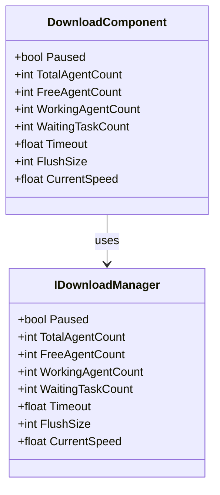
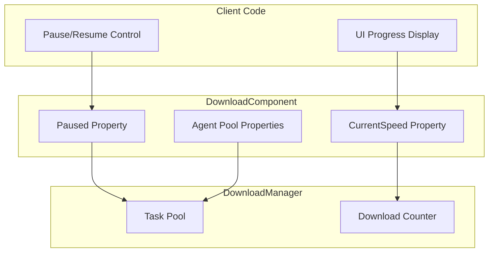

# Properties

This document provides detailed documentation on all public properties exposed by the DownloadComponent and its associated interfaces and event argument classes.

## Overview

The download module provides rich properties for monitoring and controlling the status of download tasks. The main property categories are:

1. **Status Control Properties** - Used to control download pause/resume
2. **Agent Pool Properties** - Used to monitor download agent usage
3. **Performance Configuration Properties** - Used to configure timeout and buffer size
4. **Monitoring Properties** - Used to get real-time download status



## DownloadComponent Properties

DownloadComponent is the core component of the download system, inheriting from GameFrameworkComponent. Below are detailed descriptions of all public properties:

> Source: [DownloadComponent.cs](https://github.com/GameFrameX/com.gameframex.unity.download/blob/main/Runtime/Download/DownloadComponent.cs#L46-L108)

### `Paused`

```csharp
public bool Paused
{
    get { return m_DownloadManager.Paused; }
    set { m_DownloadManager.Paused = value; }
}
```

**Type:** `bool`  
**Read/Write:** Read and write  
**Description:** Gets or sets whether the download is paused. When set to `true`, all ongoing and pending download tasks will pause; when set to `false`, paused tasks will resume execution.

**Usage Example:**

```csharp
// Pause all downloads
var downloadComponent = GameEntry.GetComponent<DownloadComponent>();
downloadComponent.Paused = true;

// Resume downloads
downloadComponent.Paused = false;
```

### `TotalAgentCount`

```csharp
public int TotalAgentCount
{
    get { return m_DownloadManager.TotalAgentCount; }
}
```

**Type:** `int`  
**Read/Write:** Read-only  
**Description:** Gets the total number of download agents. This is the total number of download agent instances created at system startup, reflecting the maximum number of concurrent download tasks the system can handle.

### `FreeAgentCount`

```csharp
public int FreeAgentCount
{
    get { return m_DownloadManager.FreeAgentCount; }
}
```

**Type:** `int`  
**Read/Write:** Read-only  
**Description:** Gets the number of available (idle) download agents. When this value is greater than 0, new download tasks can be added immediately without waiting.

### `WorkingAgentCount`

```csharp
public int WorkingAgentCount
{
    get { return m_DownloadManager.WorkingAgentCount; }
}
```

**Type:** `int`  
**Read/Write:** Read-only  
**Description:** Gets the number of working (busy) download agents. Indicates the number of agents currently executing download tasks.

### `WaitingTaskCount`

```csharp
public int WaitingTaskCount
{
    get { return m_DownloadManager.WaitingTaskCount; }
}
```

**Type:** `int`  
**Read/Write:** Read-only  
**Description:** Gets the number of waiting download tasks. When all agents are busy, newly added tasks will enter the waiting queue.

### `Timeout`

```csharp
public float Timeout
{
    get { return m_DownloadManager.Timeout; }
    set { m_DownloadManager.Timeout = m_Timeout = value; }
}
```

**Type:** `float`  
**Read/Write:** Read and write  
**Default Value:** `30.0f` (30 seconds)  
**Description:** Gets or sets the download timeout duration in seconds. When a single download task exceeds this time without completion, a download failure event will be triggered.

### `FlushSize`

```csharp
public int FlushSize
{
    get { return m_DownloadManager.FlushSize; }
    set { m_DownloadManager.FlushSize = m_FlushSize = value; }
}
```

**Type:** `int`  
**Read/Write:** Read and write  
**Default Value:** `1048576` (1MB, i.e., 1024 * 1024)  
**Description:** Gets or sets the critical size for writing the buffer to disk, only effective when breakpoint resume is enabled. This value determines the size of data that needs to accumulate in the memory buffer before being written to the final file. Larger values can improve write performance but increase memory usage.

### `CurrentSpeed`

```csharp
public float CurrentSpeed
{
    get { return m_DownloadManager.CurrentSpeed; }
}
```

**Type:** `float`  
**Read/Write:** Read-only  
**Unit:** Bytes/second (B/s)  
**Description:** Gets the current download speed. This is the real-time calculated download rate, can be used to display download progress UI.

## Event Argument Properties

The download module notifies external parties about download status changes through the event system. Below are properties exposed by each event argument class:

### DownloadStartEventArgs

Event arguments triggered when download starts.

> Source: [DownloadStartEventArgs.cs](https://github.com/GameFrameX/com.gameframex.unity.download/blob/main/Runtime/EventArgs/DownloadStartEventArgs.cs#L35-L55)

| Property | Type | Description |
|----------|------|-------------|
| `SerialId` | `int` | The serial number of the download task, used to uniquely identify the download task |
| `DownloadPath` | `string` | The local path where the file will be saved after download |
| `DownloadUri` | `string` | The original download address (URL) |
| `CurrentLength` | `long` | Currently downloaded size (bytes) |
| `UserData` | `object` | User custom data |

### DownloadUpdateEventArgs

Event arguments triggered when download progress updates.

> Source: [DownloadUpdateEventArgs.cs](https://github.com/GameFrameX/com.gameframex.unity.download/blob/main/Runtime/EventArgs/DownloadUpdateEventArgs.cs#L35-L55)

| Property | Type | Description |
|----------|------|-------------|
| `SerialId` | `int` | The serial number of the download task |
| `DownloadPath` | `string` | The local path where the file will be saved |
| `DownloadUri` | `string` | The original download address |
| `CurrentLength` | `long` | Currently downloaded size |
| `UserData` | `object` | User custom data |

### DownloadSuccessEventArgs

Event arguments triggered when download completes successfully.

> Source: [DownloadSuccessEventArgs.cs](https://github.com/GameFrameX/com.gameframex.unity.download/blob/main/Runtime/EventArgs/DownloadSuccessEventArgs.cs#L35-L56)

| Property | Type | Description |
|----------|------|-------------|
| `SerialId` | `int` | The serial number of the download task |
| `DownloadPath` | `string` | The local path where the file will be saved |
| `DownloadUri` | `string` | The original download address |
| `CurrentLength` | `long` | The final downloaded file size |
| `UserData` | `object` | User custom data |

### DownloadFailureEventArgs

Event arguments triggered when download fails.

> Source: [DownloadFailureEventArgs.cs](https://github.com/GameFrameX/com.gameframex.unity.download/blob/main/Runtime/EventArgs/DownloadFailureEventArgs.cs#L35-L55)

| Property | Type | Description |
|----------|------|-------------|
| `SerialId` | `int` | The serial number of the download task |
| `DownloadPath` | `string` | The local path where the file will be saved |
| `DownloadUri` | `string` | The original download address |
| `ErrorMessage` | `string` | Error description |
| `UserData` | `object` | User custom data |

## Property Relationships and Data Flow

The following diagram shows the relationships between properties and data flow:



## Usage Examples

### Monitoring Download Status

The following example shows how to use properties to monitor the download system status:

```csharp
public class DownloadStatusMonitor : MonoBehaviour
{
    private DownloadComponent _downloadComponent;

    private void Start()
    {
        _downloadComponent = GameEntry.GetComponent<DownloadComponent>();
    }

    private void Update()
    {
        // Get real-time download speed
        float speed = _downloadComponent.CurrentSpeed;
        
        // Get agent pool status
        int total = _downloadComponent.TotalAgentCount;
        int free = _downloadComponent.FreeAgentCount;
        int working = _downloadComponent.WorkingAgentCount;
        int waiting = _downloadComponent.WaitingTaskCount;
        
        // Update UI display
        UpdateDownloadUI(speed, total, free, working, waiting);
    }
    
    private void UpdateDownloadUI(float speed, int total, int free, int working, int waiting)
    {
        // Convert bytes to MB/s
        float speedMB = speed / (1024 * 1024);
        Debug.Log($"Download speed: {speedMB:F2} MB/s | Agent status: {free}/{total} free | Working: {working} | Waiting: {waiting}");
    }
}
```
> Source: [DownloadComponent.cs](https://github.com/GameFrameX/com.gameframex.unity.download/blob/main/Runtime/Download/DownloadComponent.cs#L100-L108)

### Pause and Resume Downloads

```csharp
public class DownloadController
{
    private DownloadComponent _downloadComponent;

    public void PauseAllDownloads()
    {
        _downloadComponent = GameEntry.GetComponent<DownloadComponent>();
        _downloadComponent.Paused = true;
        Debug.Log("All downloads paused");
    }

    public void ResumeAllDownloads()
    {
        if (_downloadComponent == null)
        {
            _downloadComponent = GameEntry.GetComponent<DownloadComponent>();
        }
        _downloadComponent.Paused = false;
        Debug.Log("Downloads resumed");
    }
}
```
> Source: [DownloadComponent.cs](https://github.com/GameFrameX/com.gameframex.unity.download/blob/main/Runtime/Download/DownloadComponent.cs#L46-L50)

### Configuring Download Parameters

```csharp
public void ConfigureDownload()
{
    var downloadComponent = GameEntry.GetComponent<DownloadComponent>();
    
    // Set timeout to 60 seconds
    downloadComponent.Timeout = 60f;
    
    // Set buffer flush size to 2MB
    downloadComponent.FlushSize = 2 * 1024 * 1024;
    
    Debug.Log($"Timeout: {downloadComponent.Timeout}s, Buffer: {downloadComponent.FlushSize} bytes");
}
```
> Source: [DownloadComponent.cs](https://github.com/GameFrameX/com.gameframex.unity.download/blob/main/Runtime/Download/DownloadComponent.cs#L87-L100)

## Configuration Options Summary Table

| Property | Type | Default | Description |
|----------|------|---------|-------------|
| `Paused` | `bool` | `false` | Whether downloads are paused |
| `TotalAgentCount` | `int` | Determined by config | Total number of download agents |
| `FreeAgentCount` | `int` | - | Number of available download agents |
| `WorkingAgentCount` | `int` | - | Number of working download agents |
| `WaitingTaskCount` | `int` | - | Number of waiting download tasks |
| `Timeout` | `float` | `30.0f` | Download timeout duration (seconds) |
| `FlushSize` | `int` | `1048576` | Buffer write-to-disk critical size (bytes) |
| `CurrentSpeed` | `float` | - | Current download speed (bytes/second) |

## Related Links

- [Methods](./5-api-reference.methods) - Learn all methods of DownloadComponent
- [Download Events](./6-events.download-events) - Learn about the download event system in detail
- [Architecture Overview](./4-core-concepts.architecture) - View the overall architecture of the download module
- [DownloadComponent](./4-core-concepts.download-component) - Learn about DownloadComponent core concepts