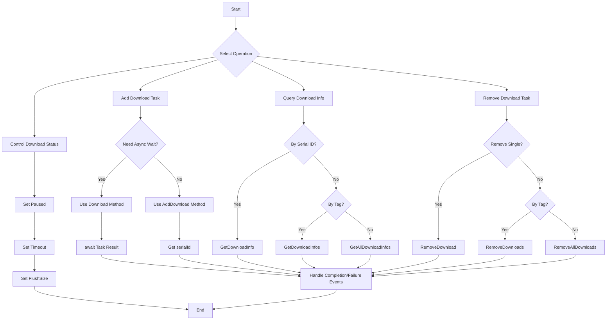

# Methods

This document provides detailed documentation on all public methods exposed by the DownloadComponent. These methods are used for managing download tasks, querying download status, and controlling download behavior.

## Overview

DownloadComponent is the core component for game download functionality, providing a complete set of async download task management APIs. Through these methods, developers can:

- Add download tasks (with support for priority, tags, and user custom data)
- Query download task status and progress
- Pause/resume downloads
- Remove single or batch download tasks
- Get real-time download speed

## Download Task Management

### Adding Download Tasks

DownloadComponent provides 8 `AddDownload` method overloads to meet different usage scenarios. All overloads return the serial ID of the newly added download task.

#### Basic Add Method

```csharp
public int AddDownload(string downloadPath, string downloadUri)
```

Adds a basic download task.

**Parameters:**
- `downloadPath` (string): Local storage path for the downloaded file
- `downloadUri` (string): Remote file download URL

**Return Value:** Serial ID of the newly added download task

**Example:**
```csharp
var downloadComponent = GameEntry.GetComponent<DownloadComponent>();
int serialId = downloadComponent.AddDownload(Application.persistentDataPath + "/file.dat", "https://example.com/file.dat");
```

> Source: [DownloadComponent.cs](https://github.com/GameFrameX/com.gameframex.unity.download/blob/main/Runtime/Download/DownloadComponent.cs#L238-L241)

---

#### Add Method with Tag

```csharp
public int AddDownload(string downloadPath, string downloadUri, string tag)
```

Adds a download task with a tag for group management.

**Parameters:**
- `downloadPath` (string): Local storage path for the downloaded file
- `downloadUri` (string): Remote file download URL
- `tag` (string): Tag for the download task, used for group management

**Return Value:** Serial ID of the newly added download task

**Example:**
```csharp
int serialId = downloadComponent.AddDownload(path, uri, "resources");
```

> Source: [DownloadComponent.cs](https://github.com/GameFrameX/com.gameframex.unity.download/blob/main/Runtime/Download/DownloadComponent.cs#L250-L253)

---

#### Add Method with Priority

```csharp
public int AddDownload(string downloadPath, string downloadUri, int priority)
```

Adds a download task with priority.

**Parameters:**
- `downloadPath` (string): Local storage path for the downloaded file
- `downloadUri` (string): Remote file download URL
- `priority` (int): Priority of the download task, higher values have higher priority

**Return Value:** Serial ID of the newly added download task

> Source: [DownloadComponent.cs](https://github.com/GameFrameX/com.gameframex.unity.download/blob/main/Runtime/Download/DownloadComponent.cs#L262-L265)

---

#### Add Method with User Data

```csharp
public int AddDownload(string downloadPath, string downloadUri, object userData)
```

Adds a download task with user custom data.

**Parameters:**
- `downloadPath` (string): Local storage path for the downloaded file
- `downloadUri` (string): Remote file download URL
- `userData` (object): User custom data that will be passed in events

**Return Value:** Serial ID of the newly added download task

**Example:**
```csharp
var userData = new { fileType = "texture", version = "1.0" };
int serialId = downloadComponent.AddDownload(path, uri, userData);
```

> Source: [DownloadComponent.cs](https://github.com/GameFrameX/com.gameframex.unity.download/blob/main/Runtime/Download/DownloadComponent.cs#L291-L294)

---

#### Full Parameter Add Method

```csharp
public int AddDownload(string downloadPath, string downloadUri, string tag, int priority, object userData)
```

Adds a download task with all parameters.

**Parameters:**
- `downloadPath` (string): Local storage path for the downloaded file
- `downloadUri` (string): Remote file download URL
- `tag` (string): Tag for the download task
- `priority` (int): Priority of the download task
- `userData` (object): User custom data

**Return Value:** Serial ID of the newly added download task

> Source: [DownloadComponent.cs](https://github.com/GameFrameX/com.gameframex.unity.download/blob/main/Runtime/Download/DownloadComponent.cs#L344-L350)

---

### Async Download Method

```csharp
public Task<bool> Download(string downloadPath, string downloadUri)
```

Adds a download task and returns a Task object for async/await pattern usage.

**Parameters:**
- `downloadPath` (string): Local storage path for the downloaded file
- `downloadUri` (string): Remote file download URL

**Return Value:** Task&lt;bool&gt;, returns true on completion, false on failure

**Example:**
```csharp
var downloadComponent = GameEntry.GetComponent<DownloadComponent>();
bool success = await downloadComponent.Download(Application.persistentDataPath + "/file.dat", "https://example.com/file.dat");
```

> Source: [DownloadComponent.cs](https://github.com/GameFrameX/com.gameframex.unity.download/blob/main/Runtime/Download/DownloadComponent.cs#L273-L282)

---

### Removing Download Tasks

#### Remove by Serial ID

```csharp
public bool RemoveDownload(int serialId)
```

Removes a specified download task by its serial ID.

**Parameters:**
- `serialId` (int): Serial ID of the download task to remove

**Return Value:** bool, whether removal was successful

**Example:**
```csharp
bool removed = downloadComponent.RemoveDownload(serialId);
```

> Source: [DownloadComponent.cs](https://github.com/GameFrameX/com.gameframex.unity.download/blob/main/Runtime/Download/DownloadComponent.cs#L357-L361)

---

#### Remove by Tag

```csharp
public int RemoveDownloads(string tag)
```

Removes all matching download tasks by tag.

**Parameters:**
- `tag` (string): Tag of download tasks to remove

**Return Value:** int, number of tasks removed

**Example:**
```csharp
// Remove all download tasks tagged as "resources"
int removedCount = downloadComponent.RemoveDownloads("resources");
```

> Source: [DownloadComponent.cs](https://github.com/GameFrameX/com.gameframex.unity.download/blob/main/Runtime/Download/DownloadComponent.cs#L368-L382)

---

#### Remove All Tasks

```csharp
public int RemoveAllDownloads()
```

Removes all download tasks.

**Return Value:** int, number of tasks removed

**Example:**
```csharp
int removedCount = downloadComponent.RemoveAllDownloads();
```

> Source: [DownloadComponent.cs](https://github.com/GameFrameX/com.gameframex.unity.download/blob/main/Runtime/Download/DownloadComponent.cs#L388-L392)

---

## Download Information Query

### Query by Serial ID

```csharp
public TaskInfo GetDownloadInfo(int serialId)
```

Gets download task information by serial ID.

**Parameters:**
- `serialId` (int): Serial ID of the download task to query

**Return Value:** TaskInfo, containing detailed download task information

> Source: [DownloadComponent.cs](https://github.com/GameFrameX/com.gameframex.unity.download/blob/main/Runtime/Download/DownloadComponent.cs#L189-L192)

---

### Query by Tag

```csharp
public TaskInfo[] GetDownloadInfos(string tag)
```

Gets all matching download task information by tag.

**Parameters:**
- `tag` (string): Tag of download tasks to query

**Return Value:** TaskInfo[], array of matching download task information

```csharp
public void GetDownloadInfos(string tag, List<TaskInfo> results)
```

Adds matching download task information to the specified list (avoiding memory allocation).

**Parameters:**
- `tag` (string): Tag of download tasks to query
- `results` (List&lt;TaskInfo&gt;): TaskInfo list to store results

> Source: [DownloadComponent.cs](https://github.com/GameFrameX/com.gameframex.unity.download/blob/main/Runtime/Download/DownloadComponent.cs#L199-L212)

---

### Query All Tasks

```csharp
public TaskInfo[] GetAllDownloadInfos()
```

Gets information for all download tasks.

**Return Value:** TaskInfo[], array of all download task information

```csharp
public void GetAllDownloadInfos(List<TaskInfo> results)
```

Adds all download task information to the specified list (avoiding memory allocation).

**Parameters:**
- `results` (List&lt;TaskInfo&gt;): TaskInfo list to store results

> Source: [DownloadComponent.cs](https://github.com/GameFrameX/com.gameframex.unity.download/blob/main/Runtime/Download/DownloadComponent.cs#L218-L230)

---

## Download Control Properties

### Pause/Resume Control

```csharp
public bool Paused { get; set; }
```

Gets or sets whether downloads are paused. When set to true, all pending download tasks will pause execution.

**Property Value:** bool, true means paused, false means continue

**Example:**
```csharp
// Pause all downloads
downloadComponent.Paused = true;

// Resume downloads
downloadComponent.Paused = false;
```

> Source: [DownloadComponent.cs](https://github.com/GameFrameX/com.gameframex.unity.download/blob/main/Runtime/Download/DownloadComponent.cs#L46-L50)

---

### Timeout Setting

```csharp
public float Timeout { get; set; }
```

Gets or sets the download timeout duration in seconds. Default value is 30 seconds.

**Property Value:** float, timeout duration in seconds

**Example:**
```csharp
// Set download timeout to 60 seconds
downloadComponent.Timeout = 60f;
```

> Source: [DownloadComponent.cs](https://github.com/GameFrameX/com.gameframex.unity.download/blob/main/Runtime/Download/DownloadComponent.cs#L87-L91)

---

### Buffer Size Setting

```csharp
public int FlushSize { get; set; }
```

Gets or sets the critical size for writing the buffer to disk. Only effective when breakpoint resume is enabled. Default value is 1MB.

**Property Value:** int, buffer size in bytes

> Source: [DownloadComponent.cs](https://github.com/GameFrameX/com.gameframex.unity.download/blob/main/Runtime/Download/DownloadComponent.cs#L96-L100)

---

## Status Query Properties

### Agent Status

```csharp
public int TotalAgentCount { get; }
```

Gets the total number of download agents.

---

```csharp
public int FreeAgentCount { get; }
```

Gets the number of available (idle) download agents.

---

```csharp
public int WorkingAgentCount { get; }
```

Gets the number of working download agents.

---

```csharp
public int WaitingTaskCount { get; }
```

Gets the number of waiting download tasks.

---

### Download Speed

```csharp
public float CurrentSpeed { get; }
```

Gets the current download speed in bytes per second.

**Example:**
```csharp
float speed = downloadComponent.CurrentSpeed;
Debug.Log($"Current download speed: {speed / 1024 / 1024:F2} MB/s");
```

> Source: [DownloadComponent.cs](https://github.com/GameFrameX/com.gameframex.unity.download/blob/main/Runtime/Download/DownloadComponent.cs#L105-L108)

---

## Method Usage Flow



---

## Complete Usage Example

```csharp
using UnityEngine;
using GameFrameX.Runtime;
using GameFrameX.Download.Runtime;

public class DownloadExample : MonoBehaviour
{
    private DownloadComponent downloadComponent;

    private void Start()
    {
        downloadComponent = GameEntry.GetComponent<DownloadComponent>();

        // Example 1: Basic download
        int serialId = downloadComponent.AddDownload(
            Application.persistentDataPath + "/data.bin",
            "https://example.com/data.bin"
        );

        // Example 2: Download with priority and tag
        int serialId2 = downloadComponent.AddDownload(
            Application.persistentDataPath + "/texture.png",
            "https://example.com/texture.png",
            "resources",  // Tag
            100,         // Priority
            null         // User data
        );

        // Example 3: Async download
        _ = AsyncDownload();
    }

    private async Task AsyncDownload()
    {
        bool success = await downloadComponent.Download(
            Application.persistentDataPath + "/config.json",
            "https://example.com/config.json"
        );

        Debug.Log($"Download result: {(success ? "succeeded" : "failed")}");
    }

    private void Update()
    {
        // Query download status
        if (downloadComponent != null)
        {
            TaskInfo[] allTasks = downloadComponent.GetAllDownloadInfos();
            foreach (var task in allTasks)
            {
                Debug.Log($"Task {task.SerialId}: {task.Status} - {task.Description}");
            }

            // Display download speed
            Debug.Log($"Speed: {downloadComponent.CurrentSpeed / 1024:F2} KB/s");
        }
    }
}
```

---

## Frequently Asked Questions

### How to implement breakpoint resume?

Breakpoint resume is enabled by default. When a download is interrupted and the same path download task is added again, the system automatically detects the downloaded portion and continues from the breakpoint.

### How to limit the number of concurrent downloads?

Set the `Download Agent Helper Count` property in the DownloadComponent Inspector panel. This value determines the maximum number of concurrent download tasks.

### How to retry after download failure?

You can listen to the `DownloadFailure` event to get failure information, then re-call the `AddDownload` method in the callback to add a retry task.

---

## Related Links

- [Properties](./5-api-reference.properties) - DownloadComponent properties documentation
- [Download Events](./6-events.download-events) - Download-related events
- [Agent Events](./6-events.agent-events) - Download agent-related events
- [Agent Configuration](./7-configuration.agent-configuration) - Download agent configuration
- [DownloadComponent Core Concepts](./4-core-concepts.download-component) - Component detailed introduction