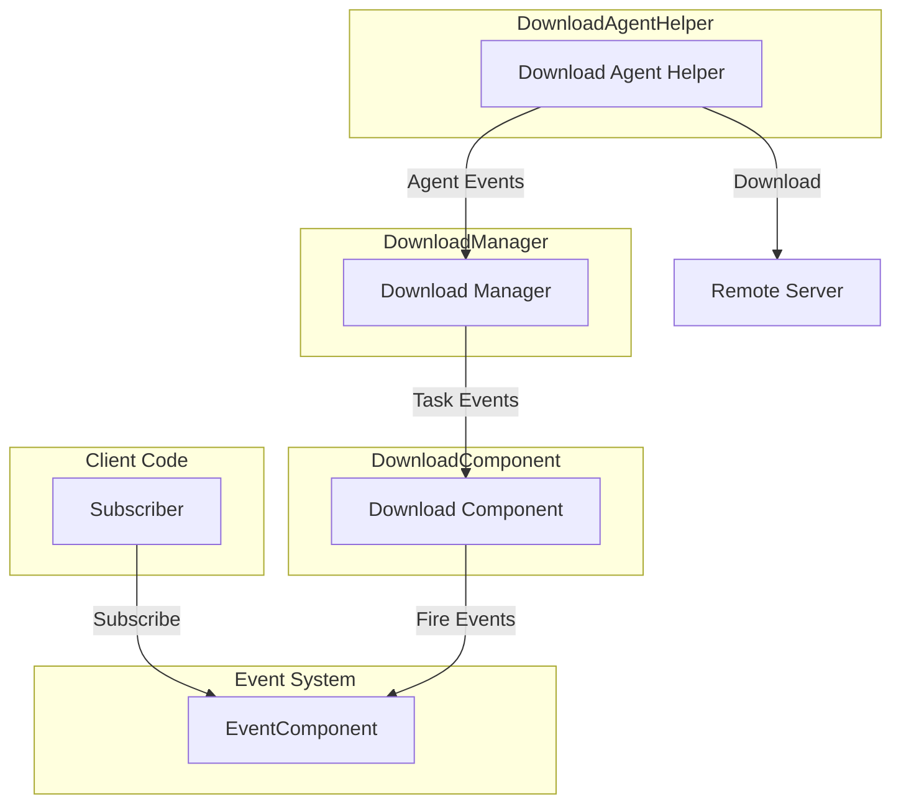
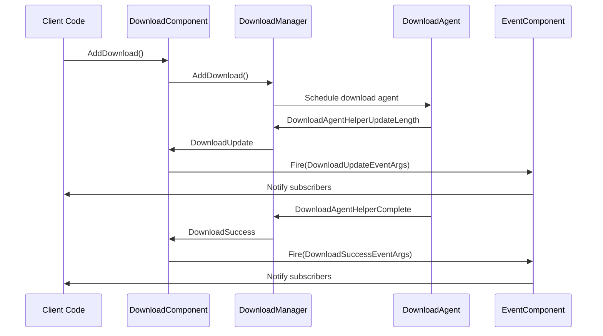

# Download Events

This document provides detailed documentation on the event system in the GameFrameX download module, including download task events and download agent events.

## Overview

The GameFrameX download module uses an event-driven architecture, implementing real-time notification of download status through a unified event system. The event system is divided into two levels:

1. **Download Task Events** - Notifications for status changes across the entire download task
2. **Download Agent Events** - Low-level status notifications for download agent helpers

This layered design allows developers to choose different granularity of event listening based on their needs. They can monitor high-level download task status or low-level agent data transmission status.

## Event Architecture

The download event system uses a publish-subscribe pattern, with `EventComponent` providing unified event management and distribution.



### Event Flow Description

1. Client subscribes to download events of interest through `EventComponent`
2. When calling `DownloadComponent.AddDownload()` to add a download task, the task enters the download queue
3. `DownloadManager` schedules download agents to execute actual download operations
4. Various events generated during the download process are forwarded to `EventComponent` through `DownloadComponent`
5. Subscribers receive event notifications and execute corresponding logic

## Download Task Events

Download task events are defined in the `IDownloadManager` interface and exposed to external use through `DownloadComponent`. These events provide key status change notifications throughout the complete lifecycle of download tasks.

> Source: [IDownloadManager.cs](https://github.com/GameFrameX/com.gameframex.unity.download/blob/main/Runtime/Download/Download/IDownloadManager.cs#L86-L104)

### Event List

| Event Name | Event Args Class | Trigger Time |
|------------|------------------|--------------|
| Download Start | `DownloadStartEventArgs` | When download task starts executing |
| Download Update | `DownloadUpdateEventArgs` | When download progress updates |
| Download Success | `DownloadSuccessEventArgs` | When download completes successfully |
| Download Failure | `DownloadFailureEventArgs` | When download fails |

### DownloadStartEventArgs

Download start event, triggered when a download task is received and started processing by a download agent.

```csharp
//------------------------------------------------------------
// Game Framework
// Copyright © 2013-2021 Jiang Yin. All rights reserved.
//------------------------------------------------------------

using GameFrameX.Event.Runtime;
using GameFrameX.Runtime;

namespace GameFrameX.Download.Runtime
{
    /// <summary>
    /// Download start event.
    /// </summary>
    public sealed class DownloadStartEventArgs : GameEventArgs
    {
        public static readonly string EventId = typeof(DownloadStartEventArgs).FullName;

        /// <summary>
        /// Initializes a new instance of the DownloadStartEventArgs class.
        /// </summary>
        public DownloadStartEventArgs()
        {
            SerialId = 0;
            DownloadPath = null;
            DownloadUri = null;
            CurrentLength = 0L;
            UserData = null;
        }

        /// <summary>
        /// Gets the serial number of the download task.
        /// </summary>
        public int SerialId { get; private set; }

        /// <summary>
        /// Gets the storage path after download.
        /// </summary>
        public string DownloadPath { get; private set; }

        /// <summary>
        /// Gets the download address.
        /// </summary>
        public string DownloadUri { get; private set; }

        /// <summary>
        /// Gets the current size.
        /// </summary>
        public long CurrentLength { get; private set; }

        /// <summary>
        /// Gets the user custom data.
        /// </summary>
        public object UserData { get; private set; }

        /// <summary>
        /// Creates a download start event.
        /// </summary>
        public static DownloadStartEventArgs Create(int serialId, string downloadPath, string downloadUri, long currentLength, object userData)
        {
            DownloadStartEventArgs downloadStartEventArgs = ReferencePool.Acquire<DownloadStartEventArgs>();
            downloadStartEventArgs.SerialId = serialId;
            downloadStartEventArgs.DownloadPath = downloadPath;
            downloadStartEventArgs.DownloadUri = downloadUri;
            downloadStartEventArgs.CurrentLength = currentLength;
            downloadStartEventArgs.UserData = userData;
            return downloadStartEventArgs;
        }

        /// <summary>
        /// Clears the download start event.
        /// </summary>
        public override void Clear()
        {
            SerialId = 0;
            DownloadPath = null;
            DownloadUri = null;
            CurrentLength = 0L;
            UserData = null;
        }

        public override string Id
        {
            get { return EventId; }
        }
    }
}
```
> Source: [DownloadStartEventArgs.cs](https://github.com/GameFrameX/com.gameframex.unity.download/blob/main/Runtime/EventArgs/DownloadStartEventArgs.cs#L1-L94)

### DownloadUpdateEventArgs

Download update event, continuously triggered during download to report current download progress.

```csharp
/// <summary>
/// Download update event.
/// </summary>
public sealed class DownloadUpdateEventArgs : GameEventArgs
{
    public static readonly string EventId = typeof(DownloadUpdateEventArgs).FullName;

    /// <summary>
    /// Initializes a new instance of the DownloadUpdateEventArgs class.
    /// </summary>
    public DownloadUpdateEventArgs()
    {
        SerialId = 0;
        DownloadPath = null;
        DownloadUri = null;
        CurrentLength = 0L;
        UserData = null;
    }

    /// <summary>
    /// Gets the serial number of the download task.
    /// </summary>
    public int SerialId { get; private set; }

    /// <summary>
    /// Gets the storage path after download.
    /// </summary>
    public string DownloadPath { get; private set; }

    /// <summary>
        /// Gets the download address.
    /// </summary>
    public string DownloadUri { get; private set; }

    /// <summary>
    /// Gets the current size.
    /// </summary>
    public long CurrentLength { get; private set; }

    /// <summary>
    /// Gets the user custom data.
    /// </summary>
    public object UserData { get; private set; }

    /// <summary>
    /// Creates a download update event.
    /// </summary>
    public static DownloadUpdateEventArgs Create(int serialId, string downloadPath, string downloadUri, long currentLength, object userData)
    {
        DownloadUpdateEventArgs downloadUpdateEventArgs = ReferencePool.Acquire<DownloadUpdateEventArgs>();
        downloadUpdateEventArgs.SerialId = serialId;
        downloadUpdateEventArgs.DownloadPath = downloadPath;
        downloadUpdateEventArgs.DownloadUri = downloadUri;
        downloadUpdateEventArgs.CurrentLength = currentLength;
        downloadUpdateEventArgs.UserData = userData;
        return downloadUpdateEventArgs;
    }

    /// <summary>
    /// Clears the download update event.
    /// </summary>
    public override void Clear()
    {
        SerialId = 0;
        DownloadPath = null;
        DownloadUri = null;
        CurrentLength = 0L;
        UserData = null;
    }

    public override string Id
    {
        get { return EventId; }
    }
}
```
> Source: [DownloadUpdateEventArgs.cs](https://github.com/GameFrameX/com.gameframex.unity.download/blob/main/Runtime/EventArgs/DownloadUpdateEventArgs.cs#L1-L94)

### DownloadSuccessEventArgs

Download success event, triggered when a download task completes successfully.

```csharp
/// <summary>
/// Download success event.
/// </summary>
public sealed class DownloadSuccessEventArgs : GameEventArgs
{
    public static readonly string EventId = typeof(DownloadSuccessEventArgs).FullName;

    /// <summary>
    /// Initializes a new instance of the DownloadSuccessEventArgs class.
    /// </summary>
    public DownloadSuccessEventArgs()
    {
        SerialId = 0;
        DownloadPath = null;
        DownloadUri = null;
        CurrentLength = 0L;
        UserData = null;
    }

    /// <summary>
    /// Gets the serial number of the download task.
    /// </summary>
    public int SerialId { get; private set; }

    /// <summary>
    /// Gets the storage path after download.
    /// </summary>
    public string DownloadPath { get; private set; }

    /// <summary>
    /// Gets the download address.
    /// </summary>
    public string DownloadUri { get; private set; }

    /// <summary>
    /// Gets the current size.
    /// </summary>
    public long CurrentLength { get; private set; }

    /// <summary>
    /// Gets the user custom data.
    /// </summary>
    public object UserData { get; private set; }

    /// <summary>
    /// Creates a download success event.
    /// </summary>
    public static DownloadSuccessEventArgs Create(int serialId, string downloadPath, string downloadUri, long currentLength, object userData)
    {
        DownloadSuccessEventArgs downloadSuccessEventArgs = ReferencePool.Acquire<DownloadSuccessEventArgs>();
        downloadSuccessEventArgs.SerialId = serialId;
        downloadSuccessEventArgs.DownloadPath = downloadPath;
        downloadSuccessEventArgs.DownloadUri = downloadUri;
        downloadSuccessEventArgs.CurrentLength = currentLength;
        downloadSuccessEventArgs.UserData = userData;
        return downloadSuccessEventArgs;
    }

    /// <summary>
    /// Clears the download success event.
    /// </summary>
    public override void Clear()
    {
        SerialId = 0;
        DownloadPath = null;
        DownloadUri = null;
        CurrentLength = 0L;
        UserData = null;
    }

    public override string Id
    {
        get { return EventId; }
    }
}
```
> Source: [DownloadSuccessEventArgs.cs](https://github.com/GameFrameX/com.gameframex.unity.download/blob/main/Runtime/EventArgs/DownloadSuccessEventArgs.cs#L1-L95)

### DownloadFailureEventArgs

Download failure event, triggered when an error occurs during download.

```csharp
/// <summary>
/// Download failure event.
/// </summary>
public sealed class DownloadFailureEventArgs : GameEventArgs
{
    public static readonly string EventId = typeof(DownloadFailureEventArgs).FullName;

    /// <summary>
    /// Initializes a new instance of the DownloadFailureEventArgs class.
    /// </summary>
    public DownloadFailureEventArgs()
    {
        SerialId = 0;
        DownloadPath = null;
        DownloadUri = null;
        ErrorMessage = null;
        UserData = null;
    }

    /// <summary>
    /// Gets the serial number of the download task.
    /// </summary>
    public int SerialId { get; private set; }

    /// <summary>
    /// Gets the storage path after download.
    /// </summary>
    public string DownloadPath { get; private set; }

    /// <summary>
    /// Gets the download address.
    /// </summary>
    public string DownloadUri { get; private set; }

    /// <summary>
    /// Gets the error message.
    /// </summary>
    public string ErrorMessage { get; private set; }

    /// <summary>
    /// Gets the user custom data.
    /// </summary>
    public object UserData { get; private set; }

    /// <summary>
    /// Creates a download failure event.
    /// </summary>
    public static DownloadFailureEventArgs Create(int serialId, string downloadPath, string downloadUri, string errorMessage, object userData)
    {
        DownloadFailureEventArgs downloadFailureEventArgs = ReferencePool.Acquire<DownloadFailureEventArgs>();
        downloadFailureEventArgs.SerialId = serialId;
        downloadFailureEventArgs.DownloadPath = downloadPath;
        downloadFailureEventArgs.DownloadUri = downloadUri;
        downloadFailureEventArgs.ErrorMessage = errorMessage;
        downloadFailureEventArgs.UserData = userData;
        return downloadFailureEventArgs;
    }

    /// <summary>
    /// Clears the download failure event.
    /// </summary>
    public override void Clear()
    {
        SerialId = 0;
        DownloadPath = null;
        DownloadUri = null;
        ErrorMessage = null;
        UserData = null;
    }

    public override string Id
    {
        get { return EventId; }
    }
}
```
> Source: [DownloadFailureEventArgs.cs](https://github.com/GameFrameX/com.gameframex.unity.download/blob/main/Runtime/EventArgs/DownloadFailureEventArgs.cs#L1-L94)

## Download Agent Events

Download agent events are defined in the `DownloadAgentHelperBase` abstract class, providing lower-level download status notifications. These events are primarily used internally by `DownloadManager` to track the working status of download agents.

> Source: [DownloadAgentHelperBase.cs](https://github.com/GameFrameX/com.gameframex.unity.download/blob/main/Runtime/Download/DownloadAgentHelperBase.cs#L19-L42)

### Event List

| Event Name | Event Args Class | Trigger Time |
|------------|------------------|--------------|
| Agent Update Bytes | `DownloadAgentHelperUpdateBytesEventArgs` | When download agent receives new data block |
| Agent Update Length | `DownloadAgentHelperUpdateLengthEventArgs` | When download agent data size changes |
| Agent Complete | `DownloadAgentHelperCompleteEventArgs` | When download agent completes download |
| Agent Error | `DownloadAgentHelperErrorEventArgs` | When download agent encounters error |

### DownloadAgentHelperUpdateBytesEventArgs

Agent update bytes event, provides raw byte content of downloaded data.

```csharp
/// <summary>
/// Download agent helper update bytes event.
/// </summary>
public sealed class DownloadAgentHelperUpdateBytesEventArgs : GameEventArgs
{
    public static readonly string EventId = typeof(DownloadAgentHelperUpdateBytesEventArgs).FullName;
    
    private byte[] m_Bytes;

    /// <summary>
    /// Initializes a new instance of the DownloadAgentHelperUpdateBytesEventArgs class.
    /// </summary>
    public DownloadAgentHelperUpdateBytesEventArgs()
    {
        m_Bytes = null;
        Offset = 0;
        Length = 0;
    }

    /// <summary>
    /// Gets the offset of the data stream.
    /// </summary>
    public int Offset { get; private set; }

    /// <summary>
    /// Gets the length of the data stream.
    /// </summary>
    public int Length { get; private set; }

    /// <summary>
    /// Creates a download agent helper update bytes event.
    /// </summary>
    public static DownloadAgentHelperUpdateBytesEventArgs Create(byte[] bytes, int offset, int length)
    {
        if (bytes == null)
        {
            throw new GameFrameworkException("Bytes is invalid.");
        }

        if (offset < 0 || offset >= bytes.Length)
        {
            throw new GameFrameworkException("Offset is invalid.");
        }

        if (length <= 0 || offset + length > bytes.Length)
        {
            throw new GameFrameworkException("Length is invalid.");
        }

        DownloadAgentHelperUpdateBytesEventArgs downloadAgentHelperUpdateBytesEventArgs = ReferencePool.Acquire<DownloadAgentHelperUpdateBytesEventArgs>();
        downloadAgentHelperUpdateBytesEventArgs.m_Bytes = bytes;
        downloadAgentHelperUpdateBytesEventArgs.Offset = offset;
        downloadAgentHelperUpdateBytesEventArgs.Length = length;
        return downloadAgentHelperUpdateBytesEventArgs;
    }

    /// <summary>
    /// Gets the downloaded data stream.
    /// </summary>
    public byte[] GetBytes()
    {
        return m_Bytes;
    }
    
    public override string Id
    {
        get { return EventId; }
    }
}
```
> Source: [DownloadAgentHelperUpdateBytesEventArgs.cs](https://github.com/GameFrameX/com.gameframex.unity.download/blob/main/Runtime/EventArgs/DownloadAgentHelperUpdateBytesEventArgs.cs#L1-L104)

### DownloadAgentHelperUpdateLengthEventArgs

Agent update length event, provides incremental data size of downloaded data.

```csharp
/// <summary>
/// Download agent helper update length event.
/// </summary>
public sealed class DownloadAgentHelperUpdateLengthEventArgs : GameEventArgs
{
    public static readonly string EventId = typeof(DownloadAgentHelperUpdateLengthEventArgs).FullName;

    /// <summary>
    /// Initializes a new instance of the DownloadAgentHelperUpdateLengthEventArgs class.
    /// </summary>
    public DownloadAgentHelperUpdateLengthEventArgs()
    {
        DeltaLength = 0;
    }

    /// <summary>
    /// Gets the incremental download data size.
    /// </summary>
    public int DeltaLength { get; private set; }

    /// <summary>
    /// Creates a download agent helper update length event.
    /// </summary>
    public static DownloadAgentHelperUpdateLengthEventArgs Create(int deltaLength)
    {
        if (deltaLength <= 0)
        {
            throw new GameFrameworkException("Delta length is invalid.");
        }

        DownloadAgentHelperUpdateLengthEventArgs downloadAgentHelperUpdateLengthEventArgs = ReferencePool.Acquire<DownloadAgentHelperUpdateLengthEventArgs>();
        downloadAgentHelperUpdateLengthEventArgs.DeltaLength = deltaLength;
        return downloadAgentHelperUpdateLengthEventArgs;
    }

    /// <summary>
    /// Clears the download agent helper update length event.
    /// </summary>
    public override void Clear()
    {
        DeltaLength = 0;
    }

    public override string Id
    {
        get { return EventId; }
    }
}
```
> Source: [DownloadAgentHelperUpdateLengthEventArgs.cs](https://github.com/GameFrameX/com.gameframex.unity.download/blob/main/Runtime/EventArgs/DownloadAgentHelperUpdateLengthEventArgs.cs#L1-L63)

### DownloadAgentHelperCompleteEventArgs

Agent complete event, triggered when download agent completes download.

```csharp
/// <summary>
/// Download agent helper complete event.
/// </summary>
public sealed class DownloadAgentHelperCompleteEventArgs : GameEventArgs
{
    public static readonly string EventId = typeof(DownloadAgentHelperCompleteEventArgs).FullName;

    /// <summary>
    /// Initializes a new instance of the DownloadAgentHelperCompleteEventArgs class.
    /// </summary>
    public DownloadAgentHelperCompleteEventArgs()
    {
        Length = 0L;
    }

    /// <summary>
    /// Gets the downloaded data size.
    /// </summary>
    public long Length { get; private set; }

    /// <summary>
    /// Creates a download agent helper complete event.
    /// </summary>
    public static DownloadAgentHelperCompleteEventArgs Create(long length)
    {
        if (length < 0L)
        {
            throw new GameFrameworkException("Length is invalid.");
        }

        DownloadAgentHelperCompleteEventArgs downloadAgentHelperCompleteEventArgs = ReferencePool.Acquire<DownloadAgentHelperCompleteEventArgs>();
        downloadAgentHelperCompleteEventArgs.Length = length;
        return downloadAgentHelperCompleteEventArgs;
    }

    /// <summary>
    /// Clears the download agent helper complete event.
    /// </summary>
    public override void Clear()
    {
        Length = 0L;
    }

    public override string Id
    {
        get { return EventId; }
    }
}
```
> Source: [DownloadAgentHelperCompleteEventArgs.cs](https://github.com/GameFrameX/com.gameframex.unity.download/blob/main/Runtime/EventArgs/DownloadAgentHelperCompleteEventArgs.cs#L1-L63)

### DownloadAgentHelperErrorEventArgs

Agent error event, triggered when download agent encounters an error.

```csharp
/// <summary>
/// Download agent helper error event.
/// </summary>
public sealed class DownloadAgentHelperErrorEventArgs : GameEventArgs
{
    public static readonly string EventId = typeof(DownloadAgentHelperErrorEventArgs).FullName;

    /// <summary>
    /// Initializes a new instance of the DownloadAgentHelperErrorEventArgs class.
    /// </summary>
    public DownloadAgentHelperErrorEventArgs()
    {
        DeleteDownloading = false;
        ErrorMessage = null;
    }

    /// <summary>
    /// Gets whether the currently downloading file needs to be deleted.
    /// </summary>
    public bool DeleteDownloading { get; private set; }

    /// <summary>
    /// Gets the error message.
    /// </summary>
    public string ErrorMessage { get; private set; }

    /// <summary>
    /// Creates a download agent helper error event.
    /// </summary>
    public static DownloadAgentHelperErrorEventArgs Create(bool deleteDownloading, string errorMessage)
    {
        DownloadAgentHelperErrorEventArgs downloadAgentHelperErrorEventArgs = ReferencePool.Acquire<DownloadAgentHelperErrorEventArgs>();
        downloadAgentHelperErrorEventArgs.DeleteDownloading = deleteDownloading;
        downloadAgentHelperErrorEventArgs.ErrorMessage = errorMessage;
        return downloadAgentHelperErrorEventArgs;
    }

    /// <summary>
    /// Clears the download agent helper error event.
    /// </summary>
    public override void Clear()
    {
        DeleteDownloading = false;
        ErrorMessage = null;
    }

    public override string Id
    {
        get { return EventId; }
    }
}
```
> Source: [DownloadAgentHelperErrorEventArgs.cs](https://github.com/GameFrameX/com.gameframex.unity.download/blob/main/Runtime/EventArgs/DownloadAgentHelperErrorEventArgs.cs#L1-L67)

## Event Subscription and Usage

Developers can subscribe to download events through `EventComponent` to monitor download status changes.

### Event Subscription Example

```csharp
using GameFrameX.Download.Runtime;
using GameFrameX.Event.Runtime;
using UnityEngine;

public class DownloadExample : MonoBehaviour
{
    private EventComponent m_EventComponent;
    
    private void Start()
    {
        m_EventComponent = GameEntry.GetComponent<EventComponent>();
        
        // Subscribe to download start event
        m_EventComponent.Subscribe(DownloadStartEventArgs.EventId, OnDownloadStart);
        
        // Subscribe to download update event
        m_EventComponent.Subscribe(DownloadUpdateEventArgs.EventId, OnDownloadUpdate);
        
        // Subscribe to download success event
        m_EventComponent.Subscribe(DownloadSuccessEventArgs.EventId, OnDownloadSuccess);
        
        // Subscribe to download failure event
        m_EventComponent.Subscribe(DownloadFailureEventArgs.EventId, OnDownloadFailure);
    }
    
    private void OnDownloadStart(object sender, GameEventArgs e)
    {
        var args = (DownloadStartEventArgs)e;
        Debug.Log($"Download started: SerialId={args.SerialId}, Path={args.DownloadPath}");
    }
    
    private void OnDownloadUpdate(object sender, GameEventArgs e)
    {
        var args = (DownloadUpdateEventArgs)e;
        Debug.Log($"Download progress: SerialId={args.SerialId}, CurrentLength={args.CurrentLength}");
    }
    
    private void OnDownloadSuccess(object sender, GameEventArgs e)
    {
        var args = (DownloadSuccessEventArgs)e;
        Debug.Log($"Download success: SerialId={args.SerialId}, Path={args.DownloadPath}");
    }
    
    private void OnDownloadFailure(object sender, GameEventArgs e)
    {
        var args = (DownloadFailureEventArgs)e;
        Debug.LogError($"Download failed: SerialId={args.SerialId}, Error={args.ErrorMessage}");
    }
}
```

> Source: [DownloadComponent.cs](https://github.com/GameFrameX/com.gameframex.unity.download/blob/main/Runtime/Download/DownloadComponent.cs#L415-L442)

### Event Trigger Flow



## Event Argument Property Reference

### Download Task Event Properties

| Property | Type | Description | Belongs To |
|---------|------|-------------|------------|
| `SerialId` | `int` | Unique serial number of the download task | All |
| `DownloadPath` | `string` | Local path where file will be saved after download | All |
| `DownloadUri` | `string` | Remote download address | All |
| `CurrentLength` | `long` | Currently downloaded data size (bytes) | Start/Update/Success |
| `ErrorMessage` | `string` | Error description | Failure |
| `UserData` | `object` | User custom data | All |

### Agent Event Properties

| Property | Type | Description | Belongs To |
|---------|------|-------------|------------|
| `Bytes[]` | `byte[]` | Downloaded raw data bytes | UpdateBytes |
| `Offset` | `int` | Offset of data stream | UpdateBytes |
| `Length` | `int` | Length of data stream | UpdateBytes/Complete |
| `DeltaLength` | `int` | Incremental size for this download | UpdateLength |
| `DeleteDownloading` | `bool` | Whether to delete the currently downloading file | Error |
| `ErrorMessage` | `string` | Error description | Error |

## Event Usage Recommendations

1. **Choose Appropriate Event Granularity**
   - Monitor download task events (`DownloadStart`/`DownloadUpdate`/`DownloadSuccess`/`DownloadFailure`) for business logic processing
   - Monitor agent events for implementing download progress bars or debugging

2. **Event Argument Pooling**
   - All event arguments are pool-managed through `ReferencePool`
   - Use `Create()` method to create events, use `Clear()` method to recycle

3. **Error Handling**
   - Always subscribe to `DownloadFailure` events to capture download failures
   - Error messages in failure events contain detailed error information

## Related Links

- [Agent Events](./6-events.agent-events) - Download agent low-level events detail
- [DownloadComponent](./4-core-concepts.download-component) - Download component detail
- [Download Agent](./4-core-concepts.download-agent) - Download agent concept description
- [API Reference](./5-api-reference) - Complete API reference documentation