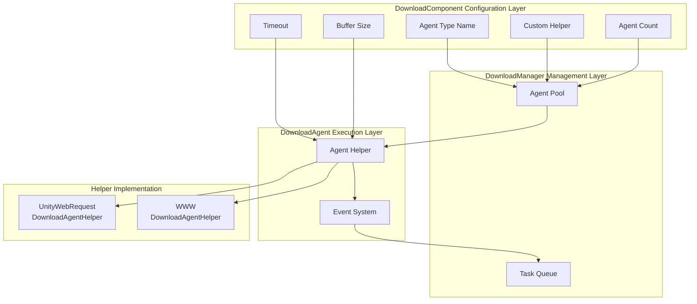

# Download Agent Configuration

Download agent configuration is used to set the core behavior of the download system, including agent type selection, concurrency count, timeout settings, and other key parameters.

## Overview

The download agent (Download Agent) is the core execution unit of the download system, responsible for actual network requests and data writing operations. Each download agent implements specific download functionality through a download agent helper (DownloadAgentHelper). The system supports configuring multiple parallel working download agents to improve multi-file download efficiency.

Download agent configuration is primarily set through the `DownloadComponent` component in the Unity editor, and can also be dynamically adjusted via code.

## Configuration Item Details

### Agent Helper Type Configuration

The agent helper type determines the specific implementation class that actually performs the download operation.

| Configuration Item | Type | Default | Description |
|---------|------|---------|-------------|
| Helper Type Name | string | "GameFrameX.Download.Runtime.UnityWebRequestDownloadAgentHelper" | Full type name of the helper class |
| Custom Helper Instance | DownloadAgentHelperBase | null | Directly referenced custom helper object |

```csharp
// Configuration definition in DownloadComponent.cs
[SerializeField] private string m_DownloadAgentHelperTypeName = "GameFrameX.Download.Runtime.UnityWebRequestDownloadAgentHelper";

[SerializeField] private DownloadAgentHelperBase m_CustomDownloadAgentHelper = null;
```
> Source: [DownloadComponent.cs](https://github.com/GameFrameX/com.gameframex.unity.download/blob/main/Runtime/Download/DownloadComponent.cs#L33-L35)

**Usage Instructions:**
- Create by type name: The system reflects to create helper instance based on string type name
- Direct reference to custom instance: You can pre-create custom helpers and assign them to `m_CustomDownloadAgentHelper`

### Agent Count Configuration

```csharp
// Create 3 parallel download agents by default
[SerializeField] private int m_DownloadAgentHelperCount = 3;
```
> Source: [DownloadComponent.cs](https://github.com/GameFrameX/com.gameframex.unity.download/blob/main/Runtime/Download/DownloadComponent.cs#L37)

```csharp
// Create all download agents at startup
for (int i = 0; i < m_DownloadAgentHelperCount; i++)
{
    AddDownloadAgentHelper(i);
}
```
> Source: [DownloadComponent.cs](https://github.com/GameFrameX/com.gameframex.unity.download/blob/main/Runtime/Download/DownloadComponent.cs#L178-L181)

| Configuration Item | Type | Default | Range | Description |
|---------|------|---------|----------|-------------|
| Agent Count | int | 3 | 1-16 | Number of download agents working simultaneously |

**Performance Recommendations:**
- More agents means stronger parallel download capability, but higher network bandwidth consumption
- Recommended based on actual network conditions and server limits
- Mobile: 2-4 agents recommended, PC: 4-8 agents can be set

### Timeout Configuration

```csharp
// Download timeout in seconds
[SerializeField] private float m_Timeout = 30f;
```
> Source: [DownloadComponent.cs](https://github.com/GameFrameX/com.gameframex.unity.download/blob/main/Runtime/Download/DownloadComponent.cs#L39)

| Configuration Item | Type | Default | Range | Description |
|---------|------|---------|----------|-------------|
| Timeout | float | 30 seconds | 0-120 seconds | Maximum wait time for a single download request |

**Timeout Logic:**
```csharp
// Timeout judgment in DownloadAgent.cs
m_WaitTime += realElapseSeconds;
if (m_WaitTime >= m_Task.Timeout)
{
    // Trigger timeout error
    DownloadAgentHelperErrorEventArgs.Create(false, "Timeout");
}
```
> Source: [DownloadManager.DownloadAgent.cs](https://github.com/GameFrameX/com.gameframex.unity.download/blob/main/Runtime/Download/Download/DownloadManager.DownloadAgent.cs#L127-L138)

### Buffer Configuration

```csharp
// Buffer size in bytes, default 1MB
private const int OneMegaBytes = 1024 * 1024;
[SerializeField] private int m_FlushSize = OneMegaBytes;
```
> Source: [DownloadComponent.cs](https://github.com/GameFrameX/com.gameframex.unity.download/blob/main/Runtime/Download/DownloadComponent.cs#L25-L41)

| Configuration Item | Type | Default | Description |
|---------|------|---------|-------------|
| Buffer Size | int | 1048576 (1MB) | Buffer threshold for triggering disk writes |

**Breakpoint Resume Principle:**
```csharp
// Accumulate buffer during data writing, flush to disk when threshold is reached
m_FileStream.Write(e.GetBytes(), e.Offset, e.Length);
m_WaitFlushSize += e.Length;
if (m_WaitFlushSize >= m_Task.FlushSize)
{
    m_FileStream.Flush();  // Flush to disk
    m_WaitFlushSize = 0;
}
```
> Source: [DownloadManager.DownloadAgent.cs](https://github.com/GameFrameX/com.gameframex.unity.download/blob/main/Runtime/Download/Download/DownloadManager.DownloadAgent.cs#L270-L291)

## Built-in Agent Helpers

### UnityWebRequestDownloadAgentHelper

This is the system's default download agent helper, implemented based on Unity's `UnityWebRequest`.

**Features:**
- Supports breakpoint resume (Range requests)
- Supports HTTPS/SSL
- Automatic certificate handling (accepts all certificates by default)
- Compatible with Unity 2017.2+

**Key Implementation:**
```csharp
public partial class UnityWebRequestDownloadAgentHelper : DownloadAgentHelperBase, IDisposable
{
    // Supports three download modes:
    // 1. Full download
    public override void Download(string downloadUri, object userData);
    
    // 2. Breakpoint resume from specified position
    public override void Download(string downloadUri, long fromPosition, object userData);
    
    // 3. Specified range download
    public override void Download(string downloadUri, long fromPosition, long toPosition, object userData);
}
```
> Source: [UnityWebRequestDownloadAgentHelper.cs](https://github.com/GameFrameX/com.gameframex.unity.download/blob/main/Runtime/Download/UnityWebRequestDownloadAgentHelper.cs#L26-L147)

**Certificate Handling:**
```csharp
// Accept all SSL certificates by default (for development use)
public sealed class DownloadCertificateHandler : CertificateHandler
{
    protected override bool ValidateCertificate(byte[] certificateData)
    {
        return true; // Accept all certificates
    }
}
```
> Source: [UnityWebRequestDownloadAgentHelper.cs](https://github.com/GameFrameX/com.gameframex.unity.download/blob/main/Runtime/Download/UnityWebRequestDownloadAgentHelper.cs#L14-L21)

### WWWDownloadAgentHelper

Traditional download helper, implemented based on `WWW` class, only available in Unity versions before 2018.3.

```csharp
#if !UNITY_2018_3_OR_NEWER
public class WWWDownloadAgentHelper : DownloadAgentHelperBase, IDisposable
{
    // Same interface as UnityWebRequestDownloadAgentHelper
}
#endif
```
> Source: [WWWDownloadAgentHelper.cs](https://github.com/GameFrameX/com.gameframex.unity.download/blob/main/Runtime/Download/WWWDownloadAgentHelper.cs#L8-L22)

**Note:** It is recommended to use `UnityWebRequestDownloadAgentHelper`, the `WWW` class was deprecated in Unity 2018.3.

## Architecture Diagram



## Agent Helper Interface

All download agent helpers must implement the `IDownloadAgentHelper` interface:

```csharp
public interface IDownloadAgentHelper
{
    /// Download agent helper update bytes event
    event EventHandler<DownloadAgentHelperUpdateBytesEventArgs> DownloadAgentHelperUpdateBytes;

    /// Download agent helper update length event
    event EventHandler<DownloadAgentHelperUpdateLengthEventArgs> DownloadAgentHelperUpdateLength;

    /// Download agent helper complete event
    event EventHandler<DownloadAgentHelperCompleteEventArgs> DownloadAgentHelperComplete;

    /// Download agent helper error event
    event EventHandler<DownloadAgentHelperErrorEventArgs> DownloadAgentHelperError;

    /// Download data from specified address via download agent helper
    void Download(string downloadUri, object userData);
    void Download(string downloadUri, long fromPosition, object userData);
    void Download(string downloadUri, long fromPosition, long toPosition, object userData);

    /// Reset download agent helper
    void Reset();
}
```
> Source: [IDownloadAgentHelper.cs](https://github.com/GameFrameX/com.gameframex.unity.download/blob/main/Runtime/Download/Download/IDownloadAgentHelper.cs#L15-L65)

## Custom Agent Helper

You can create custom download agent helpers by inheriting `DownloadAgentHelperBase`:

```csharp
public abstract class DownloadAgentHelperBase : MonoBehaviour, IDownloadAgentHelper
{
    /// Range not satisfiable error code
    protected const int RangeNotSatisfiableErrorCode = 416;

    /// Four events that must be implemented
    public abstract event EventHandler<DownloadAgentHelperUpdateBytesEventArgs> DownloadAgentHelperUpdateBytes;
    public abstract event EventHandler<DownloadAgentHelperUpdateLengthEventArgs> DownloadAgentHelperUpdateLength;
    public abstract event EventHandler<DownloadAgentHelperCompleteEventArgs> DownloadAgentHelperComplete;
    public abstract event EventHandler<DownloadAgentHelperErrorEventArgs> DownloadAgentHelperError;

    /// Three download methods that must be implemented (supports breakpoint resume)
    public abstract void Download(string downloadUri, object userData);
    public abstract void Download(string downloadUri, long fromPosition, object userData);
    public abstract void Download(string downloadUri, long fromPosition, long toPosition, object userData);

    /// Reset helper status
    public abstract void Reset();
}
```
> Source: [DownloadAgentHelperBase.cs](https://github.com/GameFrameX/com.gameframex.unity.download/blob/main/Runtime/Download/DownloadAgentHelperBase.cs#L17-L72)

## Editor Configuration

In the Unity editor, you can visually configure through the DownloadComponent component panel:

```csharp
// Configuration items in Inspector
EditorGUILayout.PropertyField(m_InstanceRoot);  // Instance root node
m_DownloadAgentHelperInfo.Draw();               // Agent helper type selection
m_DownloadAgentHelperCount.intValue = EditorGUILayout.IntSlider("Download Agent Helper Count", ...); // Agent count
EditorGUILayout.Slider("Timeout", ...);        // Timeout
EditorGUILayout.DelayedIntField("Flush Size", ...); // Buffer size
```
> Source: [DownloadComponentInspector.cs](https://github.com/GameFrameX/com.gameframex.unity.download/blob/main/Editor/Inspector/DownloadComponentInspector.cs#L38-L69)

## Event System

Download agent helpers report download status to upper layers through events:

| Event | Parameter Type | Trigger Time |
|------|----------|--------------|
| DownloadAgentHelperUpdateBytes | DownloadAgentHelperUpdateBytesEventArgs | When download data is received |
| DownloadAgentHelperUpdateLength | DownloadAgentHelperUpdateLengthEventArgs | When data size updates |
| DownloadAgentHelperComplete | DownloadAgentHelperCompleteEventArgs | When download completes |
| DownloadAgentHelperError | DownloadAgentHelperErrorEventArgs | When download error occurs |

These events are received and processed by `DownloadAgent`, ultimately triggering higher-level download events.

## Related Links

- [Editor Configuration](./7-configuration.editor-configuration) - Editor-related configuration instructions
- [Core Concepts - Download Agent](./4-core-concepts.download-agent) - Download agent core concepts detail
- [API Reference - Properties](./5-api-reference.properties) - DownloadComponent properties API
- [API Reference - Methods](./5-api-reference.methods) - DownloadComponent methods API
- [Download Events](./6-events.download-events) - Download-related events
- [Agent Events](./6-events.agent-events) - Agent-related events