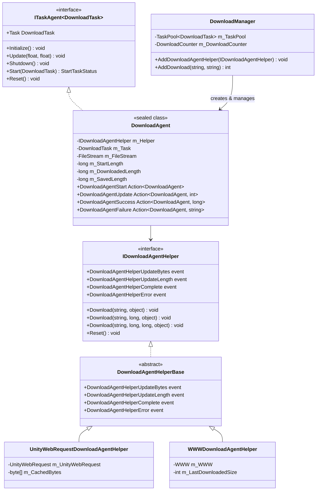
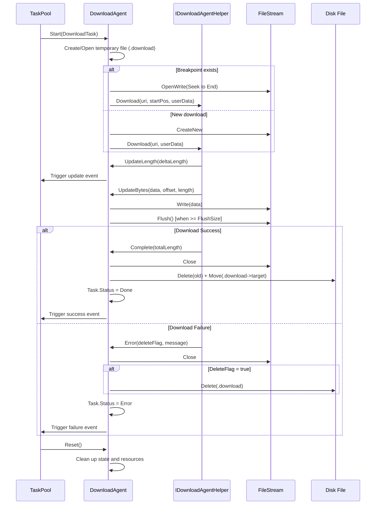

# Download Agent

The Download Agent is the core execution unit of the GameFrameX download system, responsible for actually executing download tasks. Each download agent instance corresponds to a specific download operation, completing network requests and data storage through interaction with the Download Agent Helper.

## Overview

The download agent is the internal task executor of `DownloadManager`, implementing the `ITaskAgent<DownloadTask>` interface. It manages the complete lifecycle of a single download task, including:

- **Task Startup**: Initialize file stream, check breakpoint resume, start download
- **Progress Monitoring**: Real-time tracking of download progress, handling timeout, calculating download speed
- **Data Writing**: Write downloaded data blocks to temporary files (.download suffix)
- **Task Completion**: Rename temporary file to target file
- **Error Handling**: Handle network errors, timeout errors, IO errors

The download agent uses a strategy pattern design, supporting different download implementations through dependency injection of different download agent helpers (`IDownloadAgentHelper`). The framework provides two built-in implementations:
- `UnityWebRequestDownloadAgentHelper`: Based on Unity's `UnityWebRequest` API (recommended, compatible with Unity 2017.2+)
- `WWWDownloadAgentHelper`: Based on traditional `WWW` class (only supports Unity versions below 2018.3)

## Architecture

The download agent system uses a layered architecture design, with core components including:



**Architecture Design Points:**

1. **Task Agent Pattern**: `DownloadAgent` implements `ITaskAgent<DownloadTask>` interface, integrating into the `TaskPool` task pool system for unified task scheduling and management.

2. **Dependency Injection**: `DownloadAgent` receives `IDownloadAgentHelper` instance through constructor, abstracting the underlying download implementation for easy extension and testing.

3. **Event-Driven**: `DownloadAgent` senses download progress and status changes by subscribing to `IDownloadAgentHelper` events, keeping decoupled from specific download implementations.

4. **Lifecycle Management**: `DownloadAgent` implements `IDisposable` interface to ensure resources (especially file streams and network requests) are properly released.

## Core Flow

The download agent processes the complete flow of a single download task as follows:



**Key Design Decisions:**

1. **Temporary File Mechanism**: Download data is first written to a `.download` suffix temporary file, and only renamed to the target file after completion. This ensures:
   - Incomplete downloads won't corrupt the original target file
   - Supports breakpoint resume (by checking temporary file size)

2. **Buffered Writing**: `DownloadAgent` maintains an internal buffer, performing physical writes only when `FlushSize` (default 1MB) is reached, reducing IO operations.

3. **Timeout Detection**: The wait timer is reset each time data or progress updates are received. If no data is received for `Timeout` (default 30 seconds), a timeout error is determined.

## Core Properties

`DownloadAgent` provides the following public properties for external queries:

| Property | Type | Description |
|----------|------|-------------|
| `Task` | `DownloadTask` | Currently processing download task |
| `WaitTime` | `float` | Time since last data received (seconds) |
| `StartLength` | `long` | Size of existing file when download started (for breakpoint resume) |
| `DownloadedLength` | `long` | Data size already downloaded in this session |
| `CurrentLength` | `long` | Current total size (StartLength + DownloadedLength) |
| `SavedLength` | `long` | Data size persisted to disk |

```csharp
// Example: Query download progress
DownloadAgent agent = /* get from event or pool */;
long totalSize = agent.CurrentLength;
long downloaded = agent.DownloadedLength;
float progress = (float)downloaded / totalSize * 100f;
Debug.Log($"Download progress: {progress:F1}% ({downloaded}/{totalSize} bytes)");
```

## Event System

The download agent communicates with the outside through the following callback events:

```csharp
// Download start event
public Action<DownloadAgent> DownloadAgentStart;

// Download progress update event (triggered each time new data block is received)
public Action<DownloadAgent, int> DownloadAgentUpdate;

// Download success completion event
public Action<DownloadAgent, long> DownloadAgentSuccess;

// Download failure event
public Action<DownloadAgent, string> DownloadAgentFailure;
```

These events are bound to the manager's event system when `DownloadManager.AddDownloadAgentHelper()` is called, forming a unified event flow.

## Download Agent Helper

### IDownloadAgentHelper Interface

`IDownloadAgentHelper` defines the core contract for download agent helpers:

> Source: [IDownloadAgentHelper.cs](https://github.com/GameFrameX/com.gameframex.unity.download/blob/main/Runtime/Download/Download/IDownloadAgentHelper.cs#L15-L65)

```csharp
public interface IDownloadAgentHelper
{
    // Event: Download data stream update
    event EventHandler<DownloadAgentHelperUpdateBytesEventArgs> DownloadAgentHelperUpdateBytes;
    
    // Event: Download length update (incremental)
    event EventHandler<DownloadAgentHelperUpdateLengthEventArgs> DownloadAgentHelperUpdateLength;
    
    // Event: Download complete
    event EventHandler<DownloadAgentHelperCompleteEventArgs> DownloadAgentHelperComplete;
    
    // Event: Download error
    event EventHandler<DownloadAgentHelperErrorEventArgs> DownloadAgentHelperError;

    // Method: Download from beginning
    void Download(string downloadUri, object userData);
    
    // Method: Continue download from specified position (breakpoint resume)
    void Download(string downloadUri, long fromPosition, object userData);
    
    // Method: Download specified range of data
    void Download(string downloadUri, long fromPosition, long toPosition, object userData);
    
    // Method: Reset helper status
    void Reset();
}
```

### UnityWebRequestDownloadAgentHelper

Implementation based on UnityWebRequest, supporting modern Unity versions (2017.2+):

> Source: [UnityWebRequestDownloadAgentHelper.cs](https://github.com/GameFrameX/com.gameframex.unity.download/blob/main/Runtime/Download/UnityWebRequestDownloadAgentHelper.cs#L26-L229)

**Features:**
- Uses `DownloadHandlerScript` subclass to implement incremental data callbacks
- Built-in SSL certificate verification handler (accepts all certificates by default)
- Supports HTTP Range header for breakpoint resume
- Compatible with Unity 2017.2 to latest versions

**Usage:**

```csharp
// Create UnityWebRequest helper instance
var helper = gameObject.AddComponent<UnityWebRequestDownloadAgentHelper>();

// Add to download manager
var downloadManager = GameEntry.GetComponent<DownloadManager>();
downloadManager.AddDownloadAgentHelper(helper);
```

### WWWDownloadAgentHelper

Implementation based on traditional WWW, only applicable to Unity versions below 2018.3 (marked as obsolete):

> Source: [WWWDownloadAgentHelper.cs](https://github.com/GameFrameX/com.gameframex.unity.download/blob/main/Runtime/Download/WWWDownloadAgentHelper.cs#L21-L244)

**Note:** This implementation is protected by `#if !UNITY_2018_3_OR_NEWER` conditional compilation and is not available in Unity 2018.3 and above.

## Custom Download Agent Helper

Developers can implement custom download logic by inheriting `DownloadAgentHelperBase`:

```csharp
using UnityEngine;
using GameFrameX.Download.Runtime;

public class CustomDownloadAgentHelper : DownloadAgentHelperBase
{
    // Implement inherited events and abstract methods...
    
    public override void Download(string downloadUri, object userData)
    {
        // Implement custom download logic
        // Important: Trigger events at appropriate times
    }
    
    public override void Reset()
    {
        // Clean up resources
    }
}
```

## Event Arguments

### DownloadAgentHelperUpdateBytesEventArgs

Download data stream update event arguments:

> Source: [DownloadAgentHelperUpdateBytesEventArgs.cs](https://github.com/GameFrameX/com.gameframex.unity.download/blob/main/Runtime/EventArgs/DownloadAgentHelperUpdateBytesEventArgs.cs#L16-L62)

| Property | Type | Description |
|----------|------|-------------|
| `Bytes` | `byte[]` | Downloaded data block |
| `Offset` | `int` | Data starting offset |
| `Length` | `int` | Data length |

### DownloadAgentHelperUpdateLengthEventArgs

Download incremental size event arguments:

> Source: [DownloadAgentHelperUpdateLengthEventArgs.cs](https://github.com/GameFrameX/com.gameframex.unity.download/blob/main/Runtime/EventArgs/DownloadAgentHelperUpdateLengthEventArgs.cs#L16-L47)

| Property | Type | Description |
|----------|------|-------------|
| `DeltaLength` | `int` | Incremental download data size this time |

### DownloadAgentHelperCompleteEventArgs

Download complete event arguments:

> Source: [DownloadAgentHelperCompleteEventArgs.cs](https://github.com/GameFrameX/com.gameframex.unity.download/blob/main/Runtime/EventArgs/DownloadAgentHelperCompleteEventArgs.cs#L16-L62)

| Property | Type | Description |
|----------|------|-------------|
| `Length` | `long` | Total downloaded data size |

### DownloadAgentHelperErrorEventArgs

Download error event arguments:

> Source: [DownloadAgentHelperErrorEventArgs.cs](https://github.com/GameFrameX/com.gameframex.unity.download/blob/main/Runtime/EventArgs/DownloadAgentHelperErrorEventArgs.cs#L16-L66)

| Property | Type | Description |
|----------|------|-------------|
| `DeleteDownloading` | `bool` | Whether to delete the currently downloading temporary file |
| `ErrorMessage` | `string` | Error description |

## Common Issues

### Breakpoint Resume Not Working

**Symptoms**: After restarting the game, download task starts from beginning instead of continuing from last interruption.

**Possible Causes**:
1. Server does not support HTTP Range header
2. Temporary file (.download) was accidentally deleted
3. Download paths are inconsistent

**Troubleshooting:**
```csharp
// Check the StartLength property of the download agent
DownloadAgent agent = /* get agent */;
Debug.Log($"StartLength: {agent.StartLength}");
// If 0, breakpoint was not detected
```

### Download Timeout

**Symptoms**: Download has no response for a long time, eventually reports "Timeout" error.

**Solution:**
```csharp
// Adjust download timeout setting
var downloadManager = GameEntry.GetComponent<DownloadManager>();
downloadManager.Timeout = 120f; // Adjust to 120 seconds
```

### High Memory Usage

**Symptoms**: Memory usage surges when downloading large files.

**Cause Analysis**:
`UnityWebRequestDownloadAgentHelper` uses a 4KB fixed buffer. If download speed is extremely fast and not processed in time, data may accumulate.

**Optimization Suggestions:**
- Reduce `FlushSize` to increase disk write frequency
- Monitor `WorkingAgentCount`, limit concurrent downloads

## Related Links

- [Download Component](./4-core-concepts.download-component) - Usage of download component
- [Architecture Overview](./4-core-concepts.architecture) - Overall system architecture
- [Download Events](./6-events.download-events) - Download event details
- [Agent Events](./6-events.agent-events) - Agent event details
- [API Reference](./5-api-reference.properties) - Complete property and method definitions