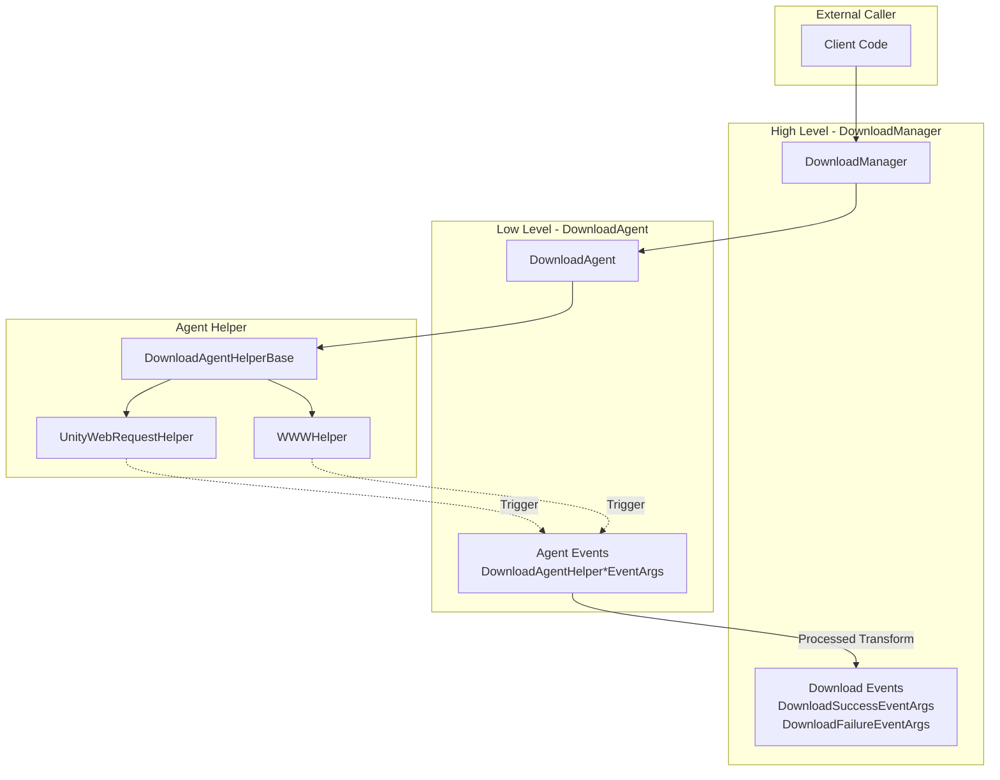
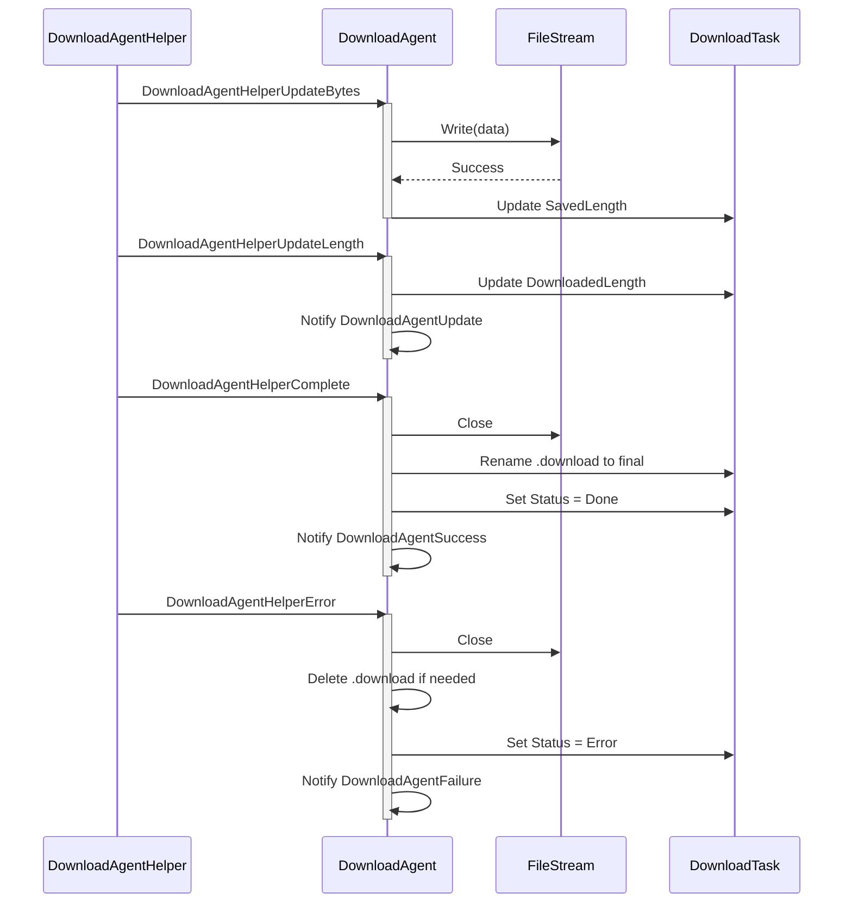
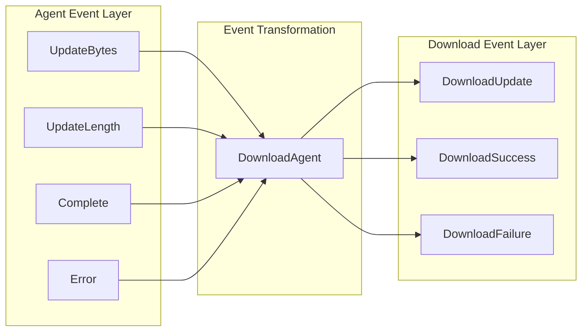

# DownloadAgent Events

Agent events are low-level events triggered during download operations in the DownloadAgentHelper. These events provide fine-grained control over various stages of the download process, enabling developers to monitor and handle the state of download data flow.

## Overview

Agent events are **low-level events** in the download system, distinct from the high-level download events emitted by DownloadManager (download success, download failure, etc.). Agent events work directly at the download agent helper level, providing refined control over download data flow.

**Differences between agent events and download events:**

| Feature | Agent Events | Download Events |
|---------|--------------|------------------|
| Trigger Level | Download Agent Helper layer (low-level) | DownloadManager layer (high-level) |
| Event Granularity | Fine-grained (byte stream, progress updates) | Coarse-grained (task completion/failure) |
| Use Cases | Scenarios requiring download data handling | Scenarios requiring task-level status awareness |

**Four agent events:**
1. `DownloadAgentHelperUpdateBytesEventArgs` - Download data stream update event
2. `DownloadAgentHelperUpdateLengthEventArgs` - Download data size update event
3. `DownloadAgentHelperCompleteEventArgs` - Download completion event
4. `DownloadAgentHelperErrorEventArgs` - Download error event

## Event System Architecture



### Event Flow Description

1. **Client** adds download task through `DownloadManager`
2. **DownloadManager** assigns task to **DownloadAgent** for processing
3. **DownloadAgent** calls **DownloadAgentHelper** to perform actual download
4. **DownloadAgentHelper** (e.g., UnityWebRequestHelper) triggers **agent events** during download
5. **DownloadAgent** receives and processes these events, updating task status
6. Upon task completion, **DownloadManager** emits high-level **download events**

## Core Event Details

### DownloadAgentHelperUpdateBytesEventArgs

Download data stream update event, triggered when new data blocks arrive during download.

```csharp
// Source: Runtime/EventArgs/DownloadAgentHelperUpdateBytesEventArgs.cs#L16-L103
public sealed class DownloadAgentHelperUpdateBytesEventArgs : GameEventArgs
{
    public static readonly string EventId = typeof(DownloadAgentHelperUpdateBytesEventArgs).FullName;

    private byte[] m_Bytes;

    /// <summary>
    /// Gets the offset of the data stream.
    /// </summary>
    public int Offset { get; private set; }

    /// <summary>
    /// Gets the length of the data stream.
    /// </summary>
    public int Length { get; private set; }

    /// <summary>
    /// Gets the downloaded data stream.
    /// </summary>
    public byte[] GetBytes()
    {
        return m_Bytes;
    }
}
```

**Use Cases:**
- Real-time processing of downloaded data streams
- Encryption/decryption processing of downloaded data
- Writing to storage while downloading

### DownloadAgentHelperUpdateLengthEventArgs

Download data size update event, reports incremental changes in downloaded data.

```csharp
// Source: Runtime/EventArgs/DownloadAgentHelperUpdateLengthEventArgs.cs#L16-L63
public sealed class DownloadAgentHelperUpdateLengthEventArgs : GameEventArgs
{
    public static readonly string EventId = typeof(DownloadAgentHelperUpdateLengthEventArgs).FullName;

    /// <summary>
    /// Gets the incremental download data size.
    /// </summary>
    public int DeltaLength { get; private set; }
}
```

**Use Cases:**
- Real-time update of download progress
- Calculate download speed
- Display download percentage

### DownloadAgentHelperCompleteEventArgs

Download completion event, triggered when the download agent helper finishes downloading.

```csharp
// Source: Runtime/EventArgs/DownloadAgentHelperCompleteEventArgs.cs#L16-L63
public sealed class DownloadAgentHelperCompleteEventArgs : GameEventArgs
{
    public static readonly string EventId = typeof(DownloadAgentHelperCompleteEventArgs).FullName;

    /// <summary>
    /// Gets the downloaded data size.
    /// </summary>
    public long Length { get; private set; }
}
```

**Use Cases:**
- Data validation after download completion
- Trigger subsequent processing flow

### DownloadAgentHelperErrorEventArgs

Download error event, triggered when an error occurs during download.

```csharp
// Source: Runtime/EventArgs/DownloadAgentHelperErrorEventArgs.cs#L16-L67
public sealed class DownloadAgentHelperErrorEventArgs : GameEventArgs
{
    public static readonly string EventId = typeof(DownloadAgentHelperErrorEventArgs).FullName;

    /// <summary>
    /// Gets whether the currently downloading file needs to be deleted.
    /// </summary>
    public bool DeleteDownloading { get; private set; }

    /// <summary>
    /// Gets the error message.
    /// </summary>
    public string ErrorMessage { get; private set; }
}
```

**Use Cases:**
- Error log recording
- Retry mechanism triggering
- Cleanup of incomplete download files

## Event Subscription and Handling

### Handling Agent Events in DownloadAgent

```csharp
// Source: Runtime/Download/Download/DownloadManager.DownloadAgent.cs#L114-L120
/// <summary>
/// Initializes the download agent.
/// </summary>
public void Initialize()
{
    m_Helper.DownloadAgentHelperUpdateBytes += OnDownloadAgentHelperUpdateBytes;
    m_Helper.DownloadAgentHelperUpdateLength += OnDownloadAgentHelperUpdateLength;
    m_Helper.DownloadAgentHelperComplete += OnDownloadAgentHelperComplete;
    m_Helper.DownloadAgentHelperError += OnDownloadAgentHelperError;
}
```

### Event Handling Flow



## Relationship Between Agent Events and Download Events



Agent events are transformed into high-level download events after processing by DownloadAgent:

| Agent Event | Transformation Result |
|-------------|---------------------|
| UpdateBytes | Write to file, update SavedLength |
| UpdateLength | Trigger DownloadAgentUpdate callback |
| Complete | Trigger DownloadAgentSuccess -> DownloadSuccessEventArgs |
| Error | Trigger DownloadAgentFailure -> DownloadFailureEventArgs |

## Event Args Reference

### DownloadAgentHelperUpdateBytesEventArgs

| Property | Type | Description |
|----------|------|-------------|
| Offset | int | Offset of the data stream |
| Length | int | Length of the data stream |
| GetBytes() | byte[] | Gets the complete byte array |

### DownloadAgentHelperUpdateLengthEventArgs

| Property | Type | Description |
|----------|------|-------------|
| DeltaLength | int | Incremental data size for this download |

### DownloadAgentHelperCompleteEventArgs

| Property | Type | Description |
|----------|------|-------------|
| Length | long | Total downloaded data size |

### DownloadAgentHelperErrorEventArgs

| Property | Type | Description |
|----------|------|-------------|
| DeleteDownloading | bool | Whether to delete the currently downloading file |
| ErrorMessage | string | Error message |

## When to Use Agent Events

Agent events are suitable for the following scenarios:

1. **Need to process download data stream**: Such as real-time decryption, processing while downloading
2. **Need fine-grained progress control**: Get updates for each data block
3. **Custom storage strategy**: Fully control how files are written
4. **Implement breakpoint resume**: Monitor data size changes

For most scenarios, it is recommended to use high-level **download events** because they provide a simpler API and complete task information. Only use agent events when you need the above special features.

## Related Links

- [Download Events](./6-events.download-events) - High-level download events
- [Download Agent](./4-core-concepts.download-agent) - Download agent concepts
- [DownloadAgentHelper](./4-core-concepts.download-agent) - Agent helper
- [IDownloadAgentHelper](./5-api-reference.methods) - Agent helper interface
- [DownloadComponent](./7-configuration.download-component) - Download component configuration