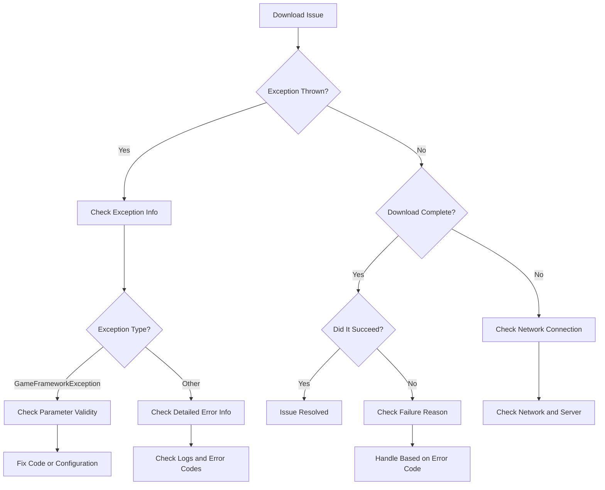

# Troubleshooting

This document collects common issues and their solutions that may be encountered when using the GameFrameX Download component.

## Overview

The Download component is the core component responsible for handling download tasks in the GameFrameX framework. In practical use, various issues may arise due to improper configuration, missing dependencies, or network environment factors. This document aims to help developers quickly locate and resolve these issues.

## Initialization Issues

### Issue: "Download manager is invalid" error when game starts

**Error Message:**
```
Log.Fatal("Download manager is invalid.");
```

**Cause Analysis:**
DownloadComponent depends on the IDownloadManager module, but this module was not correctly registered in the GameFramework system.

**Solution:**
1. Ensure the DownloadManager module is correctly registered. Check if the relevant module registration code was called during startup.
2. Confirm that GameFrameworkEntry can correctly resolve the IDownloadManager interface.

---

### Issue: "Event component is invalid" error when game starts

**Error Message:**
```
Log.Fatal("Event component is invalid.");
```

**Cause Analysis:**
DownloadComponent depends on EventComponent for event distribution, but EventComponent was not correctly initialized.

**Solution:**
1. Ensure EventComponent exists in the scene.
2. EventComponent must be initialized before DownloadComponent.
3. For detailed information about EventComponent, refer to the [Event component documentation](https://github.com/GameFrameX/com.gameframex.unity.event).

---

### Issue: "Can not create download agent helper" error

**Error Message:**
```
Log.Error("Can not create download agent helper.");
```

**Cause Analysis:**
Unable to create a download agent helper instance based on the configured type name.

**Solution:**
1. Check if the `DownloadAgentHelperTypeName` field configuration in DownloadComponent is correct.
2. The default value should be `UnityGameFramework.Runtime.UnityWebRequestDownloadAgentHelper`.
3. If using a custom download agent helper, ensure the type name matches the fully qualified name in the assembly.

---

## API Usage Issues

### Issue: "Download path is invalid" exception when calling AddDownload

**Error Message:**
```
GameFrameworkException: Download path is invalid.
```

**Cause Analysis:**
The downloadPath parameter passed to the AddDownload method is empty or null.

**Solution:**
Ensure the downloadPath parameter is valid:
```csharp
// Incorrect example
int id = downloadComponent.AddDownload("", "http://example.com/file.zip");

// Correct example
int id = downloadComponent.AddDownload(Application.persistentDataPath + "/file.zip", "http://example.com/file.zip");
```

> Source: [DownloadManager.cs](https://github.com/GameFrameX/com.gameframex.unity.download/blob/main/Runtime/Download/Download/DownloadManager.cs#L338-L341)

---

### Issue: "Download uri is invalid" exception when calling AddDownload

**Error Message:**
```
GameFrameworkException: Download uri is invalid.
```

**Cause Analysis:**
The downloadUri parameter passed to the AddDownload method is empty or null.

**Solution:**
Ensure the downloadUri parameter is valid:
```csharp
// Incorrect example
int id = downloadComponent.AddDownload(Application.persistentDataPath + "/file.zip", "");

// Correct example
int id = downloadComponent.AddDownload(Application.persistentDataPath + "/file.zip", "http://example.com/file.zip");
```

> Source: [DownloadManager.cs](https://github.com/GameFrameX/com.gameframex.unity.download/blob/main/Runtime/Download/Download/DownloadManager.cs#L343-L346)

---

### Issue: "You must add download agent first" exception when calling AddDownload

**Error Message:**
```
GameFrameworkException: You must add download agent first.
```

**Cause Analysis:**
At least one download agent helper must be added before adding any download tasks.

**Solution:**
1. DownloadComponent automatically creates the specified number of agent helpers in the Start method.
2. Ensure DownloadComponent is correctly added to the scene.
3. Check if the `DownloadAgentHelperCount` property is greater than 0 (default is 3).

```csharp
// Set in DownloadComponent Inspector
[SerializeField] private int m_DownloadAgentHelperCount = 3;
```

> Source: [DownloadManager.cs](https://github.com/GameFrameX/com.gameframex.unity.download/blob/main/Runtime/Download/Download/DownloadManager.cs#L348-L351)

---

## Network and Download Issues

### Issue: Download fails with "Timeout" error

**Error Message:**
```
Download failure, download serial id '0', download path '...', download uri '...', error message 'Timeout'.
```

**Cause Analysis:**
The download request did not complete within the specified timeout. Default timeout is 30 seconds.

**Solution:**
1. Increase the timeout setting:
```csharp
// Set timeout to 120 seconds
downloadComponent.Timeout = 120f;
```

2. Check if the network connection is stable.

3. Confirm if the server response time is normal. Try accessing the download link with a browser or other tool.

4. For large file downloads, consider adjusting the timeout or implementing breakpoint resume.

---

### Issue: Network error during download

**Error Message:**
```
error: "Network error"
```

**Cause Analysis:**
UnityWebRequest detected a network-level error, which may be caused by:
- Network connection interrupted
- DNS resolution failed
- Unable to establish connection

**Solution:**
1. Check the device's network connection status.
2. Confirm the download URL is accessible.
3. If testing on mobile devices, ensure network permissions are added (Android: INTERNET, ACCESS_NETWORK_STATE; iOS: NSAppTransportSecurity).
4. Check device logs for more detailed error information.

---

### Issue: HTTP error during download

**Error Message:**
```
error: "HTTP Error 404"
error: "HTTP Error 500"
```

**Cause Analysis:**
The server returned an error status code. Common status codes include:
- 404: File does not exist
- 500: Internal server error
- 502: Gateway error
- 503: Service unavailable

**Solution:**
1. Confirm the download link is correct.
2. Check if the file exists on the server.
3. If it's an API request, verify the API endpoint is correct.
4. Check server logs for more error details.

---

### Issue: Breakpoint resume not working

**Cause Analysis:**
Breakpoint resume functionality depends on the server supporting the HTTP Range header.

**Solution:**
1. Confirm if the server supports breakpoint resume (HTTP 206 status code).
2. Check the FlushSize configuration to ensure file writing logic is normal:
```csharp
// Set the critical size for writing to disk (default is 1MB)
downloadComponent.FlushSize = 1024 * 1024;
```

3. Ensure the download directory has sufficient disk space.

---

## File System Issues

### Issue: Download file write failure

**Cause Analysis:**
- Insufficient disk space
- No write permission for the path
- Directory does not exist

**Solution:**
1. Ensure the target directory exists:
```csharp
string directory = Path.GetDirectoryName(downloadPath);
if (!Directory.Exists(directory))
{
    Directory.CreateDirectory(directory);
}
```

2. Check remaining disk space.

3. Check if the application has write permissions.

4. On Android, note to use Application.persistentDataPath instead of Application.dataPath.

---

## Event Subscription Issues

### Issue: Cannot receive download events

**Cause Analysis:**
DownloadComponent or DownloadManager events were not correctly subscribed to.

**Solution:**
Correct way to subscribe to events:
```csharp
// Subscribe via EventComponent
var eventComponent = GameEntry.GetComponent<EventComponent>();
eventComponent.Subscribe(DownloadSuccessEventArgs.EventId, OnDownloadSuccess);
eventComponent.Subscribe(DownloadFailureEventArgs.EventId, OnDownloadFailure);

// Callback handling
private void OnDownloadSuccess(object sender, GameEventArgs e)
{
    var ne = (DownloadSuccessEventArgs)e;
    Debug.Log($"Download success: {ne.DownloadPath}");
}

private void OnDownloadFailure(object sender, GameEventArgs e)
{
    var ne = (DownloadFailureEventArgs)e;
    Debug.Log($"Download failed: {ne.ErrorMessage}");
}
```

> Source: [README.md](https://github.com/GameFrameX/com.gameframex.unity.download/blob/main/README.md#L94-L106)

---

### Issue: Task returns null

**Issue Information:**
The Download method returns null instead of a Task object.

**Cause Analysis:**
In the Download method, if the serialId is not in the m_Downloads dictionary, null is returned.

**Solution:**
Ensure the correct serial ID is used:
```csharp
// Use the serialId returned by AddDownload
int serialId = downloadComponent.AddDownload(downloadPath, downloadUri);

// Wait for download to complete
var task = downloadComponent.Download(downloadPath, downloadUri);
if (task != null)
{
    bool success = await task;
}
```

> Source: [DownloadComponent.cs](https://github.com/GameFrameX/com.gameframex.unity.download/blob/main/Runtime/Download/DownloadComponent.cs#L273-L282)

---

## Configuration Issues

### Issue: Download speed too slow

**Possible Causes:**
- Insufficient agent count
- Timeout setting too short
- Network bandwidth limitation

**Solution:**
1. Increase the number of download agents:
```csharp
// Set a higher DownloadAgentHelperCount in the Inspector
// Recommended: 3-5 agents
```

2. Adjust timeout:
```csharp
downloadComponent.Timeout = 60f; // Increase to 60 seconds
```

3. Adjust FlushSize:
```csharp
// Increasing write buffer size can improve large file download performance
downloadComponent.FlushSize = 2 * 1024 * 1024; // 2MB
```

---

### Issue: Cannot create custom download agent helper

**Cause Analysis:**
Custom download agent helper type was not correctly registered or the assembly was not included.

**Solution:**
1. Ensure the custom helper inherits from DownloadAgentHelperBase:
```csharp
public class CustomDownloadAgentHelper : DownloadAgentHelperBase
{
    // Implement necessary methods
}
```

2. Set the correct type name in the DownloadComponent Inspector:
```
DownloadAgentHelperTypeName: "YourNamespace.CustomDownloadAgentHelper"
```

3. Ensure the assembly is correctly added to the Unity project's Assembly Definition.

---

## Debugging Tips

### Enable Detailed Logging

During development, you can enable detailed debug logs to help locate issues:

```csharp
// Subscribe to all download events to monitor status
downloadComponent.DownloadStart += (s, e) => Debug.Log($"Start: {e.DownloadUri}");
downloadComponent.DownloadUpdate += (s, e) => Debug.Log($"Progress: {e.CurrentLength}");
downloadComponent.DownloadSuccess += (s, e) => Debug.Log($"Success: {e.DownloadPath}");
downloadComponent.DownloadFailure += (s, e) => Debug.Log($"Failure: {e.ErrorMessage}");
```

### Check Download Status

Use the methods provided by DownloadComponent to check the current download status:

```csharp
// Get the number of waiting download tasks
int waitingCount = downloadComponent.WaitingTaskCount;

// Get the number of working agents
int workingCount = downloadComponent.WorkingAgentCount;

// Get the number of available agents
int freeCount = downloadComponent.FreeAgentCount;

// Get the current download speed
float speed = downloadComponent.CurrentSpeed;
```

### Get Task Information

```csharp
// Get download task information by serial ID
var info = downloadComponent.GetDownloadInfo(serialId);

// Get download task information by tag
var infos = downloadComponent.GetDownloadInfos("myTag");

// Get all download task information
var allInfos = downloadComponent.GetAllDownloadInfos();
```

---

## Diagnostic Flowchart



---

## Related Links

- [Introduction](./1-overview.introduction)
- [Features](./1-overview.features)
- [Installation](./2-installation)
- [Basic Setup](./3-getting-started.basic-setup)
- [First Example](./3-getting-started.first-example)
- [Architecture Overview](./4-core-concepts.architecture)
- [DownloadComponent](./4-core-concepts.download-component)
- [Download Agent](./4-core-concepts.download-agent)
- [API Reference - Properties](./5-api-reference.properties)
- [API Reference - Methods](./5-api-reference.methods)
- [Download Events](./6-events.download-events)
- [Agent Events](./6-events.agent-events)
- [Editor Configuration](./7-configuration.editor-configuration)
- [Agent Configuration](./7-configuration.agent-configuration)